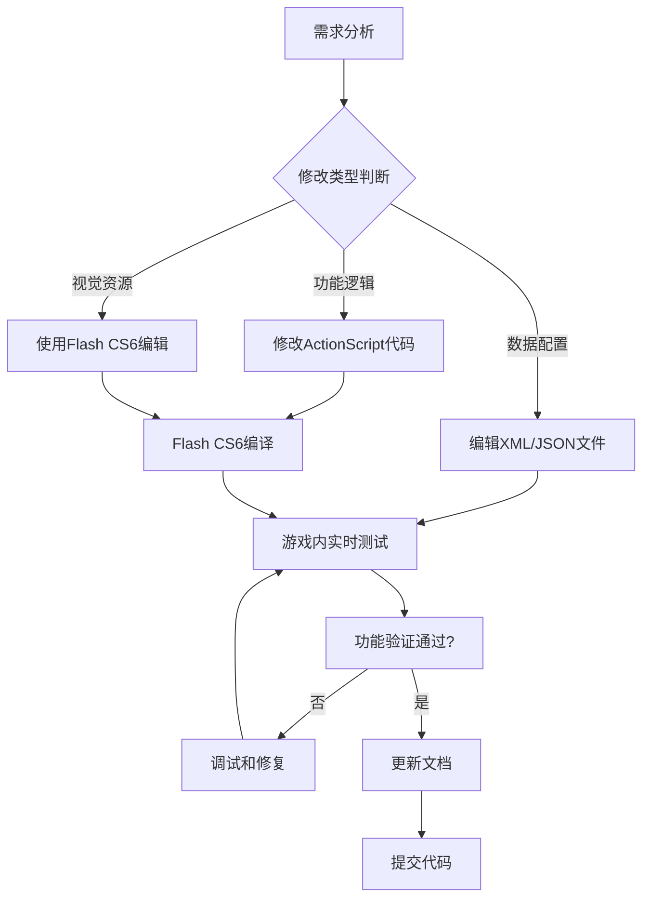

# 闪客快打7佣兵帝国 单机版MOD

<div align="center">

**《闪客快打7佣兵帝国》（Crazy Flasher 7: Mercenary Empire）单机版 MOD 开发工程**


*基于 ActionScript 2.0 和 Adobe Flash 技术栈的经典横版动作游戏MOD*

</div>

## 📖 项目概述

《闪客快打7佣兵帝国》单机版是一款基于Adobe Flash技术开发的横版动作射击游戏MOD。项目已获得原作者 **andylaw** 的授权，为玩家提供可自定义的单机游戏体验。

**项目主页**：[https://space.bilibili.com/6492006](https://space.bilibili.com/6492006)

### ✨ 主要特色

- **📱 离线单机体验** - 完全脱离网络环境，支持本地游戏数据管理
- **🎮 丰富的游戏内容** - 包含多个关卡、武器系统、技能树、战宠系统等
- **⚙️ 高度可定制性** - 支持通过XML配置文件修改游戏参数和内容
- **🔧 MOD开发支持** - 提供完整的开发工具链和文档
- **🎯 经典游戏体验** - 保留原版游戏的核心玩法和视觉风格，极大优化游玩体验

### 🎯 核心系统

- **🏗️ 模块化架构** - 基于 `org.flashNight.*` 命名空间的完整类库系统
- **🎨 视觉效果引擎** - 支持粒子特效、光照系统、天气变化
- **🔊 音频系统** - 完整的背景音乐和音效管理
- **💾 存档系统** - 本地化存档管理，支持多存档位
- **🌐 网络通信** - 内置Node.js本地服务器，支持XMLSocket通信

## ⚠️ 重要提示

> **环境限制**：此项目基于已停产的Adobe Flash技术栈，无法在现代开发环境或Linux容器中直接运行。必须在Windows环境下使用Adobe Flash CS6进行开发。

## 🛠️ 环境配置

### 必需环境

- **操作系统**：Windows 7/10/11（必需）
- **核心软件**：Adobe Flash Professional CS6（无可替代方案）
- **运行时**：Adobe Flash Player 20+
- **语言环境**：ActionScript 2.0（已停止维护）
- **编译方式**：仅支持Flash IDE图形界面编译，**无命令行编译选项**

### 辅助工具

- **Node.js**：14.0+ （用于本地服务器）
- **PowerShell**：5.0+ （用于自动化脚本）
- **文本编辑器**：支持ActionScript语法高亮的编辑器

### 环境搭建步骤

1. **安装Adobe Flash Professional CS6**
   ```
   注意：Flash CS6已停止销售，建议自行寻找合法的授权版本
   ```

2. **安装Adobe Flash Player 20**
   ```
   从Adobe官方下载独立播放器版本，或者从重制版包体中获取
   ```

3. **配置Node.js环境**
   ```powershell
   # 检查Node.js版本
   node --version
   npm --version
   
   # 进入服务器目录并安装依赖
   cd "tools\Local Server"
   npm install
   ```

4. **配置PowerShell执行策略**
   ```powershell
   # 允许本地脚本执行
   Set-ExecutionPolicy -ExecutionPolicy RemoteSigned -Scope CurrentUser
   ```

## 🏗️ 项目结构详解

### 完整目录布局

```
CrazyFlashNight/
├── 📁 0.说明文件与教程/          # 中文项目文档和教程
├── 📁 automation/               # PowerShell自动化脚本和config.toml
│   ├── start.ps1                # 主启动脚本
│   ├── start_game.ps1           # 游戏启动脚本
│   ├── start_server.ps1         # 服务器启动脚本
│   ├── configure_server.ps1     # 服务器配置脚本
│   └── config.toml              # 运行时配置（Flash路径、SWF路径等）
├── 📁 config/                   # XML系统配置文件
│   ├── PIDControllerConfig.xml  # PID控制器配置
│   └── WeatherSystemConfig.xml  # 天气系统配置（昼夜循环、光照）
├── 📁 data/                     # ✅ 游戏数据文件（XML/JSON，立即生效）
│   ├── stages/                  # 关卡定义
│   ├── items/                   # 物品配置
│   ├── units/                   # 单位数据
│   ├── dialogues/               # 对话脚本
│   └── environment/             # 环境设置（如scene_environment.xml）
├── 📁 flashswf/                 # ⚠️ FLA/SWF资源（需Flash CS6编辑）
│   ├── arts/                    # 角色与怪物逻辑（链接到FLA脚本）
│   ├── UI/                      # 用户界面代码和素材
│   ├── backgrounds/             # 背景资源
│   ├── miniGames/               # 小游戏资源
│   └── skybox/                  # 天空盒资源
├── 📁 scripts/                  # ⚠️ ActionScript 2.0源代码（仅可分析，需Flash CS6编译）
│   ├── 展现/                    # 视觉系统和UI交互代码
│   ├── 引擎/                    # 引擎工具（调试、随机、声音等）
│   ├── 通信/                    # 网络和保存系统脚本
│   ├── 逻辑/                    # 游戏逻辑
│   └── 类定义/                  # 主要类库（org.flashNight.*）
├── 📁 tools/Local Server/       # ✅ Node.js本地服务器（可测试和修改）
│   ├── server.js                # 主服务器文件
│   ├── controllers/             # 任务处理器（eval、regex、计算、音频）
│   ├── routes/                  # HTTP路由
│   ├── services/                # 服务模块（socketServer.js等）
│   ├── utils/                   # 工具模块（logger.js等）
│   ├── config/ports.js          # 端口配置
│   ├── package.json             # 依赖配置
│   └── server.md                # 服务器详细文档
└── 📁 其他文件（README.md、crossdomain.xml等）
```

### 可直接修改的文件类型

#### ✅ 立即生效的修改

**1. `data/` 目录 - 游戏数据文件**

这是最容易修改且立即生效的内容：

- **怪物刷新配置** - 调整敌人种类和数量
- **天气渲染配置** - 修改光照和环境效果  
- **任务文本** - 更新任务描述和对话
- **物品数据** - 添加新武器、装备、道具

**修改示例**：
```xml
<!-- 仅供参考的假数据 -->
<weapon id="1001" name="改进型手枪">
    <damage>120</damage>        <!-- 伤害值 -->
    <firerate>300</firerate>    <!-- 射速（毫秒） -->
    <accuracy>90</accuracy>     <!-- 精准度 -->
    <price>1500</price>         <!-- 价格 -->
    <level>5</level>            <!-- 解锁等级 -->
</weapon>
```

**2. `tools/Local Server/` - Node.js本地服务器**

可以实时测试和修改的JavaScript代码：
- HTTP API接口
- XMLSocket通信逻辑
- 任务处理器功能
- 日志和监控系统

#### ⚠️ 需要特殊处理的文件

**1. `scripts/` 目录 - ActionScript 2.0源代码**

- **限制**：仅可进行代码分析和审查
- **编译要求**：需要Flash CS6编译才能生效
- **包含内容**：
  - 游戏核心逻辑
  - 引擎系统代码
  - UI交互脚本
  - 网络通信模块

**2. `flashswf/` 目录 - Flash资源文件**

- **编辑工具**：必须使用Adobe Flash CS6
- **文件类型**：FLA源文件和编译后的SWF
- **包含内容**：
  - 角色动画和逻辑
  - UI界面元素
  - 背景和特效素材

## 🚀 快速开始

### 启动游戏

**方式1：使用自动化脚本（推荐）**

```powershell
# 进入项目根目录
cd "C:\Program Files (x86)\Steam\steamapps\common\CRAZYFLASHER7StandAloneStarter\resources"

# 运行主启动脚本
.\automation\start.ps1
```

**方式2：手动启动**

```powershell
# 直接启动游戏
.\start_game.ps1

# 或者启动特定版本
.\start_game_2_5.ps1
```

### 启动本地服务器

```powershell
# 进入服务器目录
cd "tools\Local Server"

# 首次运行需要安装依赖
npm install

# 启动服务器
node server.js

# 服务器将在控制台显示启动信息
# HTTP服务器: http://localhost:3000
# XMLSocket服务器: localhost:3001
```

### 验证环境

```powershell
# 检查Flash Player版本
Get-ItemProperty "HKLM:\SOFTWARE\Adobe\Flash Player ActiveX" | Select-Object Version

# 检查Node.js和npm版本
node --version
npm --version

# 检查PowerShell版本
$PSVersionTable.PSVersion
```

## 🔧 开发工具使用指南

### 核心类库架构

项目采用模块化设计，核心类库位于 `scripts/类定义/org/flashNight/` 目录：

```
org.flashNight/
├── arki/          # 游戏引擎核心组件
│   ├── bullet/    # 子弹系统（Factory/BulletFactory.as等）
│   ├── camera/    # 摄像机控制系统
│   ├── component/ # 单位组件系统
│   ├── item/      # 物品管理系统
│   └── audio/     # 音频引擎（LightweightSoundEngine等）
├── aven/          # 事件协调工具
├── gesh/          # 通用工具库（数组、字符串、解析、算法）
├── naki/          # 数据结构和数学工具
│   ├── random/    # LinearCongruentialEngine、MersenneTwister等
│   └── math/      # AdvancedMatrix.as等
├── neur/          # 事件系统、控制器、计时器、状态机
│   └── Timer/     # FrameTimer.as等
└── sara/          # 物理引擎（粒子、约束、表面）
```

### ActionScript 2.0 开发规范

#### 代码风格

```actionscript
/**
 * 子弹工厂类，负责创建和管理子弹实例
 * @class BulletFactory
 * @package org.flashNight.arki.bullet.Factory
 * @author [作者名]
 * @version 1.0.0
 */
class org.flashNight.arki.bullet.Factory.BulletFactory {
    
    /**
     * 当前激活的子弹数量
     * @type Number
     * @private
     */
    private var _activeBulletCount:Number;
    
    /**
     * 创建新的子弹实例
     * @param {Number} x 起始X坐标
     * @param {Number} y 起始Y坐标
     * @param {Number} angle 发射角度（弧度）
     * @param {Number} speed 初始速度
     * @returns {MovieClip} 创建的子弹MovieClip对象
     */
    public function createBullet(x:Number, y:Number, angle:Number, speed:Number):MovieClip {
        trace("创建子弹: x=" + x + ", y=" + y + ", angle=" + angle);
        // 实现代码
        return bulletClip;
    }
}
```

#### 命名约定

- **类名**：PascalCase（`PlayerController`、`BulletFactory`）
- **方法和变量**：camelCase（`updatePosition`、`createBullet`）
- **常量**：UPPER_CASE（`MAX_HEALTH`、`DEFAULT_SPEED`）
- **私有成员**：下划线前缀（`_privateVar`、`_health`）
- **接口**：以`I`开头（`IMusicEngine`、`IMovable`）

### 本地服务器API

#### 核心接口

```javascript
// 获取XMLSocket端口
GET /getSocketPort
Response: { "port": 3001, "status": "active" }

// 音频播放任务
POST /audio/play
{
    "sound": "bgm-1.mp3",
    "volume": 0.8,
    "loop": true
}

// 代码执行任务（沙箱环境）
POST /eval/execute
{
    "code": "Math.sqrt(16)",
    "timeout": 5000
}

// 正则表达式处理
POST /regex/match
{
    "pattern": "\\d+",
    "text": "Hello 123 World",
    "flags": "g"
}
```

#### 服务器配置

编辑 `tools/Local Server/config/ports.js`：

```javascript
module.exports = {
    http: 3000,           // HTTP服务端口
    xmlsocket: 3001,      // XMLSocket端口
    fallback: [3002, 3003] // 备用端口列表
};
```

### 自动化脚本配置

编辑 `automation/config.toml`：

```toml
[flash]
player_path = "C:/Program Files/Adobe/Flash Player/flashplayer.exe"
swf_path = "./CRAZYFLASHER7MercenaryEmpire.swf"

[server]
auto_start = true
port = 3000

[debug]
enable_trace = true
log_level = "debug"
```

### 开发工作流程



#### 修改优先级

1. **优先修改**：`data/` 和 `config/` 下的XML配置文件（立即生效）
2. **次要修改**：Node.js服务器代码（可测试和验证）
3. **谨慎修改**：ActionScript源代码（需要Flash CS6验证）
4. **避免修改**：已编译的SWF文件和关键引擎代码

## 🔍 常见问题解答

### Q: 如何添加新的武器或装备？

**A:** 在 `data/items/` 目录下编辑对应的XML文件：

```xml
<!-- 仅供参考的假数据 -->
<weapon id="1001" name="新型激光手枪" category="手枪">
    <damage>150</damage>        <!-- 基础伤害 -->
    <firerate>400</firerate>    <!-- 射击间隔（毫秒） -->
    <accuracy>95</accuracy>     <!-- 精准度（0-100） -->
    <price>3500</price>         <!-- 购买价格 -->
    <level>15</level>           <!-- 解锁等级 -->
    <ammo_type>能量弹</ammo_type> <!-- 弹药类型 -->
    <special_effects>
        <effect type="burn" duration="3000" damage="10"/>
    </special_effects>
</weapon>
```

### Q: 游戏启动后出现黑屏怎么办？

**A:** 按以下步骤排查：

   **检查游戏版本**
   
   当前游戏需要steam正版授权


### Q: 如何修改游戏难度和平衡性？

**A:** 修改单位所对应的文件：

```xml
<!-- 仅供参考的假数据 -->
<enemy id="zombie_01" name="基础僵尸">
    <health>80</health>         <!-- 生命值（原100，降低难度） -->
    <damage>15</damage>         <!-- 攻击力（原20，降低难度） -->
    <speed>1.2</speed>          <!-- 移动速度 -->
    <exp_reward>25</exp_reward> <!-- 经验奖励（原15，增加奖励） -->
</enemy>
```

### Q: ActionScript代码修改后不生效？

**A:** ActionScript需要重新编译：

1. **在Flash CS6中打开对应FLA文件**
   ```
   找到 flashswf/arts/ 或相关目录下的 .fla 文件
   ```

2. **重新发布**
   ```
   文件 → 发布设置 → 发布（Ctrl+Enter）
   ```

3. **替换SWF文件**
   ```
   将新生成的 .swf 文件覆盖游戏目录中的对应文件
   ```

4. **重启游戏进行测试**

### Q: 本地服务器启动失败？

**A:** 常见解决方案：

```powershell
# 1. 清理npm缓存
npm cache clean --force

# 2. 删除node_modules并重新安装
Remove-Item -Recurse -Force node_modules
npm install

# 3. 检查端口占用
netstat -ano | findstr ":3000"
# 如果端口被占用，终止对应进程
taskkill /PID [进程ID] /F

# 4. 使用备用端口
# 编辑 config/ports.js，使用fallback端口
```

### Q: 如何添加新的关卡或场景？

**A:** 需要同时修改多个文件：

//todo

### Q: 如何调试ActionScript代码？

**A:** 使用trace()语句进行调试：

```actionscript
// 在关键位置添加调试输出
trace("玩家位置: x=" + player._x + ", y=" + player._y);
trace("敌人数量: " + enemyArray.length);
trace("当前状态: " + gameState);

// 检查变量值
if (health <= 0) {
    trace("警告：玩家生命值归零");
}

// 函数调用跟踪
function createBullet(x:Number, y:Number) {
    trace("创建子弹: createBullet(" + x + ", " + y + ")");
    // 函数实现
}
```

在Flash IDE的输出面板中查看trace信息。

**B:** 在游戏实机进行调试：

```actionscript
// 在关键位置添加调试输出
_root.发布消息("玩家位置: x=", player._x , ", y=", player._y);
_root.发布消息("敌人数量: " + enemyArray.length);
_root.发布消息("当前状态: " + gameState);

// 检查变量值
if (health <= 0) {
    _root.发布消息("警告：玩家生命值归零");
}

// 函数调用跟踪
function createBullet(x:Number, y:Number) {
    _root.服务器.发布服务器消息("创建子弹: createBullet(" + x + ", " + y + ")");
    // 函数实现
}
```

在游戏的左上角信息面板上，查看 发布消息 打印的消息
在node.js后端上，查看 发布服务器消息 打印的日志

## 🤝 贡献指南

### 参与贡献流程

欢迎社区贡献！请遵循以下步骤：

1. **Fork项目**
   ```bash
   # 在GitHub上Fork项目到您的账户
   # 克隆到本地开发环境
   git clone https://github.com/你的用户名/CrazyFlashNight.git
   ```

2. **创建功能分支**
   ```bash
   git checkout -b feature/新功能名称
   # 或者
   git checkout -b fix/bug修复描述
   ```

3. **开发和测试**
   - 遵循项目的代码规范
   - 添加必要的测试用例
   - 确保功能正常工作

4. **提交更改**
   ```bash
   git add .
   git commit -m "feat: 添加新的武器系统"
   # 遵循下面的commit规范
   ```

5. **推送并创建Pull Request**
   ```bash
   git push origin feature/新功能名称
   # 在GitHub上创建Pull Request
   ```

### Commit规范

建议使用语义化的commit信息：

```bash
# 功能添加
git commit -m "feat: 添加新的战宠系统"
git commit -m "feat(items): 增加稀有武器配置"

# Bug修复  
git commit -m "fix: 修复存档加载时的崩溃问题"
git commit -m "fix(ui): 修复商店界面显示错误"

# 文档更新
git commit -m "docs: 更新API使用文档"
git commit -m "docs(readme): 完善环境配置说明"

# 性能优化
git commit -m "perf: 优化子弹碰撞检测算法"
git commit -m "perf(engine): 减少内存分配开销"

# 代码重构
git commit -m "refactor: 重构玩家状态管理系统"

# 测试相关
git commit -m "test: 添加武器系统单元测试"

# 构建/配置变更
git commit -m "build: 更新Node.js依赖版本"
git commit -m "config: 调整PowerShell脚本参数"
```

### 代码贡献要求

#### 质量标准

- **测试覆盖率**：新功能必须包含对应的测试用例
- **文档完整性**：API变更需同步更新文档
- **兼容性保证**：确保与Flash Player 9.0+兼容
- **性能考虑**：避免引入性能回归

#### 代码审查要点

1. **ActionScript 2.0规范**
   - 使用JSDoc风格注释
   - 遵循命名约定
   - 正确的类型声明

2. **XML配置规范**
   - 4空格缩进
   - 双引号属性值
   - 详细的中文注释

3. **Node.js代码规范**
   - ES6+语法
   - 错误处理完整
   - 日志记录规范

### 问题报告模板

提交Issue时请包含以下信息：

```markdown
## 问题描述
简要描述遇到的问题

## 环境信息
- 操作系统：Windows 10 21H2
- Flash Player版本：20.0.0.306
- Node.js版本：16.14.0

## 重现步骤
1. 启动游戏
2. 进入商店界面
3. 点击购买武器按钮
4. 观察到错误现象

## 期望行为
描述应该发生的正确行为

## 实际结果
- 错误信息：[粘贴具体错误信息]
- 截图：[如果可能，请附上截图]

## 相关日志
```
[粘贴相关的日志文件内容]
```

## 附加信息
其他可能有助于解决问题的信息
```

### 开发环境贡献

如果您想改进开发工具或构建脚本：

1. **PowerShell脚本**
   - 保持Windows PowerShell 5.0+兼容性
   - 添加错误处理和日志记录
   - 提供详细的帮助信息

2. **Node.js服务器**
   - 使用现代JavaScript特性
   - 完善的API文档
   - 单元测试覆盖

3. **文档改进**
   - 保持中文为主，英文为辅
   - 提供具体的代码示例
   - 及时更新过时信息

## ⚠️ 重要限制和注意事项

### 严格禁止 ❌

- **编译限制**：不要尝试编译或构建ActionScript项目（无命令行编译选项）
- **环境限制**：不要在非Windows环境下安装Flash开发环境
- **文件安全**：不要修改已编译的SWF文件（可能导致文件损坏）
- **配置安全**：不要删除或重命名核心配置文件
- **平台限制**：不要在Linux容器中运行Flash相关操作

### 建议避免 ⚠️

- **引擎修改**：避免大幅修改核心引擎代码（`scripts/引擎/`）
- **架构变更**：避免改变现有的包结构（`org.flashNight.*`）
- **平衡性**：避免随意修改关键的游戏平衡参数
- **测试完整性**：避免删除已有的测试文件

### 推荐操作 ✅

- **代码分析**：分析和审查ActionScript代码结构
- **配置修改**：修改XML配置文件（`data/`、`config/`）
- **文档完善**：编写完善的JSDoc风格文档
- **测试添加**：添加测试用例（使用`runAllTests()`风格）
- **服务器优化**：优化Node.js服务器代码
- **自动化改进**：改进PowerShell自动化脚本
- **文档更新**：更新项目文档和教程

### 技术特性说明

#### ActionScript 2.0 特性

- **弱类型系统**：支持动态类型，但建议明确声明类型
- **原型继承**：理解原型链和继承机制
- **_root依赖**：许多游戏逻辑依赖`_root`全局变量访问舞台对象
- **MovieClip操作**：动态创建和管理MovieClip实例
- **事件处理**：使用EventDispatcher模式和自定义事件系统

#### Flash特有概念

- **MovieClip**：动态影片剪辑对象，支持嵌套和时间轴控制
- **Stage**：舞台对象和显示列表管理
- **Timeline**：时间轴和帧概念，支持帧脚本
- **Symbol**：元件和库资源管理
- **Linkage**：FLA中的脚本链接，连接代码和资源

#### 兼容性考虑

- 代码必须兼容**Flash Player 9.0+**
- 避免使用ActionScript 3.0语法特性
- 注意跨浏览器兼容性问题
- XMLSocket通信需要crossdomain.xml支持

## 📄 授权和版权

### 项目授权

本项目已获得原作者 **andylaw** 的正式授权，允许进行MOD开发和非商业性分发。

### 使用条款

- ✅ **个人使用**：允许个人下载、修改和使用
- ✅ **非商业分发**：允许非商业性质的分享和传播
- ✅ **衍生作品**：允许基于本项目创建MOD和衍生版本
- ✅ **学习研究**：允许用于编程学习和技术研究
- ❌ **商业用途**：禁止任何形式的商业销售和盈利
- ❌ **版权移除**：禁止移除或修改版权信息和授权声明

### 致谢

感谢以下贡献者：

- **andylaw** - 原作者，提供授权和技术支持
- **fs** - 核心引擎重构和性能优化
- **雾人** - 美术资源和关卡设计
- **无名氏** - 游戏内容和文本编写
- **伊恩** - 角色设计和动画制作
- **所有社区贡献者** - 提供bug报告、功能建议和代码贡献

## 🔗 相关链接

- **项目主页**：[https://space.bilibili.com/6492006](https://space.bilibili.com/6492006)
- **GitHub仓库**：[项目Git地址]
- **问题反馈**：[GitHub Issues链接]
- **开发文档**：[项目Wiki链接]
- **技术讨论**：[社区论坛链接]

## 📧 联系方式

如有疑问、建议或合作意向，请通过以下方式联系：

- **项目负责人**：通过GitHub Issues或项目主页私信
- **技术支持**：查看文档或提交Issue
- **社区交流**：加入开发者讨论群组

---

<div align="center">

**❤️ 感谢所有贡献者和玩家的支持！**

*本项目基于已停产的Adobe Flash技术栈，重点在于代码分析、文档完善、配置优化和测试覆盖，旨在保存和延续经典游戏的生命力。*

**🎮 让经典游戏在新时代焕发光彩！**

</div>


# 团队成员工作状态与计划模块

此模块用于实时跟踪团队成员的当前状态、工作计划以及待推进的内容，帮助团队协调工作并明确优先事项。

---

## 成员状态与工作计划

### **1. 模板**
```md
#### **成员代号**：
- **当前状态**：工作中 / 待机中 / 暂停
- **当前任务**：
  - [任务名称]：简要描述当前正在处理的主要任务。
  - [预计完成时间]：任务的完成目标时间。
- **待推进任务**：
  - 任务 1：描述任务内容。
  - 任务 2：描述任务内容。
- **备注**：额外需要补充的信息（如遇到的困难、需要协作的部分等）。
```

---

### **2. 实例**

#### **成员代号：fs**
- **当前状态**：工作中
- **当前任务**：
  - [任务名称]：重构子弹，通过抽象工厂-子弹工厂-子弹组件-子弹基类的模式进行class化。
  - [预计完成时间]：2025年中
- **待推进任务**：
  - 任务 1：完成 `buff系统` 的架构设计。
  - 任务 2：为 `人形怪` 的状态改变进行重构以节约性能。
- **备注**：等待对怪物的思考块实例进行命名/重构以作下一步的ai优化

#### **成员代号：雾人**
- **当前状态**：工作中
- **当前任务**：
  - [任务名称]：绘制92副本地图。
  - [预计完成时间]：2024年末
- **待推进任务**：
  - 任务 1：完成 `下水道相关地图` 的设计。
  - 任务 2：为 `下水道相关地图` 补完`巨型老鼠`，`异变鼠人`等怪物。
  - 任务 3：制作出更多`地图陷阱`。
  - 任务 4：制作`黑铁会外交部长`的战斗形态，填写相关支线。
  - 任务 5：制作`秋月`的战技。

- **备注**：还在考虑加不加蝙蝠怪物，翅膀和扇翅动画感觉很难搞

#### **成员代号：无名氏**
- **当前状态**：工作中
- **当前任务**：
  - [任务名称]：为情报界面补充文本。
  - [预计完成时间]：2025年初
- **待推进任务**：
  - 任务 1：设计主线关卡地图。
  - 任务 2：更新更多烹饪材料。
  - 任务 3：确定基建系统UI的初步设计方案。

- **备注**：

#### **成员代号：伊恩**
- **当前状态**：工作中
- **当前任务**：
  - [任务名称]：绘制霜精。
  - [预计完成时间]：2024年末
- **待推进任务**：
  - 任务 1：完成 `联合大学相关地图` 的设计。
  - 任务 2：为 `联合大学相关地图` 补完各种敌人。
  - 任务 3：填充`彩蛋支线`。

- **备注**：

---

## 模块使用说明

1. **更新频率**：建议每日或每次任务状态发生重大变化时更新。
2. **编辑权限**：限团队负责人或成员本人修改。
3. **用途**：提高协作效率，明确团队内各成员的工作状态和优先事项。

---
