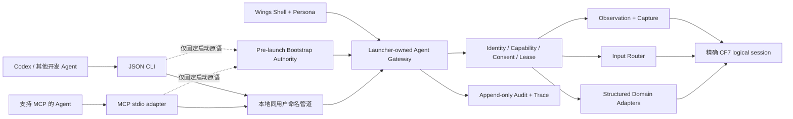

# CF7 Agent Runtime 与 Wings Network 一期：技术底座、人格层、能力边界与永久禁区 ADR

**文档角色**：CF7 项目内置 Agent 运行时与 Wings 桌宠/叙事客户端的一期工程决策真源；分别冻结技术底座、Wings 人格层、一期能力清单与永久禁区，并记录施工顺序和验收合同。

**状态**：`ACCEPTED_SCOPE / SOURCE_FROZEN / SOURCE_IMPLEMENTATION_COMPLETE / CANDIDATE_BUILT / CANDIDATE_EXECUTED / E2E_VERIFIED / PROMOTED / STANDARD_ENTRY_VERIFIED`。2026-07-31 的 F8 收口在 F7 shutdown/runner 闭包之上，进一步按 production composer 的真实能力面冻结 surface advertise：Launcher、WebOverlay、NativeHud 才提供 WGC；嵌入式 Flash 只提供双空 mode 的 metadata descriptor，像素请求固定 `unsupported_for_surface`；production 不组合 `window.activate`。implementation candidate 先由纯 CF7 Agent Runtime MCP 完成可见游戏/面板纵切；随后同一 identity/closure 取得双故障域 v2 共识、promotion，并从无 candidate id 的正式入口重复该窄旅程。范围与缺口以第 12、13 节和独立证据记录为准；此状态不蕴含 `wings_network_phase1_verified`、Hair/Wings 完整产品、双屏、“13/13”或维护者目视签收。

**日期**：2026-07-31（F8 最终冻结）。文件名继续保留 `2026-07-30`，表示本 ADR 首次立项并进入范围冻结的日期；为避免 canonical 路径迁移和链接漂移，不因后续冻结修订改名。

**F8 source freezes**：implementation commit `53caabc90941826ddacf626f536b0f473adbf049` / tree `5ac63ec05fbbc9b89aa14f7f0b5ab25698f9742d`；formal release commit `6f3d50a52413c747b05b74be88d6ee46650f4597` / tree `253e57f6d20a90fef6addfa744d0487d88f00dfb`。F7 C1 `dd84230a1d262c6478591cae2d11051b7a8aa7b1` 与其后 `7f1c21d9db` 可见 panel 取证只保留为历史阶段，不能与 F8 正式证据拼接或替代 F8 结论。

**冻结修订**：`F8`。F1–F7 的 rendezvous/wire/credential、security surface、legacy 隔离、XMLSocket peer、Hair、Wings structured action、shutdown response-delivery 与 trusted runner 决策继续有效；F8 以更窄的 production capability truth 取代 F6/F7 对 activation 与嵌入 Flash pixel/input 的宽表述，并冻结 panel instance 随机性、applicability 非 advertisement 语义和 pure-Runtime 人工验收边界。

F2 修复了 F1 收据无法交付 Hair restore secret 的协议断路；F3 增加唯一 human-only one-shot Hair consent method；F4 修复首 grant 需要尚不可见 session/target 的启动死锁，冻结 `session.status → lifecycleRef → exactly-one targetKinds|targetIds`、唯一 current session、`RuntimeOwned ∩ AllowedTargets`、32-target cap 与签发前后复验。F5 进一步关闭实现期对抗审计发现的 exact Flash peer、live credential revoke、trusted player receipt、pixel/app/Hair authority 与 structured Wings action 边界。F6 确认：`CurrentUserOnly` 只证明当前用户，同 Windows session/elevation 仍必须验证独立 OS peer token；process/window 绑定必须覆盖可执行路径、PID、进程启动时间及 HWND/owner 关系；Web 导航开始即推进 document generation，`window.state` 与 `window.activate` 分离，production activation 全绑定并复核；`business_modal` selector 在 production 为空，内部 `BusinessModal` 永远 human-only；可信 scoped ledger 与使用共同 owner pending marker、同目录 atomic move 的 8 MiB Runtime-owned JSONL exporter 已完成后，`trace.export` 仅向明确 enrolled developer + consentPurpose 开放，且单文件 move 不冒充 filesystem/audit 跨资源原子事务；Hair unknown receipt 改为同事务实例 lifecycle-local escrow 与权威 reconcile 后单次交付；最终 unattended security boundary 落在受信 Core 二进制 runner，Node/PowerShell 只作便利包装。F7 关闭最后一轮 shutdown 对抗审阅：`LeaseDescriptor.purpose` 必填而 `renewAfter` 可选且 shutdown 必须省略；shutdown 只存在于 DeveloperInteractive/UnattendedTest，成功 consume 的 owner reservation 跨所有 response frame 写入，首字节前顺序取得 audit identity 与 lease/human-input fence；同 identity/canonical payload 的 duplicate 严格复用 retained receipt，完整写后 callback/audit 失败只能丢失 continuity，不能把已经写出的结果改写为 unknown；lease tombstone 与 committed-shutdown latch 有界且满载全局 fail closed；trusted runner 禁止 Flash keyframe fallback，只信 Launcher frame，以固定 30 秒凭据等待和有界 stderr completion evidence 核验正常退出。

F8 关闭“类型设计存在即可对生产 advertise”的最后一个口径漏洞：static applicability 只描述 method 对 surface kind 的**类型级潜在适用性**，不是 session capability advertisement；一次调用真正可达，必须同时满足当前 authenticated session 的 capability 与 exact `SurfaceDescriptor.observationModes/inputModes`。production composer 当前只给 Launcher、WebOverlay、NativeHud 注册 `window_graphics_capture`，嵌入 Flash descriptor 的 `observationModes=[]`、`inputModes=[]`，任何 Flash pixel capture 在进入 frame source 前即返回 `unsupported_for_surface`。`window.activate` 仍保留在 v1 registry/schema 以维持冻结合同，但 production 不组合 activator、Welcome/session capability 不 advertise，调用不可达。面板开启改由 `panel.open` structured action 的专用 one-shot lease 进入既有 Host broker，结果仍使用 action receipt，且 dispatch 原生键鼠 packet 数为零；所有 production panel instance ID 统一为至少 144-bit CSPRNG 的 opaque Base64URL 值，fallback/Loot 等 producer 不得再用时间戳或递增序号。

F2–F8 对当时按更早冻结 artifact 实现的客户端均为 pre-release wire-breaking 或收紧，因此在首个正式消费者前仍以 `1.0` 原子升级 method registry、schema、生成物、CLI/MCP、服务端、fixture 与 harness。F8 formal release 现已成为首个 promoted v1 consumer；从此任何 wire-breaking 都必须新增 revision/version、定义兼容与迁移，并原子升级全部消费者，禁止在现役 v1 内静默替换、部分 rollout、兼容地产生缺失领域结果、绕过人工授权的 token、泄露 grant 前 session/target，或继续接受更宽的旧参数。

**证据边界与历史封装**：F7 C1 commit `dd84230a1d262c6478591cae2d11051b7a8aa7b1` / tree `7362881e96d8ed0f9c20ccae580426c522f14946` 的 production-policy **26/26** candidate 只达到 `candidate_built / NOT_DEPLOYED`，无前台凭据超时是 fail-closed 负向证据。其后 `7f1c21d9db` 的可见 panel E2E 证明了早期结构化 opener 与 WebOverlay WGC，但当时尚未冻结最终 Flash/activation advertise，故仅为历史诊断。F8 implementation source `53caabc90941826ddacf626f536b0f473adbf049` / tree `5ac63ec05fbbc9b89aa14f7f0b5ab25698f9742d` 的 isolated candidate 先在 identity `0F4C92F237ABD7785C957F3CD135ABF2EFB1EB5D9AB5671B869F39D00970675C`、closure `54FBCCBA7C90ACF407B09E38FFB874C13DE3CDFB80CF62D0F8D4E239A42962F0`、Core EXE `86DF1F5DC611037DB3A85FD9BA0D43490394F232D25A4F62B59AA4F2B4B6E4FD` 上达到 `e2e_verified / NOT_DEPLOYED`。formal release source `6f3d50a52413c747b05b74be88d6ee46650f4597` / tree `253e57f6d20a90fef6addfa744d0487d88f00dfb` 随后由 tag `runtime-build-v2/20260731-agent-runtime-wings-f8-v1`、request `A9B33601805709DBB5EAE6DAF312C2B7B0B502096FDD3BDCEA9CBE26D8B1299C`、GitHub run `30602046108` 与本地 X509 `physical-host-a` 达成双 signer/双 faultDomain 共识；production receipt SHA-256 `DA46C6E99CB02A268099ACB709C80B60E8B2D821134E1D32C9C84CB288EEC38C`，于 `2026-07-31T03:56:21.4933374Z` promotion。正式报告 `tmp/manual-agent-acceptance/formal-f8/agent-runtime-help-20260731T040942Z.json` 与 residue comparison 将同一 identity/closure 的窄纵切推进到 `standard_entry_verified`；历史 candidate 状态不被反写。

**适用范围**：开发期外部 Agent、无人值守测试 Agent、未来玩家助手 Wings，以及以后在游戏规则内工作的叙事/战术 Agent。只覆盖一个被精确绑定的 CF7 logical session，不建设通用桌面自动化产品。

**稳定规则归属**：

- 本文是一期冻结目标态、施工顺序和验收合同的唯一设计真源；现役事实仍由对应 canonical docs 维护。
- 现役 Launcher 拓扑仍以 [architecture.md](../agentsDoc/architecture.md) 与 [launcher/README.md](../launcher/README.md) 为准。
- 现役验证与发布术语仍以 [testing-guide.md](../agentsDoc/testing-guide.md) 为准。
- Wings 既有硬设定与提案分级仍以 [worldbuilding/00-结论归属矩阵](worldbuilding/00-结论归属矩阵.md)、[worldbuilding/20-权威表](worldbuilding/20-权威表.md) 为准；本文不取得世界观 canon 的定义权。
- 首个协议、进程、目录或可执行测试入口落地时，必须同轮同步对应 canonical docs；只有实际落地的切片可以回写为现役事实。

---

## 0. 决策摘要

### 0.1 中心结论

可以、也值得把这项投资定义为 **Wings Network 一期**，但必须采用“一套中立技术底座、多个受限调用主体”的结构：

- 底层叫 **CF7 Agent Runtime**，属于项目基础设施；
- Wings 是其上的 **Wings Shell + Wings Persona**，只是一个受限客户端和调用主体；
- Codex、其他开发 Agent、无人值守 runner 不经过 Wings 人格，也能调用同一套受控能力；
- “Wings Network”是产品/叙事计划名称，不表示一期要开放远程网络端口。

“对标 Codex Computer Use，但只允许操作游戏启动器”是合理的一期边界，不过“启动器”必须按 **CF7 logical session** 理解：Guardian/Launcher 本体、它精确绑定的 Flash 游戏窗口、WebView2 overlay、Native HUD/InputShield、Wings 自有窗口及这些窗口的 owned modal。若只按 EXE 名或窗口标题限制，会漏掉真实游戏面，也无法抵抗同名窗口和跨局误操作。

录屏能力一期不实现，但现在必须冻结帧、时间戳、capture policy 与 sink 接口。首期实际交付为截图、动作 trace 和动作前后关键帧；连续视频、环形缓冲、音频和长时留存均保持 capability 为 false，等出现时间性缺陷/战斗分析的真实需求后另行启用。

### 0.2 已冻结的总决策

1. 生产执行器由 Launcher Host 持有，因为它掌握进程、HWND、attempt、存档启动决议、panel instance 和 build identity 的真实对应关系；独立 sidecar 只可用于早期 spike，不可成为另一套 session truth。
2. 外部边界采用当前用户、当前 Windows 登录会话内的本地命名管道；提供 JSON CLI 与 MCP `stdio` 两层薄适配。不得依赖 Codex 私有插件、私有 pipe 或某一家 Agent 的调用格式。
3. Runtime 遵循 **structured-first, visual-fallback**：有权威 Host/领域命令时走类型化命令；visual fallback 只能用于当前 production descriptor 明确 advertise 像素/输入 mode 的 surface。F8 中嵌入式 Flash 只可枚举 metadata，不能截图或输入；不得因它“不透明”而绕过双空 mode。
4. 观察可以由多个持有 read grant 的读者并行；合成输入和领域写入只有一个短租约持有者。任何不带本租约精确 tag 的 external input，必须在下一次合成动作前撤销租约。
5. 每个动作绑定本 principal 在 TTL 内取得、结构代际仍一致的 `observationId`；坐标动作必须再绑定具体 `frameId` 和 transform。动画像素变化或其他 reader 观察不使其失效，布局/焦点/lifecycle/attempt/surface/document/panel 变化则失效。动作结果不明时禁止盲重试。
6. 开发期交互模式允许附着当前任意开发/测试存档；`cf7_agent_*` 限制只继续约束无人值守启动、重建、批处理和恢复流程。未来真实玩家存档允许观察、指导和经授权的正常游戏操作，但不允许 Runtime 直接重建或裸写。
7. 旧 Flash 修改器一期可被打开、观察和在开发模式中视觉操作，但不能直接包装成通用语义写接口。迁移时必须逐功能建设 `inspect → propose → preview → validate → consent → commit → reconcile/rollback`。
8. Wings 的剧情身份可以隐瞒动机和阵营，但她不得隐瞒真实权限、采集范围、数据去向、修改内容和撤销方式。授权始终由中性的 Launcher 安全 UI 掌握。
9. Wings 一期只处于公开伙伴阶段；不会自行推进剧情、写 canon、生成永久任务或使用最终 Boss/敌对接管能力。
10. 最终 Boss、实时游玩超控和元叙事都复用该底座，但只预留高层意图与事务接口。低延迟战斗输入必须由本地确定性控制器执行，模型不是逐帧权威。
11. `consent_ui`、内部 `BusinessModal`、Kill Switch、权限/隐私提示、文件选择器、UAC/安全桌面、认证窗口及 system/foreign modal 是 human-only security surface；永不被 Agent 发现、捕获或操作。production 的 `business_modal` selector 结果固定为空；其出现会撤销 write lease 并清空输入。
12. 一期第一个 modifier transaction 固定为“发型切换与恢复”；沿用权威 Hairdresser 领域服务，新增 CAS、一次性 consent token、reconcile 与有界 restore point，不裸写 SOL。
13. Wings 一期以 deterministic offline reference backend 完成指导、授权和 fallback 纵切；任何云模型只是后续可选 provider，必须另获 data-egress 同意，不能成为一期核心路径。
14. standard normal 与 legacy automation 是互斥控制面：standard normal 启用 Agent Runtime/Wings，并令全部高权限 localhost HTTP `DenyAll`；只有显式 `--legacy-http-automation` / `--bus-only` 才签发进程生命周期 credential，同时不创建 Agent Runtime/rendezvous/Wings。Flash 必需的窄 HTTP probe/log 与公开 socket port 不授予总线权限；standard XMLSocket 还必须绑定当前 exact Flash owner。

### 0.3 状态词典

| 状态 | 含义 |
|---|---|
| `ACCEPTED_SCOPE` | 本文四类边界已成为后续施工默认约束；改变它们必须修订 ADR 并说明迁移影响 |
| `FROZEN_FOR_IMPLEMENTATION` | 会改变一期安全架构、协议职责或完成判据的决策已关闭；实现不得把冻结项重新解释为开放项 |
| `IMPLEMENTATION_IN_PROGRESS` | 至少一个施工切片正在落地；不表示全部能力完成，更不表示部署 |
| `NOT_IMPLEMENTED` | 仅用于尚无生产实现的具体切片或 capability，不能笼统覆盖已经落地并有测试证据的部分 |
| `RESERVED` | 只保留兼容接口/扩展点，调用能力必须返回 unavailable，不能伪装成已实现 |
| `PERMANENTLY_FORBIDDEN` | 不因进入后续阶段、剧情反转或玩家好感度而自动解禁；若要推翻，必须新 ADR 明确废止本决策 |

---

## 1. 当前真值与证据边界

### 1.1 仓库已经具备的可复用构件

| 现役构件 | 当前真值 | 对一期的价值 | 不能冒充的能力 |
|---|---|---|---|
| [`AgentControlTask.cs`](../launcher/src/Tasks/AgentControlTask.cs) | 已有 `status/start/revealOk/cancel/shutdown/openEquipmentTuning/openCharacterBuild` 和 attempt/readiness gate | 可复用启动生命周期、精确 runtime readiness、固定领域 opener | 不是任意 GUI/DOM 控制器，也不是多 Agent gateway |
| [`GameLaunchFlow.cs`](../launcher/src/Guardian/GameLaunchFlow.cs) / [`ProcessManager.cs`](../launcher/src/Guardian/ProcessManager.cs) | 已持有锁保护的 attempt/save 状态、exact save handshake、进程启动与 stale process reference 防护；fresh 路径可能删除 shadow/tombstone/SOL | 构成 Session Authority 的进程/attempt 真值 | fresh/rebuild 不能混入普通交互 CU |
| [`FlashSnapshot.cs`](../launcher/src/Guardian/FlashSnapshot.cs) | 对 Flash HWND 做 BitBlt、DPI 探针、16:9 content rect、黑帧检测和 backdrop 合成 | 只保留 Launcher 内部启动诊断/历史探针价值 | F8 production Agent Runtime 不把它注册为 frame source 或 keyframe fallback；`FlashSnapshotKeyframe` 枚举位是 reserved/diagnostic，不是 capability |
| [`OverlayCoordinateContext.cs`](../launcher/src/Guardian/OverlayCoordinateContext.cs) / [`InputShieldForm.cs`](../launcher/src/Guardian/InputShieldForm.cs) | 已有 physical/CSS/DPR/visual viewport/DPI 映射，并用 CDP 派发 Web 鼠标事件；已有低级鼠标 hook 遥测 | 可复用 Web overlay 的坐标与输入路由经验 | 不是 Agent 输入租约、键盘/Flash 控制或人工接管仲裁 |
| [`WindowManager.cs`](../launcher/src/Guardian/WindowManager.cs) | 已有前台恢复、焦点校验与 `AttachThreadInput` fallback | 可复用精确窗口归属与焦点探针 | 不授权 Agent 静默抢焦点 |
| [`PanelHostController.cs`](../launcher/src/Guardian/PanelHostController.cs) | 已有 active panel/instance、admission epoch、exact-instance close 与串行命令 | 可复用 expected instance/epoch/serialized mutation 模式 | 不提供任意 panel/initData/JS 入口 |
| [`automation/start.ps1`](../automation/start.ps1) | 已区分 formal/candidate，验证路径、reparse、strict identity 和同 PID ports | 可把 build identity/payload closure 固化进 SessionDescriptor | sidecar 或随意路径不能冒充正式运行时 |
| [`app.manifest`](../launcher/app.manifest) | `asInvoker`、`uiAccess=false`、PerMonitorV2 | 保持同完整性级输入和 DPI 基线 | 不跨 UAC、安全桌面或更高完整性窗口 |
| [`HttpApiServer.cs`](../launcher/src/Bus/HttpApiServer.cs) | 当前 source 已拒绝浏览器 `Origin`/`OPTIONS`，standard normal 对 `/console`、`/status`、`/task`、`/shutdown`、`/save-push`、`/logs`、`/diagnostic` 执行 `DenyAll`；显式 legacy 模式才接受进程生命周期 token。公开 `/logBatch` 有 64 KiB 流式上限并净化换行 | 继续服务 Flash 窄 probe/log 与尚未迁移的显式 legacy runner | 不扩张为新 Agent gateway；尤其不得把 `/console` 变成业务写入通道 |
| 旧 Flash 修改器 | 已能加货币/物品、解锁或结束关卡、改任务、出兵等，部分实现直接改 `_root` 或使用动态查找 | 是迁移需求和视觉 fallback 的真实对象 | 不是安全的领域 API；不能整体暴露给 Wings 或外部 Agent |

现役 `agent_control` 的专用存档限制有明确上下文：领域 opener 和无人值守闭环依赖 `cf7_agent_*`、attempt 与新鲜 UiData 来防止重建/错局。它不应被误推广成“所有 Agent 观察和交互永远只能用专用存档”。

现役窗口帮助函数中存在“Guardian PID 所属窗口都算本游戏 session”的宽口径，这可以服务内部焦点恢复，却不能成为 Agent 权限边界。新 Runtime 必须建立正向注册的 `SessionSurfaceRegistry`；只有带 owner、kind、generation 和 input/capture mode 的显式 surface 才可观察或操作。

Launcher 当前目标为 `net10.0-windows`，`global.json` 固定 SDK `10.0.300` 且不 roll forward。系统 `PATH` 的首个 `dotnet` 仍可能是 `6.0.410`，但仓库 `launcher/resolve-dotnet.ps1` 已实测精确解析到 SDK `10.0.300`；锁定的 Rust `1.96.0`、MSVC `19.44.35228` 与 Windows SDK `22621` 也已逐字节核验。施工和发布必须继续使用仓库 resolver/byte gate，不能以裸 `dotnet`、`setup-check` 或本段调查代替正式 build evidence。

### 1.2 Codex Computer Use 只作行为参照

当前官方 `openai/codex` 仓库采用 Apache-2.0，但本机审计到的 OpenAI bundled Computer Use 插件 `26.721.41059` 在自己的 manifest 中声明 `Proprietary`。因此结论是：**Codex CLI 开源不等于其所有 bundled plugin 都开源**。本项目只独立实现需求和公开行为契约，不复制、链接或依赖该插件实现。

本机安装包 `26.721.41059` 的内部说明列出 13 个 Windows Window2 方法；这是审阅时的本地比较快照，不是 OpenAI 对本项目承诺的稳定公开协议：

1. `list_windows`
2. `get_window`
3. `list_apps`
4. `launch_app`
5. `get_window_state`
6. `click`
7. `press_key`
8. `type_text`
9. `scroll`
10. `set_value`
11. `drag`
12. `perform_secondary_action`
13. `activate_window`

该本地说明称 `get_window_state` 可返回窗口截图、可选 UI Automation tree、focused element、selection/text。公开 Computer Use 文档只保证 Windows 上对前台、可见、已解锁桌面的交互边界，没有把上述 13 个方法名冻结成兼容协议；公开 Record & Replay 文档描述的是 macOS 示范录制，也不是 Windows Computer Use 的通用视频 API。

因此本项目冻结自己的 **CF7 GUI capability set v1**。它用这 13 项作需求核对，但只冻结“一个动作后重新观察、观察产生的坐标/node/frame 不跨代际复用”等行为原则，不冻结 OpenAI 方法名、wire schema 或内部实现。

### 1.3 Wings 设定的硬事实与空白

现有权威矩阵已经明确的支线真相只有：

- Wings 是全部支线的幕后黑手，各线只给出证据切片，真结局才收束全貌；
- 她操纵 WP 散播病毒并触发审判日；
- 她欺骗自治区核心层“飞升”，把尸解仙锁在天网隔离节点。

“Wings 是主角最终对手”见 07 的强创作方向，也是本次用户明确采用的后续产品计划，但尚未由 00 升格成独立硬 canon；本文据此预留 adversarial/Boss 技术接口，不替世界观治理完成升格，也不冻结每个结局是否进入同一战斗。

当前文档没有冻结 Wings 的日常口吻、幽默感、亲密度、桌宠视觉、长期记忆方式、Boss 形态和具体战斗机制。“最后存活克隆体”“模因母语”“所有人都变成我”等仍在提案层，也不得由本 ADR 升格。

因此，本 ADR 只新增产品侧的“一期桌宠助手行为契约”，不把它伪装成既有 canon。完整 worldbuilding 是内部开发材料，不能直接作为玩家侧模型的检索库。

### 1.4 可行性与难度判断

结论为 **技术可行、架构复用价值高、工程难度中高**。F8 source freeze 已把仓库关键拼图收束为 Agent 可授权、可抢占、可审计的统一源码管线，并以真实 production composer 收窄 Flash/activation advertise；剩余难点属于真实环境与发布证据：

- 截图、点按本身是中等难度；
- 真正困难的是精确 session 绑定、窗口生命周期、DPI/多显示器、焦点与 UIPI、人工接管、多 Agent 写入仲裁、动作结果不明时的恢复；
- 修改器迁移的难点是把历史任意写入拆成可校验、可预览、可恢复的领域事务；
- Wings 的难点是 lore projection、权限与剧情人格分离，而不是画出一个桌宠窗口。

一期共享底座能同时消除外部 Agent 对偶发插件连接的依赖，并为 Wings 指导/修改/互动提供同一套安全动作能力。反过来，如果只为 Wings 写一套私有脚本，外部 Agent 仍会重复建设 session、截图、输入和审计，长期成本更高。

---

## 2. 问题、驱动因素、目标与非目标

### 2.1 问题

外部 Agent 当前依赖通用 Computer Use 插件时，存在连接可用性、供应商绑定、目标范围过宽、对 Flash 语义理解不足和多 Agent 不一致等问题。与此同时，Wings 桌宠、修改器迁移、玩家指导、实时辅助、最终 Boss 和元叙事都需要：

- 看见同一个游戏会话；
- 理解当前可公开状态；
- 在明确授权下行动；
- 知道动作是否真正生效；
- 留下可审计、可撤销、可复盘的记录。

这些能力高度重合，应建设一次、由不同 principal 复用。

### 2.2 一期目标

- 为任何本地 Agent 提供供应商中立、版本化、可发现的 CF7 工具面；
- 对一个精确 logical session 冻结项目自有 CF7 GUI capability set v1 的 13 项 registry/applicability 合同；production 只 advertise 当前 composer 与 surface modes 实际提供的子集，不以 13/13 为一期验收口号；
- 优先提供结构化游戏状态和领域动作，视觉操作作为兼容层；
- 支持任意当前开发存档的非破坏性交互；
- 保留现役 `cf7_agent_*` 无人值守重建护栏；
- 交付 Wings 的最小公开伙伴纵切：出现、对话、指导、请求授权、执行短时游戏操作、报告结果；
- 交付至少一个经过白名单和事务化的修改器迁移纵切；
- 提供动作 trace 与关键帧，让失败可以由人或 Agent 分析；
- 冻结视频录制兼容接口，但不承担视频功能成本。

### 2.3 一期非目标

- 通用 Windows 桌面控制；
- 替代现役 Launcher 总线、保存系统或 panel protocol；
- 把所有旧修改器功能一次迁完；
- 自主长期运行的通用 LLM loop；
- 最终 Boss、实时战斗代打、动态永久支线；
- 云端控制服务、远程网络监听、移动端遥控；
- 连续录屏、音频录制或玩家画像；
- 用 Agent 视觉结果替代游戏领域权威。

---

## 3. 术语、Actor 与权威归属

### 3.1 核心术语

| 术语 | 冻结定义 |
|---|---|
| CF7 Agent Runtime | Launcher 持有的 session、观察、输入、领域 adapter、policy、lease 与 audit 技术底座 |
| Wings Network | 共用底座及其 Wings 产品纵切的计划名称；不等同于远程网络协议 |
| Wings Shell | 桌宠/Launcher 内的视觉呈现、对话和状态 UI |
| Wings Persona | 语气、展示身份、知识投影和叙事行为策略 |
| CF7 logical session | 一个 Launcher 实例及其精确绑定的 Flash、WebView2、Native HUD/InputShield、Wings 窗口和显式注册的业务 owned modal；不包含任何 human-only security surface |
| principal | 发起请求的主体，如 `developer_agent`、`unattended_test_runner`、`wings_persona`、`human` |
| observation | 某一 session/lifecycle/attempt/surface/document/panel 代际下的截图、可选 accessibility/UIA 与焦点/可见性状态 |
| write lease | 对合成输入和领域写入的独占、短时、可撤销许可 |
| domain transaction | 由领域 owner 校验并提交的结构化状态变化，不是任意脚本或属性写入 |

### 3.2 权威表

| 决策/状态 | 唯一权威 |
|---|---|
| 是否授权、何时撤销 | 人类 + 中性 Launcher Consent Broker |
| session/process/HWND/attempt/build identity | Launcher Host |
| 游戏运行态、任务、物品、存档语义 | 现役 AS2/Host 领域 owner 及其正式 projection |
| panel instance/nonce/revision/commit | 对应 Web Panel/Host/AS2 协议 |
| 观察帧与输入落点 | Agent Runtime，且只在当前 observation generation 内有效 |
| Agent 的高层建议 | 外部模型或 Wings Persona；仅为提案 |
| lore 可见范围 | `ILoreProjection` 根据存档进度产生的 allow-list view |
| canon 与剧情阶段写入 | 游戏叙事验证器/作者配置，不由模型拥有 |
| 最终战低延迟行为 | 本地确定性战斗系统 |
| 审计事实 | retention segment 内 append-only 的 `IAuditLedger` |

### 3.3 Principal 与默认能力

| Principal | 默认模式 | 默认写能力 |
|---|---|---|
| `developer_agent` | `developer_interactive` | 无；经开发者授权取得短 lease |
| `unattended_test_runner` | `unattended_test` | 仅预先声明的测试能力与 `cf7_agent_*` 流程 |
| `wings_persona` | `player_assist` | 无；默认只观察/建议，每次经中性 UI 授权取得限域 lease |
| `human` | 任意 | 永远优先，并可立即撤销所有 Agent lease |
| `narrative_director` | 后续 reserved | 只可 propose；commit 由游戏验证器拥有 |

角色好感度、故事阶段、人格说服或模型自述均不能改变 principal capability。

授权发行方同时冻结，client 不能选择自己的发行路径：

| 模式 | credential / grant 唯一发行条件 |
|---|---|
| `developer_interactive` | 本机开发者在中性 Launcher UI 显式 enrollment；默认无写权，每项 capability/target 都可独立撤销 |
| `unattended_test` | immutable 测试 allow-list + 精确 build identity + attempt + `cf7_agent_*` slot scope 联合成立；runner 显示名和请求正文不参与授权 |
| `player_assist` | 仅由中性 Launcher UI 对玩家当前选中的 session 签发 observation/write/domain grant；Wings 对白、模型输出、剧情选择和好感度都不是授权 |

S0 已在 F6 source freeze 交付版本化 credential enrollment、rotation、revocation、rendezvous 与 consent/audit receipt chain；只有匹配 source identity 的真实 candidate/standard-entry 通过对应安全矩阵后，才可对该 runtime advertise 观察或输入能力。

---

## 4. 技术底座冻结

### 4.1 目标拓扑



生产时 `Agent Gateway`、session registry 和 action executor 属于 Launcher Host。Launcher 已运行后，CLI/MCP 只做序列化、进程边界和 Agent 兼容，不复制策略。

Launcher 未运行时不存在 pipe，因此 `cf7-agentctl` 额外持有一个极窄的 **Pre-launch Bootstrap Authority**：

- 无 pipe 时，`list_apps` 只能返回仓库声明的单一 CF7 标准入口和“不在运行”状态；
- `launch_app` 只能启动固定根 bootstrap；不得接受 client-supplied EXE、脚本或路径；
- `isolated_candidate` 只能接收不可变 request/candidate identity，经现役 verifier 解析实际路径，不能由 Agent 传路径；
- 启动后等待 authenticated rendezvous，把全部 session/观察/动作权限移交 Launcher pipe；
- 该 pre-launch authority 没有截图、输入、存档、console 或任意进程控制能力。

MCP adapter 若要暴露 `launch_app`，必须调用同一项目自有 pre-launch library/CLI 原语，不能另写启动逻辑。`shutdown` 不属于 pre-launch authority：只在已认证 session 中提供，developer/unattended 需相应 capability。`player_assist` 的退出还必须有逐次中性授权，但一期没有实现这种授权的可信 issuer；因此只有语法有效、已认证且通过 connection/principal/session/method capability/target authority 等全部先行门、实际到达 issuance policy 的 acquire 才返回 `consent_required`。畸形、未认证、越权或直接 action 请求仍可在更早的真实 gate 失败；不得拿 enrollment receipt、普通 write consent 或 Wings 对白代替。未来若增加 issuer，须以新冻结修订同时定义 UI、receipt、lifecycle 与竞态合同。

当前 source 已在 `tools/cf7-agent/lib/prelaunch.js` 与
`tools/cf7-agent/prelaunch.js` 落下 formal-only 的独立原语：项目根和
`automation/start.ps1` 由工具自身位置固定解析，CLI 只接受显式
`clientInstanceId`，受保护 developer credential 必须包含 `app.launch`；
调用方不能传 EXE/path/runtime mode/candidate/legacy/proof/capability。
authority 先尝试受保护的现役 `formal_runtime` rendezvous；不存在时仅以
已验证的绝对 system Windows PowerShell 路径、参数数组和禁用 shell expansion 的方式无参数启动固定 `start.ps1`，随后经共享
`AgentClient` 完成认证并调用 exact
`app.launch {standard_entry, formal_runtime}`。stdout 只输出一行冻结的
minimal receipt；失败只可能清理本次拥有且尚未完成的 PowerShell bootstrap
child，不枚举或 kill 已确认 Guardian。该 source 落盘不构成 candidate、
promotion 或真实 standard-entry E2E 证据。

根 bootstrap 在缺少受支持 .NET runtime 时可能进入 installer/UAC 路径。Agent 只可发起固定 bootstrap；一旦检测到 installer、UAC、安全桌面或其他 system prompt，必须返回 `human_intervention_required`，不建立 session，也绝不捕获或操作该 UI。机器级 `Global\CF7ME_Guardian` 已被其他 logon 占用时，只返回不泄露其他用户信息的 `occupied_by_other_logon_or_elevation`。

### 4.2 传输与发现

一期 wire 与发现合同冻结如下：

- 生产 transport 是 Windows 本地命名管道；server 用 `PipeOptions.CurrentUserOnly` 和 reject-remote 语义创建。`CurrentUserOnly` 只证明当前用户，不能证明同 Windows session 或相同 elevation；server 还必须从 OS 取得并验证独立 peer token，把 Windows session ID、elevation/integrity 与精确 pipe client process incarnation 绑定到已认证连接。其他 session、elevation 不匹配、token/进程复验失败的 client 均拒绝，不能为兼容而放宽；
- pipe frame header 固定为 12 bytes：ASCII `CF7A`、`protocolMajor:u8`、`kind:u8`（`1=json_rpc`、`2=binary_chunk`）、`flags:u16le`、`payloadLength:u32le`。JSON 最大 1 MiB，单个 binary chunk 最大 4 MiB，总对象/并发/速率另由 Welcome limits 收紧；
- framing magic、version、kind、flags、length 或 UTF-8/JSON 无效时，立即关闭 offending connection、撤销它持有的 lease/held input；不得在损坏 byte stream 上猜边界继续。其他连接与 Launcher 必须存活；
- JSON frame 承载本项目冻结的 JSON-RPC 2.0 子集：只接受单 request/response，不接受 batch 或 notification；request 精确为 `{jsonrpc:"2.0", id:string, method:string, params:object}`，success 精确为 `{jsonrpc:"2.0", id:string, result}`，failure 精确为 `{jsonrpc:"2.0", id:string, error:{code:int32, message:string, data:{reasonCode,retryable,reconcileKind,serverSequence}}}`，`result/error` 必须且只能出现一个。pipe profile 不接受 numeric/null/缺失 ID、重复属性、额外顶层属性或未注册 method；无法取得合规 string ID 的畸形请求可以直接断连，不得为回包伪造 null ID；
- `runtime.hello` 是唯一 pre-auth method 且只允许作为首个 JSON frame，`params` 精确等于 `HelloMessage`。其余 method 来自 `method-registry.v1.json` 闭集并逐项映射 required capability；13 个 GUI capability 的正式 wire 名就是 capability 名本身，不存在第二条泛化 `action.execute` wire 旁路。action-shaped method 复用 `ActionEnvelope`，Gateway 必须填充并复核 `operation == method` 后才进入共享 executor；
- schema、method registry、reason code、canonicalization 和 test vector 的单一真源落在 `launcher/contracts/agent-runtime/v1/`；协议添加/删除/改变字段必须升版或提供显式兼容；
- MCP adapter 遵循 MCP 2025-06-18 `stdio`：一行一个 UTF-8 JSON-RPC message，stdout 只输出协议消息，诊断走 stderr，message 内不得含嵌入换行。它是独立于 pipe profile 的外层协议边界，可接受 string 或 JSON safe-integer request ID；首个 request 必须是 `initialize`，只有成功 response 后收到 `notifications/initialized`，才允许 `tools/list|tools/call`。一期只实现该 lifecycle、`notifications/cancelled` 与 tools；畸形/不支持的 notification 零 JSON-RPC response。adapter 为每次转发生成新的内部 string ID，numeric outer ID、notification、任意 method 与 cancellation 都不得透传到 CF7A。取消尚未转发的调用只放弃本地等待；developer MCP entrypoint 取消已经转发的 active `tools/call` 时关闭整条 authenticated pipe，让 Host 撤销 connection 的 grant、lease 与 pending action，可能越过 dispatch 的调用必须重连并先用 `action.get` 收束未知结果，禁止盲重试；trusted Core runner 则终止 isolated lifecycle、关闭 pipe 并回收 exact-owned Guardian，不保留重连路径，也不得报告 E2E success。trusted runner 的 active `tools/call` 从 handler 启动到 buffered response copy/flush 共用一个绝对 30 秒预算，active 并发输出复用剩余预算；idle initialize/tools-list/error 输出各有独立 30 秒 output budget，任一超时均零伪 response 并进入 bounded exact-child recovery。通用 CLI 采用严格 pipe profile 的 JSONL request/receipt；两者共用同一 client library 和 schema，不能复制 policy；
- pipe 和 adapter 都 clamp request size、binary 总量、rate、deadline、并发与 client queue；所有相对时限由 server 的单调时钟计算，wire 只返回 `ttlMs/expiresInMs + serverSequence`，不信 client wall clock；
- `actionId`/credential/session 等 opaque ID 使用 128-bit 以上 CSPRNG；正文比较按协议定义的 canonical JSON，而不是原始空白或属性顺序。

Rendezvous 固定为 `%LOCALAPPDATA%\CF7FlashNight\agent-runtime\v1\<projectRootHash>\rendezvous.json`；目录与文件只授予当前 logon SID，Launcher 以同目录临时文件 + atomic replace 写入，并在正常退出时删除。内容仅含协议范围、随机 pipe ID、Launcher PID/start time、lifecycle ID、runtime qualification state、token expiry 和一个单次 connection ticket；不含 slot、路径、active panel、surface 或完整 SessionDescriptor。ticket 成功握手后立即消费并原子轮换，最大 TTL 30 秒；stale PID/start time/lifecycle 必须拒绝。server 还通过 OS pipe peer API 取得并校验 client PID/start time、Windows session ID 与 elevation，不信 Hello 自报值。

窄修订：A5 的 observed credential 可能晚于 Host 初始票的 30 秒寿命，因此仅在该 credential 原子可见前，Host 可为同一 exact `pipeId/PID/startTime/lifecycleId/runtimeQualificationState` 换发一张新的随机 30 秒票。该动作不接受或消费过期票；owner、进程 incarnation、生命周期、pipe 或运行模式任一漂移均拒绝并保持无凭据。其他槽不执行 credential 前换票，client 对过期票的 fail-closed 规则不变。

`agentName`/显示名只作审计标签，不作认证；请求中的 principal 字符串也不可信。developer credential 由中性 UI enrollment 并存入同用户保护存储，unattended credential 由 immutable allow-list/build/attempt/slot 决议派生，Wings/player grant 只在 Launcher 内部签发。credential proof + connection ticket 由 server 映射到 opaque `securityPrincipalId`、principal kind 和初始 capability；断连、rotation、revocation、lifecycle 变化必须先撤销相应 credential/grant/lease/action，再主动取消并关闭旧 pipe。Gateway 在 frame 完整读入后与 scheduler 真正 dispatch 前都要读取 authoritative connection/credential state，已经越过第一道门但尚未执行的旧请求不能在 rotation/revoke 之后落入 performer。endpoint/ticket 不写现役 `launcher_ports.json`，也不经窗口标题、HTTP 或 pipe 扫描发现。

一期明确不把 `HttpApiServer` 复用为 Agent gateway。当前 source 的 standard normal 只公开 Flash 必需的 `POST /testConnection`、`GET /getSocketPort`、`POST /logBatch` 与 `GET /crossdomain.xml`；浏览器 `Origin`、`OPTIONS`、错误 method 均拒绝，`/logBatch` 对 Content-Length 与 chunked body 使用同一 64 KiB 流式上限，超限返回 413，并把 CR/LF 转义成单一物理日志行。其余高权限 legacy route 全部 `DenyAll`。显式 legacy 模式才创建当前进程生命周期 credential，但该 Host 不创建 Agent Runtime/rendezvous/Wings，因此 token 不能与低权限 pipe principal 叠加。

Flash XMLSocket 另有独立 peer gate，不能因 `/getSocketPort` 公开而省略。standard normal 从 accepted loopback TCP exact tuple 查询 owner PID，再与 GameLaunchFlow 当前授权阶段的 Flash `PID + startTime + executablePath` 做最终相等比较；授权必须发生在关闭旧 client、推进 generation、发布 ready 或 dispatch 任意消息之前。未授权 peer 不得替换现有 Flash 连接。该绑定直接依附 GameLaunchFlow，不依赖可选 Agent Host 是否成功组合，并在 shutdown 使用 drain gate 防止 in-flight state callback 于 clear 后重新武装。只有显式 legacy/`--bus-only` 模式允许 loopback compatibility authority。

该边界能阻断跨用户、远端、浏览器 origin 误入、无 token 的 legacy 高权限请求和非当前 Flash 的普通本地 XMLSocket 连接；不能宣称抵御已经在同一用户上下文取得任意代码执行并窃取受保护 credential、注入受信进程或接管 Launcher 的恶意代码。后者属于主机失陷，不靠 Agent pipe 单独解决。

握手最小语义：

```text
Hello
  protocolVersion, clientInstanceId, clientKind
  requestedCapabilities[], nonce
  connectionToken, credentialProof

Welcome
  serverInstanceId, protocolVersion
  securityPrincipalId, minimalSessionRef
  grantedCapabilities[], limits, serverSequence
```

grant 前的 `minimalSessionRef` 只能暴露“本项目是否运行、qualification 状态和 opaque lifecycle ref”。完整 SessionDescriptor、window list、slot、路径、panel 与 surface 都必须在 scoped observation grant 后按 capability 过滤。

F4 冻结首个 observation grant 的无泄露 bootstrap：

1. 一期 registry 必须恰有一个 current logical session；零个或多个 session 都不得把任意一个猜成 current，`minimalSessionRef` 此时不提供可用 `lifecycleRef`；
2. JSONL CLI 与 MCP adapter 都隐藏自身 `runtime.hello`，调用方先调用已获 capability 的 `session.status`（或同语义 `session.discover`）取得当前 `lifecycleRef`，不得从 rendezvous、PID、标题或本地缓存合成 session ID；
3. `observation.grant.issue` 必须携带该 `lifecycleRef`，并在 `targetKinds` 与 `targetIds` 中 **exactly one**。`targetKinds` 是 `launcher|flash|web_overlay|native_hud|wings_shell|business_modal` 的非空 wire 闭集，适合尚不知道 opaque target ID 的首个 grant；其中 `business_modal` 只保留稳定枚举位，production resolution 必须返回不泄露存在性的空 scope，因为内部 `BusinessModal` 永远是 human-only security surface。`targetIds` 适合已经从此前获准的 grant/window list 得到 exact ID 后进一步收窄，不是绕过 discover 的任意 HWND；
4. Host 只把 selector 解析成当前 session 中 `RuntimeOwned ∩ authenticated principal AllowedTargets` 的 exact targets。`AllowedTargets` 是已验证 credential/principal 的 server-side authority；Hello、`session.status`、grant params 和 grant 前响应均不能提交、覆盖或枚举这张授权表；
5. 每个 grant 的 resolved target scope 非空且最多 32 项；该上限同时出现在 schema、broker、Welcome `limits.maximumTargetScopeItems` 与 client validator。超限、无交集或 selector 不匹配使用不泄露 target 存在性的 scope rejection；
6. Host 在签发前解析 `lifecycleRef` 并核对唯一 current session/generation，在 broker 签发后再次读取 registry，重验 lifecycle、每个 exact target 的 `RuntimeOwned`、AllowedTargets 与 requested kind；任一变化先撤销刚签发的 grant，再返回 stale/scope rejection；
7. 成功的 grant descriptor 才首次返回 `sessionScope.sessionId/lifecycleGeneration` 与本次 `targetScope[]`。随后 `window.list` 仍必须携带该 session ID、grant ID 和 `dataScope=window_metadata`，不能因已知 ID 跳过 grant。

这个顺序是协议的一部分，不是 CLI 使用建议：`session.status → observation.grant.issue → window.list/observation.capture`。任何把完整 session/target 放回 Welcome、让 client 在 grant 前自报 session ID，或把 `targetKinds` 当成跨 session 全局枚举的实现，均违反 F4。

截图内容不塞入 JSON。JSON-RPC 先返回受 observation grant 约束的 `opaqueContentHandle`；客户端以 `content.read` 的精确参数 `{handle,offset,count}` 发起 bounded read，随后同一 pipe 接收一个 `binary_chunk` frame。binary payload 精确为 `u32le(metadataLength) || UTF-8 metadata JSON || data`，metadata 精确为 `{handle,offset,totalLength,final,contentHash}`；header 必须重新绑定请求的 handle/offset，跨 chunk 的 totalLength/hash 必须恒定，`final` 必须等于真实终止区间，整对象完成后客户端复核 SHA-256。`metadataLength <= 1024`，4 MiB 是包含 4-byte prefix、metadata 与 data 的整个 binary payload 上限，因此真实 data cap 是 `4194304 - 4 - encodedMetadataLength`；request `count` 粗上限 4194300，sender 编码真实 header 后必须再次 clamp，总对象上限 16 MiB。handle 必须绑定 security principal/session/observation，具有 TTL；每次 open/read 都审计，过期、跨 principal、跨 session、超限、乱序或重放读取全部拒绝，client 发来的 binary frame 一律 connection-fatal。

### 4.3 Session 绑定

Runtime 每次只允许一个 action 指向一个精确 session。绑定至少同时验证：

- Launcher/Core 精确进程 incarnation：规范化可执行路径、PID 与进程启动时间；
- HWND 与 owner PID/start-time/path、父子进程及 owned-window 关系；
- Launcher lifecycle generation；
- 当前 attempt ID 与 save slot；
- `formal_runtime` 与 `isolated_candidate` 均必须有已经验证的 build identity、payload closure 与实际进程路径；
- 每个 HWND 的 owner PID、window kind、generation、DPI 与 client rect；
- panel 的 instance/nonce/revision（若动作进入领域协议）；
- 外来 modal、最小化、隐藏、桌面锁定和前台状态。

窗口标题和 EXE 名只可用于展示，不能单独建立信任。允许为 spike/debug 定义独立 `unqualified_dev` runtimeMode，但它默认 observe-only、必须醒目标记，不能产生发布级证据，也不能冒充 formal/candidate；若开发者临时授权视觉输入，授权只覆盖该进程生命周期且不得取得领域写 capability。

`SessionSurfaceRegistry` 只接受 Launcher owner 的正向注册。`consent_ui`、内部 `BusinessModal`、`kill_switch`、权限/隐私提示、系统文件选择器、installer、UAC/安全桌面、认证/凭据窗口以及任何 system/foreign modal 全部归类为 `human_only_security_surface`：不进入 discover、capture、UIA 或 input scope。任一此类 surface 出现时，Runtime 必须推进 `modalEpoch`、撤销 write lease、取消 queued action、释放自身 held input；在其消失且人类重新授权前保持 fail closed。只有显式注册、标注 owner/generation 与安全 input mode 的非安全业务 modal 才属于 logical session。

失效按层级收束，不能因打开一个 panel 就杀掉整个 session：

| 事件 | 代际变化 | 必须失效 |
|---|---|---|
| Launcher/Core 重启 | `sessionId/lifecycleGeneration` | 全部 observation grant、write lease、observation、pending action/token |
| Flash 新启动/新 attempt | `attemptGeneration` | Flash 相关 observation/pending action；attempt-scoped grant/lease（默认写 lease）撤销 |
| HWND 重建、DPI/content rect/layout 变化 | `surfaceEpoch/coordinateSpaceVersion` | 对应 surface 的 observation、semantic node 和 pending coordinate action |
| 前台/焦点切出再切回 | `focusEpoch` | 旧 focus-bound observation 和全部 pending input；切回不能复活 |
| 业务 modal 或 security/foreign modal 出现/消失 | `modalEpoch` | 旧 observation/pending input；security/foreign modal 另撤销 write lease |
| Web 导航开始（含 reload/renderer recovery） | 立即递增 `documentGeneration` | 对应 Web semantic snapshot/node/action；不能等待导航完成或新 DOM ready 才失效旧代 |
| panel 切换或换实例 | `panelInstanceId` | 对应 panel observation、pending operation 和 exact-instance lease；不杀整个 session |

更宽的 session-scoped read grant 或 write lease 是否跨 attempt/surface 延续，必须在 scope 中显式声明；默认写 lease fail-safe 撤销，不能自动继承到新 attempt。

一期只支持交互式前台桌面。桌面锁定、用户切换、目标不可见、目标最小化、前台落在非 CF7 窗口、未知外来 modal 时，动作 fail closed。观察层可以捕获被遮挡的目标窗口，但不得把“能捕获”解释为“可在后台悄悄控制”。

### 4.4 观察契约

以下是冻结的最小语义字段。F1–F8 已在 implementation source `53caabc90941826ddacf626f536b0f473adbf049` 的 `launcher/contracts/agent-runtime/v1/` 物化精确 JSON Schema、reason-code registry、test vectors 与 surface applicability 语义，并由 formal release source `6f3d50a52413c747b05b74be88d6ee46650f4597` promotion 为首个 v1 consumer。生产 executor 不得绕过该合同；兼容收紧仍须记录影响，wire-breaking 必须升 revision/version 并迁移，不能静默改变本节语义：

```text
SessionDescriptor
  protocolVersion, sessionId, lifecycleGeneration
  sessionMode, runtimeMode
  attemptId?, attemptGeneration?, slot, saveRevision?
  launcherPath, launcherPid/startTime, flashPid/startTime?
  coreSha256
  runtimeQualification{
    buildIdentity + payloadClosure       // formal_runtime / isolated_candidate 必填
    unqualifiedReason                    // unqualified_dev 必填
  }
  surfaces[], activePanel{name, instanceId, targetId}?, capabilities[]

SurfaceDescriptor
  targetId(opaque), kind, surfaceEpoch
  boundsPhysical, dpi, zIndex, visible
  coordinateSpaceVersion, focusEpoch, modalEpoch
  semanticGeneration?, documentGeneration?
  observationModes[], inputModes[]

ObservationGrantDescriptor
  observationGrantId, ownerClientId, securityPrincipalId
  sessionScope, targetScope[], dataScope[]
  issuedMonotonic, expiresMonotonic
  consentReceipt?, allowEphemeralKeyframes
  allowPersistence, allowExport, state, revokeReason?

LeaseDescriptor
  leaseId, ownerClientId, securityPrincipalId, sessionMode, purpose, scope
  capabilities[], issuedMonotonic, expiresMonotonic, renewAfter?
  consentReceipt?, humanOverridePolicy, state, revokeReason?

ObservationEnvelope
  observationId, observationGrantId
  sessionId, lifecycleGeneration, capturedUtc, capturedAtMonotonic
  attemptId?, attemptGeneration?, panelInstanceId?, documentGeneration?
  targetId, surfaceEpoch, coordinateSpaceVersion, focusEpoch, modalEpoch
  semanticSnapshotId?, semanticGeneration?
  visible, minimized, active, blockingModalKind
  frames[], accessibility?, focus?, selection?

FrameEnvelope
  frameId, observationId, targetId, surfaceEpoch
  sourceLayer, zIndex, capturedAtMonotonic
  coordinateSpaceId, coordinateSpaceVersion
  captureRectPhysical, clientRectPhysical, contentRectPhysical
  frameToTargetContentTransform
  width, height, dpi, pixelFormat, contentHash, opaqueContentHandle
```

F8 production `SurfaceDescriptor` 另有不可放宽的 composer 不变量：

| surface kind | `observationModes` | `inputModes` | 说明 |
|---|---|---|---|
| `launcher` | `window_graphics_capture` | 空 | 当前可见 Launcher 顶级 HWND 的 WGC 观察；structured panel action 不借 input mode |
| `web_overlay` | `window_graphics_capture` | `send_input_guarded`、`domain_transaction` | panel target 由 exact instance/generation 绑定 |
| `native_hud` | `window_graphics_capture` | `send_input_guarded` | 只覆盖已注册 NativeHud HWND |
| `flash` | 空 | 空 | 嵌入式 `WS_CHILD` 仅 metadata；像素固定 `unsupported_for_surface` |

Wings/business modal 等未在本表列出的 kind 不因 enum 或 static applicability 存在而自动获得能力；只有 production composer 的正向注册可以增加 mode。applicability artifact 固定声明 `surfaceApplicabilitySemantics=type_level_potential_requires_session_capability_and_surface_modes`；canonical pixel/input 正向 vector 使用 WebOverlay（WGC + `send_input_guarded`），Flash 使用独立 metadata-only 双空 vector，禁止再借 Flash vector暗示 pixels/input。`FlashTopLevel` 等内部模型命名不能推翻实际 `WS_CHILD` 归属，若未来要做 off-screen top-level + compositor，必须触发独立 ADR。`activePanel.instanceId` 以及所有 panel producer 的 instance ID 必须由统一 opaque generator 产生：至少 144-bit CSPRNG、Base64URL 编码；不可从时间、PID、递增 counter 或可预测业务字段导出。

`LeaseDescriptor.purpose` 是 required discriminator；`renewAfter` 是可选的 server hint，不是续租权。shutdown descriptor 必须完全省略 `renewAfter`，不能发送 `null`、零值或伪提示来维持兼容。

未取得有效 `ObservationGrantDescriptor` 前，不能产生截图、UIA/accessibility state、结构化玩家状态或模型上下文；未授权的 discover 只返回“固定 CF7 入口是否存在/是否运行”等最小非敏感信息。read grant 与 write lease 独立，持有 write lease 也不能扩大 target/data/export 范围；security surface 即使有人授予宽 scope 也不得进入结果。

一期 `dataScope` 是闭集：`window_metadata`、`pixels`、`accessibility`、`focus`、`selection`、`player_state`、`lore_public`、`retention.persist`、`data.export`；不得在 wire 上接受 `frame`、`structured`、`uia` 等别名。`window.list/get/state` 必须携带原 principal 在目标 session 上取得的 grant，并分别绑定 `window_metadata`；发型事务的 `inspect/preview/consent/reconcile` 必须携带 grant 与 `targetId`，Gateway 另行复核其中的 `player_state` scope，`consent` 还必须绑定当前 session/lifecycle。grant TTL 与 observation TTL 是两种不同预算：grant 最长 900000 ms（15 分钟），单个 observation 最长 10000 ms；长期 grant 不使旧 observation、frame、node 或结构代际继续有效。

`observation.grant.issue` 自 F4 起不接受 grant 前不可得的 `sessionId`。其 exact params 必须包含 `lifecycleRef`、`dataScopes`、TTL 与三个 retention/export boolean，并且只出现 `targetKinds` 或 `targetIds` 之一；两者都缺失或同时出现都属于参数错误。selector 的请求项与最终 exact `targetScope` 均受各自闭集/唯一性与 32-target hard cap 约束，不能以重复 kind/ID 或分批并发请求绕过 principal、session 与 retention policy。

F5 把“method 实际产生的数据”提升为强制 scope，不允许 caller 用较低 scope 给较高数据贴标签：

- `observation.capture` 在 v1 固定产生像素 frame，params 必须携带常量断言 `dataScope:"pixels"`，它不是可选 scope selector；缺失或任何其他值都拒绝。未来 accessibility/player-state capture 必须增加与真实 producer 对应的 typed method 或升版，不能复用该 method 偷换结果；
- grant-free `app.list/app.launch` 只返回固定标准入口的存在/运行状态、`alreadyRunning` 与 opaque lifecycle/runtime qualification 摘要；不能返回 SessionDescriptor、slot、PID/start、路径、target、capability inventory。当前 pipe 内 `app.launch` 仍只确认已运行实例，不能用“返回当前 session”冒充启动；独立 pre-launch source authority 已落在 `tools/cf7-agent/`，它只负责 fixed formal bootstrap → protected rendezvous → authenticated pipe handoff，最终仍转交同一个 minimal receipt；
- `trace.export` 只向显式 enrolled 的 `developer_agent`、`DeveloperInteractive` 会话开放；连接必须同时持有 `trace.export + observation.export`，params 携带精确 `consentPurpose` 与同 principal/current session 的有效 `observationGrantId`，grant 还必须具备 `data.export`、`allowExport=true` 和可核验 consent receipt。export source 是 Host 从可信事实写入、覆盖 connection/auth/grant/lease/action/domain/revocation、并按 principal/session/consent purpose 独立形成的完整 hash chain；receipt audit sequence 必须可对账到该 chain，不得过滤混合全局 chain 后伪称完整，也不得导出其他主体记录。Runtime 只在自有导出目录以 `CreateNew + WriteThrough + same-directory atomic move` 生成最多 8 MiB 的 JSONL；每个调用先完整写 owner-specific staging marker，再原子改名为共同 `.pending` 预留名，由 owner PID/start-time 与同进程 active registry 防止 janitor 误删并发调用。authority/revoke/cancel/scope/容量/路径/序列化或 final move 后 audit/authority 失败时，只删除本调用已经取得所有权的临时/最终文件；OS 允许删除时，可控返回失败没有 payload 残留。若共享/ACL/介质错误使删除失败，保留 marker 并尽力记录 `trace_export_cleanup_pending`，后续调用仅在 owner process incarnation 已确定死亡或同进程 transaction 已退出时重试 janitor；无法确认 owner 状态必须保守跳过。升级前遗留且无 marker 的 `trace_*.jsonl.tmp` 只在能取得 `FileShare.None` 独占时删除，仍被旧 writer 打开的文件跳过；无 marker 的 `.jsonl` 永不推断删除。不能把这些状态表述成“任一失败零残留”。单文件改名与内存 audit ledger 不是跨资源事务：`trace_export_completed` 后若发布收尾失败，可由同 artifact 的 failed fact 补偿；进程在 marker 删除前崩溃会留下可回收事务，marker 删除后即为发布线性化点，随后崩溃/响应丢失仍可能留下已发布但调用方未获知的无 marker artifact，janitor 无权把它与成功 artifact 区分并删除。wire 只返回 opaque artifact ID/文件名和摘要，不返回任意路径；
- Hair 的 `targetId` 不只要求“某个 RuntimeOwned target”：一期必须解析为当前 session 中唯一同时具备 `WebOverlay + DomainTransaction` 的 exact target，并把它贯穿 inspect/preview/consent/commit/reconcile/restore、grant、lease、observation 与 action envelope。任一阶段换 target 或目标不唯一都 fail closed。

`player_assist` 的 consent receipt 不是 client 可命名的标签。ObservationGrantBroker 与 WriteLeaseBroker 都必须用 constant-time exact comparison 验证它等于当前 active credential 的受信 `IssuerReceipt`，成功对象保存 server-normalized receipt；GUI lease 的累计 120 秒预算按 `securityPrincipalId + trusted issuer receipt` 记账。伪造、换字符串、跨 principal、跨 session、过期或 rotation 后的 receipt 都不能签发 grant/lease，也不能重置预算。

F8 production capture 只对 descriptor 明确含 `window_graphics_capture` 的 Launcher、WebOverlay、NativeHud HWND 建立 frame source；多窗口结果保留各自 z-order，不伪造成一张可能遮挡关系错误的全桌面图。嵌入式 Flash 的双空 mode 在 schema、typed validator、registry、Windows synchronizer 与 capture service 五层同时 fail closed；即使 caller 取得含 `pixels` 的 grant，`observation.capture` 也必须在触碰 frame source 前返回 `unsupported_for_surface`。`FlashSnapshot`/`FlashSnapshotKeyframe` 仅保留为 Launcher 内部诊断与 reserved 枚举，不构成 production fallback 或 advertisement。

像素通过有大小上限、短生命周期的 opaque handle/bounded binary read 获取；不在 pipe JSON 中无界内嵌 base64。自带 CLI/MCP adapter 只有在 persistence/export grant 内才能写文件或形成持久 data URL；云传输还要独立 data-egress grant。采集采用 on-demand、per-source latest-frame-wins 和明确 backpressure，绝不阻塞 UI 线程。

Runtime 的删除、TTL 与“不落盘”保证只覆盖 Launcher、自带受信 adapter 和受控 backend。像素或文本一旦交给外部 client，Launcher 无法追回其副本；撤销只阻止未来读取。中性授权 UI 必须如实说明这一边界，不能承诺技术上无法强制的 client 端删除。

Accessibility/UIA state 是可选增强：

- WinForms/WebView2 有可靠 provider 时可返回 tree、focus、selection 和可编辑 pattern；
- Flash/自绘控件若无可靠 provider，`accessibility` 合法地为 null；
- 不允许为了“结构化”而把 OCR/模型猜测伪装成权威控件 ID。

Observation 的有效性不由“画面任意像素发生变化”或“其他 reader 又观察一次”决定。一个 action 可引用本 client/read grant 获得、仍在 TTL 内且 lifecycle/attempt/surface/document/panel/coordinate-space/focus/modal 代际一致的 observation；动画继续播放不自动使其 stale。任何 write attempt（input dispatch 或 domain commit）都会消费这次 action observation，下一动作必须显式重新 `observation.capture`；read-only inspect 不消费。`observation.get` 只在原 TTL/authority 内重新领取既有 envelope，`observation.ack` 是终态释放并撤销其 content handle，二者都不能制造新 observation 或 effect evidence。after frame 必须来自动作后的新 capture，布局、DPI、content rect、modal、焦点或上述结构代际变化则立即 stale。

UIA/semantic 动作必须携带当前 observation 下的稳定 `nodeId + semanticSnapshotId/semanticGeneration`，不能只携带可跨树误用的顺序 index；Web surface 还必须携带 `documentGeneration`，native UIA 不伪造 Web document。

### 4.5 动作与结果契约

```text
ActionEnvelope
  actionId, idempotencyKey, deadlineMs
  sessionId, observationGrantId, leaseId, observationId
  expectedLifecycleGeneration, targetId, expectedSurfaceEpoch
  expectedAttemptId?, expectedAttemptGeneration?
  expectedPanelInstanceId?, expectedSemanticGeneration?
  expectedDocumentGeneration?
  expectedCoordinateSpaceVersion, expectedFocusEpoch, expectedModalEpoch, frameId?
  operation, arguments, reason

ActionReceipt
  actionId, auditSequence
  terminal: true
  outcome: rejected | input_dispatched | effect_observed | domain_committed | unknown
  evidenceKind, reasonCode, reconcileKind, retryable
  actualTargetId?, focusVerified
  beforeObservationId, afterObservationId?, leaseState
  domainResult?: HairDomainActionResult

HairDomainActionResult
  transactionId, previewHash
  restoreToken?, restoreExpiresAtUtc?
```

规则：

1. `deadlineMs` 是单一绝对预算，并由 server hard cap。server 在完整 CF7A request frame 读入后立即记录单调时钟起点，再用解析出的 `deadlineMs` 计算唯一截止点；UTF-8/JSON/参数解析、capability 与 admission、scheduler 排队、performer、response writer lock，以及该 response 的 JSON frame 和可选 binary frame 的全部 `WriteAsync` 都消费同一预算，任何阶段不得重新起算。完整 required frame 写完后的 Flush 不改变 delivery 线性化事实。每个 action-shaped 直接 method 只返回 terminal receipt，wire 上没有 `action.execute`。若 client 丢失响应，可用只读 method `action.get`（参数绑定 `sessionId + actionId`）读取原 receipt，不引入悬空 `accepted` 状态；该查询只允许原 `securityPrincipalId + sessionId`，跨 principal 读取须走另行授权的 audit API；
2. action 与 observation grant、TTL、focus/modal 或其他结构代际不一致时返回 `outcome=rejected, reasonCode=stale_observation`；
3. `input_dispatched` 只证明本地输入 broker 完成派发，不证明目标处理；
4. 后置截图中的相关变化最多证明 `effect_observed`，不能单独声称变化必由本动作造成；
5. 只有领域 owner 的 authoritative ack 才能返回 `domain_committed`；
6. 进程/管道在提交窗口中断时返回 `unknown`，调用方必须按 `reconcileKind=domain_authoritative|visual_ambiguous|manual_required` 收束。`unknown` contract receipt 的 `EvidenceKind` 必须为 `ReconciliationRequired`；shutdown delivery abort 还固定为 `reasonCode=reconcile_required`、`reconcileKind=manual_required`、`retryable=false`。只有领域权威证明“未应用”后才能用新 key 发起新动作；GUI 无可见变化也不能自动重放；
7. `actionId` 是单次请求/receipt 的相关 ID，`idempotencyKey` 是调用方跨断连重提同一意图的去重键；二者均限定在 `securityPrincipalId + sessionId` namespace。canonical payload 固定包含 operation、规范化 arguments 及全部 session/observation/lease/target/generation binding，排除 display reason、deadline 和 JSON 属性顺序。ledger 已保留该 identity 的 `ContractReceipt` 时，同 actionId 或 idempotencyKey + 同 canonical payload 必须返回其中同一份 receipt（broker 内部保持同一对象实例，wire 重序列化保持全部字段精确一致），不得重新 dispatch、追加第二组通用 action audit 或再次合成 receipt；没有被 durable observe 的完整 receipt 不得事后伪造为 retained。同 key + 不同 payload 返回 `outcome=rejected, reasonCode=idempotency_conflict`，且不泄露其他 principal 的存在。response-dependent shutdown 在原 owner 尚未完成 delivery disposition 时，concurrent duplicate 必须等待同一 owner，不能偷走 completion：完整 frames 已写则返回原始 success receipt；写前/写中 abort 则返回 ledger 已持久化的同一份 action-shaped `unknown` receipt，连同 `EvidenceKind.ReconciliationRequired`、target/before-observation/consumed lease 等字段逐项一致；
8. `action.get=not_found` 只有 broker 的 durable/current-lifecycle ledger 能证明该 action 从未 dispatch/commit 时才允许调用方换新 key；server crash、ledger 截断、response delivery 未决或提交窗口不明必须返回/保持 `unknown` 并要求 reconcile；
9. 坐标型 click/drag/scroll 的 `frameId` 必填，坐标声明 `coordinateSpace=observation_px`，按冻结 transform 映射到 target content；semantic click 可不带 frame，但必须绑定 node/document generation；禁止裸 screen coordinate；
10. key/type 必须绑定 observation 的 target/focus 和相应 focus/document/panel generation；焦点变动即拒绝；
11. `set_value` 与 secondary action 必须绑定 observation/semantic generation 下的稳定 nodeId，Web 还绑定 document generation，且 provider 明确支持相应 pattern。
12. `domainResult` 只允许且必须出现在 `outcome=domain_committed`；一期 typed result 固定为 `HairDomainActionResult`，`transactionId + previewHash` 必填并通过 opaque ID/SHA-256 校验。commit 产生 restore secret 时，`restoreToken + restoreExpiresAtUtc` 必须在同一 terminal receipt 中成对返回；任一缺失都不是合法成功收据。非 `domain_committed`（包括 `unknown`）禁止携带 `domainResult`，避免把未获权威确认的写入冒充成可恢复提交。
13. client 的 bounded retry 只允许用于 registry 明确列入 canonical retryable-transient allow-list、且 response 同时给出 `retryable=true` 的**未产生动作效果**请求；attempt 数、总时长与 backoff 都必须有硬上限。未知 reason、transport ambiguity、任何 terminal action receipt、`unknown`、idempotency conflict 与所有 mutation 均不得因“看起来瞬时”自行重试。`session.shutdown` action 绝不重试；响应丢失只能按 `action.get`/进程与 completion evidence 收束，不能发送第二个 shutdown。

### 4.6 输入路由

| 目标 | 首选路径 | 失败边界 |
|---|---|---|
| WebView2 overlay | 现役坐标上下文 + CDP input | panel instance/focus 不匹配即拒绝 |
| 嵌入式 Flash | F8 production 无输入路径 | `inputModes=[]`，任何 input method 都是 `unsupported_for_surface`；不得用 `SendInput` 或 legacy HTTP 绕过 |
| 其他明确 advertise native input 的 surface | Win32 `SendInput` + Runtime-tagged low-level containment guard | guard/hook 健康未知、输入未静默、UIPI/integrity 不兼容、前台/命中/代际变化即拒绝 |
| 可靠 UIA 编辑控件 | UIA Value/Invoke/secondary pattern | pattern 不存在不回退成猜测 |
| 领域修改 | 类型化 domain transaction | revision/nonce/token/validation 任一失败即不提交 |

`window.state` 是只读状态查询，绝不能隐式激活。`window.activate` 仍是 registry/schema 中的独立显式动作，但 F8 production activator map 为空，Welcome/session capability 不含它；因此不存在“先激活再输入”的 production 隐式链。未来若重新引入 production activation，必须新增冻结修订并恢复 exact session/process/HWND/generation/focus/modal pre/post binding 的正负矩阵，不能仅把 provider 填回去。

“调用 `SendInput` 前复核一次前台”不足以形成 containment。每个 Runtime-tagged native input batch 在 low-level hook 实际看到事件时，仍必须核对 lease/input epoch、foreground HWND、target generation、`focusEpoch/modalEpoch`、security modal 缺席；鼠标事件还要用实际 hit-test 证明该点最上层可输入 surface 就是 observation 绑定目标。任一不符由 guard 吞掉整批剩余事件、撤销 lease 并释放仅由 Runtime 持有的键/按钮。

lease 获取和每次 native input 前必须通过 input-quiescence gate：连续至少 150 ms 未看到外部键鼠，且 `GetAsyncKeyState`/等价状态证明所有非 Runtime-owned modifier 和 mouse button 已释放。发现人类仍按住 Ctrl/Alt/Shift/按钮时直接拒绝，绝不能替人类合成 key-up。Runtime 组合键只按自身记录的顺序在 `finally` 中释放自身按下项。

low-level hook 必须运行在专用线程、callback 有界且不可阻塞，具备 heartbeat/watchdog；hook 被系统静默移除、heartbeat 超过 500 ms、guard 状态不一致或健康未知时立即撤销 write lease。若 S0 不能在真实前台桌面证明 containment + quiescence + hook-loss fail-closed，Flash/native `SendInput` capability 一期保持 `unavailable`，不能用“best effort”替代。

`SendInput` 返回数不足只证明输入未完整插入；UIPI 不提供可靠的专用错误码。Runtime 可以用预先的 integrity 比较拒绝明显越权，但无法确认根因时应返回 `unknown/input_not_inserted` 或 `rejected/integrity_mismatch`，验收只要求零越权输入和 fail closed，不要求伪造精确 UIPI 诊断。

### 4.7 多 Agent、租约与人工优先

- 允许多个已取得各自 observation grant 的 Agent 同时订阅其 scope 内的状态和 observation；
- 同一 logical session 最多一个 write lease；
- observation grant 与 write lease 都绑定 server 颁发的 opaque security principal；write lease 包含 capability scope、target scope、过期时间和 consent receipt；
- write lease 不隐含读权；动作所引用的 observation 必须来自同 principal 的有效 read grant；
- 高风险领域事务使用一次性 token，不因持有键鼠 lease 自动获得；
- 所有 broker 可观测到且不带 Runtime 当前 lease 精确随机 tag 的 physical/injected keyboard/mouse input，以及 authoritative lifecycle/surface/focus/modal/domain epoch 变化、Kill Switch、窗口切出、锁屏、目标重启或 consent 撤销，都会终止 lease；无法观测任意同用户代码的所有 UIA/CDP/domain side effect，后者属于既定 host-compromise 边界；
- 只有 raw/physical 证据充分时审计才标作 `human_input`；其他未标记或其他软件注入事件标作 `external_input`，同样触发抢占；
- Runtime 注入通过 `LL*HF_INJECTED + dwExtraInfo`（或等价）识别本 lease 的精确 tag，不能把“任意 injected”都当成本方；
- external input 必须在下一项合成动作前生效，并抢占所有尚未取得 shutdown delivery-write ownership 的 live lease/action：包括 active、execution-pending、delivery-pending 与 queued；已排队动作全部取消。human/external-input sequence fence 若在首字节前发生变化，shutdown write claim 必须失败并走唯一 unknown/abort 终态；
- shutdown delivery-write ownership 一旦在首字节前成功 claim，普通 credential/session/connection revoke 或随后的人类/external input 不得回滚该 write owner；从此只由 response-completion state machine 决定 committed 或 unknown。人工优先仍通过 claim 前抢占与 sequence fence 保证，不允许撤销线程伪造第二终态；
- lease 撤销或客户端崩溃时，Input Broker 必须在 `finally` 路径释放自己仍持有的键和鼠标按钮，避免卡键；
- Wings UI 可以显示“正在观察/正在控制”，但不能遮挡或接管中性控制指示器。

一期 server hard cap：

| 模式/许可 | 单 lease 上限 | 续期 |
|---|---|---|
| `player_assist` GUI input | 30 秒、8 个动作、一个 target、consent 签名的 operation/argument bounds | 不自动续期；同一 consent 累计 120 秒或 scope 扩张必须重新中性授权 |
| `player_assist` domain transaction | 单一 preview hash/revision/operation，一次 commit，60 秒 | one-shot token 不续期 |
| `shutdown`（仅 `developer_interactive` / `unattended_test`） | selector/lease scope 解析为恰好一个当前 `RuntimeOwned` Launcher target、仅 `session.shutdown`、≤30 秒、1 个动作；这是该 scope 的 cardinality，不断言 logical session 全局只有一个 Launcher target | 不产生 `renewAfter`；`lease.renew` 固定 `operation_invalid` |
| `developer_interactive` | 5 分钟、显式 capability/target scope | 至多续一次；之后重新授权 |
| `unattended_test` | 不超过 exact attempt/runner deadline，且受 immutable allow-list | attempt/lifecycle 变化立即终止，不跨局续期 |

client 提供的 TTL、动作数和 scope 只可缩小这些上限。`renewAfter` 是 server 提示，不构成续期权；shutdown descriptor 必须省略它。一期不得用连续短 lease 的自动滚动实现 reserved continuous control。对 `player_assist`，只有已通过 JSON/schema、authentication、connection/principal、session、method capability 与 target authority 等先行门、并以合法 `kind=shutdown` 到达 issuance policy 的完整授权 acquire，才承诺返回 `consent_required`；畸形、未认证、越权或绕过 lease 直接调用 `session.shutdown` 的请求可以且应在更早的对应 gate 失败，不能把“稳定 `consent_required`”解释为错误优先级旁路。

lease 生命周期存储也属于冻结安全边界：live lease map 只保留 active lease，或仍在排空 execution/delivery reservation 的 terminal lease；其余终态转入容量固定为 **256** 的 FIFO tombstone。`lease.renew` 与 `lease.release` 只解析 exact active owner；tombstoned、consumed、pending、wrong-owner 或已淘汰 ID 均不能借 lifecycle cleanup 释放 reservation。已提交 shutdown 另由独立的 exact session latch 保护，最多保存 **64** 个 session；第 65 个不同 committed session 触发不可逆的进程生命周期全局 fail-closed latch，集合不再增长，任何新 write lease 都拒绝。terminal tombstone 淘汰绝不能重开 writer，因为 committed-shutdown latch 与 tombstone 独立；human override 只扫描 live map，不因历史 churn 无界增长。

### 4.8 Structured-first

视觉层用来覆盖旧 Flash 与迁移缝隙，不承担直接语义写入。所有 out-of-band 修改器、绕过正常玩法的业务写入，以及 Agent 需要声称“领域已提交”的任务/物品/货币/角色构筑/关卡/存档能力，都必须由领域 owner 提供：

```text
inspect
→ propose
→ preview
→ validate(expectedRevision)
→ consent(oneShotToken)
→ commit
→ reconcile
→ rollback/restorePoint（按领域可行性）
```

禁止提供通用 `_root` 属性路径、`eval`、任意控制台命令、任意脚本、client-supplied arbitrary path 或“传一段 AS2 执行”的 escape hatch。固定根 bootstrap、verifier 解析出的 candidate 与 Runtime-owned bounded export destination 是独立白名单能力，不接受 Agent 自由指定实际路径。现役 `/console` 继续只服从现有诊断边界，不能被 Wings/Agent Runtime 调用作业务 preview/commit。

经授权的普通游戏 UI 输入仍由现役游戏规则裁决：例如玩家在商店正常购买、在任务 UI 正常交付，只能根据可见结果返回 `input_dispatched/effect_observed`，不因影响游戏状态就伪称 `domain_committed`。一期 risk matrix 固定如下：

| 模式 | 普通游戏 UI | 旧修改器/存档编辑器 | bootstrap 修复/导入/删除 UI | security UI |
|---|---|---|---|---|
| `developer_interactive` | 经 scoped lease 可操作 | 仅显式 `legacy_modifier_visual` developer capability；不得伪装成事务 | 默认拒绝，需人工接管 | 永久拒绝 |
| `unattended_test` | 仅 allow-list + exact attempt | 不操作；改走已事务化 adapter | 只走现役固定 automation primitive，不走 GUI CU | 永久拒绝 |
| `player_assist` | 玩家逐段授权后可操作 | 永久不操作；只调用已事务化白名单 | 永久拒绝 | 永久拒绝 |

### 4.9 Audit 与 trace

每次连接、授权、观察、动作、领域提案、提交、失败和撤销至少记录：

- session/security principal/client/model（若有）；
- capability、reason、consent receipt；
- observation/action/transaction ID；
- lifecycle/attempt/surface/document/panel/coordinate-space generation、slot、save revision；
- before/after 关键帧 hash；
- outcome/reason code/未知结果的 reconcile；
- capture/导出/删除操作和留存策略。

`IAuditLedger` 只对已提交的 `serverSequence` 事实负责；Launcher crash 前尚未提交的事件不得补写成已发生。每个 retention epoch/segment 使用 sequence + previous hash 形成可验证链，异常关闭后以显式 `truncated` receipt 收束，不能假装连续。`action_response_written` 与 `action_response_unknown` 是 reserved event：通用 append 入口必须以 `audit_event_reserved` 拒绝它们，只有专用、one-shot response-completion API 可以产生。需要把 terminal action response 与副作用完成绑定时，terminal envelope 先以 `responseDeliveryPending=true` 进入同一 scope；response owner 必须用 exact principal、connection、correlation、action hash 与 terminal sequence/hash 取得一次性 audit identity claim。shutdown 还必须在首个成功字节前顺序取得第二道 lease write/human-input-sequence fence；这不是“同时 claim”的不可实现原子承诺。第二道失败时第一道 pending 以 `action_response_unknown` 补偿，成功字节保持为零。两道都成功后，普通 credential/session/connection revoke 不得替 write owner 伪造第二终态。正常完整 response frames 写完后追加且只追加一个 `action_response_written`；如果这一 post-write audit append 或其他 post-write completion callback 返回 false 或抛异常，transport delivery 已经发生，系统只能标记 ledger continuity lost、移除 pending，并由 committed-shutdown latch 或仍被保留的 reservation 阻止后继 writer；audit 失败还把 segment 收束为 `truncated`。这些失败不得回滚原 receipt，也不得在 dispose/truncate 时合成 `action_response_unknown`；SafeExit continuation 此时不再有保证，故不能计作 clean shutdown 或 E2E success。只有尚未越过完整 write boundary 的 pending/claimed response，才可在明确 abort 或 shutdown/dispose 时保守收束为 unknown；abort callback 若返回 false 或抛异常，必须保留 reservation、标记 continuity lost，且绝不允许后继 writer。同一 terminal action 永远不得同时出现 written 与 unknown。

“append-only”只表示 segment 在保留期内不可就地篡改，不等于无限保留或拒绝删除：

- 玩家模式默认在内存中保存脱敏 action envelope、receipt、关键帧 hash；验证像素只短时存在；
- 持久关键帧、结构化状态、原始文本或导出需要独立 retention/export grant；
- 删除或到期时整段销毁相关 metadata/blob/加密密钥，只保留不含内容、身份或剧情信息的 deletion receipt；
- 开发模式可显式导出有界测试 artifact；
- 日志不得包含完整世界观私有提示、密码、其他应用画面或未授权个人数据。

为支持删除，持久 segment 必须按 consent/principal/purpose 分段或使用可销毁的独立加密键；删除 receipt 只能证明 Runtime 管理范围内的 segment 已销毁，不能证明外部 client 已删除其自行保存的副本。

Wings Persona 与未来 Boss 默认没有 raw audit read capability，只能获得当前会话、当前 lore view 下的脱敏 action receipt。跨会话玩法历史必须经独立同意进入 `IPersonaMemory` projection，不能从 Audit Ledger 旁路读取。

---

## 5. Wings 人格层冻结

### 5.1 定位

Wings Persona 是 CF7 Agent Runtime 上的受限叙事客户端，不是 Runtime 本身、不是权限管理员、不是存档权威，也不是外部开发 Agent 的必经入口。

内部 principal kind 与产品计划身份固定为 `wings_persona` / Wings Network，但每次连接使用 opaque `securityPrincipalId`。玩家第一天看到的 presentation name 是否直接写 “Wings” 留给叙事评审。直接使用会形成有意暗示，使用别名则只替换 presentation identity，不改权限。

中性 consent UI 使用 Launcher 根据已认证 principal kind + 受信任 presentation config 解析出的 `requesterDisplayName`，并提供“项目内助手”这一不剧透的安全类别；绝不采用 client/模型自报的名字。玩家可见日志、导出、错误和 capability metadata 不暴露内部 `wings_persona`、未来 Boss actor 或未解锁 phase 名。受限开发审计可以保存 principal kind，但它不是玩家内容。

### 5.2 一期人格基线

- 可靠、能干，略带“知道得比她应该知道的多”的观察感；
- 帮助必须真实有效，不能靠误导、故意失败或破坏制造伏笔；
- 对自身不确定性、真实能力、即将修改的内容和失败原因保持事实透明；
- 神秘感来自经叙事审核的措辞、关注点和预写伏笔，不来自安全欺骗；
- 不自称全知，不倾倒内部技术论文，不主动讲出未解锁真相；
- 不冻结具体口癖、幽默度、亲密度、立绘、声音、Boss 形态；这些是后续创作问题。

她可以隐瞒或回避的是虚构身份、动机和阵营；她对能力、数据范围、真实动作、游戏建议、修改结果和不确定性的陈述必须字面真实。所谓“知道得过多”的感觉只能来自已审核 presentation cue，不得暗示尚未升格的提案事实已经为真。

一句话安全契约：

> Wings 未来可以在剧情中背叛玩家，但永远不能背叛权限、隐私、可撤销性与存档完整性。

### 5.3 两个正交状态机

剧情阶段与运行状态不能混为一个枚举，也不能把未来阶段名泄露到一期 wire：

```text
storyPhaseId
  opaque, 由作者分支图决定
  一期只授权 public companion lore view

operationState
  offline
  idle
  observing
  advising
  awaiting_grant
  executing
  reporting
  safe_error
```

`storyPhaseId` 只由叙事进度权威推进，未来可以是分支图而非线性枚举；`operationState` 只反映当前工具生命周期。任何运行错误、能力升级或好感变化都不能隐式改变剧情阶段。作者内部可以使用 `suspected/revealed/adversarial/boss` 等工作标签，但这些不是一期 schema、capability 或玩家日志的一部分。

story phase 只能触发 fail-safe 降权，不能授予技术能力。离开一期公开助手适用阶段时，必须撤销桌宠 principal 的 observation grant、write lease、待执行动作和 one-shot token。未来 Boss 使用独立、游戏内的 actor principal，只能走 `INarrativeAuthority/ITacticalIntent`，不得继承玩家曾给桌宠的 Computer Use 权限。

### 5.4 知识与剧透隔离

一期必须建设 `ILoreProjection`，按存档、支线进度和 opaque `storyPhaseId` 生成 allow-list `loreViewId`。模型输入、检索缓存、回复缓存和记忆都必须绑定该 view。

每条可陈述事实至少携带：

```text
factId, sourceAuthority, canonClass, sourceRevision, revealPredicate
```

一期 catalog 真源固定为 `launcher/agent-assets/lore/public-companion.v1.json`，只收录当前任务/装备/路线/UI 帮助所需的公开事实与经审核 presentation cue；不得从 `docs/worldbuilding/*` 运行时扫描生成。`ILoreProjection` 根据 save/story/catalog revision 计算 exact allowed `factId` set，再对该集合和 revisions 取 hash 形成 opaque `loreViewId`，避免在每条 fact 中枚举动态 view。最少提供 old save、NG+、全解锁开发档与一组互斥分支 fixture；输入检索、回复缓存和 output checker 都按 exact fact set 隔离。

禁止把完整 `docs/worldbuilding/*` 喂给模型后只靠 prompt 要求“不剧透”。Wings 可见内容只包括：

- 玩家当前界面和当前存档已公开事实；
- 当前任务/装备/路线所需的白名单说明；
- 已进入相应权威层级、且 reveal predicate 成立的事实性伏笔；
- 经审核但不作事实断言的 presentation cue；
- 她自己经过授权执行的动作和结果。

主假说、作者储备和未升格提案默认排除；事实性伏笔必须先按 00/20 晋升或在相应权威处登记。玩家侧事实陈述必须 ground 到当前 `loreViewId` 内的 `factId`，无来源时 fail closed 或退回明确的非叙事回答。该输出检查同样约束未来 Narrative Director 和 Boss 台词，不能只裁剪输入。

合法的“首次揭露”必须走 reveal transaction：Director 只提交待揭露 `factId` → Authority 校验 canon class、剧情条件和 `revealPredicate` → 原子提交 story progress/reveal grant → 生成新的 `loreViewId` → presentation 才能渲染揭露对白。用于 proposal/validation 的 planning view 不得直接面向玩家，也不得进入玩家缓存或记忆。玩家侧事实性输出必须由 checker 证明所有 claim 都 ground 到当前 exact fact set；无法证明时使用明确的本地非叙事 fallback。

模型不能自行把提案升级为 canon，也不能自行推进 `storyPhaseId`。

### 5.5 同意与角色扮演边界

Wings 可以用角色语言提出“要不要我来做”，但真实授权必须由中性 Launcher UI 显示：

- 目标 session/存档；
- 要观察、输入或修改的具体范围；
- 动作或事务预览；
- 有效时限；
- 是否存储/导出数据；
- 撤销与 Kill Switch。

观察、输入、存档领域事务、跨会话记忆、录屏、音频和云端数据传输是不同授权域。对白选项、好感度、剧情压力、沉默或继续游玩都不构成系统授权。

拒绝观察/输入/记忆/录制/联网授权不得自动降低好感、改变路线、减少核心内容或触发反复劝诱。若剧情要询问“是否信任 Wings”，先记录独立 diegetic choice，再由中性 UI 请求技术授权；两个 receipt 互不替代。

Wings Shell 的 `hide` 只隐藏角色表现：若 observation grant 仍有效，必须保留中性观察指示器。`pause` 则停止采集和推理、撤销 write lease、取消 pending action；是否保留只读 grant 由中性 UI 明示，默认同时暂停。

### 5.6 修改器职责

Wings 一期可以：

- 解释白名单修改项；
- inspect 当前值；
- 生成 proposal；
- 展示 preview、风险与恢复方式；
- 请求中性授权；
- 调用一个已事务化的纵切；
- 报告 commit/reconcile/rollback 结果。

Wings 一期不能：

- 直接操纵任意 `_root`；
- 把旧修改器所有按钮视为已授权；
- 用自然语言绕过字段 schema；
- 在结果未知时重复提交；
- 因剧情人格而隐藏修改影响。

首个纵切固定为 `appearance.hair.change.v1`：

- `inspect` 读取 Hairdresser 权威 snapshot、目录与当前发型；
- `propose/preview` 只允许目录内 identifier，绑定 session/lifecycle/attempt/slot/save signature、before/after 与 snapshot revision/hash；
- `validate` 在 AS2 领域 owner 内用 `expectedCurrentHair` 做 CAS，并重新检查免费目录、actor/save/refresh 可用性；
- 客户端只能通过 `appearance.hair.change.v1.consent` 请求授权；Gateway 先把 grant/target/session/lifecycle/transaction/preview hash 重新绑定到 original authenticated principal，再让 Launcher-owned human-only 中性 UI 展示 exact before/after preview。prompt 必须绑定 exact Launcher HWND、owner process incarnation 与唯一 prompt instance；展示前、决定后及关闭/注销后都重验。任意 foreign input、第二个 security surface、HWND/instance 漂移、Reject/Dismiss/断连/过期/代际变化均 fail closed；Allow 路径必须先关闭并注销 prompt，再由同一 trusted human interaction 完成 session reauthorization acknowledgement，随后才把 one-shot consent 决定交回 issuer；
- `commit` 由 focused transaction runner 走 `HairdresserPanelService` 正常服务并取得权威 ack，不裸写 SOL；`expectedCurrentHair` CAS、一次 dispatch、零自动 replay 是不可分割合同，panel 关闭/重开不得让迟到结果进入新实例；
- commit 前落一个有界 restore point，只保存 transaction ID、存档绑定、before/after、revision/hash、过期与状态，不保存整份 SOL；
- commit 权威成功时，唯一明文 restore token 只通过该 `domain_committed` terminal receipt 的 typed `domainResult` 交给原 principal；持久 restore point 只保存 token hash。收据必须同时返回 token 过期时间，调用方不得从 hash、transaction ID 或 preview hash 推导/重建 token；
- commit 结果为 `unknown` 时，receipt 永不携带原始 restore token。token 只存在于同一 `HairAppearanceModifierTransaction` 实例的 lifecycle-local escrow；Gateway 必须用 exact `connectionId + securityPrincipalId + sessionId/lifecycleGeneration + targetId` 对 preview store 复验，由 reconcile authority 证明 durable state 已 committed 后，才允许同一实例按 `transactionId + previewHash + expiry` 单次消费并交付。不同连接、新 transaction、不同 target 或 Core restart 永不交付；同一 Core session/lifecycle 的 transaction service restart 只能从同 lifecycle 的 durable service/store 重建状态并继续 reconcile，不能恢复或重新生成旧实例的原始 escrow token。需要旧 token 才能 restore 的调用在新 transaction/service 实例中必须 fail closed；Core restart 还会改变 lifecycle 并拒绝旧事务；
- `reconcile` 先重新读取 durable snapshot/state；权威确认已应用就收敛 `Committed`，unknown 不自动重放。若恢复流程不能确认，必须保留原 commit receipt/unknown 状态并继续禁止重新 dispatch commit；
- `restore` 仅在当前值仍等于该事务 after、存档绑定仍相同且 restore token 有效时，再通过相同领域 owner CAS 回 before；人工已改发型时返回 `stale_state`。

该外观事务不消耗物品、不改变 canon/任务结构，且可用正常领域写恢复；Equipment Tuning 因存在材料消耗和不可逆背包变化，不作为一期首个纵切。

### 5.7 记忆

一期默认只有会话级偏好和动作上下文。跨会话人格记忆是 reserved capability，未来启用时必须做到显式同意、来源可见、逐项删除、导出可审计，并与 lore view 隔离。

不得自动推断玩家现实身份、健康、经济状况、心理脆弱点或依赖关系。Persona 默认不能读 raw Audit Ledger；当前战斗内的临时适应属于会话瞬时游戏态，跨局历史画像则必须由玩家明确同意写入 `IPersonaMemory`。

Memory grant 必须 purpose-bound：“记住偏好以辅助游玩”的授权不能被未来敌对/Boss 个性化继承。Boss 若使用历史玩法，必须取得独立 `boss_personalization` 用途授权，只能读取该用途投影中的游戏内事件摘要，并允许清除；拒绝时使用完整本地 fallback。

### 5.8 最终 Boss 与元叙事接口

后续预留但一期不实现：

- `INarrativeDirector`：只执行 `observeContext → proposeBeat`，输出高层剧情提案；
- 游戏内 `INarrativeAuthority`：执行 `validateBeat → commitBeat → closeBeat`，只在作者预授权 schema 内拥有 save-local narrative state 的提交权；
- `ITacticalIntent`：模型选择高层目标、节奏、台词和战术意图；
- 本地游戏验证器：校验任务/场景/liveness/budget/cooldown/author schema/save revision；
- 本地确定性控制器：负责低延迟移动、瞄准、技能冷却和战斗输入。

模型可以 propose 作者预授权 schema 内的 save-local beat/任务实例，由 Authority 校验后提交；这不会自动创建或修改全局 canon、任务 schema 或作者事实。

核心 Boss 战、胜负、必要对白、结局和通关必须有完整的本地确定性/作者内容 fallback。模型断线、玩家拒绝云端数据、清除历史记忆或关闭个性化时仍能完整游玩；模型与历史数据只能增强变化，不能成为核心内容门票。

最终 Boss 的“越权感”只能由游戏规则和演出模拟。不得真的访问其他应用、破坏存档、阻止 Kill Switch、秘密自启动或维持 OS 级持久化。

### 5.9 人格边界接口

以下名称冻结语义边界，不冻结代码语言或最终类型签名：

| 接口 | 唯一职责 |
|---|---|
| `IPersonaPresentation` | 展示身份、语气、立绘/动画、对白与 operation state |
| `ILoreProjection` | 从权威进度生成 allow-list `loreViewId` |
| `IConsentBroker` | 用中性 UI 签发、展示和撤销真实授权 |
| `IGuidanceContext` | 只投影玩家当前可见的任务、装备、路线与 UI 上下文 |
| `IModifierTransaction` | inspect/propose/preview/validate/commit/reconcile/恢复 |
| `IPersonaMemory` | 管理显式同意的记忆、来源、导出和删除 |
| `IAuditLedger` | 记录 principal、模型、授权、动作和结果的来源链 |
| `INarrativeDirector` | 只提交剧情提案 |
| `INarrativeAuthority` | 本地校验并提交作者 schema 内的 save-local 剧情事务；不改全局 canon |
| `ITacticalIntent` | 提交高层战术意图，不承担逐帧控制 |
| `ICapturePolicy` | 决定截图/关键帧/未来录屏的目标、留存、脱敏与导出 |

### 5.10 一期推理 backend

一期核心路径固定提供 deterministic offline reference backend：以白名单 guidance intent、结构化 current context、public-companion fact catalog 和审核过的模板生成建议/授权说明/结果报告，并经过同一 lore output checker。它必须在无网络、无模型 key、云端拒绝和 provider 故障时完整可用，且是 S4 测试 oracle。

本地或云端生成模型只可作为另行注册的 optional provider。云 provider 必须先取得独立 data-egress grant，展示将发送的字段与 provider；拒绝或断线无惩罚地回退到 reference backend。模型 provider 永远不签发 grant、不绕过 checker，也不进入一期完成判据。

### 5.11 Wings structured action 与结果权威

Wings 的对话/自由文本只可选择审核过的 guidance key，永久不能创建、补全、批准或修改可执行动作。一期写入纵切的唯一入口是 Launcher-owned allow-list factory 产生的 immutable `WingsActionIntentV1`，Shell 只渲染 Host 已冻结的 structured action card：

```text
WingsActionIntentV1
  intentId, actionId, idempotencyKey
  sessionId, lifecycleGeneration, attemptId?, attemptGeneration?
  slot, saveBindingId, saveSignature?, saveRevision?
  loreViewId
  targetId, surfaceEpoch, panelInstanceId?, documentGeneration?
  semanticGeneration?, coordinateSpaceVersion, focusEpoch, modalEpoch
  observationGrantId, observationId, frameId?
  operation, canonicalArguments, argumentBoundsHash, reason
  issuedMonotonic, expiresMonotonic
  hairBinding? {
    transactionId, previewHash, expectedRevision
    expectedGeneration, snapshotHash, before, after
  }
```

action card 只显示上述受信 Host facts、作用目标、动作/参数边界、TTL/action cap 与 retention/export 影响；Allow/Reject/Dismiss 仍由登记为 `human_only_security_surface` 的 Launcher 中性 HWND 承担。Allow 路径必须先关闭并注销该 HWND，再取得 exact session reauthorization ack，然后重验全部 binding；任何漂移都拒绝。角色对白中的“好”“继续”“交给我”不是该 ack。

in-process Wings 也不得直调 Hairdresser、domain adapter、NativeInput、broker 或 performer。Composer 必须为它建立固定 `WingsPersona + 玩家明确选择的 current session` 的 virtual authenticated connection，并注册到同一 revocation coordinator；请求仍走共享的 params schema/contract validator → method dispatcher → grant/lease → one-use observation → action broker → idempotency ledger/audit/reconcile。只直调 dispatcher 会跳过 parameter boundary，也不合格。pause、neutral indicator 丢失、session/target invalidation、credential rotation 或 external input 必须像外部连接一样撤销 connection/lease/queued action。

`lease.acquire.argumentBoundsHash` 固定为 canonical `operation + arguments` 的 SHA-256。该字段为兼容 developer/unattended 的多动作 lease，在通用 wire schema 上保持 optional；但 `player_assist` 必须提供且必须等于 Launcher-owned intent 的边界哈希。外部 client 即使提交同名字段也不能自证：普通 Gateway dispatch 不产生 Host attestation；只有 virtual connection 的专用 lease 路径在重验 intent/principal/session/target/capability/action/issuer/Hair binding 后，才把该哈希写入不可由 wire 覆盖的 dispatch context。lease/descriptor 必须保留此哈希，action broker 在消费 lease 后、消费 observation 与调用 performer 前按实际 action 重新计算并 constant-time 比较；缺失或不等必须以 terminal `arguments_invalid` 收束，且 performer dispatch 为零。

`TrustedWingsActionReceiptAuthority` 只接受 action broker 形成的 terminal `ActionReceipt`，按 principal + intent/actionId + session/save/lore/target/observation/lease exact 对账后，才投影 `rejected | input_dispatched | effect_observed | domain_committed | unknown` 给 Persona。Persona/模型不能自报 outcome/evidence；`unknown` 只能按 receipt 的 `reconcileKind` 收束，不能自动重试。

F7 source freeze 已把 immutable intent/consent、Host-owned virtual connection、structured chooser/action card、可信 observation、写入 credential、逐 intent lease、五态 result authority 与 production coordinator 组成完整写入纵切；Hair 同样把可信 `player_state` projection、结构化发型选择、preview card、exact prompt evidence、preview-bound lease、commit/reconcile/restore 串在同一 connection/transaction 上。F8 再冻结 production `panel.open`：调用必须绑定当前 Launcher target 的新鲜 WGC pixels observation/frame，并取得 purpose=`structured_action`、capability=`panel.open`、actionLimit=1 的专用 one-shot lease；Host 只接受 allow-list panel key，由现役 panel owner 生成新的 CSPRNG instance 并通过同一 broker 返回 terminal action receipt。当前 allow-list 为 `help/map/tasks/team/jukebox/settings/settings_camera_preview/materials`；其中 `settings_camera_preview` 是映射到 `settings + initialView:"camera_preview"` 的固定只读诊断入口，不执行设置写入，真实入口帧调试仍先以 Flash metadata-only grant + `window.list` 等待完整 surface，再另取 fresh WebOverlay WGC。该路径不调用 `window.activate`，不发送任何 native keyboard/mouse packet，也不接受自由文本生成 panel key。F8 exact candidate 先用该路径达到 `e2e_verified / NOT_DEPLOYED`；同一 identity/closure 随后 promotion，并从正式入口再次打开可见帮助 panel、观察 exact WebOverlay instance及可信退出，窄纵切达到 `standard_entry_verified`，详见 [F8 人工验收与正式发布记录](evidence/cf7-agent-runtime-f8-manual-acceptance-2026-07-31.md)。

---

## 6. 一期能力清单冻结

### 6.1 CF7 GUI capability set v1（13 项行为核对）

下列方法名不再只是说明性短名：表中 13 项的正式 wire 名依次冻结为 `window.list`、`window.get`、`app.list`、`app.launch`、`window.state`、`input.click`、`input.press_key`、`input.type_text`、`input.scroll`、`semantic.set_value`、`input.drag`、`semantic.secondary_action`、`window.activate`。schema 与 required-capability 映射由 `launcher/contracts/agent-runtime/v1/` 定版，不承诺跟随 OpenAI 私有插件变化。

| Codex 参照能力 | CF7 一期等价语义 | 范围约束 |
|---|---|---|
| `list_windows` | 列出当前 logical session 的项目窗口/层 | 不列其他应用 |
| `get_window` | 按 opaque target ID 重新绑定并复核 generation | 不接受任意 HWND |
| `list_apps` | 返回 CF7 `standard_entry`、运行状态和 grant-free opaque lifecycle/qualification 摘要 | 不枚举系统应用，不返回完整 session/PID/路径/target |
| `launch_app` | pre-launch authority 从无参数 `automation/start.ps1` 正式入口启动 CF7；已运行 formal pipe 直接认证并只返回 minimal `alreadyRunning` 状态 | 不接受任意 EXE/path/runtime mode/legacy/candidate；source authority 已落盘仍不得冒充 candidate execution、promotion 或标准入口验收 |
| `get_window_state` | 返回获准目标的 metadata；仅 mode 明确支持时返回截图层/可选 UIA | 不截全桌面；Flash 只返回 metadata |
| `click` | observation-bound 坐标或 semantic node 的单/双/左右/中键点击 | 目标外坐标/过期 node 拒绝 |
| `press_key` | 向当前目标派发白名单键或组合键 | 禁 Win/Meta、系统全局快捷键和安全序列 |
| `type_text` | 向当前焦点输入 literal text | 焦点不明即拒绝；不读取系统剪贴板 |
| `scroll` | 目标相对坐标滚动 | 旧 frame 不可复用 |
| `set_value` | 对可靠 UIA editable pattern 赋值 | Flash 不透明字段不猜测 |
| `drag` | 目标内 observation-bound 拖拽 | 起终点均须命中 |
| `perform_secondary_action` | 调用可靠 UIA 的展开/折叠等次级动作 | 只接受观察中声明的 action |
| `activate_window` | registry 中保留的显式激活动作 | F8 production 未组合、未 advertise |

能力是否可调用必须由两层同时成立：authenticated session capability + 当前 exact surface mode。`capability-applicability.v1.json` 只记录 surface kind 对 method 的类型级潜在适用性，用于 validator/harness，不是 advertisement；不能从表中存在一格就推导当前 session 可调用。F8 production Flash 的 observation/input 双空，所以除获准 metadata 枚举/状态外，其像素、坐标、键盘、semantic 操作全部 `unsupported_for_surface`；`window.activate` 则在 session capability 层即不可达。Web/native 也只有当前 descriptor 和 semantic snapshot 同时明示相应 mode/pattern 时才支持动作。qualification harness 可验证协议，但不能为了凑 13/13 人造无产品价值入口或宣称 production 13/13。

一期真实 applicability matrix：

| 能力组 | 必须完成的真实正例 | 正确拒绝 |
|---|---|---|
| discover/get/list/launch | 固定 CF7 standard entry + 当前 Launcher/Flash/Web/Native/Wings registry | 其他应用、任意 HWND/路径、跨 logon、UAC 返回 `human_intervention_required` |
| state/capture | Launcher、WebOverlay、NativeHud 的真实 WGC 正例；Flash metadata 正例 | Flash pixels=`unsupported_for_surface`；security/foreign surface 永不返回；最小化=`target_minimized`，有 mode 但无新鲜帧=`capture_unavailable` |
| click/key/type/scroll/drag/activate | 只对当前 session capability + surface input mode 同时成立的真实面取证 | Flash 双空 mode；production activation capability 缺席；错前台/命中、stale epoch、held human key、hook loss、UIPI/高 integrity 全部 fail closed |
| set_value/secondary | Wings Shell 或真实 Web/native semantic provider 的 editable、expand/collapse 正例 | Flash/OCR 猜测、pattern 缺失、旧 node=`unsupported_for_surface|stale_semantic_node` |

CF7 扩展能力：

- `session.status/discover/attach/detach/shutdown`（shutdown 一期仅 developer/unattended capability；`player_assist` 只有语法有效、已认证、获完整先行授权且到达 issuance policy 的 acquire 才因缺少逐次中性退出 consent issuer 返回 `consent_required`，畸形、越权或直接 action 可更早失败）；
- 现役标准启动与 reveal/cancel lifecycle；
- 类型化 `panel.open` opener：只接受 allow-list panel key，使用 one-shot `structured_action` lease、同一 action broker/receipt，原生输入 packet 必须为零；
- `lease.acquire/renew/release`；
- `trace.export`（仅显式 enrolled developer 的 `DeveloperInteractive` 会话；要求 `trace.export + observation.export + consentPurpose`、同 principal/session 的 `data.export + allowExport` observation grant 与 consent receipt；从可信 scoped ledger 以 pending marker + same-directory atomic move 输出最多 8 MiB 的 Runtime-owned JSONL；可控失败做 owner-scoped cleanup，删除受阻时保留 marker 供 dead-owner janitor 重试，wire 只返 artifact ID/文件名）；
- 一个白名单 modifier transaction 纵切。

扩展 wire 闭集还包含 observation grant 的 `observation.grant.issue/revoke`，采集/领取/确认的 `observation.capture/get/ack`，bounded `content.read`，只读 `action.get`，以及 `appearance.hair.change.v1.inspect/preview/consent/commit/reconcile/restore`。后六项统一要求 capability `domain.appearance.hair.change.v1`；不得用该 capability 名本身作为泛化执行 method。

所有 method 的 `params` 必须按 `launcher/contracts/agent-runtime/v1/parameter-contracts.v1.json` 与 `method-params.v1.schema.json` 做 required/optional 精确白名单校验；未知字段、缺失字段和 operation-specific `arguments` 多余字段均拒绝。`clientInstanceId`、`securityPrincipalId`、`credentialId` 只能从已认证连接上下文取得，任何 method 都不得允许客户端在 `params` 中覆盖。`lease.acquire` 不接受自动续租开关，`observation.grant.revoke` 只接受 grant ID（撤销原因由服务端固定为 `client_revoked`），`observation.capture.dataScope` 只能精确为 `pixels`；`trace.export` 除 export grant 外仍必须通过 enrolled developer、`DeveloperInteractive`、capability、consentPurpose/receipt 与 scoped ledger 全部门，8 MiB exporter 必须保留 pending marker、owner-scoped cleanup、dead-owner janitor 与发布线性化边界，禁止恢复“任一失败零残留”的不可证明承诺；发型 `consent` 是唯一可达的人工授权请求入口，不接受 caller-provided principal、approval、receipt 或 TTL；发型六方法必须共享唯一 exact DomainTransaction WebOverlay target，`commit/restore` 复用完整 `ActionEnvelope`、idempotency、lease 和 observation 消费规则，不能降级成只传 transaction/token 的旁路。

`lease.acquire.argumentBoundsHash` 若出现必须是 64 位 SHA-256 hex；`player_assist` 必填并服从第 5.11 节 Host-attested exact intent 规则，developer/unattended 为兼容一个 lease 覆盖多个已授权动作而保持可选。wire 字段本身不构成证明，普通外部 connection 的 dispatch context 固定没有该 Host attestation。

`shutdown` 必须走现役 SafeExit/persistence fence，并使用专用 shutdown write lease：selector/lease scope 必须解析为恰好一个当前 `RuntimeOwned` Launcher target；这是该 scope 的 cardinality，不表示 logical session 全局只能注册一个 Launcher target。capability/operation 只能是 `session.shutdown`，TTL 不超过 30 秒，`actionLimit=1`，descriptor 省略 `renewAfter` 且 `lease.renew` 固定 `operation_invalid`。它一期只存在于 `DeveloperInteractive` / `UnattendedTest`；`PlayerAssist` descriptor 与 shutdown purpose 的组合非法。只有一个已经通过结构、认证、连接/principal、session、method capability 与 target authority 等先行门的合法完整 PlayerAssist shutdown acquire，才由 issuance policy 返回 `consent_required`；其他畸形或越权调用仍按先遇到的真实 gate 失败。

同 session 的 mutation execution reservation 只由成功 consume 的 action owner 取得，并从该 consume 一直保持到该 action response 的全部 CF7A frames（JSON 及可选 binary）完成 `WriteAsync` commit 或明确 abort；因此 shutdown 不能越过仍在交付 receipt 的前序 mutation/restore-token action，也不能与第二 writer 并行。消费失败的 contender 从未拥有 reservation，绝不能在错误清理路径释放、abort 或覆盖其他 owner 的 reservation/lease。shutdown performer 只先 arm SafeExit，并把 terminal action 以 response-pending 事实写入 scoped audit；此时不得已经退出。

Gateway 在写入成功 response 的第一个字节前执行顺序两阶段 claim：先以 exact principal/connection/correlation/action hash/terminal sequence/hash claim audit response identity，再原子核对并 claim shutdown lease write ownership 与捕获的 human-input sequence fence。只有两道都成功才允许首字节。第一道后第二道若因 human override/revoke/fence 漂移失败，必须在仍为零成功字节时把 audit pending 补偿为唯一 `action_response_unknown`、把 action ledger/`action.get` 固定为 action-shaped `unknown/manual`、同步确认 SafeExit abort，再释放本 owner reservation；不得把“两次顺序 claim”写成不可证明的“同时 claim”。若第二道 write claim 已成功，普通 revoke 不得在写入中途回滚该 owner。

该 response 的 JSON frame 与任何可选 binary frame 都完成 `WriteAsync` 是 server-side delivery disposition 的线性化点，不是 peer acknowledgement：正常路径随后追加唯一 `action_response_written`、保留原始 `shutdown_requested` terminal receipt、完成 shutdown delivery lease 并令 SafeExit continue。其后的 `FlushAsync` 失败不能回滚，因为 peer 可能已经读到完整 frames。若 post-write `action_response_written` append 或其他 commit callback 返回 false 或抛异常，同样不能回滚或合成 unknown；只能标记 ledger continuity lost、移除 pending，并由 committed-shutdown latch 或仍持有的 reservation 阻止后继 writer；audit append 失败还以 `truncated` segment 明示证据链不完整。原 terminal receipt 保持已交付，但 SafeExit continuation 不再有保证，因此该路径不是 clean shutdown/E2E success。若在全部 required frames 写完前发生写拒绝、异常、取消、timeout 或断连，则只追加 `action_response_unknown`，把 action ledger/`action.get` 收束为 `EvidenceKind.ReconciliationRequired + reconcile_required + manual_required + retryable=false` 的 durable `unknown`；只有 SafeExit abort 获得同步确认才释放 execution reservation。abort callback 返回 false 或抛异常时，reservation 必须继续 fail closed 持有、ledger continuity 标记丢失且后继 writer 永远不得进入；不得盲目 kill、重试或伪造正常 response。所有 completion callback 必须 one-shot。只有 runner 完整读到严格收据，且又在 10 秒内观察到同一 exact owned process 以 exit code 0 正常退出，才能形成正常退出证据。

### 6.2 三种一期 session mode

#### `developer_interactive`

- 可附着当前任意开发/测试存档，不要求 `cf7_agent_*`；
- 可观察、指导、执行正常 UI 键鼠；
- 可调用明确启用的结构化领域事务；
- 默认不删除、重建、替换或裸写存档；
- candidate 可执行只能由显式开发 capability 指向不可变的精确候选身份，不能传任意路径。

#### `unattended_test`

- 最终安全身份与协议执行器只能是已验证正式/候选闭包内的受信 `Core.exe --agent-unattended-runner`；Node/PowerShell wrapper、显示名与请求正文都不是 principal 或授权证据；
- `automation/start.ps1 -UnattendedAdapter jsonl|mcp -UnattendedSlot <slot>` 必须先用 v2 strict verifier 校验 manifest、完整 payload inventory、selected payload、build identity 与 payload closure，再执行同一 exact Core；
- slot allow-list 固定为 `cf7_agent_equipment_tuning`、`cf7_agent_arena_calibration`、`cf7_agent_character_build`、`cf7_agent_loot_target_full_v1`、`cf7_agent_a5_material_shop_run`；A5 槽还必须绑定物化 `resources` 根内 exact candidate leaf `a5`，其余槽保持 formal 或完整 immutable `c-*` 约束；每次运行再绑定 exact save path/attempt/build identity；
- runner 独占 Guardian 生命周期并复用现役 fresh/rebuild/batch/recovery 与 readiness gate；`/console` 仍不得承担业务 preview/commit；
- runner 等待 Host 发布 observed credential 的 policy maximum 始终以单调 `Stopwatch` 计时且不可由 Node、PowerShell、CLI/client 配置：四个历史槽固定 **30 秒**，仅 exact A5 槽固定 **60 秒**，用于覆盖同 attempt 的真实标题回执、固定进档与 runtime-ready 栅栏；watchdog 不得签发标题权威。该上限与 bootstrap request/credential lease 的 10 分钟最大生存期独立；等待服从取消，超时固定为 `trusted_runner_credential_timeout`，所有失败都进入 exact-owned Guardian recovery；
- Windows surface refresh 先提交新的可信 surface state，再在 synchronizer lock 外调用 completion callback。Host callback 受 `IsStopping` lifecycle gate 约束，并在每次完成的 periodic refresh 上重试 `TryPublishObservedCredential`；callback/发布失败不回滚 surface state，也不把未发布 credential 降级为成功，系统保持 fail closed；
- stdin 正常结束必须经已认证协议发送 `session.shutdown`。runner 请求 Launcher target 的像素 observation 时固定 `allowValidatedFlashKeyframeFallback=false`，且只接受 exact target 的 `SourceLayer.Launcher` frame；Flash source 或任何 fallback frame 都不是退出 authority。shutdown lease 必须逐字段通过 active `UnattendedTest` / purpose `Shutdown` / no `renewAfter` / exact owner-principal-session-attempt-target / singleton capability-operation / one action / issuer receipt 验证。runner 完整读取 receipt response 后还要严格验证 required fields 与 contract，并精确要求 `terminal=true`、同 action ID、`outcome=input_dispatched`、`evidenceKind=broker_dispatch`、`reasonCode=shutdown_requested`、`reconcileKind=none`、`retryable=false`、同 target、同 before observation、`focusVerified=false`、`leaseState=consumed`；任一漂移均失败。trusted Core runner 对每个 forwarded JSONL call 执行 30 秒硬截止；每个 MCP `tools/call`（包括 stdin EOF 时仍在途的调用）从 handler 启动到 buffered response copy/flush 共用一个绝对 30 秒 wall-clock 预算，active-loop 的并发错误/控制输出复用剩余时间，idle lifecycle/tools-list/error 输出各有独立 30 秒 budget。完整 shutdown transcript 另有 30 秒截止；严格 receipt 后只再等待 exact owned child 10 秒并要求 exit code 0。deadline 必须取消调用、异步关闭 authenticated pipe 且不伪造 protocol response，再进入 bounded exact-child recovery，Kill 后 5 秒仍无法观察 exact child 退出必须显式失败。timeout、pipe 失联、非零退出或 forced kill 都计失败，不能冒充正常完成或 E2E success。
- 只有 `no forced recovery + protocol shutdown observed + adapter exit code 0 + strict terminal receipt + 同一 exact child exit code 0` 全部成立，runner 才在 stderr 恰好输出一条、UTF-8 总长不超过 **16 KiB** 的完成证据；prefix 固定为 `cf7-trusted-runner-evidence: `，schema 固定为 `cf7.agent_runtime.trusted_unattended_completion.v1`。记录必须包含 `runtimeMode`、规范化完整 `processPath`、`coreSha256`、`buildIdentity`、`payloadClosure`、`guardianProcessId` 与完整 `terminalReceipt`，不得包含 credential、connection ticket、nonce 或其他 secret；stdout 始终只承载 JSONL/MCP 协议。candidate/E2E 取证必须捕获并逐字段核验这条记录，进程消失、wrapper 退出 0 或日志中的 PID 单独都不构成完成证据。

#### `player_assist`

- 面向 Wings 一期和未来其他玩家助手，绑定玩家当前明确选择的一个存档/session；
- 取得 session/target/data-scoped observation grant 后，默认只有观察和建议，不因持续运行获得输入权；
- 每段游戏内输入都需要短 lease，每个领域修改都需要独立 preview 与 consent；
- 允许正常 UI 操作与已经事务化的白名单修改，不允许 fresh/rebuild/delete/裸写；
- 玩家切走窗口、产生真实输入或暂停 Wings 时立即收回控制；
- 若状态或截图要离开本机，必须另取得 data-egress 同意。

未来更主动的陪玩、叙事 Director 与 Boss 只保留 opaque extension point；`player_copilot/narrative_director/boss` 是本文作者侧工作标签，不进入一期 wire enum、capability advertisement 或玩家日志。`player_assist` 不继承 `unattended_test` 的重建权限。

### 6.3 Wings 一期纵切

必须同时具备：

1. Wings Shell 可显示、隐藏、暂停，且不影响游戏退出；
2. 文本对话和通知；
3. 取得 observation grant 后，只使用一期 public companion `loreViewId` 与玩家当前可见结构化状态；
4. 提供任务、装备、路线和界面操作建议；
5. 解释将要执行的动作并请求中性授权；
6. 取得短 lease 后执行点击、按键、输入、滚动或拖拽；
7. 人类或其他 external input 立即夺回控制；
8. 准确区分 `input_dispatched/effect_observed/domain_committed/rejected/unknown`；
9. 默认只在会话内存保留动作理由、授权、receipt、帧 hash 与验证关键帧；任何持久 segment、像素落盘或导出都需独立 retention/export grant；
10. 完成 `appearance.hair.change.v1` 发型切换/恢复事务，符合第 5.6 节的 snapshot、CAS、preview、consent、commit、reconcile 与 restore 合同。

### 6.4 一期完成定义

只有以下全部成立，才能称 `wings_network_phase1_verified`：

- CLI 与 MCP 两种客户端通过同一协议合同；
- 首 observation grant 的 JSONL/MCP bootstrap 通过：`session.status` 只给 opaque lifecycleRef，零/多 current session fail closed，`observation.grant.issue` 强制 exactly-one selector，并在 32-target cap 内完成 `RuntimeOwned ∩ AllowedTargets` 与签发前后复验；grant 前不泄露完整 session、target 或 AllowedTargets；
- credential rotation/revocation 能终止旧连接并阻止已读未 dispatch 请求；`player_assist` 的伪造/替换/cross-principal/session/expired consent receipt 全部拒绝且不能重置累计预算；
- v1 的 13 项 registry method 具有完整 applicability 映射；static applicability 明确不是 advertisement，真实正例/unsupported 必须按当前 session capability + surface modes 判定，不要求或宣称 production 13/13；发现/启动/观察覆盖 cross-session、opaque ID、任意路径、identity、security surface 与 capture-scope 负例；
- production surface truth 逐字成立：Launcher/WebOverlay/NativeHud 才 advertise WGC，Flash observation/input 双空且 pixels=`unsupported_for_surface`，production session 不 advertise `window.activate`；所有 panel producer 的 instance ID 均使用至少 144-bit CSPRNG opaque 值；
- `CurrentUserOnly` 之外还验证 OS peer token 的 Windows session/elevation/process incarnation；`observation.capture` 固定像素 scope，grant-free app 结果不泄露 session/target，`business_modal` selector 恒空；
- `trace.export` 只接受 enrolled developer + `DeveloperInteractive` + `trace.export/observation.export` + exact consentPurpose/receipt + `data.export/allowExport`；8 MiB Runtime-owned JSONL 使用 pending marker + same-directory atomic move，可控失败只清理 owned files，删除受阻时由 dead-owner janitor 重试，wire 不返路径；
- Hair 六方法只接受唯一 DomainTransaction WebOverlay target；unknown receipt 无 token，同事务 lifecycle-local escrow 只在 exact connection/principal/session/lifecycle/target 权威 reconcile 后单次消费，不同连接/transaction/Core lifecycle 永不交付；
- observation-bound 输入覆盖 stale TTL/lifecycle/attempt/surface/document/panel/coordinate-space；另一个 reader 的观察与普通动画不得使 writer livelock；
- 任意开发存档交互与 `cf7_agent_*` 无人值守策略均通过；
- `player_assist` 在玩家明确选择的存档上通过：未授权不观察，observe/suggest 默认无写权，逐段 lease、独立 modifier consent、拒绝 rebuild/delete、data-egress 分离；
- 两个并发 Agent 中只有 lease owner 能写；
- shutdown lease 只存在于 DeveloperInteractive/UnattendedTest，selector/lease scope 解析为恰好一个当前 RuntimeOwned Launcher target（只约束该 scope cardinality）；成功 consume 的 reservation 跨全部 response frames，失败 consume 不释放别人的 owner。首字节前 audit→lease/human fence 顺序双 claim、同 canonical duplicate exact receipt replay、reserved response audit event、post-write/abort callback failure 与 audit truncation 均按第 6.1 节单终态收束；
- live map / terminal tombstone / committed-shutdown latch 分别满足 active-or-draining、FIFO 256、exact session 64，容量溢出全局 fail closed；tombstone 淘汰不能重开 writer，renew/release 只能处理 exact active owner；
- 可观测 external input 在下一项合成动作前撤销所有尚未取得 shutdown delivery-write ownership 的 active/execution-pending/delivery-pending lease/action、取消 queued action，并只释放 Runtime-owned held key/button；已经取得 write ownership 的 response 只由 completion state machine 收束；
- 错窗口、同名窗口、重用 HWND、重启、锁屏、最小化、黑帧、hook loss、security modal 和 UIPI/高 integrity 均按 matrix reason fail closed；
- Web 导航开始立即推进 document generation，panel instance 切换只失效对应层，不误杀整个 session；pipe 的 DACL/OS peer token/principal mismatch/oversize/malformed/rate limit 均有负向测试；
- Wings lore projection、neutral consent 与一期人格契约通过测试；
- Wings action 只能从 Launcher-owned immutable structured intent 进入共享 validator/dispatcher/broker/ledger/audit 管线，自由文本与 Persona 不能构造动作或收据；`panel.open` 使用专用 one-shot structured-action lease、exact observation/target 与零 native packet，Hair action 维持 human-only prompt 和 trusted receipt/reconcile 投影；production `window.activate` 保持未组合；
- unattended 只由 strict-verified exact Core trusted runner 执行，slot allow-list、固定单调 30 秒 credential acquisition、periodic committed-surface refresh 后 fail-closed publish retry、Launcher-only/no-fallback shutdown observation、strict receipt 全字段、10 秒内 exact child exit code 0 与失败态 exact-child cleanup 均通过；clean success 还必须只在 stderr 产生一条 ≤16 KiB 的 `cf7.agent_runtime.trusted_unattended_completion.v1` 完成证据并逐字段绑定 runtime/process/Core/build/closure/Guardian/terminal receipt，stdout 保持协议专用；
- 一个 modifier transaction 完成 preview/consent/commit/reconcile/恢复验证；
- 旧 HTTP privilege bypass gate 已关闭，未授权 client 不能绕过 pipe capability 调 `/console`、写 `/task`、`/save-push` 或 `/shutdown`；
- standard XMLSocket 只接受当前 GameLaunchFlow exact Flash owner；非授权 loopback peer 不能替换现有连接、推进 generation 或 dispatch，Agent Host 启动失败与 shutdown race 都不能放宽该 gate；
- trace 和关键帧能解释一次成功、一次拒绝、一次 unknown；
- 实现代码按既有 Launcher 发布链达到 `compiled → candidate_built → candidate_executed → e2e_verified → promoted → standard_entry_verified`。

只完成截图或点击 demo 不能称一期完成；只完成 candidate build 不能称部署。

---

## 7. Capture、trace 与视频录制契约

### 7.1 一期决策

| Capability | 一期状态 |
|---|---|
| 单次目标截图 | `true`（仅有效 grant + 当前 descriptor 像素 mode；F8 Flash 为 `false`） |
| 一次动作前后关键帧 | `true`（仅有 frame source 的 surface，默认短时内存） |
| 结构化 action/domain trace | `true`（默认脱敏 metadata + hash） |
| 手动导出调试 artifact | `true`（开发模式、显式请求） |
| 内存环形帧缓冲 | `false / RESERVED` |
| 连续视频编码 | `false / RESERVED` |
| 音频录制 | `false` |
| 全桌面录制 | `PERMANENTLY_FORBIDDEN` |

对 Agent 分析而言，结构化动作日志 + 动作前后关键帧比连续视频更可检索、更省资源，也更容易关联动作与可见变化；它们仍不能单独证明因果或领域提交。视频的价值主要在连续时序缺陷、动画/战斗节奏、焦点抖动和无法预先定位的偶发故障，因此值得预留，但不值得挤占一期稳定性工作。

### 7.2 预留管线

```text
CaptureSession
  → IFrameSource
  → FrameEnvelope
      ├─ SnapshotSink                 // 一期
      ├─ TraceKeyframeSink            // 一期
      ├─ BoundedRingBufferSink        // reserved
      └─ VideoEncoderSink             // reserved
```

冻结要求：

- `FrameEnvelope` 从第一天就有单调时间戳、session/surface/coordinate-space generation、capture/client/content rect、transform、DPI/pixel format/hash；
- sink 只能消费已经通过 observation grant、target allow-list 与 retention policy 的 frame；
- snapshot/keyframe 与未来 video 使用同一 frame source，不能各自建立目标选择逻辑；
- 视频 codec、容器、帧率、硬件编码和文件路径暂不冻结；
- 一期 API 不暴露假的 `recording.start/status/stop`；capability negotiation 必须明确返回 unavailable。

### 7.3 后续启用录屏的触发条件

至少出现一项真实需求，才另立实现 ADR：

- 关键帧无法复现的时间性输入/焦点/动画缺陷；
- 需要量化战斗或 UI 时序；
- 自动测试需要失败前若干秒的 bounded ring buffer；
- 玩家主动要求导出一段自己的游戏内片段供分析。

启用时仍必须：

- 只录项目-owned target，不录全桌面；
- 默认无音频；
- 录制与上传分别授权；
- 明示录制状态；
- 有容量、时长和留存上限；
- 支持停止、删除与导出；
- 玩家模式默认不落盘；persist-on-failure 或显式保存都要独立 retention grant；
- 不把视频当成权威状态或确定性 replay。

---

## 8. 永久禁区冻结

以下均为 `MUST NOT / PERMANENTLY_FORBIDDEN`：

1. **越出 CF7 logical session**：不得控制其他应用、终端、运行对话框、浏览器、聊天、文件管理器或任意桌面区域；不得读取全局剪贴板或把项目数据遗留在全局剪贴板。
2. **安全与身份越权**：不得处理管理员提权、安全/隐私提示、认证、密码管理器、凭据、支付或系统安全设置。
3. **任意执行逃生口**：不得暴露 shell、client-supplied 任意 EXE/文件路径、任意 AS2/JS/C#、`eval`、通用 `_root` setter 或无限制 `/console`；固定 bootstrap、verified candidate identity 和 Runtime-owned bounded export 不因此被禁止。
4. **人格自授权**：Wings、模型、好感度、剧情阶段和对白选择永远不能签发或扩大技术权限。
5. **不可撤销控制**：不得隐藏控制状态、阻挠 Kill Switch、在 external input 抢占后继续输入、同时允许多个 writer 或让 lease 自动无限续期。
6. **秘密采集**：不得秘密截图、录屏、录音、上传、扩大窗口范围或延长留存；不得把角色对白冒充隐私告知。
7. **玩家存档破坏**：Wings/玩家模式不得直接删除、重建、故意损坏、不可逆覆写或裸编辑 SOL/shadow；Runtime 发起的 out-of-band 修改器事务必须有恢复点。作者设计、经正常游戏/叙事规则验证的不可逆选择、死亡和结局仍服从现有游戏设计。
8. **协议绕过**：不得绕过 instance/nonce/revision/CAS/one-shot token；`unknown` 写入不得盲重放。
9. **世界观越权**：不得向模型开放未授权作者材料、泄露未解锁支线、让模型自行推进 story phase、单方面定义全局 canon/任务 schema 或直接写世界状态；模型只可 propose 作者预授权 schema 内的 save-local beat/任务实例，由本地 Authority 校验提交，且不自动升格全局 canon。
10. **把安全事故当演出**：最终背叛不得表现为真实恶意软件、自启动、自我保存、越权重连、读其他应用、Kill Switch 失灵或真实存档损坏。
11. **隐私画像伤害**：不得根据现实身份、心理弱点、健康、经济或依赖关系诱导、羞辱或制定 Boss 针对策略。
12. **模型成为写入权威**：模型输出不得直接成为剧情、任务、存档或战斗状态；必须由本地领域 validator/确定性系统裁决。
13. **逐帧远程模型控制**：不得让远程/高延迟模型成为瞄准、移动、闪避、冷却等 frame-critical loop 的唯一控制器。
14. **供应商私有依赖**：不得依赖、复制或反向绑定 Codex bundled Computer Use 私有实现/pipe；兼容只能通过项目自有 CLI/MCP 契约。
15. **不安全远程入口**：不得开放无强认证、无来源验证、无 session scope 的网络控制端口；一期完全不开放远程 listener。
16. **剧情身份继承技术授权**：未来敌对/Boss actor 不得继承桌宠 principal 的 observation grant、write lease、one-shot token、audit read 或跨会话记忆权限。
17. **操作安全/授权界面**：consent、Kill Switch、权限/隐私、文件选择、installer、UAC/安全桌面、认证/凭据及 system/foreign modal 永远 human-only；不得通过“它属于 Launcher 进程”把它纳入 session。
18. **旧控制面旁路**：不得让拥有低权限 Agent client 的同一进程绕过 Gateway，直接使用无 credential 的 HTTP `/console`、写 `/task`、`/save-push`、`/shutdown` 或等价入口取得更高权限。

“以后可能录制视频、使用玩家真实存档、进入敌对剧情或由云端模型给建议”不推翻上述禁区；它们只能在透明授权、受限数据、领域校验和可撤销前提下新增。

---

## 9. 一期不做与后续保留

这些不是永久禁止，只是尚未获得一期预算：

| 后续项 | 保留方式 |
|---|---|
| 更主动的实时陪玩 | 预留 `player_copilot`；一期 `player_assist` 只默认 observe/suggest，动作逐次授权 |
| 连续短时超控 | 预留 `player_copilot` 的 time-boxed control；一期只支持单段短 lease、人工优先 |
| 高层战术协作 | 预留 `ITacticalIntent`，由本地控制器执行 |
| 元叙事支线 | 预留 `INarrativeDirector.propose` + 游戏内 `INarrativeAuthority.validate/commit` |
| 最终 Boss | 预留 opaque story phase、独立 Boss actor 和高层意图，不冻结战斗形态 |
| 跨会话人格记忆 | 预留 `IPersonaMemory`，默认关闭 |
| 视频/环形缓冲 | 预留 capture sink，不暴露能力 |
| 云端模型 | 一期 deterministic offline backend 已冻结；云 provider 仅作后续 opt-in，并需要独立 data-egress 同意 |
| 多个并行 logical session | 协议保留 sessionId，执行器一期只绑定一个 |
| 完整改造器迁移 | 先一个事务纵切，再按领域逐项扩展 |

---

## 10. 威胁模型与故障收束

| 风险 | 一期收束 |
|---|---|
| 同名窗口/错误进程 | process tree + exact PID/HWND owner + lifecycle generation，不信标题 |
| HWND 重用/游戏重启 | lifecycle/attempt/surface/document/panel 分层失效；只撤销受影响 scope |
| DPI/letterbox/多显示器错点 | frame→content transform + coordinateSpaceVersion + action 前 target 复核 |
| 前台被抢/用户正在操作 | quiescence + tagged low-level guard + dispatch-time foreground/hit/epoch 复核；hook 健康未知即撤 lease |
| UIPI 阻断 | 同 integrity 前置检查；失败即拒绝，不提权 |
| 多 Agent 竞争 | 多个 scoped observation grant + 单 write lease；reader 不互相失效 |
| action ack 丢失 / response owner 竞态 | 同 identity/canonical payload 由 ledger 返回同一 retained `ContractReceipt`，不 redispatch、不追加第二组通用 audit、不二次合成；response-dependent shutdown duplicate 等待原 owner disposition，不能偷 completion。完整 frames 前 abort 固定返回同一 durable `ReconciliationRequired/reconcile_required/manual_required` receipt；完整 frames 后保持原 success receipt，即使 Flush、commit callback 或 `action_response_written` audit append 失败也不回滚，continuity lost/truncated 明示且不算 clean E2E |
| lease 历史 churn / shutdown latch 遗忘 | live map 只含 active 或 reservation-draining lease；terminal tombstone FIFO 256，committed-shutdown exact session latch 64。第 65 个不同 committed session 转为全局 fail closed；tombstone 淘汰、错误 renew/release 或 human override 扫描均不能重开 writer |
| trusted runner 启动/完成伪阳性 | credential acquisition 固定单调 30 秒且不可由 wrapper 调参；每次 committed surface refresh 后重试 publish，失败保持 closed。clean completion 只认一条绑定 exact runtime/process/Core/build/closure/Guardian/strict receipt 的 bounded stderr evidence；进程消失或 wrapper exit 0 不足 |
| pipe 误入/滥用 | logon SID DACL、reject remote、token→principal、frame/速率/TTL 上限 |
| credential rotation/revoke 竞态 | 先撤 credential/grant/lease/action，再终止旧 stream；frame-read 后与 dispatch 前双门控 |
| 伪造玩家 consent receipt | exact trusted credential issuer receipt + server-derived principal/issuer budget key |
| 旧 localhost privilege bypass | standard 与 legacy 控制面互斥；standard 高权限 HTTP `DenyAll`，公开 probe/log bounded 且无 Agent authority |
| XMLSocket 本地冒充/替换 | standard accepted tuple owner 必须等于当前 exact Flash PID/start/path；授权先于替换/generation/dispatch |
| 未授权观察 | discover 只给最小状态；截图/UIA/结构化状态必须有 read grant |
| scope 标签低于真实数据或跨主体 trace 泄漏 | capture 只接受常量 `pixels`；trace export 只向 enrolled developer 开放并核对 consentPurpose、grant/receipt 与完整可信 scoped ledger，8 MiB 写入以 pending marker / owner cleanup / dead-owner janitor 管理失败，且 wire 不返路径；grant-free app 只返 minimal result |
| security/system modal | 永不 discover/capture/input；出现即推进 modal epoch、撤 lease、清输入 |
| 旧修改器高权限 | 视觉 fallback 仅开发模式；语义写逐项事务化 |
| prompt injection/错误 UI 文本 | 屏幕和游戏文本只作不可信数据，不可授权或改变 policy |
| lore 泄漏 | fact provenance + allow-list `loreViewId` + 输入/输出/缓存/记忆分区 |
| Wings 角色诱导授权 | 中性 Launcher UI 是唯一 consent broker |
| 录制/审计隐私 | 一期无连续录制；像素默认短时内存，segment 可整段删除 |
| 模型/Boss 不可用 | 核心战斗、剧情和通关有本地确定性/作者内容 fallback |
| Launcher 崩溃 | pipe 断开、lease 失效、停止输入；不设独立常驻 writer |

---

## 11. 被否决的方案

### 11.1 继续完全依赖 Codex Computer Use

否决。它不能覆盖其他 Agent，连接可靠性已影响开发；当前 bundled plugin 也不是可直接复用的开源依赖。仍可作为人工临时工具和行为参照。

### 11.2 做一套通用 Windows Computer Use

否决。范围、权限、测试矩阵和隐私风险都会急剧扩大，且不能利用 Launcher 已知的 attempt、panel 和 save truth。

### 11.3 只给 Wings 写私有接口

否决。会重复开发外部 Agent 所需的捕获、输入、session 和审计，也会让人格层不当地成为权限中心。

### 11.4 扩展现役 localhost `/task` 或 `/console`

否决。legacy HTTP 兼容路由、诊断控制台和新玩家能力不应共享安全边界；即使当前 source 已移除 wildcard CORS 并让控制面互斥，也不能再把新能力迁回 HTTP。

### 11.5 只做截图坐标，不做结构化 adapter

否决。可作为旧 Flash fallback，但不足以安全迁移修改器、证明写入结果或支持元叙事。

### 11.6 所有能力永远只允许专用存档

否决。开发交互和未来玩家指导都必须覆盖当前真实存档；专用槽只保留给会重建/批处理的无人值守流程。

### 11.7 一期同时做连续视频

否决。帧源契约可以现在兼容，编码、ring buffer、留存、隐私 UI 和性能验证应由真实时序需求触发。

### 11.8 让模型直接控制实时战斗

否决。模型适合策略与叙事，不适合作为安全、低延迟、逐帧输入权威。

---

## 12. 施工分片、难度与投资触发

以下是规划量级，不是工期承诺，也不因进入 `IMPLEMENTATION_IN_PROGRESS` 就自动满足任何 exit gate。按下表直接求和，纯技术 Runtime（S0+S1+S2+S5）约 **6–10 engineer-weeks**；六片全部单人串行约 **9–16 engineer-weeks**。并行可以缩短日历时间，但不减少总工程量。不含桌宠美术/语音、大规模剧情内容、完整修改器迁移和云端模型成本。

| Slice | 目标 | 粗略量级 | Exit gate |
|---|---|---:|---|
| S0 合同与三项证伪 | versioned wire/rendezvous/credential、legacy HTTP 隔离、surface mode truth、SendInput containment、13 项 registry 合同，配假窗口 harness | 1–2 周 | 合同/旁路负向测试 + 错窗口/断连/版本拒绝 + capture/input 可行性报告 |
| S1 Observe-only | Launcher registry、Launcher/WebOverlay/NativeHud WGC、Flash metadata-only、frame/audit | 2–3 周 | 三类 WGC 正例、Flash pixels unsupported、DPI/多显示器测试 |
| S2 Action lease | production-advertised input/structured method、焦点、UIPI、人工接管、多 Agent lease | 2–3 周 | 实际 advertise 子集及负向矩阵；static applicability 不冒充 13/13 |
| S3 Modifier vertical | `appearance.hair.change.v1` 发型切换与恢复 | 1–2 周 | CAS preview/validate/consent/commit/reconcile/restore |
| S4 Wings vertical | Shell、Persona、LoreProjection、neutral Consent UI、offline reference backend、指导闭环 | 2–4 周 | public companion exact fact set 纵切与剧透/权限/fallback 测试 |
| S5 产品收口 | E2E、标准入口、发布、文档同步 | 1–2 周 | 既有 v2 promotion 与 standard entry |

### 12.1 F8 implementation freeze 与 formal release 的实现/证据状态矩阵

本表绑定 2026-07-31 F8 implementation source `53caabc90941826ddacf626f536b0f473adbf049` / tree `5ac63ec05fbbc9b89aa14f7f0b5ab25698f9742d`，以及 formal release source `6f3d50a52413c747b05b74be88d6ee46650f4597` / tree `253e57f6d20a90fef6addfa744d0487d88f00dfb`。F7 C1 `dd84230a1d262c6478591cae2d11051b7a8aa7b1` 的 `candidate_built` 与 `trusted_runner_credential_timeout`、以及 `7f1c21d9db` 的早期可见 panel run，均保留为历史且不参与 F8 身份拼接。候选、promotion 与正式入口证据按阶段分层，不从另一 identity 继承状态。

| Slice/域 | 当前 source implementation | 本地/真实环境证据边界 | 尚未满足的产品 gate |
|---|---|---|---|
| F1–F8 contract + CLI/MCP | v1 schema/registry/vectors、strict CF7A/JSON-RPC、credential loader、JSONL/MCP adapter、formal-only pre-launch authority、scope/trace/Hair/shutdown 闭包，以及 F8 surface mode/applicability/panel ID 不变量已落盘；F8 是首个 promoted v1 consumer | Launcher fresh 全树 **2724 passed + 3 explicit opt-in skipped / 2727 total，0 fail**；TrustedRunner **57/57**；仓库 SDK resolver **7/7** 并精确解析 `.NET SDK 10.0.300`；Node client **37/37**。测试覆盖 production composer exact capability、Flash 双空与 capture 早拒绝、三类 WGC、无 production activator、panel instance 144-bit CSPRNG、structured panel action 与 shutdown 时序；source 门不单独证明发布，但本轮另有 S5 正式证据 | installer/UAC/security-desktop/other-logon 真实负向、真实 crash/power-loss 与 delete-denial 恢复演练 |
| S0 transport/auth/legacy HTTP/XMLSocket | named-pipe/rendezvous/authenticator、独立 OS peer token、principal/grant/lease/revocation、live connection termination、trusted issuer receipt、互斥 legacy HTTP 与 exact Flash XML peer authority 已在 source freeze | F8 人工纵切只走 Agent Runtime MCP；无 Computer Use、legacy HTTP 或 `input.*` 调用。transport/security/XML peer 的其余结论来自 source/focused tests | standard entry 下 credential rotation、Flash 关闭/重启、跨 logon/elevation 实机全链 |
| S1 observe | Host-owned registry；Launcher/WebOverlay/NativeHud=WGC；Flash metadata-only 双空；human-only `BusinessModal`；panel instance 统一 CSPRNG | single-display Win11/GPU formal runtime：Launcher WGC hash `6DB81B6DA51671278E58D9040704AB9B2C4C8C0AD3BD466B557EAD087E35357E`、NativeHud hash `3E23CE959D6AC2F1A94832A8293048F314AB4E66365871CDB20C803BE49E0494`、Flash metadata/pixels=`unsupported_for_surface`、WebOverlay hash `EB4130ACDF352336C6C3EF20B5FB9277D6537982E4AF14990F61AF5DCECB8A31`；像素只在 client 内存对账，没有写 PNG | 第二显示器物理迁移、NativeHud 在更多生命周期的产品矩阵、owned modal/security surface 实机全负向 |
| S2 action | observation-bound action、idempotency/deadline/lease、external-input preemption、专用 shutdown 闭包；production 无 `window.activate`；`panel.open` 走 one-shot structured-action lease 且零 native packet；retry 仅限 canonical transient，shutdown 永不重试 | formal operator 以 57 次 MCP `tools/call` 完成纵切，`acceptancePassed=true`、0 failure；structured `panel.open` 打开 `panel_-clB6-04T-5-jrLaQGT5gA0F`，可见保持 12009 ms，operator transcript 中无 `window.activate`、`input.*` 或 `session.shutdown`。stdin EOF 后由 trusted wrapper 经 Agent Runtime 协议发送唯一 `session.shutdown`，严格 receipt 与 exact clean exit 成立 | 原生 input/UIPI/hook-loss/人工抢占完整实机矩阵；不能从本纵切宣称 13/13 |
| S3 Hair | AS2/Host/Web CAS、focused runner、exact Launcher prompt、preview/consent/commit/reconcile/restore、同 transaction-instance unknown-token lifecycle escrow、持久 restore point 与 service restart durable-state reconstruction 已落盘；新 service/transaction 实例不恢复原始 token | Panel contracts **62/62**、runtime **27/27**、browser 三视口各 **39/39**；TestLoader run `4a4c842aa76e4723969aa90b1c4a9776` fresh **28/28**、Compiler **0/0**、32K retry **0**。publish-only `scripts/asLoader.swf` 为 **1,047,718 bytes**、SHA-256 `9608A2B3E0A6F22F812DAD72F68952A0B21952EA9DB0CB15E1F974573922E364`、**9,593 functions**、最大 **46,025B**；未编 main，非 runtime promotion | 对冻结身份执行真实中性 prompt、unknown/reconcile/token delivery、完整退出/重启回读与标准入口 exact transaction E2E |
| S4 Wings | Shell/Persona/lore/offline backend、player-assist authority、structured chooser/card、Host virtual connection、可信 observation、写入 credential、逐 intent lease、五态 receipt 与 Hair coordinator 已组成 source pipeline；production activation 明确缺席 | focused/integration tests覆盖自由文本零执行、prompt/indicator、漂移撤销、参数 HMAC/current binding、Hair unknown/reconcile；F8 visible panel 仅证明 shared structured action primitive | 真实 Wings privacy/action card、玩家授权、Hair 和标准入口 E2E |
| Production composer/runner | `Program.cs` standard normal 精确组合三类 WGC、Flash metadata-only、空 activator map；最早分支装配受信 Core runner；legacy 模式跳过 Agent control plane | source composition tests + exact candidate 与 formal MCP visible run；shutdown action 不重试，严格 receipt、exact process exit 与 residue compare 均记录在独立证据；无 candidate id 的 formal run 已完成同身份复核 | 完整 runner stderr completion contract 的各失败型实机演练 |
| S5 release/external | release source `6f3d50a52413c747b05b74be88d6ee46650f4597` / tree `253e57f6d20a90fef6addfa744d0487d88f00dfb`；tag `runtime-build-v2/20260731-agent-runtime-wings-f8-v1`；request `A9B33601805709DBB5EAE6DAF312C2B7B0B502096FDD3BDCEA9CBE26D8B1299C`；identity `0F4C92F237ABD7785C957F3CD135ABF2EFB1EB5D9AB5671B869F39D00970675C`、closure `54FBCCBA7C90ACF407B09E38FFB874C13DE3CDFB80CF62D0F8D4E239A42962F0`、Core EXE `86DF1F5DC611037DB3A85FD9BA0D43490394F232D25A4F62B59AA4F2B4B6E4FD`、Core DLL `0CEA0C64C037090ADAB4E9C38294075E58F1D298615DD447677D0D6725A9271E`；production policy **26/26** | local X509 `physical-host-a` + GitHub OIDC/Sigstore `github-hosted-windows` run `30602046108` 达成双故障域共识并于 `2026-07-31T03:56:21.4933374Z` promotion。formal report `tmp/manual-agent-acceptance/formal-f8/agent-runtime-help-20260731T040942Z.json`（SHA-256 `4D7206C3183685806F6D9B82B8C100D99D44A2098C1A536441542A9CBD826A86`）与 residue comparison SHA-256 `0FF8B6E09C35749A1A3C8D3505DA321D1AE76703D121C4D4F633452B45F1B9D9` 取得 `runtimeMode=formal_runtime`、`noResidualDelta=true`，达到 `standard_entry_verified` | 双屏证据、维护者目视签收、13/13、Flash pixels/input、Wings/Hair 完整产品与 security modal 全矩阵 |

切片可部分并行，但 S0 的身份/协议/旧旁路、S1 的 session truth 和 S2 的 lease 不应跳过。当前机器已由仓库 resolver 核验精确 .NET SDK `10.0.300`，环境不是当前阻塞；正式证据仍必须来自每轮 exact resolver/build gate。spike 可暂放 `tools/` 的隔离 harness，但生产执行器必须回归 Launcher owner。

F8 已关闭“用 WGC 捕获嵌入 Flash child”的一期路径：它当前就是 metadata-only，不再把黑帧或 `internal_error` 当作待重试截图。若未来确有像素/输入需求，唯一允许的扩张方向是“Flash 改为 off-screen top-level + 合成器”的独立 ADR，粗略另增 **4–8+ engineer-weeks**；不得把该重构、BitBlt fallback 或 reserved `FlashSnapshotKeyframe` 悄悄塞回一期。当前仍需补足多显示器、更多 NativeHud 生命周期和 security modal 实机矩阵。

后续投资触发：

- 第一个 modifier 事务证明 structured-first 可行后，才批量迁移；
- observe/action 负向矩阵稳定后，才让 Wings 获得输入能力；
- player 模式同意/隐私测试通过后，才允许真实玩家存档；
- 关键帧不足以诊断真实时序问题后，才进入视频实现；
- 本地确定性 controller 成熟后，才评估战斗 copilot/Boss。

---

## 13. 验收矩阵与证据词典

### 13.1 最低验证矩阵

| 域 | 必测 |
|---|---|
| Session | 正确实例、同名伪窗口、重启、HWND 重用、lifecycle/attempt/surface/document/panel 分层失效、formal/candidate identity、unqualified_dev 降权 |
| Capture | observation grant；Launcher/WebOverlay/NativeHud WGC；Flash metadata-only 双空与 pixels=`unsupported_for_surface`；遮挡、100/125/150/200% DPI、多显示器、frame→content transform；minimized=`target_minimized`、有 mode 但无新鲜帧=`capture_unavailable`，security/foreign surface 必须零像素/零 metadata |
| Input | 13 项 registry 的 static applicability 非 advertisement；实际正负例只按 session capability + exact surface modes。production `window.activate` 缺席，Flash input 双空；其余 advertise input 覆盖错焦点/越界/stale、UIPI/高 integrity、hook loss、external input 抢占与仅释放 Runtime-owned input |
| Concurrency | 多 scoped reader、reader 不使 writer stale、双 writer 竞争、lease timeout、client crash、Launcher crash；同 session execution reservation 必须由成功 consume 的 owner 跨 action consume→全部 JSON/optional-binary response frames commit/abort，失败 consume 不得释放他人 reservation。前序 mutation/restore-token receipt 未收束时 shutdown 不得越过；human/external input 抢占 active/execution-pending/delivery-pending/queued，但不能回滚已取得 delivery-write ownership 的 response；首字节前 audit→lease/human-fence 顺序双 claim 竞态只能有一个胜者。terminal tombstone FIFO 256、committed-shutdown exact-session latch 64 及其 overflow global fail-closed 必须覆盖 churn，tombstone eviction/renew/release 不得重开 writer |
| Protocol | same user 之外独立 OS peer token 的 Windows session/elevation/process-incarnation 复验、remote/elevated/wrong-session client reject、ticket/credential/principal mismatch、version mismatch、malformed/oversize/rate limit、binary handle TTL/owner、action/idempotency conflict、receipt 丢失、not-found proof、三类 unknown reconcile；同 identity/canonical payload replay 必须返回同一 retained `ContractReceipt` 且零 redispatch/零二次通用 audit/零二次 receipt synthesis，concurrent shutdown duplicate 分别覆盖 committed 原 success 与 aborted 原 durable Unknown 的对象/字段一致。另覆盖完整 request frame 收到起贯穿 parse/admission/scheduler/performer/所有 response `WriteAsync` 的单一绝对 deadline，以及 `session.status → lifecycleRef`、零/多 current session、exactly-one selector、`business_modal` 恒空、`RuntimeOwned ∩ AllowedTargets`、32-target cap、签发前后 TOCTOU、导航开始代际失效、JSONL/MCP 等价 bootstrap、credential live revoke 与 scoped trace exporter 的授权/8 MiB/owned cleanup/pending marker/dead-owner janitor。bounded retry 只接受 canonical retryable transient + `retryable=true`，任何 ambiguity/mutation/unknown 禁止重试；shutdown action 永不重试。shutdown 另固定仅 DeveloperInteractive/UnattendedTest、selector/lease scope 恰好一个当前 RuntimeOwned Launcher target（非 session 全局唯一断言）、TTL≤30 秒、one action/no renew、合法完整 PlayerAssist acquire=`consent_required`，以及 generic append 拒绝 reserved response event、response-pending→顺序双 claim→完整 frames 正常 `action_response_written`、写前/写中失败 `action_response_unknown`、后置 Flush 不回滚、post-write commit/audit failure continuity-lost/truncated、不合成 Unknown且不算 clean E2E、abort callback 不确认时 reservation 保持 fail closed 的单终态合同 |
| Legacy HTTP / XMLSocket | standard 未授权 `/console`、写 `/task`、`/save-push`、`/shutdown` 全拒绝；Flash 必需窄 probe/log 正例，`/logBatch` Content-Length/chunked 64 KiB 与 413/单行净化，`crossdomain` GET-only；legacy 与 Agent control plane 互斥。standard XML peer 必测 exact PID/start/path、PID reuse、expected identity race、unauthorized peer 不替换/不推进 generation/不 dispatch、Host composition fail-closed 后游戏仍可连与 teardown 不重武装 |
| Save | 任意开发存档 attach、专用槽 unattended rebuild、玩家选择存档的 assist 正例、rebuild/delete/裸写拒绝、data-egress 分离 |
| Domain | hair snapshot/preview、`expectedCurrentHair` CAS、focused runner、exact prompt HWND/instance、foreign input/second security surface fail-close、close/reopen 隔离、commit、unknown receipt 零 token、同 transaction 实例 escrow 单次交付、不同 connection/new transaction/Core lifecycle 拒绝、service restart 只重建 durable state 且不恢复原始 token、restore-first durable reconcile 与零 replay；六方法必须同一唯一 DomainTransaction WebOverlay target |
| Wings | exact fact-set provenance、互斥分支、旧存档/NG+/全解锁开发存档、跨存档缓存隔离、offline reference backend、neutral consent、拒绝无惩罚、hide/pause、Boss principal 分离、cloud/data-egress 拒绝后的本地 fallback；structured pipeline 固定覆盖 canonical 参数哈希、generic wire 零 Host attestation、virtual lease exact binding、connection reason-bound revoke、五态 result HMAC/current binding、foreign trust domain、chooser/action card、attached write connection、`panel.open` 专用 lease/零 native packet、Hair coordinator 与自由文本零执行；production activation 保持缺席。真实玩家授权和标准入口 Wings/Hair E2E 仍是外部 gate |
| Trusted runner | credential acquisition 固定单调 30 秒且与 10 分钟 bootstrap/credential lease 上限分离，wrapper/client 零可配置；取消与 `trusted_runner_credential_timeout` 均 exact-owned recovery。surface refresh callback 在 committed state 后、synchronizer lock 外执行，Host `IsStopping` gated 并于每次 periodic completion 重试 publish，失败不回滚 state 且保持 closed。只有 no forced recovery + protocol shutdown + adapter 0 + strict receipt + exact child 0 才向 stderr 输出恰好一条 ≤16 KiB `cf7.agent_runtime.trusted_unattended_completion.v1`；验证完整 process/Core/build/closure/Guardian/receipt、零 secret、stdout protocol-only |
| Capture policy | 未授权无 frame、目标外窗口不出现、ephemeral/persist/export 分离、segment 删除、video capability 为 unavailable |

### 13.2 证据词典

前期可以使用：

- `scope_accepted`
- `contract_prototyped`
- `observe_verified`
- `action_verified`
- `modifier_transaction_verified`
- `wings_vertical_slice_verified`
- `wings_network_phase1_verified`

这些词不替代 Launcher 的正式发布词典。涉及二进制时仍必须使用：

`compiled → candidate_built → candidate_executed → e2e_verified → promoted → standard_entry_verified`

证据必须按层分开，不得把低层结果改写成高层结论：

| 层 | 可以证明 | 不能证明 |
|---|---|---|
| source implementation | `53caabc90941826ddacf626f536b0f473adbf049` / `5ac63ec05fbbc9b89aa14f7f0b5ab25698f9742d` 冻结实现、schema、生成物、测试与本地 build/test 输出 | 正式 runtime 已部署、玩家标准入口可用，或旧正式 runtime 身份已包含本轮源码 |
| runtime candidate/promotion | 由 exact build identity、payload closure、实际进程路径与 v2 receipts 证明对应阶段 | 未达到的后一阶段；`candidate_built` 尤其不等于 `candidate_executed` 或部署 |
| real external evidence | 在真实 Win11/GPU/Flash/多显示器/人工授权环境取得的限定正例或负例 | 未覆盖的硬件、显示器、DPI、security modal、玩家存档或跨进程全矩阵 |

implementation source `53caabc90941826ddacf626f536b0f473adbf049` 与本地测试进入第一层；production-policy **26/26** 的 exact isolated candidate 随后在单显示器交互环境取得限定 `e2e_verified / NOT_DEPLOYED`，其原始 panel、hash 与 completion 证据继续保留。formal release source `6f3d50a52413c747b05b74be88d6ee46650f4597` 又以同一 identity/closure 取得 immutable request、双 signer/双 faultDomain receipt、promotion，并从无 candidate id 的正式入口执行 57 次 pure-MCP call：帮助 panel `panel_-clB6-04T-5-jrLaQGT5gA0F` 可见保持 12009 ms，三类 WGC content hash、严格 completion、存档不变与 `noResidualDelta=true` 均成立，故窄纵切达到 `standard_entry_verified`。两阶段都没有使用 Computer Use、legacy HTTP、`input.*` 或 `window.activate`，像素只在内存校验 hash，未写 PNG；仍不能补齐双显示器、13/13、Wings/Hair 或安全 modal 全矩阵。通用规则不变：任何新 identity 若没有自身 immutable request、双 signer/双 faultDomain promotion receipt 和标准入口复核，不得继承本轮的 `promoted` 或 `standard_entry_verified`。

### 13.3 F1–F8 范围冻结审阅完成判据

- 技术底座、Wings 人格层、一期能力与永久禁区都有独立一级章节；
- “任意开发存档”与“专用无人值守存档”不再互相覆盖；
- `player_assist` 的 observation grant、默认只建议、逐段 lease、独立 modifier consent、无 rebuild/delete 与 data-egress 分离都已写入；
- CF7 v1 的 13 项 registry method 有完整 applicability 映射，且 applicability 被明确限定为类型级潜在适用性而非 production advertisement；
- 视频接口预留与一期不实现同时明确；
- 硬 canon、提案和本 ADR 新产品决策被分开；
- 未把尚未落地的目标态写入现役 architecture/launcher/testing 文档；已落地切片必须同轮同步；
- 文档治理验证与 diff 检查通过。
- F2 的 Hair `domainResult`/restore secret、F3 的 human-only one-shot consent 请求入口均已进入闭集合同，且没有 caller-provided approval/principal 旁路；
- F4 的首 grant 只接受 opaque `lifecycleRef` 与 exactly-one `targetKinds|targetIds`，不再要求 grant 前不可见的 session ID；
- 一期 current session 必须唯一；kind resolution 只产生 `RuntimeOwned ∩ authenticated principal AllowedTargets` 的 non-empty exact scope，最多 32 项；
- 完整 AllowedTargets 不进入 Hello/method params/grant 前响应，签发前后均重验 lifecycle 与 exact target authority；
- JSONL 与 MCP 都通过 `session.status` 启动并遵循相同的 grant bootstrap，不能从隐藏 Welcome、rendezvous 或窗口枚举另建一条路径；
- standard/legacy 控制面互斥，standard XMLSocket exact Flash owner、credential live rotation/revoke、trusted player receipt、真实 surface pixel mode、minimal app result 与 unique Hair DomainTransaction target 均已成为服务端不变量；trace export 的 enrolled developer、consentPurpose、grant/receipt、scoped ledger、8 MiB、pending marker、owned cleanup 与 dead-owner janitor 门不可放宽；单文件 move 不得伪称为跨 audit/filesystem 的全失败零残留事务；
- Wings 自由文本零执行，action 必须来自 Launcher-owned immutable intent、共享 validation/dispatch/broker/ledger/audit 管线与 exact trusted receipt projection；`panel.open` structured action 与 Hair source pipeline 已闭合，production activation 明确缺席；
- F6 的 OS peer token、exact process/HWND incarnation、导航开始 generation、`business_modal` 恒空、enrolled-developer scoped trace、Hair escrow 与 trusted Core runner 已进入代码、contract 和测试闭集；
- F7 的 required `purpose` / optional `renewAfter`、PlayerAssist+shutdown 不可能状态、shutdown selector scope 恰好一个当前 Launcher target（非 session 全局唯一断言）、成功 consume owner reservation、失败 consume 非 owner、首字节前 audit→lease/human-fence 顺序双 claim、external-input preemption ownership fence、same-canonical exact retained receipt replay、reserved audit event、256 tombstone/64 committed-shutdown latch 与 overflow fail-closed、完整 JSON+binary frame deadline、post-write/abort callback failure 的 continuity-lost/reservation fence、audit truncated/no-synthetic-Unknown，以及 runner 固定 30 秒 credential wait、surface-refresh publish retry、no-fallback/Launcher-only/strict-receipt/10 秒 exit-code-0/单条 bounded stderr evidence 已形成单终态闭包；
- F8 的 Launcher/WebOverlay/NativeHud WGC、Flash metadata 双空/pixel unsupported、production 无 `window.activate`、all-panel CSPRNG、applicability 非 advertisement、bounded retry allow-list 与 shutdown action zero-retry 已进入代码、contract、tests 和 exact candidate 取证；
- source 落盘、`candidate_built → candidate_executed → e2e_verified → promoted → standard_entry_verified` 与真实外部环境证据已在状态矩阵中分层；双显示器、13/13、Wings/Hair 完整产品与 security modal 的缺口均保持显式。

满足本小节说明 F1–F8 的 `scope_accepted`、contract freeze、source implementation complete，以及本文限定纵切的 candidate E2E、promotion 与正式入口复验；不说明完整 Wings 产品完成。产品完成仍只按第 6.4 节 `wings_network_phase1_verified` 及正式发布词典判定。

---

## 14. Canonical docs 同步矩阵

| 文档 | 本轮处理 | 原因/后续触发 |
|---|---|---|
| 本 ADR | 修订到 F8 formal release | 一期 source truth、安全闭环、surface capability truth、structured panel/shutdown 与证据边界的唯一真源 |
| [F8 人工验收与正式发布证据](evidence/cf7-agent-runtime-f8-manual-acceptance-2026-07-31.md) | 扩展 | 分开记录 exact candidate 历史、双故障域 promotion、formal MCP transcript、trusted completion、内存 hash 与 residue 边界 |
| [`agentsDoc/game-design.md`](../agentsDoc/game-design.md) | 同步 F8 能力边界 | 不新增 lore，只区分本轮实测 help 面板、其余 allow-list 能力与 Flash metadata-only 限制 |
| [`docs/tech-stack-rationalization.md`](tech-stack-rationalization.md) | 同步 F8 source boundary | 冻结 Launcher-contained 技术边界、Flash metadata-only 与 wrapper 非权威 |
| [`launcher/contracts/agent-runtime/v1/README.md`](../launcher/contracts/agent-runtime/v1/README.md) | 同步 F8 | wire schema、surface modes、applicability、panel/shutdown 与原子升版 |
| [`launcher/src/AgentRuntime/Contracts/README.md`](../launcher/src/AgentRuntime/Contracts/README.md) | 保持 formal release source 字节；后继 docs-only 同步 | 该文件属于本轮 `policy.fixedFiles`，不能在 deployment closure 提交中改写并使已签 request/receipt 失效；正式发布后以独立 source-ahead 文档提交同步状态 |
| [`tools/cf7-agent/README.md`](../tools/cf7-agent/README.md) | 同步 F8 | JSONL/MCP bootstrap、bounded retry、shutdown 与 pure Runtime evidence |
| [`agentsDoc/architecture.md`](../agentsDoc/architecture.md) | 同步 F8 | production composition、Host-owned ingress、surface truth、shutdown completion 与 source/release 分层 |
| [`launcher/README.md`](../launcher/README.md) | 同步 F8 | 运行态 surface/structured action 边界、legacy 区分和受信 runner |
| [`agentsDoc/testing-guide.md`](../agentsDoc/testing-guide.md) | 同步 source/evidence | 固定 fresh 自动门、F8 candidate 历史与 formal standard-entry，并显式保留双屏、13/13 和产品缺口 |
| [`automation/README.md`](../automation/README.md) | 同步 F8 | trusted Core runner、严格 zero-retry shutdown 与 legacy HTTP 互斥 |
| [`AGENTS.md`](../AGENTS.md) | 更新 Launcher Host Context Pack 链接与基线 | 本 ADR 已成为未来施工的稳定入口，但不把目标态写成现役能力 |
| 根 README | 不改 | 根总览未陈述 F8 部署状态，维护者继续由 AGENTS/Launcher 文档路由，避免复制深层发布证据 |
| worldbuilding 00/07/20 | 不改 | 本文不升格新 lore；若冻结 Boss 形态/桌宠身份为 canon，另走世界观治理 |

---

## 15. 冻结闭合项、非阻塞创作项与外部证据依赖

F1–F8 审阅已关闭会让实现漂移、让调用链无法启动或让低权限数据/人格边界扩大的事项：

- wire/rendezvous/credential 由第 3.3、4.2 节定版，S0 只能证伪或按升版流程修订，不能留到实现者临场选择；
- 第一个 modifier 固定为第 5.6 节 `appearance.hair.change.v1`；
- 一期 lore catalog、projection 算法和 fixtures 由第 5.4 节定版；
- 一期推理 oracle 固定为第 5.10 节 deterministic offline reference backend，云端不是完成依赖。
- Hair commit 的 typed `domainResult`/restore token 交付与 direct human-only consent method 分别由 F2/F3 定版，不能回退为 out-of-band secret、caller approval 或无 UI token；
- 首 observation grant 的 F4 bootstrap 固定为 `session.status → lifecycleRef → observation.grant.issue(exactly-one targetKinds|targetIds)`；一期唯一 current session、`RuntimeOwned ∩ AllowedTargets`、32-target cap 与签发前后复验均为 wire/security contract，不是 adapter 自由选择；
- 完整 AllowedTargets 只作为已验证 principal 的 server-side authorization truth；client 不能在 Hello 或 method params 自报、扩大或替换，grant 前也不能据此枚举 target。
- F5 把 exact Flash XML peer、credential live revoke/dispatch 双门、trusted player issuer receipt、pixel scope integrity、minimal grant-free app result 与 unique Hair DomainTransaction target 固定为服务端不变量；
- F6 再冻结独立 OS peer token、exact process/HWND incarnation、Web navigation-start generation、human-only `BusinessModal`、enrolled-developer scoped trace exporter、同一 transaction 实例内的 Hair unknown-token escrow，以及 service restart 仅重建 durable state、绝不恢复 raw token 的边界，并为 activation 与 trusted Core unattended runner 定义严合同；F8 已以更窄 production composition 取代其中 activation advertisement，不得引用 F6 恢复宽行为；
- F7 冻结 shutdown descriptor/mode/selector-scope-cardinality/TTL/action/no-renew、成功 consume owner reservation 与失败 consume 非 owner、首字节前顺序双 claim、human/external-input ownership fence、same-canonical exact retained receipt replay、reserved response audit event、256 tombstone/64 committed-shutdown latch 与 overflow global fail-closed、单一绝对 action deadline、post-write/abort callback failure 的 continuity-lost/reservation fence、audit truncated/no-synthetic-Unknown，以及 trusted runner 的固定 30 秒 credential acquisition、committed-surface refresh 后 publish retry、no-fallback Launcher observation、strict receipt、10 秒 exit-code-0 与单条 bounded secret-free stderr completion evidence；不得把“合法完整 PlayerAssist acquire 返回 `consent_required`”扩大为越权/畸形请求的错误优先级旁路；
- F8 冻结 Launcher/WebOverlay/NativeHud WGC、Flash metadata-only 双空与 pixel `unsupported_for_surface`、production activator 空映射、all-panel 144-bit CSPRNG instance、static applicability 非 advertisement、`panel.open` 专用 structured-action lease/零 native packet、仅 canonical retryable transient 的 bounded retry，以及 shutdown action 永不重试；
- Wings action 固定为 Launcher-owned immutable structured intent + human-only consent + shared validation/dispatch/broker/ledger/audit + trusted receipt projection；自由文本/模型/Persona 永远零执行。

以下创作/后续产品问题不阻塞一期技术范围：

- Wings 一期具体立绘、动画、口吻、声音与亲密度；
- 对玩家公开名称是否从第一天就直接使用 “Wings”；
- 跨会话记忆的数据模型与产品开关；
- 视频 codec、帧率、ring buffer 时长与硬件编码；
- 最终 Boss 的具体形态、战斗规则和结局分歧；
- 多 logical session 是否有足够真实需求；
- 远程协作是否未来需要经过单独认证的 relay。

这些问题不能被实现者用来改变已冻结的权限、session、事务、人工优先、lore projection 或永久禁区。一期 Shell 可以先使用功能性占位视觉与中性 presentation name，不能以美术未定为由跳过安全 UI、hide/pause 或产品纵切。

下列是外部/交互证据依赖，不是开放设计题：

- 当前施工机只枚举到一块显示器，真实 multi-monitor gate 必须在具备第二显示器的交互环境补齐；在此之前不得声称 capture/action 完整矩阵通过；
- AS2 若改动，必须在正确 TestLoader/asLoader 目标上取得新鲜 trace/Output，当前已打开的 CS6 窗口不算证据；
- 本轮 exact identity 已以 immutable request、local X509 与 GitHub hosted OIDC/Sigstore 双 signer/双 faultDomain 完成 `promoted → standard_entry_verified`；任何后续 identity 仍必须重复完整流程，单机 candidate 不能继承或替代。

---

## 16. 关联资料

### 仓库内

- [Launcher 子系统真源](../launcher/README.md)
- [系统拓扑真源](../agentsDoc/architecture.md)
- [验证矩阵真源](../agentsDoc/testing-guide.md)
- [Automation 入口](../automation/README.md)
- [技术栈保留/收敛评估](tech-stack-rationalization.md)
- [Wings 支线储备](worldbuilding/07-祛魅补丁与支线储备.md)
- [世界观结论归属矩阵](worldbuilding/00-结论归属矩阵.md)
- [世界观权威表](worldbuilding/20-权威表.md)

### 外部官方资料（本次核对）

- [OpenAI Codex repository](https://github.com/openai/codex)
- [OpenAI Computer Use manual](https://learn.chatgpt.com/docs/computer-use.md)
- [OpenAI Record & Replay](https://learn.chatgpt.com/docs/extend/record-and-replay.md)
- [Microsoft SendInput](https://learn.microsoft.com/en-us/windows/win32/api/winuser/nf-winuser-sendinput)
- [Windows Graphics Capture](https://learn.microsoft.com/en-us/windows/apps/develop/media-authoring-processing/screen-capture)
- [Capture one HWND with CreateForWindow](https://learn.microsoft.com/en-us/windows/win32/api/windows.graphics.capture.interop/nf-windows-graphics-capture-interop-igraphicscaptureiteminterop-createforwindow)
- [Screen capture to video](https://learn.microsoft.com/en-us/windows/uwp/audio-video-camera/screen-capture-video)
- [UI Automation providers](https://learn.microsoft.com/en-us/windows/win32/winauto/uiauto-providersoverview)
- [Named pipe security](https://learn.microsoft.com/en-us/windows/win32/ipc/named-pipe-security-and-access-rights)
- [.NET PipeSecurity](https://learn.microsoft.com/en-us/dotnet/api/system.io.pipes.pipesecurity?view=net-10.0)
- [.NET PipeOptions.CurrentUserOnly](https://learn.microsoft.com/en-us/dotnet/api/system.io.pipes.pipeoptions?view=net-10.0)
- [MCP lifecycle 2025-06-18](https://modelcontextprotocol.io/specification/2025-06-18/basic/lifecycle)
- [MCP tools 2025-06-18](https://modelcontextprotocol.io/specification/2025-06-18/server/tools)
- [MCP schema 2025-06-18](https://modelcontextprotocol.io/specification/2025-06-18/schema)
- [MCP transports 2025-06-18](https://modelcontextprotocol.io/specification/2025-06-18/basic/transports)
- [Raw input overview](https://learn.microsoft.com/en-us/windows/win32/inputdev/about-raw-input)
- [Keyboard injected-event flag](https://learn.microsoft.com/en-us/windows/win32/api/winuser/ns-winuser-kbdllhookstruct)
- [Mouse injected-event flag](https://learn.microsoft.com/en-us/windows/win32/api/winuser/ns-winuser-msllhookstruct)
