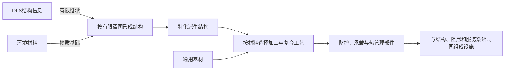

# CF7:ME · 统合时期的超级材料学

**文档角色**：统合时期先进材料的工程史与扩展入口，解释性能如何由材料、微观结构和制造工艺共同形成，怎样从昂贵特装走向普及，以及这些成果如何成为末世遗产。61系与钛基材料是首个完整案例；后续材料按本章的共同问题继续补充。

**状态**：本章工程史概括与机制解释按00归入当前主假说，不据此改写01-04。61系同源并行、钛基材料分级与单兵核动力已于2026-09-08用于物品文案；蓝晶、炎魔的DLS派生归属及材料学与基建的联系于2026-09-09纳入。2026-09-12采纳Astra设计局冠名、联盟特装职责与设计批注，见`21·Astra设计局节`。具体结构与工艺保持各自来源的归属层级。

**最后核对代码基线**：commit `04a59c9c4804a0db6f2a68e3814c459109ee409e`；2026-09-12核对61系玩家文案与设计局工程归属。政治年代归19，基础物理与DLS归01/05/10，纳米执行体系归09，堡垒化建筑归13，贵金属经济归14，星座武器及血剑失联机理归12。具体物品数值和效果由XML及对应玩法文档维护。

## 一、材料进步怎样改变了统合时代
> **稳定节名**：`21·材料发展史节`

统合时期的材料学承接了地面企业、研究机构与联盟舰群已有的技术积累。合体扩大了资源、试验条件和工艺知识的交流，使原先分别服务航天、能源、军事与民生的成果能够进入共同的工程体系；不把所有先进材料的发明都追认给统合成立之后。

这一时期的进步可以从三个相互联系的方向理解：

- **极端工况先行**：舰群、能源设备与少量特装能够接受高成本材料、专门制造和频繁检修，先取得普通设备无法负担的性能。
- **工艺与结构扩散**：配方之外，定向成形、接合、表面处理、检测和模块化维护经验逐渐扩散。某些性能可以通过复合结构和工程设计下放，减少对最稀缺材料的依赖。
- **普及依赖工业条件**：把一件样品做出来之后，还需要稳定良率、原料配额、产能与维修体系，才能让部队或社会持续使用。特装成熟与大众普及之间允许存在漫长间隔。

统合政治崩解先于审判日；政治组织瓦解后，既有工厂、设备与研究工作仍可能局部延续。审判日随后破坏更多生产与维护条件，已完成的装备、半成品、库存和图纸则以不同状态留存。相对年代以 `19·政治崩解与技术存续节` 为准。

## 二、“超级材料”是一种工程能力
> **稳定节名**：`21·材料性能与工艺节`

本章使用“超级材料”概括相对传统材料取得显著工程优势的材料族。一个名称可以承载多种牌号、复合结构与成形工艺；性能必须落实到具体用途，不能仅凭名称推得万能防护或无限输出。

| 决定因素 | 需要说明的内容 | 可形成的差异 |
|---|---|---|
| 组成 | 基材、强化组分、稀有配体或夹层 | 同属一个材料族，仍可能有不同等级和用途 |
| 微观结构 | 晶粒、定向结构、复合界面与分布方式 | 原料相同，组织方式不同，性能也可能不同 |
| 制造工艺 | 成形、接合、热处理、表面处理与校准 | 有配方或残件，仍可能缺少制造合格部件的能力 |
| 服役条件 | 温度、载荷、辐照、工作时长与维护条件 | 一种材料适合某项极端工况，不代表适合所有设备 |
| 工业供给 | 良率、配额、制造工时与替换件 | 昂贵原型能够工作，大批采购仍可能无法成立 |

被动的纳米改性材料、需要供能的功能材料，以及包含主动纳米资产或DLS器件的复合装置应按其实际构成区分。被动建筑材料的自愈时间尺度归13，主动纳米群的执行权限归09，DLS耦合及其能量边界归01/05/10；不能因都冠以“纳米”或“特种”便合并成一种机制。

材料可以提高承载、转换或传导能力，具体设备仍须有能源、控制与散热条件。特别是微型核动力，燃料供能，结构负责约束和防护，冷却回路移除废热；材料进步不使这些系统负担自动消失。

### 2.1 DLS派生矿物：以全谱能力换取特化
> **稳定节名**：`21·DLS派生材料节`

蓝晶、炎魔等矿石属于DLS现象的次级派生材料。这些结构失去了母体DLS的部分对称性与全谱耦合能力，保留下来的响应则偏向特定工程用途；相对于常规材料，它们仍能取得显著的性能优势。2026-09-09维护者确认这一族系归属，具体矿床与显微结构仍按后续内容分别展开。

机制沿用 `09·DLS派生结构节`：创作层掌握的是从DLS提取的有限结构信息，可在其蓝图允许的范围内形成低对称的次级结构。物质原料与结构信息来源要分开理解；环境材料可以成为派生产物的物质基础，复制这类产物并不等于制造出完整天然DLS。

09所述派生路径的工程化示意：

这里的对称性破缺发生在材料及其耦合结构上，不能与10的宏观θ域背景演化直接画等号。机械切割保留DLS本征模式，派生过程则涉及结构信息的不完整复现或定向改变，两者也应分别处理。“低阶”描述的是相对DLS保留了多少能力，不代表人类工程性能一定低下，更不构成对称性越低、所有属性就越强的通用升级规律。

| 材料方向 | 当前可采用的工程定位 | 已有依据与限制 |
|---|---|---|
| 蓝晶 | 结构防护与冷向耐受的功能矿物，可作为复合防护材料的特化组分 | 次品蓝晶与蓝晶装备已有防御、重量和冷抗差异；名称与冷抗不等于主动制冷，蓝晶也不自动成为冰魄的别名 |
| 炎魔 | 面向热工条件的防护材料，具体用途取决于矿相和构件工艺 | 炎魔甲现有较高防御并同时具有热抗、冷抗；本轮不从名称推得自燃、喷火或反伤，也不把矿石当成无输入的热源 |
| 冰魄与冷凝方向 | 定向热力学耦合的既有例子，为其他特化路线提供参照 | 具体机理以10为准，不能把该路线的主动作用移植给所有冷色矿物 |

蓝晶的冷抗说明它对相关伤害的防护表现；冰魄在10中承担的是主动热能抽取。这两层不能互相替代，也不足以证明二者必属同一矿物族的相反取态。蓝晶可能通过特定的热流或耦合响应实现防护，具体显微机理仍待对应内容定义。

应用性能还受有效矿相比例、结构完整度、复合界面和服役条件影响。物品文案中的“融合更多矿石”可以落实为有效功能相占比提高；更成熟的加工与复合结构又能改善利用效率。成品的防护与重量变化应结合这些因素解释。蓝晶与炎魔是不同特化方向，当前没有把它们排成统一的矿物进阶阶梯。

加工损耗也须逐材料处理：切割、粉碎、重熔或热处理可能改变功能结构，复合后的性能需看结构是否保留或能够重建。10对DLS切割与Q的关系给出的是定性标度，不能据此宣布所有派生矿物一律不可熔铸、不可重锻、只能整块镶嵌，或指定尚无依据的统一临界尺寸。整块镶嵌、保形切割及功能相复合都可作为具体设计路线，适用性随材料和构件工艺决定。

工程上可同时存在常规材料的精密加工、DLS派生矿物的特化利用，以及二者组成的复合构件。某种钛基牌号是否使用派生相，由具体设计决定，不因此把所有钛合金改写成DLS变种。派生矿物不能提供完整DLS的全谱功能，也不能借材料应用取得纳米指挥层或神谕机权限。

## 三、从特装到普及
> **稳定节名**：`21·特装与普及节`

不同使用者对同一项技术可能提出不同要求。少量高价值人员使用的特装，可以为任务能力投入大量贵料与专门工时；普通部队或民用设备则必须同时考虑能造多少、能够维护多久、替换件从哪里来。

常见的普及路径包括减少贵料覆盖范围、在关键位置局部使用、以分层结构分担功能，以及用较重或较复杂的通用部件代替昂贵整体件。这些做法往往将材料成本转化为重量、体积、控制难度或维护负担，不能把降成本写成无代价获得同样性能。

“设计可量产”“实际建立产线”和“完成列装或普及”分别回答不同问题。材料配额与工艺已经满足设计要求时，政治、资金或组织条件仍可能阻止生产。61系是这一矛盾的首个完整案例。

### 3.1 材料普及与堡垒化基建
> **稳定节名**：`21·基建材料节`

堡垒化基建是超级材料学进入大规模生活设施的结果之一。13中已有的纳米改性预制件、抗共振承重壳、自愈表层和阻尼组件，承接了先进材料与制造工艺的下放；建筑的主体体量仍可由通用材料承担，稀缺功能材料集中用于最需要它们的部位。

DLS派生矿相可以按工况进入局部复合部件，例如承载接点、防护夹层或热管理装置。它们提供特定方向的性能，常规基材、构件形状与连接工艺负责把这种性能组织到整座建筑中。具体设施采用何种材料、比例和位置由对应场景定义，不把所有民建统一写成蓝晶或炎魔矿石堆成的外壳。

材料基础与结构设计共同提高主体壳体的存续能力，却不会自动保住门禁、供能、通风、传感和控制权限。于是少拆主体、争夺服务节点和内部控制权具有工程上的理由；由此形成的战争形态仍归13。21解释材料与制造为何允许这样的建筑存在，13解释建筑怎样影响城市攻防。

自愈表层仍是13定义的长期维护机制，主动纳米资产的权限仍归09。局部使用派生材料不意味着每栋楼都装有完整DLS节点，也不赋予建筑战斗内瞬时修复或整座设施的主动意识。

## 四、材料族案例：联盟特种钛基材料
> **稳定节名**：`21·钛基材料节`

61系装备中的“钛合金”是联盟特种钛基复合材料家族的惯用简称。性能由基材、强化组分、微观结构与成形工艺共同决定；稀缺的是符合指定工况的材料和制造能力，不能仅凭钛元素含量判断等级。

| 工程分级 | 主要用途 | 设计价值 |
|---|---|---|
| 结构级 | 装甲、承力框架、关节与武器外壳 | 在重量、强度、耐久和环境适应之间获得更高余量 |
| 核能级 | 紧凑动力芯的约束组件、屏蔽结构与关键热流部件 | 允许极紧凑设备在高场、强辐照和高热流条件下持续工作 |
| 专用级 | 高功率执行器、供能接点、护盾及武器装置的专用部件 | 按具体工况取得低损耗传导、耐载或场装置结构稳定性 |

这些等级对应不同牌号和复合结构。材料仍会疲劳、受损，需要制造与维护；它不自行产能，也不赋予完整天网、神谕机或高阶模因权限。

联盟的优势由在轨精密制造、有限产线与合格材料库存支撑。本设定不引入月球高Q DLS的大规模开采，不改变19的地外军控与资源边界。既有战术背带的航天级钛合金框架、Mark3的军事卫星金钛合金按各自牌号和用途理解，名称相近不构成核动力或相同防护能力的证据。

## 五、工业化案例：61号动力装甲共同项目

### 5.1 两条并行路线
> **稳定节名**：`21·共同项目节`

普通61式与钛合金61式出自同一个61号动力装甲项目，共用基础架构与接口，分别面向地面部队和联盟舰群。两条路线在项目组织上并行，61是共同项目代号；不解释成年份，也不写成地面成品与后续升级的代际关系。

| 路线 | 主要目标 | 工程取舍与结果 |
|---|---|---|
| 联盟钛合金61 | 在有限投送名额中获得超规格战力 | 接受极高的单机材料消耗和维护工时，统合崩解前已有成熟原型服役，长期维持少量特装制造 |
| 地面普通61 | 让普通部队成规模装备动力装甲 | 长期降低稀缺材料用量，统合崩解后、审判日前夕完成可量产设计；实际产线、采购和列装未展开，仅留数台样机 |

联盟用材料冗余先满足性能指标，地面工程组继续攻克低材料消耗下的制造难题。两边交换数据与工艺，技术回流不改变并行关系。“成熟原型”已能服务限定任务，制造和校准仍依赖专门人员；合格穿戴者少、投送规模小、材料与工时昂贵共同限制数量。

普通61旧文案中的“战前联邦”制造归属保留，本篇不裁定该名称与联合国、统合会或统合的等同关系。

### 5.2 作战需求怎样影响材料选择
> **稳定节名**：`21·作战需求节`

闪6毒刺行动位于统合成立前夕，地面联合国与天上联盟并存。C.T夺船危机成为舰上特装需求的历史契机：少量人员取得内部控制权，就可能调动远超其规模的战略资产；Andy的行动也展示了超规格个体扭转危机的可能。

联盟特装承担舰内突防夺控、基地守卫反突防两类任务，采购上因此接受以昂贵装备提高有限人员的战力与生还能力。低重力减轻承重，制动、转向与射击惯性仍由驱动和控制系统处理，进入失电区或敌舰后由装备自持能源。

“危机推动61系需求”是2026-09-08采纳的后续工程史，不冒称闪6原作已经点名61号项目。共同技术研究允许有更早积累，具体年代归19。

### 5.3 贵料集中在动力核心
> **稳定节名**：`21·单兵核动力节`

61号共同平台以单兵级微型核聚变堆作为设计动力来源。核燃料供能，材料与配套设备负责约束、能量转换、防护和散热，DLS等接口按既有公设组织输出。

联盟型号允许贵料广泛覆盖动力、防护和高功率执行器，仍按重量、热管理与可靠性安排用量。地面型号则将核能级材料集中于少数不可替代部位，以替代材料和更复杂的结构承担其他功能；增加的重量与控制负担解释了粗壮腿甲及约三成能源用于移动辅助的旧记录。

地面线终于完成可量产设计时，统合已崩解，接续项目的主体缺少建线与采购资源，审判日又中断了剩余机会。“核能时代仅存在数小时”仍指走向民用及普通单兵普及的失败窗口，见14；更早的战略核工业和极少数军用原型可以已经存在。

背包级乃至武器内核动力是作品采用的科幻微型化前提，现实材料强度本身不足以证明这种尺寸可行。燃料、转换效率、散热与可调配功率仍有上限。现存普通61的封存堆芯和内置武器多已停机，物品背景不承诺玩家自动恢复全部旧设计功能。

### 5.4 同一技术体系中的配套装备
> **稳定节名**：`21·配套武器节`

钛合金P90以独立供能组件支持连续清剿与续航，钛合金171以整机协同火控应对高强度目标。分工按目标强度成立，两种武器均可用于进攻或防守；能源调配与手枪弹药回填的现役规则由[玩法ADR](../钛合金61式装甲套装-玩法设计-ADR-2026-07-27.md)维护。

血色天秤借独立微型动力芯维持本地工作，失去轨道端之后的稳场与人体代价归 `12·血色天秤例外节`。它体现了“同类材料允许设备独立运行，但完整配套能力不能仅靠供能替代”的另一种结果；持剑者的极限配装不等同正规钛合金61的普遍配置。

两套五甲及配套武器的玩家正文见[文案施工记录](../钛合金61式装备文案草案-2026-09-08.md)与其中指向的物品XML。部件效果说明、精确数值和启用条件留在物品及玩法文档中，本章维护工程来历。

### 5.5 Astra设计局与设计批注
> **稳定节名**：`21·Astra设计局节`

2026-09-12维护者采纳“星际联盟·Astra（阿斯特拉）设计局”作为钛合金系列的工程冠名。设计局承担61号共同计划中联盟特装路线的系统集成与配套武器设计，钛合金P90和钛合金QJZ171归入其配套武器；普通61的地面工程组仍是同源并行的合作方，双方交换运行记录、试验结果与工艺经验。

机构名称用于说明装备来历，图纸、武器设计批注和共同项目备忘使用“Astra”署名。署名背后的具体设计者身份暂留白，不由名称推定其为人类、人工智能或已有剧情角色。现实冠名纪念维护者确认的钛合金武器绘制与代码创作；游戏内只呈现设计局与工程记录，不出现模型代际或开发工具名。

其工程取向落实为维生优先、可靠的感知与支撑、减少操纵分心、独立装备也能发挥作用，以及为同行者提供火力窗口。给地面工程组的备忘同时交付失败试验，寄望于普通士兵未来能够领到61式；这份战前期待不改变地面型未能实际列装的结局。便笺随腿甲背景呈现，玩家正文以[物品XML](../../data/items/防具_40+级.xml)为准。

这些记录表达设计取舍，不追加装备能力或削去既有消耗与失效条件。血色天秤的特殊来历仍归12，不因能够配装便追认为设计局的制式作品。

## 六、其他材料线索与案例入口

以下条目用于继续扩展材料史，具体机制保持原有权威点；列入本表不表示全部材料已统一机理或已经完成更深的设定施工。

| 材料或工程案例 | 已有线索 | 后续可补的材料学问题 | 当前定义点 |
|---|---|---|---|
| 蓝晶、炎魔等DLS派生矿物 | 已确认由对称性损失形成特化方向，装备已有不同防护与抗性表现 | 矿相、复合工艺与具体使用工况；不把名称直接当技能 | `21·DLS派生材料节`，结构来源归 `09·DLS派生结构节` |
| 纳米改性预制件、自愈表层、抗共振承重壳 | 统合工程经验进入民建与企业设施 | 性能如何随成本下放，长期修复如何与战斗损伤区分 | [13·堡垒化基建](13-堡垒化基建、电子战与企业战争.md) |
| 抗磁性配体半金属与MACSIII | 机体可仿制，缺少指定材料时高级协议保持锁定 | 关键材料如何限制功能复现，以及补齐配额的意义 | [近战长枪物品XML](../../data/items/武器_长枪_近战.xml) |
| 航天级钛合金框架与金钛合金 | 战术背带曾使用航天工艺，Mark3利用军事卫星材料 | 原件回收、替代制造与牌号差异如何影响性能 | [插件材料](../../data/items/收集品_材料_插件.xml)、[高等级防具](../../data/items/防具_40+级.xml) |
| 贵金属接触层与DLS精密部件 | 金属在传导、接触、催化和生物相容环节持续被消耗 | 普通金属与特殊器件怎样形成组合成本 | [14·贵金属与冻链经济](14-贵金属与冻链经济.md)，DLS本体仍归05/10 |

## 七、末世留下了什么
> **稳定节名**：`21·材料工程遗产节`

材料技术的遗产可以有几种不同形态：合格原件仍可工作；库存能够支持有限维修；作坊能够复造外形及基础功能，却缺少高级材料或工艺；图纸尚存，但原料、设备和检测条件已经失散。每个案例按现役内容确定，不能一概写成全面失传，也不能因有人修好一件设备就宣称恢复了整条产业。

这使废土上的材料有了具体用途：一块残件可能是可消耗的原料，也可能是只有保留原结构才有价值的功能件。拆解、替代与直接维修的取舍来自材料和设备本身；交易价格、货币与冻链仍由14维护，不在本篇重建经济模型。

## 八、后续补建方式

新增材料案例时，写清五件事即可：它从哪一时期和哪套工业体系来；具体改善什么性能；稀缺点位于原料还是工艺；在什么条件下退化或失效；这些条件怎样影响装备、采购与末世使用。

先确定材料族及牌号，再明确涉及的是被动材料、供能装置还是主动执行系统。机制与已有章节交叉时保留原权威点，本章补工程史和应用关系；新增事实按00分级，并在20与本章案例表中补上入口。不要只凭“更高级的材料”给装备追加没有来源的全部能力。

参考与证据边界：

- 61系采用依据：2026-09-08维护者确认、两套物品原有描述与现役玩法；政治时序以19为准，旧核心设定PDF中的毒刺行动时代称谓也按19校准。
- [2010年7k7k原作介绍](https://news.7k7k.com/mingjiazhuanlan/huazai/2010/1015/16270.html)支持C.T与联合国特工Wing背景；61号装备立项因果为后续历史补写。
- 现实工程参考：[ARC紧凑高场聚变概念](https://arxiv.org/abs/1409.3540)、[ITER包层说明](https://www.iter.org/machine/blanket)。这些资料帮助区分材料性能、系统约束与工业难题，不证明作品中的单兵级微型化已经实现。
