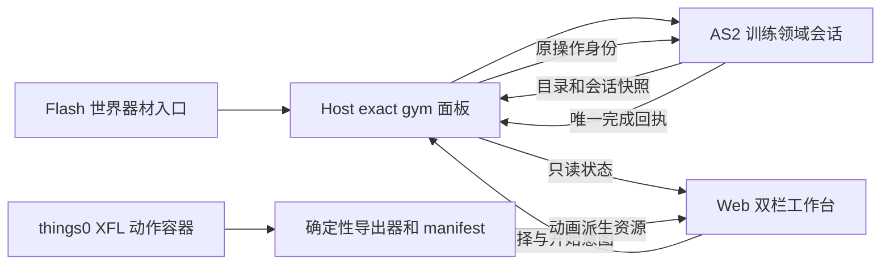

# 健身房双栏工作台与 Web 全程锻炼 ADR

**文档角色**：U4 健身训练与挂机的专项决策草案，记录预先探索、拟议架构、反例和验收出口。[剩余迁移台账](AS2-UI迁移剩余清单与难度评估-2026-09-12.md)继续拥有包范围、排期和进度；[双栏工作台合同](../agentsDoc/workbench-ui-system.md)继续拥有共享壳与视觉规范；[跨层迁移护栏](../agentsDoc/as2-web-panel-migration.md#authority-core)继续拥有通用权威约束。本文不改写这些真源。

**状态**：`FULL_TRAINING_CANDIDATE_E2E_VERIFIED / HUMAN_ACCEPTANCE_PENDING / NOT_DEPLOYED`。2026-09-23 维护者认可 Web 全程锻炼方向，裁定只在完成时统一扣费结算，未完成时切换项目、关闭面板或退出游戏均取消且不写业务结果；最小化或失焦暂停训练时钟，返回同一面板继续，并确认木人桩视觉先导可行。旧属性加成到上限后仍允许付费训练，完成时改得经验。三器材只读入口此前已获人类复测；完整训练的 AS2、Host、Web 与三动作已编译/自动验证，隔离候选在专用克隆槽通过取消、金币/K 点完成与重启读回。新候选的三器材游戏内视觉、失焦体感与人类操作尚待验收，没有正式部署。

**调查基线**：2026-09-23，仓库 HEAD `51e2ebb981f1e9728d54004a41416da03b0545c5` 加正在施工的未提交统一合成/输入工作区；下列健身房 XFL、训练脚本及 Web 纸娃娃文件未在该工作区改动。统一合成当前仍在 G1/G2 补证，G1 长会话代次反例未收口，C1/B 未开工；其后续状态只读[分阶段计划](统一合成与输入归属-分阶段施工计划-2026-09-22.md#11-续接记录当前唯一状态)。

## 1. 决策问题与现场动机

希望把健身房做成一个玩家态双栏 Web 工作台：点击世界内的木人桩、哑铃或深蹲器材，带着该器材身份打开同一个面板；主栏展示器材、当前角色的锻炼动作与进度，副栏展示该器材可切换的训练项目、费用、上限和确认。训练开始后直到完成，玩家看到的锻炼过程留在 Web 面板内。

2026-09-22 玩家正式 runtime 的现场视频与诊断包提供了有限动机：健身房提示 `ni:246` 于 23:43:12 `show`，到 23:44:05 切场景才 `hide`，期间提示随鼠标移动；该 `show` 未带器材/项目矩形锚点。同晚 NPC 菜单还出现前台和 Flash 内部焦点匹配时多次点击才弹出的现象。前者与旧健身菜单的 `rollOver → 注释`、`rollOut → 注释结束` 路径相符；现场包不能单独证明悬停离开为何未生效，也不能证明统一输入工程已修复公共点击路径。旧健身菜单迁走时必须退休其提示生产者并验证清理；器材入口首击仍需独立复验。

本 ADR 的主张是**Web 拥有完整可见体验，AS2 仍裁决训练资格、付费、完成、奖励和存档**。Web 的动画帧与倒计时是会话投影。产品规则现已明确：训练开始只建立临时会话，不扣费、不记进行中存档；切换项目、关窗或退出时，未完成会话取消；达到可结算终点后才由 AS2 一次性核验、扣费并发奖。剩余待裁决项见 §6。

## 2. 已核对的现役事实

| 范围 | 源码证据与当前行为 | 迁移影响 |
|---|---|---|
| 入口与目录 | [健身房地图](../flashswf/levels/基地场景合集/LIBRARY/地图/健身房.xml)放置三器材与场景计时器；[木人桩](../flashswf/levels/基地场景合集/LIBRARY/sprite/Symbol%202439.xml)、[哑铃](../flashswf/levels/基地场景合集/LIBRARY/sprite/Symbol%202434.xml)、深蹲器材在 `挂机中 == false` 时装载同一个 `挂机功能菜单`。器材身份决定默认动作与目录。 | 保留三处真实世界入口，由 AS2 校验当前场景、器材和角色资格；Web 不按静态地图图标推断准入。 |
| 动态项目 | [训练目录](../scripts/展现/UI交互/UI交互_aka_健身房训练.as)的三种生成函数按主线进度 `68/120`、等级 `35/50` 填充最多 13 项，包含金币/K 点、属性、经验与技能点相关项目。菜单目前逐行读取该数组。 | AS2 提供当前器材的有界目录快照和稳定项目身份；Web 只负责切换、预览与发送选择意图，不复制门槛或价格表。 |
| 完成路径 | [旧菜单](../flashswf/UI/基地特殊UI合集/LIBRARY/挂机功能菜单.xml)的属性项目在按下后同时启动场景动作/计时器，并用独立 `setTimeout` 在时长结束时改属性或转经验；计时器还会发训练经验。K 点技能项目调用计时器的独立支付/技能点路径。 | 现有属性路径有两个计时完成点。迁移时收敛为有身份的临时 AS2 训练会话；开始与动画完成都不是业务结算，唯一完成提交才可能扣费和发奖。 |
| 支付时点 | [金币提交点](../scripts/引擎/引擎_鸡蛋_lsy_物品系统.as)由属性项目完成回调调用；[计时器](../flashswf/levels/基地场景合集/LIBRARY/sprite/计时器.xml)的 K 点路径在开始时扣 `_root.虚拟币`，完成时发经验或技能点并标脏。菜单的属性项目预检使用 `_root[训练参数.货币名]`，K 点支付函数另查 `_root.虚拟币`；这两个名称在现役运行中的关系尚未实证。金币提交点验证数值后直接相减，没有完成时余额充足的二次检查。 | 旧差异仍需 parity 取证，但新产品规则已裁定金币和 K 点都只在完成时扣。AS2 在同一完成提交中重验准确余额、上限、项目和会话身份；任一拒绝均不扣费、不发奖。重复、迟到和未知回执仍须约束。 |
| 停止与存档 | 场景计时器有 `停止计时()`，但[可见的停止训练按钮](../flashswf/levels/基地场景合集/LIBRARY/sprite/Symbol%202447.xml)脚本处于注释块。`SaveManager` 将五种已完成健身加成写入 `mydata[7]`；本轮按 `挂机中/挂机计时器` 搜索未见进行中训练会话的存档字段。 | 新规则下未完成训练只保存在内存；切项目、关窗和退出取消，不扣费、不发奖、不保存进行中状态，也无退款或跨启动恢复。完成提交后的保存与回执丢失仍需按持久写合同处理。 |
| 面板暂停 | [PanelHostController](../launcher/src/Guardian/PanelHostController.cs)普通 OpenPanel 会调用 `AssertWebPanelPause`；[AS2 webPanelPause](../scripts/展现/UI交互/UI交互_lsy_UI管理.as)持有 `PauseManager` 租约，原注释明确要求面板背后的游戏与计时不推进。 | 玩家不能在该面板操作外部暂停按钮，因此无须为 U4 增加手动暂停交互；世界仍保持暂停，训练需独立时钟/完成路径，不能沿用场景 MovieClip 的计时或解除整座世界的暂停。 |
| 动画作者源 | [things0 XFL](../flashswf/arts/things0/things0.xfl)发布到 `things0.swf`；[主角-男](../flashswf/arts/things0/LIBRARY/主角-男.xml)内的 `man` 引用[健身动作 Symbol 624](../flashswf/arts/things0/LIBRARY/sprite/Symbol%20624.xml)。其 30 fps 作者时间轴含 26 层、283 个逻辑帧，标签为哑铃、深蹲、木人桩；静态解析得到 834 个分层关键帧、未见 XFL tween 属性。另有相似的 `Symbol 934` 与 `主角-女（弃用）`动作，均未由本轮证明为现役入口。 | 可从 XFL 整理单一可编辑动作容器，再确定性派生 Web 轨道；先判定重复元件与现役性别归属，分层顺序、矩阵、注册点、滤镜、器材/身体遮挡都须验证。静态解析不证明 Web 可逐帧等价。 |
| Web 人物基础 | [Web dressup manifest](../launcher/web/assets/dressup/manifest.json)现有 `dialogue/battle` rig；[烘焙器](../tools/bake-dressup-offline.py)的 battle rig 只导出七种战斗站姿。[DressupDollRenderer](../launcher/web/modules/dressup-doll-renderer.js)能播放皮肤帧序列，但 holder 矩阵取静态姿态；[CharacterAppearancePreview](../launcher/web/modules/character-appearance-preview.js)还固定了七姿势取景。 | 现有装扮皮肤和单 Canvas 可复用；健身动作的逐帧肢体轨道、器材交互与取景需独立扩展，不应把全局七站姿预览悄悄改成健身专用行为。 |
| Web 工作台 | [UI 合同](../agentsDoc/workbench-ui-system.md#2-布局系统)固定 1024×576 逻辑画布与封闭 `DualPaneShell` profile；`stage-focus` 已有约 60:40、右栏至少 360px 的空间先例。[源码 profile](../launcher/web/modules/workbench-profile.js)目前没有健身语义。仓库搜索未见现役 `gym` Panel/Task 或健身专项 runner。 | 可复用壳、缩放、焦点与状态组件；需以健身真实内容样张决定复用现有语义 profile 还是登记新 profile，不能只用 feature CSS 偷改壳级分栏。 |

以上为源码/文件静态核对，加上一份已有效采集的玩家现场包。**本轮未运行游戏、CS6、WebView2 候选、动画导出或付费训练，也未读写玩家存档。**文中“可行”是设计可行性，不是实现或表现验收。

## 3. 拟议方向与职责边界

### 3.1 玩家流程

1. 点击三种器材之一，AS2 以**当前游戏场景和器材实例**开放同一个 `gym` 面板；本次实例绑定该器材，面板内切换的是它的训练项目。更换器材先回到世界重新点击，除非人审明确扩大产品范围。三处入口不各建一套业务 UI。
2. 主栏显示器材、当前角色外观、选中项目的动作和明确的预览/进行中/完成状态；副栏显示 AS2 返回的可用训练、货币、价格、时长、当前加成与上限。选中行只改变预览；唯一“开始训练”动作只建立临时会话，不扣费、不发奖。
3. 开始后，AS2 在内存中绑定本次项目、价格、角色和会话身份；Host 绑定当前 `panelInstanceId` 与训练计时。Web 按权威开始/进度/终态投影动画、倒计时和结果，不能以 Canvas 播放完成或本地计时归零发放奖励。
4. 训练中可切换项目：先取消原临时会话并清零其进度，新项目回到预览，需再次显式开始。Esc、关窗、切场景、面板销毁或退出游戏发生在完成提交前，也取消临时会话；没有扣费、奖励、退款或待恢复的训练存档。已进入完成提交的操作不因关窗撤销，其未知结果按原操作身份查询，不能重发。

| 主栏（约 60%，待实际尺寸样张校准） | 副栏（至少 360px） |
|---|---|
| 器材与当前外观、动作 Canvas、训练进度、低动效静态姿势 | 项目列表、金币/K 点与上限、选中详情、唯一开始动作、拒绝/未知结果提示 |

玩家态 `gym` 工作台铺满当前 Web 面板的 16:9 内容区，保持 `1024×576` 逻辑画布与 `stage-focus` 分栏比例；不在四周留默认卡片边距，也不拉伸人物或器材。系统窗口标题栏及窗口是否最大化仍由 Launcher 管理。训练进度在会话功能接入后占主栏可见位置，并以文字、进度条和可访问状态同时报告已进行/总时长、百分比与剩余时间；选中项目的价格/时长不能冒充当前会话进度。

### 3.2 训练权威与暂停

- AS2 拥有器材/目录资格、当前余额和加成上限；开始时只建立内存会话，完成时在单一提交路径重验资格与余额，并把扣费、奖励、`dirtyMark`/严格保存作为同一业务结果处理。Host 拥有面板实例、独立计时、传输关联与未知结果写门；Web 拥有选择、布局、动画播放位置与可访问展示。所有命令绑定 exact 面板实例和训练操作；`PostMessage`/Web 发出/普通 ACK 不构成业务成功。
- 普通 Web 面板暂停继续保护后台世界。玩家不能在面板里操作外部暂停按钮，U4 不设计第二套手动暂停；但这个租约会使旧场景计时不适合作为训练完成依据。独立时钟须在暂停、最小化、失焦与 renderer 重建下实测；最小化/失焦期间暂停计时，回到同一面板继续。倒计时只投影已核验的训练进度，终态由 AS2 裁决。
- 无离线挂机/收益，也不持久化进行中会话。完成提交前的切换、关闭、断连和进程退出取消本次训练；重开从未训练状态进入。若完成提交已被 AS2 接受而 Web 回执丢失，必须按原操作查询终态，不能把“页面没看到成功”当作未完成并盲重试。
- 现役金币完成扣、K 点开始扣及两条完成路径先做 parity 表，明确新规则改变了 K 点扣费时点。正式完成提交拒绝余额不足、过期身份与重复请求；已达属性上限不是拒绝理由，完成后额外得到 50,000 经验，加上属性训练固定的 10,000 经验，共 60,000。未到上限的属性增长封顶并另得固定的 10,000 经验。预览和候选原型不写真实槽位。

### 3.3 动画真源与 Web 派生物

- 以 `things0` 中现役健身时间轴为作者源，调查把动作从主角 `man` 引用中整理为**唯一**可编辑容器的具体 XFL 引用方案。旧 Flash 使用期和新 Web 派生期都指向同一作者定义，避免维护两份“差不多”的动作。改名/引用先走 XFL 审核、rename/fix-includes 和 linkage 扫描；是否需要重新发布 `things0.swf` 由实际引用变更决定。
- 建议独立生成版本化健身动作 manifest：器材/动作标签、帧率与范围、每层在每帧的可见性、矩阵/注册点/层序、器材锚点、引用的已裁决装扮皮肤、源摘要及生成器版本。按相同输入重复生成应字节稳定；运行资源另有 manifest、完整性与体积审计。已有 `bake-dressup-offline.py` 的 XFL 解析和皮肤导出可作为素材，现有 manifest v1/七站姿不能直接宣称覆盖健身。
- Web 用**一个人物 Canvas**按真实角色装备/外观贴到逐帧肢体轨道，器材/背景与角色分层；不按每一种装备组合烘焙整角色视频。缺性别、皮肤、嵌套帧同步、滤镜或遮挡证明时显式降级并记录覆盖，不能把基础裸模叫作玩家当前造型。降低动效偏好只改变视觉；面板销毁须停帧、释放资源并取消未完成会话。最小化或失焦按 §6 暂停计时；完整训练时钟尚未实现。
- 作者动作分别约 78、76、128 帧，而训练项目时长有 1/10/20/30 秒；人物动作可按自身节奏循环，终态由训练会话决定，不把“播放一轮”当成奖励条件，也不为了凑时长硬拉伸原动画。短训练的收势与长训练的循环接缝须在实际尺寸下目测。
- 技术先导只取**木人桩一段真实循环**：源 XFL 与运行 Flash 同姿态对照，至少两套差异明显的真实外观，核肢体贴合、器材接触、层级、取景、循环接缝、装载体积与实际 WebView2 帧时间。通过后再扩哑铃/深蹲和可用性矩阵。26 层、283 帧是静态复杂度证据，不能代签此先导。

### 3.4 旧入口与提示清理

Web 正式接管时，三处器材 opener 只打开 `gym`；同一手势不得同时打开旧 `挂机功能菜单` 或触发旧项目 `on(press)`。旧 `rollOver/rollOut` 训练注释的生产者、场景 `挂机计时器` 的业务写入口、人物 `man.gotoAndPlay(挂机项目名)` 与残留 `挂机中` 标志逐消费者核查后退休或收窄。关闭、切项目、切场景、面板重建和断连都清 exact Web 提示；提示不依赖离开事件才能最终消失。地图/器材本体可继续作为玩家入口和场景美术。

## 4. 考虑过的路线

| 路线 | 收益与代价 | 本草案意见 |
|---|---|---|
| 只修旧提示退出 | 改动窄，能缓解此次跟随提示；旧菜单、场景计时和人物动作仍分散。 | 可独立止血，不取代 U4 全程体验目标。 |
| Web 只预览，购买后回 Flash 锻炼 | 交易改动较少；玩家动作和倒计时仍跨两套表面，不能满足“锻炼全程在 Web”。 | 不选作本 ADR 目标。 |
| Web 全程展示，AS2 完成时结算 | 一套玩家表面、一次菜单/提示生命周期；未完成训练可直接取消，仍需专项计时、完成提交与保存结果证据。 | **已接受的方向与结算规则**。 |
| Web 自行计时与扣费，或每外观烘焙整段视频 | 首屏看似简单；页面/皮肤组合不能承载可靠结算，组合数量与资产闭包无法受控。 | 不采用。 |

## 5. 验证出口与施工顺序

| 阶段 | 应交出的证明 | 明确不证明 |
|---|---|---|
| 0. 决策与取证 | 落实 §6 已裁决的完成时统一扣费/未完成取消规则；三器材 × 主线/等级门槛 × 金币/K 点 × 两种完成路径的源码 parity；核 `K点/虚拟币` 关系，并裁定剩余计时问题。 | 静态源码不证明已发布 SWF 与真实玩家旅程。 |
| 1. 动画先导 | 一段木人桩 XFL→manifest→Web 的可重复派生，原动作与两套外观的逐阶段对照；异常素材、关闭/重开、最低画布和性能/体积实测。 | 画面先导不授权真实付费，也不证明三动作已齐。 |
| 2. 只读面板纵切 | 三器材真实 opener → 同一 panel 默认项/切换/提示关闭；AS2 动态目录与余额/上限投影；键盘、Esc、缩放、失焦及游戏暂停归属。若统一输入 C1 尚未通过，标明它使用的候选后端，不能冒称终局合成。 | 面板打开不证明训练会话或焦点故障根治。 |
| 3. 训练会话候选 | 隔离/克隆槽验证金币与 K 点都只在完成提交扣费、经验/SP/属性上限、切项目/关窗/退出前零写、重复或迟到完成、余额变化、未知投递、断连、完成后保存重启读回及场景返还；AS2/Host/Web 各层有精确回执。进度文字与进度条必须绑定同一会话及权威时钟，覆盖失焦暂停/恢复、切项目归零与结算中。 | Mock、组件单测或 `build.ps1` 不证明持久写与人类体验。 |
| 4. 人类候选与发布 | 玩家实际尺寸评估器材辨识、动作贴合、项目切换、等待体感、Tooltip 清理与入口首击；确认 16:9 游戏窗口内容区无四周黑边、进度数值与等待体感一致；候选身份/路径/closure 明示。正式 runtime 发布、部署后标准入口业务复验另走独立授权和证据。 | 人验候选、promotion、正式入口各自不互相代签。 |

后续实现按[AS2 验证](../agentsDoc/testing-guide.md#as2)、[Web 验证](../agentsDoc/testing-guide.md#web)、[跨层验证](../agentsDoc/testing-guide.md#cross-layer)、[持久化验证](../agentsDoc/testing-guide.md#save)选择门；改 XFL/SWF 才执行对应真实 CS6 目标、Compiler `0/0` 与归属产物证据。当前没有健身专项 runner，后续 focused 测试应覆盖真正的资格/付费/完成反例，不为文档草案预造新发布门。

## 6. 已裁决规则与剩余问题

1. **切换**：维护者裁定训练中也可切项目。原临时会话立即取消且进度清零，新项目回到预览；只有再次显式开始才启动新训练。未完成会话无业务写，无需退款。
2. **关闭与重启**：完成提交前的 Esc、关窗、切场景、WebView2 面板销毁或退出游戏均取消；不保存进行中会话，重开不续训。完成提交已被 AS2 接受但回执未知的情况仍查询原操作，不用关窗或重启抹去已提交结果。
3. **扣费时点**：金币与 K 点统一在完成时由 AS2 一次性核验并扣费发奖；开始、预览、切换和取消均不扣费、不发奖。完成时余额或资格不满足则整次拒绝，不形成负余额或无偿奖励。这是对旧 K 点开始扣的有意产品变更。
4. **面板期间的时间**：世界暂停时训练使用 Host 独立单调时钟；最小化、失焦时暂停，返回同一面板后继续，过长的未采样系统冻结间隔不会一次性计入训练。锁屏按失焦处理，仍需在完整会话候选中实测。外部手动暂停按钮在该面板不可操作，无须另建 U4 暂停交互。
5. **外观与动画验收（待裁决）**：哪些性别、衣装/头盔、武器显隐和装备变化必须在锻炼画面精确表现？当前女性健身作者源是否真正现役，需从实际运行 SWF 和真人画面核实。
6. **工作台 profile 与全屏内容区**：继续使用现有 `stage-focus` 与 `1024×576` 逻辑画布。维护者在 1600×900 隔离候选中指出四周留边；`gym` 必须与其它工作台一样让 `#panel-content` 占满 Web 面板内容区，再整体等比缩放双栏壳，不依赖 feature 样式重写 Shell 分栏。其他宽高比保持比例并明确处理剩余区域，不裁剪文字或训练操作。
7. **玩家训练进度**：训练会话显示“已进行 X / 总计 Y 秒、Z%、剩余 T 秒”，附文本可读且不只靠颜色的进度条。最小化/失焦暂停时数值不增长，返回同一会话后继续；切项目/关闭导致取消时不保留旧进度。时长达到终点先显示“等待结算”，仅 AS2 的一次性完成结果可把状态改成已完成、扣费和发奖；未知回执显示待核实并禁止按页面百分比重发。未开始时显示“尚未开始”，不伪造进度。
8. **收益与继续训练**：项目详情显示当前已练得的永久加成、上限、还能增加多少、本次完成预计增加的属性与经验，以及是否付得起本次费用。到上限仍可训练，结果转为经验；当前恰好等于上限也按转经验处理，修正旧菜单在此边界付费却只得基础经验的问题。技能点显示当前可用余额而非虚构的累计训练所得。进行中明确显示本次已结算收益为零；只有 AS2 保存完成回执才能把预计值改为本次已获得。

剩余计时与表现问题完成前不冻结命令 schema、XFL 改名、工期或发布批次；本规则不需要为进行中训练新增存档字段。[U4 台账](AS2-UI迁移剩余清单与难度评估-2026-09-12.md#21-当前推进台账)中的 `L / 5–9 人日` 是旧范围初估，**未包含**完整 Web 纸娃娃动作轨道与完成时一次性结算及异常投递验证，不沿用为本方案报价。

## 7. 施工记录

2026-09-23：仅完成源码、文档和玩家提供的有限现场证据预先探索。维护者认可总体方向并授权单独提交、推送本文；当时 §6 未裁决。没有建立 `gym` 面板、训练会话或动画派生物，也没有候选/正式运行与付费写入验证。后续若施工，实际设计取舍、源与派生身份、失败反例、候选试玩和正式入口结论在本 ADR 或其明确链接的专项施工记录中逐次落地；不要用本文预设的验证表冒充已执行回执。

2026-09-23 续接：维护者明确完成时统一扣费结算、未完成即取消且不保存，外部手动暂停按钮不列入 U4 范围。此处只记录产品决定与静态可行性判断；独立时钟、一次性完成提交、真实保存读回、动画和面板尚未施工或验证。

2026-09-23 H1 施工：三器材 XFL opener 改走 `_root.gameCommands.openGymPreview`，由 asLoader 的 `GymPreviewPanelService.install()` 挂载；AS2 从原有 getter 复制有界目录、余额和当前角色外观，Host 只接受严格的 `world_gym` 只读打开快照，Web `gym` 统一面板可切项目、看价格/当前值/上限并精确关闭。训练按钮禁用；没有训练会话、扣费、奖励或保存命令。超上限历史值照实显示，外观字段限制已与 Host 对齐。独立场景 XFL 静态审核通过；视觉样张成稿时因 CS6 已打开且未确认编辑已保存，未触发真实编译。后续编译证据见本节末尾续接，不把早期源码连通称为当时已游戏可用。

木人桩 H1 动作先导从 `things0` 作者时间轴取 127 帧、30 fps、26 层，对两套现有男角色真实穿搭做逐帧分层预览。原 `xfl-ui-svg` 在器材 621/622/623 的填充轮廓组装丢失大块面积；当前运行包改由锁定的已发布 `things0.swf` 与 FFDec 字符 3209/3210/3211 可重复导出 SVG，manifest 同时锚定 XFL 作者源、SWF、FFDec 和输出摘要，命令及限制见[木人桩动作派生说明](../tools/gym-motion/README.md)。6 个 Web 资源共 475,982 字节，重复生成 6/6 SHA 一致，校验器重导出并核透明覆盖率。Edge 1024×576 实际资源路径测试通过 51 项页面/焦点/关闭/失败回退检查，两套外观 canvas 均有可见像素且帧号推进；未发生页面异常或失败请求。源帧 127→1 的姿势跳变保留供人审，Flash 像素一致性、当前玩家外观和真实 WebView2 帧时间仍未证明。

隔离 Launcher 开发候选已 `candidate_built`，identity `22628E6EDD16A8F727BF64FB69B972097846FF773CFFC83D2FA2987929104D75`、closure `2007CEFE39C707C2E524D16ACE8D80047DEA5940FD8A13150DE13F7D070E0ECE`，候选 bootstrap `--verify-runtime-only` 退出 0。常规 prepare 因现有 `save_repair_dict.json` 与所选发布树派生字节不符而停止；随后使用 `-SkipPrepare -SkipPolicy` 构建开发候选，并撤回准备阶段生成的四个非目标文件。成稿时候选尚未启动游戏，未经 release policy、正式发布或标准入口验收；当时下一人类节点为木人桩视觉样张评估。

2026-09-23 H1 视觉通过后续接：维护者确认 CS6 无需保留编辑。本轮 `GymPreviewProjectionTest` 在真实 TestLoader 中有 294 条通过、0 失败，Compiler `0/0`、SWF 与唯一闭合 runId trace 均新鲜。随后 `-Target publish` 刷新 `scripts/asLoader.swf`，独立目标刷新 `flashswf/levels/基地场景合集.swf`，两轮 Compiler 各为 `0 个错误, 0 个警告`，编译事务无残留不确定标记。FFDec 从已发布 asLoader 导出 `GymPreviewProjection`、`GymPreviewPanelService`、`openGymPreview` 安装和 `world_gym` 请求；从基地场景 SWF 导出三处按钮的 `dummy`、`dumbbell`、`squat` 桥接调用。此证据到 `compiled`，不能代替实机按钮和玩家存档旅程。

同一隔离开发候选经 `automation/start.ps1 -CandidateRoot <exact candidate>` 启动，verifier 报 `integrity-only / worktree` 与上述 closure 一致；Guardian PID `26412` 的实际 Core 路径位于候选目录，标题为“隔离候选 / 未部署”，HTTP/Socket bus 与 WebView2 均 ready。未选择存档，预热 deadline 后 Flash Player 退出并重置到选档页；因此只到候选前门已执行，健身房入口、AS2 动态目录与当前人物动作仍待测试/克隆槽中的人类操作。未提交、推送、promote 或标准入口验收。

2026-09-23 首轮真人入口反馈：隔离候选后续使用游戏存档进入健身房。木人桩面板显示动态目录与余额，但当前角色动画提示资源不完整；哑铃、深蹲在黑屏一瞬后返回 Flash。`logs/launcher.log` 的 16:16:58–59 段证明两种器材的 `panel_request` 均被 Host 接受、面板已打开，随后 Web 在约 30 毫秒内主动发送 exact `close`，并非按钮或 AS2 getter 未触发。根因是非木人桩的动作占位分支读取不存在的 `snapshot.station.label`，导致 `onOpen` 抛异常，Panels 依约 fail closed；已改从固定器材表取名称。回归新增哑铃、深蹲实际挂载、目录保留、占位提示和精确关闭。

木人桩外观回退另有两个确定来源：当前装备的锤子有本动作未使用的第二个刀分件，原校验因此拒绝整个元组；颈部新手军牌在现役 dressup manifest 中明确 `dressup:""` 且无人物分件，也被误认为缺失。H1 木人桩按空手动作收起已装备武器，仅放行目录明确无外观分件的已知装备；衣服、裤子、面具、手套、鞋和发型仍逐项要求实际贴图。按该次完整装备元组重建的 Edge 动画可见，未知衣物仍 fail closed。Edge 1024×576 回归 62/62、无 JS 异常或失败请求；这只证明更新后的 Web 字节，未代签新一轮真实游戏内复验。此次启动日志还包含普通 SaveManager shadow/saveAll 行，不据只读训练面板推断玩家存档整体未写。

2026-09-23 同一候选复测：Web 修正后复用原 native candidate，以 `automation/start.ps1 -CandidateRoot` 重新启动为 PID `10692`，实际路径和 identity/closure 仍为本节上述隔离候选；Web 源码哈希另为 `gym-panel.js CEEF020996357988EA950A7879DEB50C251A949BC9249E16EE597AAEC97F182E`、`gym-motion-renderer.js A21E1E9AE066EEFA054797DDCC8A9A075E9A59C2B82AF81C5F098D286C450AEF`。Edge 用真实 Web 目录复跑 62/62；在覆盖三器材与当前装扮的复测提问中，维护者回复“三种器材都正常”。对应 `launcher.log` 16:34:46–52，哑铃面板保持约 1.7 秒后由用户关闭，深蹲保持约 1.3 秒后关闭；木人桩也打开且未立即自动关闭。该结论仅覆盖只读目录打开/关闭和本轮视觉范围，不包含训练会话、完成时扣费、保存重启或正式入口。

2026-09-23 下一轮体验要求：维护者在实机截图中指出 Web 面板四周未铺满，并要求完整训练功能接入后告知玩家当前训练进度。留边根因是 `gym` 遗漏了共享 `#panel-content` 的 `inset:0` 全屏名单，生产 Web 仍用默认 `4% 6%` 内缩；已补入名单，移除 gym harness 中掩盖此差异的强制全屏样式。Edge 使用生产 CSS 在 1024×576 与 1600×900 两档均验证内容区与等比工作台铺满，分别 63/63，1600×900 截图无四周黑边；游戏内需待下次加载新 Web 字节复核。进度条仍待训练会话和权威计时/完成提交后实现，不把木人桩 127 帧循环或 H1 只读目录当成训练进度。

2026-09-23 U4 完整训练候选：维护者要求三种动作、完成扣费及收益/是否可继续训练全部施工，并裁定属性达到上限后仍可付费训练转经验；原菜单在恰好等于上限时只给固定经验的边界不沿用。新 AS2 会话只在内存中记录开始；完成时按当前目录、余额、场景/角色/存档身份二次核验，属性未满时实际增量封顶并给 10,000 经验，已满时给 10,000+50,000 经验，技能点项目只给指定技能点。标脏先于业务首写，业务只应用一次，严格保存失败后只重试同一份已应用状态；同槽重开先查询旧 session，再允许重试保存，异槽拒绝。整进程在保存失败后退出时，未落盘的内存结算无法恢复，不能对玩家宣称已保存，也不会自动重放扣费。

Host 使用当前 gym 面板实例绑定 AS2 打开 token 和会话 token，前台单调时钟每 200 毫秒采样、单次最多计入 400 毫秒；失焦/最小化暂停，时长到达后才独立发完成命令。超时、畸形回执或投递未知只允许原 token 查询，不由页面重发完成。Web 主栏显示已进行/总时长、百分比、剩余时间、暂停/结算/待核实状态及进度条；右栏区分已练得永久加成、距上限余量、本次预计收益、封顶后经验和技能点可用余额，完成保存前不把预计收益写成已获得。木人桩、哑铃、深蹲分别复用作者源 127/77/75 帧，当前角色衣裤、面具、手套和鞋继续逐件贴图；动作与器材运行包 8 文件共 680,495 字节，重建 8/8 hash 一致。Edge 生产 CSS 的 1024×576、1600×900 面板检查分别通过，最新 1024×576 为 78/78；独立三动作浏览器测试通过且当前示例穿搭可见。Flash TestLoader 预览 294/0、训练 32/0，asLoader publish Compiler 0/0，FFDec 在发布产物中确认五个训练 action、候选入口、安装调用与新保存 reason；Host 全量测试 5,671 通过、4 跳过，健身定向 20/20，专用跨层合同门与 10/10 变异反例通过。

隔离候选 `c-4fa0de945b00-577d9d4686-20260923t094004510z-43dd92b9` 的 build identity 为 `4FA0DE945B008B62E8CC11BC381F995FE7AD45928B1F8704B384A901E8AC2A12`，payload closure 为 `5D7375E9790BB7B9A982254C7B5B8A3A919C831EA30320C1E45AF32C4D7273AC`，Core SHA256 为 `19CD811B1F7DE0D5A60AC89BEFC2FD65DEAEC5073C37729C7018F5057B1A6662`；候选 bootstrap `--verify-runtime-only` 退出 0，正式 Core 与正式部署指纹在构建中保持不变。因仓库现有 prepare 派生差异，这是一份明确 `-SkipPrepare -SkipPolicy` 的开发候选，不是 formal policy 通过或部署。

专用 `cf7_agent_gym` 克隆槽在已审核的固定 AS2 opener 和当前候选 Core 下通过完整现场自动旅程（report SHA256 `7799600758F0790F1D5C39A73D8F2C4E27066EFCA0E217DE128AA4FFD9DD773C`）：先启动训练再切项目，健身业务值零变化；完成金币木人桩后金币 `3,438,500→3,378,500`、永久空攻加成 `0→3`、经验 `148,093→158,093`；完成 K 点技能点后 K 点 `2,900,741→2,899,491`、可用技能点 `45→70`。两次完成都有 AS2 `saved=true` 回执与专用 SOL 字节变化，新 PID 重启后 JSON/SOL 读回和面板目录一致。首轮/重启真实加载的五个 Web 生产脚本均与 29 文件源闭包 SHA 对上，CDP 只点击可见按钮且被动观察到 `isTrusted=true`；源槽 artifact set SHA `5ea07214f094e2af74ef7fcb2a2750b92195c5160d6562cb755fc8a96bb34de5` 在收尾保持不变，24 个非目标存档 artifact 的集合 hash 不变。runner 结束后无 Launcher/Flash 残留，克隆锁和恢复记录清空；专用克隆槽保留了测试后的独立存档。过程中的两次启动脚手架失败都在训练前 fail-closed，分别按精确恢复记录离线还原目标；已修复 Node 子 PowerShell 对 `Get-FileHash` 模块依赖及把同 Core 的直属 HotkeyGuard 误作第二 Guardian 的进程判别，随后只读候选开关与完整旅程均通过。

仍需维护者在新隔离候选中目视三种器材动画、衣装、全屏内容边界，以及实际切换、失焦/最小化暂停与恢复的体感。上限转经验、保存失败原 token 恢复与异常投递由 AS2/Host 定向测试覆盖，本轮克隆槽没有造满额、强制存盘失败或网络断线；不能把分层反例冒称实际游戏故障注入。人类候选验收完成后，提交/推送、正式 runtime promotion 与正式入口复验仍按各自授权和证据门办理。

最终源码另一次 Host 全量回归为 5,672 通过、4 项明确跳过；Web 两档 1024×576 与 1600×900 均为 78/78、页面错误和失败请求均为零；工作台 release-tree 严格审计为 0 error/0 warning，文档治理通过。

2026-09-23 视觉与即时属性续接：维护者对上一版完整训练候选回复“有效，未发现明显异常”，随后要求健身房靠近建角、整形、理发、技能界面的视觉体系，删去“当前角色外观”原始字段与其他重复提示，并让完成训练后的属性在原场景立刻生效。Web 保留共享 `stage-focus` 分栏和全屏边界，局部换成同批界面的青色强调、深灰分区与明确主按钮；移除外观字段底栏、常态目录/世界暂停状态、重复的开始/取消/成功提示，异常与待保存提示仍保留。训练中的文案改为“本次收益待完成”，不再把尚未结算的收益写成“已获得 0”。1024×576 与 1600×900 的真实浏览器界面均为 81/81，画面区、按钮命中、三动作与进度语义均通过；工作台 release-tree 严格审计为 0 error/0 warning。

理发/整形使用的 `LiveAppearanceUpdater` 只改外观，不改角色战斗数值。健身完成并严格保存成功后，未升级且实际获得属性时，现役角色在同世界、同场景、同存档、同 actor 身份下调用 `DressupInitializer.updateProperties` 重算装备与五种健身加成，再按既有规则保留当前 HP/MP 绝对值、刷新冲击派生值和玩家 HUD；等级提升沿用任务成长投影，满上限转经验及技能点项目不做多余的属性重算。保存失败期间不提前投影；同 token 重试成功后只投影一次，重复回执不重复投影。新鲜 Flash TestLoader 为预览 294/0、训练 47/0，覆盖五种属性、装备/Buff/护盾、HP/MP 不白送、保存失败重试与重复回执；asLoader publish 的 Compiler 为 0/0、SWF 已刷新，FFDec 导出确认新投影调用进入发布产物。该自动证据不能代替真人检查角色信息页是否即时显示新属性。

本轮新隔离候选为 `c-4fa0de945b00-0ffb88bbeb-20260923t110153465z-1406e807`，build identity 仍为 `4FA0DE945B008B62E8CC11BC381F995FE7AD45928B1F8704B384A901E8AC2A12`，payload closure 仍为 `5D7375E9790BB7B9A982254C7B5B8A3A919C831EA30320C1E45AF32C4D7273AC`，候选 Core SHA256 仍为 `19CD811B1F7DE0D5A60AC89BEFC2FD65DEAEC5073C37729C7018F5057B1A6662`；沿用明确的 `-SkipPrepare -SkipPolicy` 开发候选边界，正式 runtime 未部署。克隆槽完整旅程报告 SHA256 `6EED669520D616065FC3F93716C552A8C6504EB6A3E8396E93112C1D6DD98C98`：取消零健身业务变更，金币 `1,788,500→1,728,500`、空攻加成 `+3`，K 点 `2,875,741→2,874,491`、技能点 `+25`，新 PID 重启读回一致；来源槽前后 artifact set SHA256 同为 `1056F1BFD2C88C7AF41591BF8A8FDEDF288C7EA9F0E74F67669F0DA18F4F50AD`，非目标集合哈希不变，克隆锁与恢复记录均已清空。首跑验收器因仍等待已删去的“没有扣费”重复提示而假失败；真实取消回执为 `cancelled/saved=false`，修正为检查预览状态、选中项目及存档零变化后复跑通过。当前待人类验收节点是新候选的三器材视觉、加大后的画面，以及完成训练后在原地图立即查看角色属性，无需切地图；仍不是正式部署或标准入口验收。

该候选已由 `automation/start.ps1 -CandidateRoot <exact path>` 启动，bundle verifier 返回 `integrity-only / worktree`、36 文件和上述 payload closure；Guardian PID `16340` 的实际进程路径位于该候选 `runtime/` 内，窗口标题为“CF7:FlashNight — 隔离候选 / 未部署”，bus ready。此处只确认候选验收入口可用；真人角色信息页的即时变化仍待维护者现场观察。

2026-09-23 维护者对上述新候选回复“验收没问题”。按本轮提交验收的视觉排版、三器材训练与完成后原地图即时属性刷新范围，U4 开发施工和候选人类验收均收口；该总括回执未附逐项数值截图，不扩展为正式运行时发布或标准入口证据。当前仓库仍是未提交的混合工作树，U4 尚未 commit/push，也未经过正式 runtime promotion、标准入口复验；这些属于另行授权的发布阶段，不作为候选验收已完成的内容。

2026-09-23 正式发布续接：维护者随后明确授权云端共识、构建部署推送和 #31 卡片收口。U4 实现提交 `bc857066300296b75ac4cd47232c421d2665bbe5`，派生与策略修复后最终源码 `995ae9c62ec7544dfa97ffb35e3246bd06bf9047`，受保护标签 `runtime-build-v2/20260923-u4-gym-v1`，最终请求 `26EB801C98F5206BF1060E81F65F5593F6B159B6D3C2B46E785D9074C6E9C3E4`。本地 X509 与 [GitHub 云端构建 35858566544](https://github.com/FlashNightModReborn/CrazyFlashNight/actions/runs/35858566544) 达成相同 build identity / 36 文件 payload closure，严格策略 **41/41**，双签 / 双故障域 promotion、正式根 `--verify-only`、受控部署提交 `d9f1d08ba9271c58c64f70c8c4c28f7e7448224a` 快进推送和 [远端 Audit 35860162044](https://github.com/FlashNightModReborn/CrazyFlashNight/actions/runs/35860162044) 均通过；Audit 精确报告 `state=promoted / deploymentChanged=true`。机器真源与旧包恢复路径见[运行时发布记录](runtime-build-reproducibility.md#2026-09-23u4-健身房全程训练正式发布)。候选人验和克隆槽实写／重启仍是本轮健身业务证据；正式入口未另跑该付费旅程，状态为 `promoted / HUMAN_ACCEPTANCE_PASSED（隔离候选）`，不宣称业务级 `standard_entry_verified`。#31 关闭与看板归档凭证待本次卡片操作回填。
