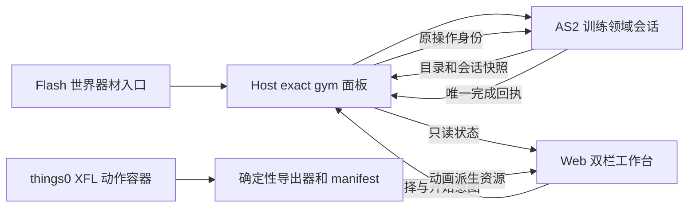

# 健身房双栏工作台与 Web 全程锻炼 ADR

**文档角色**：U4 健身训练与挂机的专项决策草案，记录预先探索、拟议架构、反例和验收出口。[剩余迁移台账](AS2-UI迁移剩余清单与难度评估-2026-09-12.md)继续拥有包范围、排期和进度；[双栏工作台合同](../agentsDoc/workbench-ui-system.md)继续拥有共享壳与视觉规范；[跨层迁移护栏](../agentsDoc/as2-web-panel-migration.md#authority-core)继续拥有通用权威约束。本文不改写这些真源。

**状态**：`DIRECTION_ACCEPTED / OPEN_DECISIONS / PRE_IMPLEMENTATION / DOC_ONLY`。2026-09-23 维护者认可 Web 全程锻炼的总体方向并授权单独提交、推送本文；§6 的产品规则仍待逐项裁决。本文不是实现、候选、游戏内验收或发布回执。

**调查基线**：2026-09-23，仓库 HEAD `51e2ebb981f1e9728d54004a41416da03b0545c5` 加正在施工的未提交统一合成/输入工作区；下列健身房 XFL、训练脚本及 Web 纸娃娃文件未在该工作区改动。统一合成当前仍在 G1/G2 补证，G1 长会话代次反例未收口，C1/B 未开工；其后续状态只读[分阶段计划](统一合成与输入归属-分阶段施工计划-2026-09-22.md#11-续接记录当前唯一状态)。

## 1. 决策问题与现场动机

希望把健身房做成一个玩家态双栏 Web 工作台：点击世界内的木人桩、哑铃或深蹲器材，带着该器材身份打开同一个面板；主栏展示器材、当前角色的锻炼动作与进度，副栏展示该器材可切换的训练项目、费用、上限和确认。训练开始后直到完成，玩家看到的锻炼过程留在 Web 面板内。

2026-09-22 玩家正式 runtime 的现场视频与诊断包提供了有限动机：健身房提示 `ni:246` 于 23:43:12 `show`，到 23:44:05 切场景才 `hide`，期间提示随鼠标移动；该 `show` 未带器材/项目矩形锚点。同晚 NPC 菜单还出现前台和 Flash 内部焦点匹配时多次点击才弹出的现象。前者与旧健身菜单的 `rollOver → 注释`、`rollOut → 注释结束` 路径相符；现场包不能单独证明悬停离开为何未生效，也不能证明统一输入工程已修复公共点击路径。旧健身菜单迁走时必须退休其提示生产者并验证清理；器材入口首击仍需独立复验。

本 ADR 的主张是**Web 拥有完整可见体验，AS2 仍裁决训练资格、付费、完成、奖励和存档**。Web 的动画帧与倒计时是会话投影。是否改变扣费时点、训练中取消、退出后继续和跨启动恢复，列在 §6 供人类审阅；本草案不把这些行为当作已接受产品规则。

## 2. 已核对的现役事实

| 范围 | 源码证据与当前行为 | 迁移影响 |
|---|---|---|
| 入口与目录 | [健身房地图](../flashswf/levels/基地场景合集/LIBRARY/地图/健身房.xml)放置三器材与场景计时器；[木人桩](../flashswf/levels/基地场景合集/LIBRARY/sprite/Symbol%202439.xml)、[哑铃](../flashswf/levels/基地场景合集/LIBRARY/sprite/Symbol%202434.xml)、深蹲器材在 `挂机中 == false` 时装载同一个 `挂机功能菜单`。器材身份决定默认动作与目录。 | 保留三处真实世界入口，由 AS2 校验当前场景、器材和角色资格；Web 不按静态地图图标推断准入。 |
| 动态项目 | [训练目录](../scripts/展现/UI交互/UI交互_aka_健身房训练.as)的三种生成函数按主线进度 `68/120`、等级 `35/50` 填充最多 13 项，包含金币/K 点、属性、经验与技能点相关项目。菜单目前逐行读取该数组。 | AS2 提供当前器材的有界目录快照和稳定项目身份；Web 只负责切换、预览与发送选择意图，不复制门槛或价格表。 |
| 完成路径 | [旧菜单](../flashswf/UI/基地特殊UI合集/LIBRARY/挂机功能菜单.xml)的属性项目在按下后同时启动场景动作/计时器，并用独立 `setTimeout` 在时长结束时改属性或转经验；计时器还会发训练经验。K 点技能项目调用计时器的独立支付/技能点路径。 | 现有属性路径有两个计时完成点。不能把“开始动画”“扣费”“完成奖励”折成一个 Web 按钮成功；需把两条完成路径收敛为有身份的 AS2 训练会话。 |
| 支付时点 | [金币提交点](../scripts/引擎/引擎_鸡蛋_lsy_物品系统.as)由属性项目完成回调调用；[计时器](../flashswf/levels/基地场景合集/LIBRARY/sprite/计时器.xml)的 K 点路径在开始时扣 `_root.虚拟币`，完成时发经验或技能点并标脏。菜单的属性项目预检使用 `_root[训练参数.货币名]`，K 点支付函数另查 `_root.虚拟币`；这两个名称在现役运行中的关系尚未实证。金币提交点验证数值后直接相减，没有完成时余额充足的二次检查。 | 人审前不得擅自统一扣费时点或认定预检等价；“余额期间变化可能造成负值”是源码推导的风险，尚非现场故障结论。实现时要在 AS2 内按准确余额、上限和项目身份重验，并覆盖重复/迟到/未知结果。 |
| 停止与存档 | 场景计时器有 `停止计时()`，但[可见的停止训练按钮](../flashswf/levels/基地场景合集/LIBRARY/sprite/Symbol%202447.xml)脚本处于注释块。`SaveManager` 将五种已完成健身加成写入 `mydata[7]`；本轮按 `挂机中/挂机计时器` 搜索未见进行中训练会话的存档字段。 | 训练中切项目、关闭、进程退出与重开不能假定已有取消/退款/恢复合同；付费未完成时的持久结果须专项裁决。 |
| 面板暂停 | [PanelHostController](../launcher/src/Guardian/PanelHostController.cs)普通 OpenPanel 会调用 `AssertWebPanelPause`；[AS2 webPanelPause](../scripts/展现/UI交互/UI交互_lsy_UI管理.as)持有 `PauseManager` 租约，原注释明确要求面板背后的游戏与计时不推进。 | 世界保持暂停时，锻炼会话需要独立的权威时钟/完成路径；不能直接沿用场景 MovieClip 的 `setInterval/setTimeout`，也不能为训练解除整座世界的暂停。 |
| 动画作者源 | [things0 XFL](../flashswf/arts/things0/things0.xfl)发布到 `things0.swf`；[主角-男](../flashswf/arts/things0/LIBRARY/主角-男.xml)内的 `man` 引用[健身动作 Symbol 624](../flashswf/arts/things0/LIBRARY/sprite/Symbol%20624.xml)。其 30 fps 作者时间轴含 26 层、283 个逻辑帧，标签为哑铃、深蹲、木人桩；静态解析得到 834 个分层关键帧、未见 XFL tween 属性。另有相似的 `Symbol 934` 与 `主角-女（弃用）`动作，均未由本轮证明为现役入口。 | 可从 XFL 整理单一可编辑动作容器，再确定性派生 Web 轨道；先判定重复元件与现役性别归属，分层顺序、矩阵、注册点、滤镜、器材/身体遮挡都须验证。静态解析不证明 Web 可逐帧等价。 |
| Web 人物基础 | [Web dressup manifest](../launcher/web/assets/dressup/manifest.json)现有 `dialogue/battle` rig；[烘焙器](../tools/bake-dressup-offline.py)的 battle rig 只导出七种战斗站姿。[DressupDollRenderer](../launcher/web/modules/dressup-doll-renderer.js)能播放皮肤帧序列，但 holder 矩阵取静态姿态；[CharacterAppearancePreview](../launcher/web/modules/character-appearance-preview.js)还固定了七姿势取景。 | 现有装扮皮肤和单 Canvas 可复用；健身动作的逐帧肢体轨道、器材交互与取景需独立扩展，不应把全局七站姿预览悄悄改成健身专用行为。 |
| Web 工作台 | [UI 合同](../agentsDoc/workbench-ui-system.md#2-布局系统)固定 1024×576 逻辑画布与封闭 `DualPaneShell` profile；`stage-focus` 已有约 60:40、右栏至少 360px 的空间先例。[源码 profile](../launcher/web/modules/workbench-profile.js)目前没有健身语义。仓库搜索未见现役 `gym` Panel/Task 或健身专项 runner。 | 可复用壳、缩放、焦点与状态组件；需以健身真实内容样张决定复用现有语义 profile 还是登记新 profile，不能只用 feature CSS 偷改壳级分栏。 |

以上为源码/文件静态核对，加上一份已有效采集的玩家现场包。**本轮未运行游戏、CS6、WebView2 候选、动画导出或付费训练，也未读写玩家存档。**文中“可行”是设计可行性，不是实现或表现验收。

## 3. 拟议方向与职责边界

### 3.1 玩家流程

1. 点击三种器材之一，AS2 以**当前游戏场景和器材实例**开放同一个 `gym` 面板；本次实例绑定该器材，面板内切换的是它的训练项目。更换器材先回到世界重新点击，除非人审明确扩大产品范围。三处入口不各建一套业务 UI。
2. 主栏显示器材、当前角色外观、选中项目的动作和明确的预览/进行中/完成状态；副栏显示 AS2 返回的可用训练、货币、价格、时长、当前加成与上限。选中行只改变预览，唯一“开始训练”动作才可能产生写入。
3. 开始后，AS2 冻结本次项目、价格、角色/存档与会话身份；Host 绑定当前 `panelInstanceId` 和回复。Web 按权威开始/进度/终态投影动画、倒计时和结果，不能以 Canvas 播放完成或本地计时归零发放奖励。
4. 一个训练会话活跃时最多只有一次可结算操作。**草案推荐**：开始前自由切换，开始后可查看其他项目，但禁用再次开始和直接切换正在执行的项目；完成后恢复选择。训练中取消、普通关闭、进程退出的产品语义留待 §6 裁决。

| 主栏（约 60%，待实际尺寸样张校准） | 副栏（至少 360px） |
|---|---|
| 器材与当前外观、动作 Canvas、训练进度、低动效静态姿势 | 项目列表、金币/K 点与上限、选中详情、唯一开始动作、拒绝/未知结果提示 |

### 3.2 训练权威与暂停

- AS2 拥有器材/目录资格、当前余额和加成上限、单次付费与奖励、`dirtyMark`/严格保存及终态查询。Host 拥有面板实例、传输关联、截止与未知结果写门；Web 拥有选择、布局、动画播放位置与可访问展示。所有命令需绑定 exact 面板实例与**领域训练操作**；`PostMessage`/Web 发出/普通 ACK 不构成业务成功。
- 普通 Web 面板暂停继续保护后台世界。训练领域会话可以按明确规则推进，但不能靠解除全局 `webpanel` 租约让世界、NPC 和其他场景计时一起运行。计时源须经过专项实验：比较 AS2 `getTimer`/回调、Host 单调时钟在暂停、最小化、失焦、WebView2 renderer 重建和进程结束时的行为；终态仍由 AS2 裁决。倒计时数字只由最近权威快照和有界本地插值显示。
- 先维持**无离线挂机/离线收益**的既有范围。Web 页面销毁不结束或重发已接受操作；同进程关闭重开先查询原身份。付费训练跨进程退出后的恢复/退款/继续策略必须与保存合同一并冻结，不能从新余额投影猜测旧操作是否执行。
- 现役的金币完成扣、K 点开始扣与两条完成路径应先被写成可执行 parity 表，再决定是否统一时点。预览和候选原型不写真实槽位；正式实现的未知/畸形成功只查询原操作，不盲重放。

### 3.3 动画真源与 Web 派生物

- 以 `things0` 中现役健身时间轴为作者源，调查把动作从主角 `man` 引用中整理为**唯一**可编辑容器的具体 XFL 引用方案。旧 Flash 使用期和新 Web 派生期都指向同一作者定义，避免维护两份“差不多”的动作。改名/引用先走 XFL 审核、rename/fix-includes 和 linkage 扫描；是否需要重新发布 `things0.swf` 由实际引用变更决定。
- 建议独立生成版本化健身动作 manifest：器材/动作标签、帧率与范围、每层在每帧的可见性、矩阵/注册点/层序、器材锚点、引用的已裁决装扮皮肤、源摘要及生成器版本。按相同输入重复生成应字节稳定；运行资源另有 manifest、完整性与体积审计。已有 `bake-dressup-offline.py` 的 XFL 解析和皮肤导出可作为素材，现有 manifest v1/七站姿不能直接宣称覆盖健身。
- Web 用**一个人物 Canvas**按真实角色装备/外观贴到逐帧肢体轨道，器材/背景与角色分层；不按每一种装备组合烘焙整角色视频。缺性别、皮肤、嵌套帧同步、滤镜或遮挡证明时显式降级并记录覆盖，不能把基础裸模叫作玩家当前造型。页面隐藏、暂停动画偏好、销毁/重建时停帧和释放资源；视效降级不改变训练计时或结果。
- 作者动作分别约 78、76、128 帧，而训练项目时长有 1/10/20/30 秒；人物动作可按自身节奏循环，终态由训练会话决定，不把“播放一轮”当成奖励条件，也不为了凑时长硬拉伸原动画。短训练的收势与长训练的循环接缝须在实际尺寸下目测。
- 技术先导只取**木人桩一段真实循环**：源 XFL 与运行 Flash 同姿态对照，至少两套差异明显的真实外观，核肢体贴合、器材接触、层级、取景、循环接缝、装载体积与实际 WebView2 帧时间。通过后再扩哑铃/深蹲和可用性矩阵。26 层、283 帧是静态复杂度证据，不能代签此先导。

### 3.4 旧入口与提示清理

Web 正式接管时，三处器材 opener 只打开 `gym`；同一手势不得同时打开旧 `挂机功能菜单` 或触发旧项目 `on(press)`。旧 `rollOver/rollOut` 训练注释的生产者、场景 `挂机计时器` 的业务写入口、人物 `man.gotoAndPlay(挂机项目名)` 与残留 `挂机中` 标志逐消费者核查后退休或收窄。关闭、切项目、切场景、面板重建和断连都清 exact Web 提示；提示不依赖离开事件才能最终消失。地图/器材本体可继续作为玩家入口和场景美术。

## 4. 考虑过的路线

| 路线 | 收益与代价 | 本草案意见 |
|---|---|---|
| 只修旧提示退出 | 改动窄，能缓解此次跟随提示；旧菜单、场景计时和人物动作仍分散。 | 可独立止血，不取代 U4 全程体验目标。 |
| Web 只预览，购买后回 Flash 锻炼 | 交易改动较少；玩家动作和倒计时仍跨两套表面，不能满足“锻炼全程在 Web”。 | 不选作本 ADR 目标。 |
| Web 全程展示，AS2 领域会话结算 | 一套玩家表面、一次菜单/提示生命周期；需要专项计时、付款终态和恢复合同。 | **推荐送人审的方向**。 |
| Web 自行计时与扣费，或每外观烘焙整段视频 | 首屏看似简单；页面/皮肤组合不能承载可靠结算，组合数量与资产闭包无法受控。 | 不采用。 |

## 5. 验证出口与施工顺序

| 阶段 | 应交出的证明 | 明确不证明 |
|---|---|---|
| 0. 决策与取证 | §6 产品选择签定；三器材 × 主线/等级门槛 × 金币/K 点 × 两种完成路径的源码 parity；当前 `K点/虚拟币` 关系、取消和存档行为专项复核。 | 静态源码不证明已发布 SWF 与真实玩家旅程。 |
| 1. 动画先导 | 一段木人桩 XFL→manifest→Web 的可重复派生，原动作与两套外观的逐阶段对照；异常素材、关闭/重开、最低画布和性能/体积实测。 | 画面先导不授权真实付费，也不证明三动作已齐。 |
| 2. 只读面板纵切 | 三器材真实 opener → 同一 panel 默认项/切换/提示关闭；AS2 动态目录与余额/上限投影；键盘、Esc、缩放、失焦及游戏暂停归属。若统一输入 C1 尚未通过，标明它使用的候选后端，不能冒称终局合成。 | 面板打开不证明训练会话或焦点故障根治。 |
| 3. 训练会话候选 | 隔离/克隆槽验证金币完成扣、K 点开始扣、经验/SP/属性上限、重复点击、余额变化、竞态、未知投递、超时、断连、关闭重开、进程退出/读回及实际场景返还；AS2/Host/Web 各层有精确回执。 | Mock、组件单测或 `build.ps1` 不证明持久写与人类体验。 |
| 4. 人类候选与发布 | 玩家实际尺寸评估器材辨识、动作贴合、项目切换、等待体感、Tooltip 清理与入口首击；候选身份/路径/closure 明示。正式 runtime 发布、部署后标准入口业务复验另走独立授权和证据。 | 人验候选、promotion、正式入口各自不互相代签。 |

后续实现按[AS2 验证](../agentsDoc/testing-guide.md#as2)、[Web 验证](../agentsDoc/testing-guide.md#web)、[跨层验证](../agentsDoc/testing-guide.md#cross-layer)、[持久化验证](../agentsDoc/testing-guide.md#save)选择门；改 XFL/SWF 才执行对应真实 CS6 目标、Compiler `0/0` 与归属产物证据。当前没有健身专项 runner，后续 focused 测试应覆盖真正的资格/付费/完成反例，不为文档草案预造新发布门。

## 6. 人类审阅需要裁决的点

1. **活动会话中的切换**：草案推荐开始前自由切，训练进行中锁住新开始；是否允许中止当前、排队下一项或查看其他项目？现役停止按钮被注释，不能把“中止即退款”视为旧语义。
2. **关闭与重启**：玩家按 Esc/关闭/切场景以及 WebView2 崩溃时，训练是继续、暂停待恢复，还是明确中止？K 点已扣未奖励的操作如何跨进程对账？默认不增加离线收益。
3. **扣费时点**：保留“金币完成扣、K 点开始扣”的原差异，还是统一成开始时预留/完成时结算？若保留差异，持久待完成会话及金额边界如何保证一次性与可恢复？
4. **面板期间的时间**：世界暂停时，训练的 1/10/20/30 秒是否按真实经过时间推进？最小化、锁屏、失焦是否计入？先执行专项时钟实验，再冻结实现。
5. **外观与动画验收**：哪些性别、衣装/头盔、武器显隐和装备变化必须在锻炼画面精确表现？当前女性健身作者源是否真正现役，需从实际运行 SWF 和真人画面核实。
6. **工作台 profile**：按 1024×576 左动作主栏、右项目决策栏制作真实内容样张后，决定复用 `stage-focus` 的空间规则，或在共享 UI 合同登记新的健身语义 profile；右栏至少保留完整价格、上限、错误与确认区。

这些裁决完成前不冻结命令 schema、存档扩展字段、XFL 改名、工期或发布批次。[U4 台账](AS2-UI迁移剩余清单与难度评估-2026-09-12.md#21-当前推进台账)中的 `L / 5–9 人日` 是旧范围初估，**未包含**完整 Web 纸娃娃动作轨道与跨页面/进程的付费训练会话，不沿用为本方案报价。

## 7. 施工记录

2026-09-23：仅完成源码、文档和玩家提供的有限现场证据预先探索。维护者认可总体方向并授权单独提交、推送本文；§6 仍待裁决。没有建立 `gym` 面板、训练会话或动画派生物，也没有候选/正式运行与付费写入验证。后续若施工，实际设计取舍、源与派生身份、失败反例、候选试玩和正式入口结论在本 ADR 或其明确链接的专项施工记录中逐次落地；不要用本文预设的验证表冒充已执行回执。
