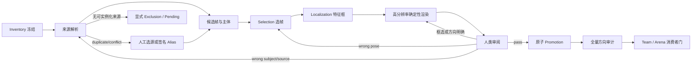

# 怪物头像生产管线：可复用运行手册

**文档角色**：怪物头像新增、返工、全量方向复核和消费者接入的操作规范。本文只保留可复用合同、分支条件、执行门和证据边界；批次历史、模型表现与路线论证见[路线评估备忘](怪物头像统一资产与Luna-CLI-Worker路线评估备忘-2026-08-05.md)，具体工具参数见 [`tools/portrait-pilot/README.md`](../tools/portrait-pilot/README.md)。

**当前状态**：`OPERATIONAL_RUNBOOK / AUTOMATED_CLOSURE_VERIFIED / ARENA_EXACT_IDENTITY_CLOSED / NOT_GAME_E2E_VERIFIED`。2026-08-09 快照为 226 identity / 227 variant / 222 human-accepted variant / 2 pending / 1 excluded / 2 aliases，生产 manifest digest `33E1FABF…9961`；Arena 目录为 217/217 ready、0 locked fallback。这些数量是一次已验证快照，不是永久硬编码。

---

## 1. 不得破坏的五层边界

| 层 | 权威与职责 | 禁止事项 |
|---|---|---|
| 身份层 | `data/enemy_properties` 中的稳定 `portraitRef`、必要 variant 指针 | 用文件名猜身份；把近似换皮自动合并 |
| 来源层 | inventory、SWF/XFL linkage、帧、内部主体和人工选源回执 | 把带血条、等级、名称的怪物根当透明主体 |
| 决策层 | Luna 结构化 shard、确定性验证、人类 pass/框选/方向/换帧 | 让模型直接写生产图或替代人工艺术签署 |
| 产物层 | 内容哈希 SVG、512px PNG 回退、manifest provenance、promotion receipt | 手改生成 manifest；只翻 SVG 或 PNG 一路 |
| 展示层 | Web resolver、头像框、底色、光晕、完整/紧凑布局 | 把框体和氛围烘焙进透明主体；由展示层反写身份 |

所有 worker 只写独立 shard；只有单一 controller 可以合并、生成回执和执行原子 promotion。`candidate_proposed`、`automated_checked`、模型 A/B 一致、进程退出 0 和 mock-browser 全绿都不是 `human_reviewed` 或真实游戏验收。

---

## 2. 标准状态机



每次进入下一状态前必须有父 artifact、schema、digest、计数和 controller closure；失败批次只能作为诊断或负例，不得挑选其中看起来较好的行拼入成功批。

---

## 3. 开工前检查

1. 记录 `git status --short`，分别查看 staged 与 unstaged；保护其他任务和用户现有改动。
2. 重新生成或验证 consumer inventory。以当次 digest 和 `portraitRef + variantKey` 集合为准，不复用文档数量充当数据库。
3. 对 Luna CLI 执行 capability probe，绑定可执行文件、版本/hash、模型、effort、service tier、schema、timeout 和 transport。probe 失败即停止，不静默替换模型。
4. 所有批次使用 `tmp/portrait-pilot/` 下的新目录；工具拒绝覆盖既有证据。
5. 冻结本批人类反馈 atlas、当前决定和 superseded negative。过期 compact atlas 不得继续作为最新偏好输入。

---

## 4. 来源解析与主体救援

### 4.1 固定优先级

1. 首帧唯一命名 `man`。
2. 人类指定动作状态中的精确 `man`、库元件和内部帧。
3. 缺 `man` 时，从根时间轴向内遍历 MovieClip；按复杂度 high → medium → low 排序，再由多模态确认候选与外围身份参考相符、构成完整可识别怪物且不含 UI。
4. MovieClip 全失败后，才检查根帧实际放置的 Graphic；必须绑定放置路径、帧、矩阵和编译形状证据，不能在全库裸 Shape 中猜测。
5. 仍不闭合则转人工选源、pending 或 exclusion，不回退带血条/等级/名字的怪物根。

复杂度只提高召回率，不构成主体真实性。武器、特效、阴影、UI 和孤立肢体即使复杂度更高也不得自动获胜。

### 4.2 变体与换皮

- 只有运行时确有稳定状态选择器时才建立正式 `variantKey`；JK `orange / white` 是已验证特例。
- duplicate/conflict 必须作为多个来源候选走人工裁决。
- 只有维护者明确确认“同一单位换皮”后，才可用签名 alias receipt 复用头像；别名不得吞并不同来源异常。
- 缺失来源与画师遗漏必须如实记录，不能以语义近似头像填坑。

---

## 5. 模型阶段与并发

模型任务必须拆成两个阶段：

- **Selection**：在完整候选上下文中选主体与帧；当前实证基线为 Luna Max / Fast6。
- **Localization**：只对锁定的原生高分辨率帧判断特征与框选；当前实证基线为 Luna Max / Fast3。

两者单进程上限当前为 600 秒。该配置只是已验证起点，不是永久产品常量。出现 429、transport、timeout、orphan/survivor、首答闭包退化或多轮几何修复时必须回落并发，不因单价下降直接提高并发。

每个 shard 记录：身份数、模型小批数、A/B PID、attempts、墙钟与 p95、429/transport、timeout、orphan/survivor、schema 修复、A/B 候选/方向一致率和最终真人通过率。

---

## 6. 构图与清晰度合同

1. 头像的第一目标是小尺寸可识别度。头通常是主焦点；头部辨识较弱时，允许武器结构、核心或身体特质成为受控复合焦点。
2. 主焦点必须位于视觉甜区并保留安全范围；辨识度弱的肢体、装饰和武器末端可受控顶边或侧边裁切。
3. 非人单位必须先说明“什么特征让它一眼可认”，再画 `featureBox / mustIncludeBox`；不能机械套用人脸模板。
4. 模型联系表和 80px 审核图只用于意图与小尺寸判断。最终像素必须从精确帧高分辨率重渲染，禁止放大低清候选。
5. 当前合同要求真实来源裁切至少 1024px、保留母版不超过 4096px、必要的 FFDec 中间全帧不超过 16384px，并用预乘 RGBA fidelity 门验证。
6. 透明主体同时派生 SVG 与 512px PNG 回退；边框、底色和氛围属于消费者展示层。

---

## 7. 人类反馈必须成为下一轮数据

- 审阅页不设置六行上限；“6”是预计复议预算。扩容估算使用 `下一批身份数 × 预计失败率 ≤ 6`，页面可以一次呈现更多项目以减少切换。
- pass、人工框选、方向、换帧、错主体、错来源、variant mismatch 和 source anomaly 分别记录。
- 更晚决定覆盖当前状态；被取代的旧决定保留为 superseded negative，不与当前标签重复计数。
- 人类已给出精确帧或框选时直接无模型重渲染；不要让 Luna 再猜一次已知答案。
- 导出按钮必须有保存中、成功、重复点击抑制和可验证归档。只有完整 decisions + receipt 才能进入 promotion。

### 7.1 消费者目录中的纸娃娃与悬浮说明

- `主角-*`、佣兵等纸娃娃头像必须复用 `MercPortraits` 的稳定外观键、胸像相机和缓存；Arena 不得另建一套裁剪语义。
- 头像快照原图尺寸不等于消费者窗口尺寸。消费者窗口内的 `` 必须显式 `width/height: 100%` 与 `object-fit: cover`，否则 112px 快照进入 38px 目录格时会只露出枪管或身体局部。
- 长目录只挂载可见区及邻近预取区的纸娃娃；共享 renderer 队列当前默认并发上限为 4。目录身份数、页面密度与实际同时渲染数是三个不同概念，不能因条目多就一次打开全部 renderer。
- 图标说明统一进入 `PanelTooltip` scope，并在 DOM 替换前 `releaseTree`；禁止把 `title` 当项目 tooltip，因为它会触发浏览器原生白色气泡并绕开项目样式、所有权和异步生命周期。
- 以上规则必须同时通过自动断言与真实 hover 检查；mock-browser 结果仍不代签 Launcher WebView2→Flash。

---

## 8. 方向语义

canonical 目标是主体视觉轴朝 viewer-right，但武器、特效或留白不能覆盖可见解剖方向。方向审核必须观察最终 production 512px PNG，不从旧 metadata 批量猜测。

人审页的 `flip_x` 表示“对当前 production 像素再镜像一次”，不是把底层绝对动作直接设置为 flip。promotion 必须同时切换最终 action、SVG 变换和 PNG 像素，并保存：

- 源生产 action / raster transform；
- 人类相对决定；
- 是否实际镜像；
- 最终 action / raster transform；
- 模型报告、review 与 receipt digest。

当前实证中 39 项风险行为 34 keep / 5 relative flip；最终结果为 ArmsArius、汽车炸弹、重盾骑士回到 `keep`，忍者兵、忍者 BOSS 成为 `flip_x`。这类“双翻恢复原方向”是相对语义的直接证据。

---

## 9. 历史证据与 Supersession

审计报告不得只引用会被下一次 promotion 替换的 live manifest 或内容哈希素材目录。执行生产替换前必须：

1. 冻结源 production manifest、promotion receipt、审计控制器与所有被审图片的精确字节。
2. 新包继续保留旧审计输入；r210 基础方向闭包为 434 个素材绑定 / 432 个唯一文件，后续 supplement 必须另绑新增项的人审与方向证据，不能冒充已进入 r210。
3. 若旧报告引用的 live 路径已合法演进，生成显式 artifact-supersession receipt，把原 artifact record 映射到字节相同的冻结副本。
4. 历史复验只有显式传入该回执才允许使用副本；缺回执仍必须按 hash drift 失败。

不得改写旧报告或重新计算旧 digest 来“修复”历史。

---

## 10. Promotion 与回滚

promotion 前至少满足：

- identity、variant、pending/excluded/alias 集合闭合；
- 所有 accepted variant 有人类回执；
- SVG / PNG / action 方向一致；
- source、review、render、vector、orientation controller closure 全部通过；
- 全量预演证明保持项 hash 不变、相对 flip 是旧 production PNG 的精确水平镜像；
- 历史审计素材已保留。

全量正式写入由 `promote-enemy-portraits-v1.py promote --replace-existing` 原子替换；已冻结基础包上的有限 Arena 尾批可由 `promote-arena-portrait-supplement-v1.py preflight/promote/check` 执行，但必须精确绑定基础 manifest digest、全部人审/方向/alias 回执，并采用 staging → 版本化 backup → 原子替换 → shared manifest 复验。两条入口都先验证目标与回滚目录在规定范围内；失败保留或自动恢复旧生产包，不做半包修补。当前直接回滚点为：

`tmp/portrait-pilot/enemy-portrait-production-backups/enemy-portraits-supplement-base-5fa93f5bac9093d2-20260809T085831644559Z/`

---

## 11. 固定验收门

```text
python tools/portrait-pilot/promote-arena-portrait-supplement-v1.py check
python tools/portrait-pilot/promote-enemy-portraits-v1.py check
python tools/portrait-pilot/promote-team-portraits-v1.py check
python tools/portrait-pilot/preserve-orientation-source-assets-v1.py check
python tools/portrait-pilot/audit-portrait-orientation-propagation-v1.py check --output tmp/portrait-pilot/orientation-audit-r220-full222-supplement-20260809T173000Z --current
node tools/audit-arena-portrait-coverage.js --check
node tools/run-team-harness.js
node tools/run-arena-harness.js --browser edge --viewports=1024x576,1366x768,1920x1080
node tools/validate-doc-governance.js
git diff --check
```

涉及方向时，另外复验人工回执、当前 propagation audit，以及带显式 supersession receipt 的历史视觉审计。当前自动基线为：

- production：222 human-accepted；
- propagation：当前 r220 为 222/222、0 action/SVG/PNG mismatch、0 legacy visual audit required；来源分为基础 178 model keep + 39 human audit，以及 supplement 4 direct human pass + 1 explicit `flip_x`；
- Arena：217/217 ready；其中怪物 manifest 214/214，`主角-*` 纸娃娃 3/3，0 controlled locked fallback；
- Team：三视口全绿；
- Arena：32/32 × 3 视口。

这些门证明源码、资产和 mock-browser 闭包，不等于真实 Launcher WebView2→Flash、游戏内视觉 E2E、部署或维护者艺术签收。

---

## 12. 新增一个怪物的最短合规路径

1. 更新 consumer inventory，确认稳定 `portraitRef` 与是否需要 variant。
2. 解析唯一 `man`；失败时按内部 MovieClip → 受约束 Graphic → 人工来源队列分流。
3. 只对新身份执行 selection；锁帧后再 localization。
4. 确定性生成高分辨率透明主体与审核派生图。
5. 人类 pass；若只改框、方向或帧，走对应的最短无模型返工支路。
6. 将新决定并入当前 feedback atlas，保留旧负例。
7. fresh 预演后原子 promotion；重跑全量方向传播和消费者覆盖。
8. Team/Arena 分别跑自动门，并在真实游戏中完成小尺寸、透明边缘、方向和布局验收。

若第 2 步无法证明主体来源，流程必须停在 pending/exclusion；不得为了“头像齐全”跳过来源事实。

---

## 13. 当前尚未关闭的边界

- `敌人-Serpent`、`敌人-黑无常索命` 仍是两个 production pending；它们当前不在 Arena 的 217 个 exact consumer identity 中，不能因 Arena 覆盖闭合而代签。
- Arena 原 6 项缺口已由 r219 增量包关闭：`敌人-红水晶 / 敌人-唐头肌肉男 / 敌人-锯片陷阱 / 敌人-旧型号机器人改 / 敌人-家用机器人` 绑定真人 4 pass + 1 orientation-only adjustment，家用机器人使用经校验的 `flip_x` 产物；`敌人-锡蒙利范围光环发生器` 的内部唯一帧只有 57×3、6 个可见黑像素，属于不可识别的退化逻辑图形，经人类明确批准后以 identity alias 复用 `敌人-锡蒙利::default`，不复制主体资产。alias receipt digest 为 `AF29A2B5…9ED`，supplement closure digest 为 `4B85A8E7…9AA4`。
- `敌人-lady` 已统一到已接受的精确身份 `敌人-Lady`，不再把大小写漂移伪装成素材缺口。`主角-男 / 主角-尾上世莉架 / 主角-文天` 已从怪物缺口中移出并走单位级纸娃娃投影。
- 当前自动验收未代签真实 Launcher WebView2→Flash 与游戏内视觉。
- Luna 的价格、模型能力、CLI transport 和安全并发都可能漂移；每个新工程必须重新 probe。

维护这份手册时只更新规范和当前已验证基线。长篇批次经过、失败样本与模型效率继续写入路线评估备忘或独立 evidence 文档，避免运行手册再次退化为难以复用的施工日志。
