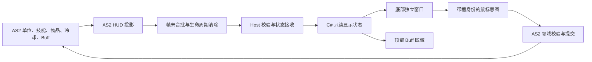

# 玩家信息界面完整迁移：复工调研与施工路线

**文档角色**：完整 HUD 施工路线与阶段收口记录。范围与协议归[玩家信息 HUD 架构设计](玩家信息界面-NativeHud迁移-架构设计-2026-06-21.md)，HP/MP 历史视觉证据归 [B0 专项 ADR](玩家信息界面-NativeHud-SVG真源与程序化动效-B0-ADR与分片施工计划-2026-07-28.md)。首轮试玩见 [§10](#live-candidate-checkpoint)，当前 C 阶段美术迁移及待验范围见 [§11](#c-stage-authored-hud)。

**最后核对代码基线**：玩家 HUD `d24f5a098f` 与上游 `1a774a108d` 的合并树（2026-09-20）。§2–5 的原始盘点保留 9 月 12 日调查语义，实施结果以 §10 及架构 §4.3 为准；B0 历史证据不升级。

**本次修订范围**：A–D 的状态、原稿美术、交互与旧壳迁移已落地，pi17 已由维护者试玩并接受当前交付，授权正式发布及归档 #29。6 号切组与战技冷却条、技能/药剂冷却读秒均已补齐。当前进行上游合并与双故障域发布；完成后身份以正式 manifest/consensus 为准。E 中未执行的保存重启、窗口生命周期与长时性能专项仍不记通过，由 Epic #19 的迁移复验尾项承接。

## 1. 复工结论

**完整 HUD 的现行界面交付已获接受，进入正式发布收口。** A–D 的实现、pi17 视觉与功能反馈及发布授权见 §10–11。后续 Buff 数据扩展与 E 专项复验独立保留，不重新从 HP/MP fixture 开始，也不由本次部署推定全部通过。

资源区按[有限重设计范围](玩家信息界面-NativeHud迁移-架构设计-2026-06-21.md#resource-hud-redesign)执行“设计前置 → 全区域真实接数 → C# 新布局收束 → 完整迁移验收”。常驻读数与显示策略在接数前明确，具体外观在候选中调整；不用先在旧 Flash 大重排，也不用先完整复刻准备取消的装饰。`defa9530f3` 已完成的切组图标作为现役基线保留。

对工作量的判断：

- 用户认为血蓝区域远不足整屏的 20%，这个观察不能被“已有很多代码”推翻。B0 的产品覆盖仍很窄，完整业务迁移的大部分工作尚未完成。
- B0 除了画血槽，还完成了蓝条、SVG 真源、字体路径、缓存、透明窗口、性能诊断与真实画面校准。这些基础工作可以保留；不能把它的耗时按剩余面积直接线性放大。
- 剩余成本主要来自状态与旧元件解耦、完整动态画面、鼠标写操作、生命周期及真机回归。模型的视觉判断能力有助于校准，但没有本项目数据支持固定加速倍数或一次短会话完工的承诺。
- 先用首个完整候选测出接数、整体布局、鼠标兼容和每帧成本，再估算后续精修工期。不能用 B0 的小面积性能数字推算整屏收益。

## 2. 复工前的可复用基座（历史盘点）

| 部分 | 当前证据 | 可复用范围与限制 |
|---|---|---|
| HP/MP 静态资产 | 8 个 canonical SVG，合计 99,576 字节；当前文件与 manifest 摘要相符 | 保留矢量和 provenance；其余 HUD 资产尚未纳入该资源集 |
| 渲染依赖 | 工程已引用 `Svg.Skia 5.1.1`、`SkiaSharp 3.119.4` | 原有受控 SVG 与原生依赖链可沿用，无须重新引入一套渲染器 |
| 数值绘制与缓动 | HP 128 格、MP 100 格；路径字形与固定虚拟步缓动 | 仅有 HP/MP 模型；生产接数前需要修正 §4.1 的数值边界 |
| 烘焙与缓存 | 按物理尺寸烘焙、PArgb、整批缓存、异步结果归属及释放 | 保留生命周期和所有权规则；缓存键、批大小与 widget 构成需扩展 |
| 独立透明窗口 | `PlayerInfoSplitSurface` 已接暂停、恢复、显隐及 shutdown | 专门避免扩大现有 NativeHud 的合成区域；当前只支持 fixture 和鼠标透传 |
| 视觉资料 | 11 个 HP/MP case、C#/Web/Flash 对比器、路径字体生成结果 | 可定位既有误差；不是完整 HUD 的状态库 |
| 人工接受 | exact `p50` 候选在实际游戏合成画面中接受，B0 为 `b0_accepted` | 保留该历史结论；没有真实玩家数据、完整交互或 PlayerInfo 专项正式入口验证 |

`891d9b08…` 到本轮基线的 `launcher/src/Guardian/Hud/PlayerInfo` 无代码差异。该目录中的 `PlayerInfoWidget` 明确不实现 `IUiDataConsumer` 或 `INativeHudWidget`，`TryHitTest()` 恒为 false。`Program` 仍由 `CF7_PLAYER_INFO_FIXTURE_CASE` 白名单调用 `CreateFixture`；生产树没有 `PlayerInfoState → pi_* → C#` 业务接线。

历史 B0-05 为 32/32，B0-06 为 48/48。B0-06 的 3,000 个活动步中，surface p95 为 **3.3339 ms**，commit p95 为 **0.3028 ms**；3,000 个稳定后空闲 tick 没有重绘。这是旧树上实际 HWND/ULW 的离屏 fixture 测量：content 为 1920×1080，物理缩放 1.875，tight surface 为 528×150，实际系统/窗口 DPI 为 96；报告的设计用例名含 `dpi150`，不等于执行了物理 150% DPI 切换。真实 `p50` 人验的 144 DPI 又是另一条证据。三者不得混为完整游戏性能结论。

追溯入口：[工具 README](../tools/player-info-hud/README.md)、[性能原始报告](../tools/player-info-hud/evidence/b0-06/runtime-qualification.json)、[人工接受记录](../tools/player-info-hud/evidence/b0-06/human-acceptance-main-space-v2.json)。本机 `tmp/` 的对照图片仍可辅助观看，但不是新任务必须依赖的唯一资料，也不应整批提交。

## 3. “完整迁移”的完成标准

迁移对象是游戏中常驻玩家 HUD，包括主舞台上的 Buff 栏。它不是 Character Build 的个人属性详情页；`PlayerInfoProvider` / `PlayerInfoSnapshotBuilder` 属于后者，不能因名字相近直接把完整构筑快照当作每帧 HUD 数据。

| 区域 | 必须交付的显示与行为 | 主要剩余难点 |
|---|---|---|
| HP / MP | 实际值、上限、合法溢出和必要过渡；常驻/详细读数按资源区新方案 | B0 到生产输入；分离旧 MP 左弧与右条；隐藏重复读数不丢事实 |
| 护盾（新增投影） | 当前容量、上限、可用性与耗尽/恢复；与血球邻接的独立弧和余量 | 多层汇总及无盾/耗尽/未就绪语义；不改变 AS2 护盾规则 |
| 韧性 | 非线性比例、破韧与恢复状态；常态弱化、风险时强调 | 核对原 31 帧的状态覆盖；新形态属设计调整，不声称矩形与旧动画等价 |
| 经验 / 等级 / 角色名 / SP | 经验直跳、经验/等级低强调、完整读数可查；姓名滚动与裁剪、SP 与说明 | 全局数据与单位数据生命周期不同；新资源区布局和保留动画分别核验 |
| 攻击模式 / 弹药 | 8 个视图，主副手及长枪副武器弹药，战技显示条件 | 各武器领域的实际弹药语义与散布的旧 MC 写点 |
| 12 格快捷技能 | 图标、等级、live 键位、冷却、说明与卸下入口 | 共用组件、槽身份与迟到点击、现役技能服务接线 |
| 战技 | 显隐、当前战技描述、键位、共享冷却、说明 | 普通战技和副武器控制的区别；残存的 UI 优先冷却时长读取 |
| 药剂区 | 切组控件、活动组四格、数量、键位、共享冷却、提示与点击卸下 | 2 组 × 4 列、物理槽与显示列映射、AS2 物品写和保存 |
| 顶部 Buff 栏 | 初始枚举、增删排序、开启动画、计时层、管理器重绑 | 与底部不同的主舞台 placement、计时语义和窗口区域 |

“完成”同时要求：

1. 所有区域消费真实 AS2 权威状态；fixture 可留作诊断，不能成为生产数据来源。
2. 原有键盘行为继续由 AS2 服务裁决，鼠标卸技能/卸药和说明入口有等价路径。
3. 切场景、读档、死亡/重建主角、开关面板、失焦及缩放后，状态、显隐、命中和冷却一致。
4. 底部旧玩家信息实例与顶部旧 Buff 实例不再是显示或输入的必需品；没有依赖隐藏 MovieClip 维持功能。窄普通对象兼容入口可以保留，游戏领域逻辑可以继续在 AS2。
5. 完成绑定候选身份的实际游戏旅程。源码测试、视觉 fixture、供应链 promotion 和正式入口业务复验分别报告。

本次目标包括业务等价迁移与资源区有限重设计，设计真源见[架构 §3.4](玩家信息界面-NativeHud迁移-架构设计-2026-06-21.md#resource-hud-redesign)。现役切组图标已独立落地，不等待完整迁移；其余技能/药剂槽、Buff 与必要信息仍按现役范围迁移。整屏任意重设计、战斗权威迁到 C#、重做技能/构筑 Web 面板或每种 Buff 的专属图标不自动并入。

## 4. 复工前核实的关键差异（实施状态见 §10）

### 4.1 血蓝样板对真实值的处理需要修正

`PlayerInfoAnimationModel` 内部 gauge 的 `Apply()` 把 current 钳制到 `[0, maximum]`，文本和百分比也来自钳制值。旧 AS2 刷新函数却显示原始数值的向下取整及原比例；`HealApplier` 的生命溢出上限为基础最大 HP 的 1.5 倍，另有 `applyMpOverflow` 超充 API。

例如合法 `HP=1400 / max=1000`，生产显示应保留 `1400` 和 `140`，填充几何可以停在满格；不能显示成 `1000 / 1000`。低于零的有限 current 也不能未经领域判定就与无效输入混为一类。无效上限、非有限数值、无主角等情况需要独立的可用性处理，不由 HUD 回写修复游戏值。

保留 B0 原 case 的历史输出，新生产输入增加溢出、负值、上限突变、缺字段与新角色换入反例。MP 超充 API 的存在已核实，但本轮没有观察具体装备的真实超充旅程；不要据此宣称该旅程通过。

### 4.2 当前是 18 路冷却与双药剂组

`ManualCooldownService` 当前消费集合为 `weapon:shared`、`quick:1..12`、`drug:0..3`、`drug:switch`，共 18 路。`getSnapshot()` 已提供 `ready / totalSteps / currentStep / progressPercent / animationFrame`，无需让 C# 从旧进度条读取逻辑状态。

`DrugInputService` 当前为 8 个物理槽、两个组、四条共享 lane；切组默认键为 `6`，其余默认键为 `7/8/9/0`。切组有独立 3 秒冷却，活动组是会话状态；换组不能重置同列药剂冷却。物品身份必须使用物理槽和对应版本，不能把视觉第一列当成第五个药剂槽，也不能保存活动组来改变现有读档契约。

`CooldownWheel` 的独立 enterFrame 驱动使手动冷却保持暂停期间推进及跨场景存活。C# 窗口暂停绘制时，不能顺手暂停这些领域计时；恢复后读取当前权威状态。完整规则引用[双药剂组 ADR](双药剂组-八槽共享冷却-ADR-2026-08-27.md)，不在 HUD 再造一套药剂状态机。

### 4.3 图标可大量复用，键名不能猜

本轮只读比对现役索引与 `launcher/web/icons/manifest.json`：

| 数据 | 结果 | 实现含义 |
|---|---|---|
| `data/skills/skills.xml` | 80 行中 66 个非空技能名，66 个 manifest key 全部存在，首帧文件均存在 | 技能图标无需从零重烘焙；14 个空行不能算缺图 |
| `data/items/list.xml` 的 54 个 items 文件 | 77 个 `use=药剂` 条目，对应 51 个不同 `<icon>`；77 项映射和首帧文件均存在 | 沿用领域给出的 icon 字段；这些药剂条目没有 manifest 动画/序列标记 |

直接拿物品名查图标会把 27 种药剂误报缺图。例如 `加强mp药剂` 的图标键是 `加强MP药剂`，`超级棒棒糖` 使用 `棒棒糖`，九龙药剂复用既有图标。这里核实的是清单和本机文件存在，不是所有图标在新 HUD 尺寸下的视觉验收。

原生 `LootIconCatalog` 已有 WebP/PNG 解码和缓存经验，但当前输出固定为 64px，并由共享缓存管理 Bitmap 生命周期。可以复用资源与解码边界；不能让常驻 HUD 长期持有可能被该缓存淘汰释放的位图，也不能在高 DPI 下放大 64px 缩略图后称为源尺寸烘焙。

### 4.4 不只是比例条：姓名、韧性和字形

从玩家信息根 symbol 沿所有 `DOMSymbolInstance.libraryItemName` 静态去重，共可达 **60 个 symbol（含根）**，7 个非空直接子组件。以下数字表示各子树潜在可达的 authored 结构，子树间有共享，不能相加；不证明每段脚本都在游戏中执行，也不包含动态 attachMovie 和外部 RSL 展开。

| 子组件 | 去重 symbol | DOMShape | script 块 | 代表性复杂度 |
|---|---:|---:|---:|---|
| HP | 10 | 250 | 4 | 大量几何已由 B0 收敛；遮罩、文字光晕及装饰 |
| MP | 5 | 21 | 2 | 形变、两层遮罩、低透明度底字 |
| 韧性 | 1 | 43 | 0 | 31 帧内四个阶段、3 段 shape tween |
| 快捷技能 | 29 | 12 | 46 | 12 槽重复结构，脚本与状态复杂度高于几何 |
| 药剂区 | 19 | 27 | 24 | 五列、换组、图标交互，内含姓名区域 |
| 模式 / 弹药 / 战技 | 13 | 20 | 11 | 模式帧标签、两张 BitmapFill 来源、四路弹药文本 |
| 经验 / 等级 | 3 | 26 | 1 | 遮罩、比例形变、字形和格式 |

`UI重构/姓名动画.xml` 是 300 帧循环：先停留，随后从 `tx=3.7` 滚到 `-130`，再从 `136` 返回 `3.7`，外有遮罩。把它替换成静态姓名会遗漏现役动画。韧性阶段边界还需要看 7/15/23 等关键帧两侧的形态，不能仅比 0%、50%、100%。

姓名、姓名网格和三项 HP 装饰由显示列表预设任务推进；`PerformanceActuator.apply()` 在 tier 0 继续该任务，在 LOW 的 tier 1 暂停它。完整迁移还需投影这个动效策略，不能让原生动画绕过现有降载行为；“数值不变”与“装饰已暂停”不是相同的空闲状态。

B0 字形集只有 `0123456789/%MP-`，不能覆盖姓名、技能文字和所有键名。现有 `native.hud.body` 默认是思源宋体，原姓名是 Microsoft YaHei；直接套用该角色会改变外观。应保留 B0 数字路径，并按原 HUD 的字体角色补充动态文字方案，经现役字体目录管理；不要把任意字符串塞入 SVG `<text>` 或擅自打包新的字体二进制。

### 4.5 Buff 和战技图标的真实资源范围

顶部 Buff 根实例位于主 XFL 的 `(5.6, 8)`，底部玩家信息实例位于 `ty=512`；两者都在主时间轴 frame index 130 起的 gameplay 段，底部独立 UI XFL 的 1024×64 文档尺寸不是其实际裁剪区域。

主库的 `buff详细图标` 是 RSL import，真源在 `flashswf/arts/新版人物文字信息/LIBRARY/素材-buff详细图标/`。`DetailedIconBar` 复制通用原型，按 add/remove 维护顺序，以 primary timer 投影 26 个计时帧，间距 28。当前所读类和原型没有按每种 Buff 名加载专属图标的路径；不要把“完整迁移”擅自扩成一套新的 Buff 图鉴美术。

类似地，现役 `sprite/战技图标.xml` 是固定矢量形状；`战技栏图标刷新()` 更新描述，按名称 attachMovie 的代码块已被注释。不能将注释中的路径当作当前必需的动态图标系统。旧资源仍需在整套 HUD 的真实画面中复核可见效果。

### 4.6 攻击模式与弹药不能由 C# 重新推算

当前 8 个帧标签为：手枪、手枪2、长枪、兵器、手雷、空手、双枪、长枪副武器。`ReloadManager.updateAmmoDisplay()` 对垂直弹种还将剩余弹数乘以 split 系数；`LongGunSubWeaponCore.updateAmmoDisplay()` 的第二列表示副武器已装数量和指定 reserveName 的库存。这不是一条通用的 `capacity - shot` 能覆盖的显示语义。

已核实的生产脚本写点包括 `ReloadEventComponent` 的动态字段索引、`XM214-CageFrame` 的弹数更新，以及多个装备对 `战技栏图标刷新()` 的调用。静态检索同时会命中旧文件、注释和裸别名；旧文档的“约 60/157/161 处”不是当前可执行闭包计数。

推荐先让 AS2 投影收集这些已结算显示值，保留四字段窄兼容面，再逐项替换剩余 MC 能力。未知模式默认保持同一角色的上一有效视图，首次无有效视图用未就绪态；不能将旧实例状态跨角色保留，也不要悄悄把未知模式改成空手。

### 4.7 键盘已服务化，两个鼠标入口仍需要真实改造

- 快捷技能的 `_root.quickSkillUnequip(slot)` 最终调用 `SkillLoadoutService.unequip()`。旧同步入口在执行时读取当前 revision；原生鼠标到 AS2 是异步链，必须校验点击时的 `slot + skillKey + revision + 上下文`，否则迟到点击可能卸下该槽新换入的技能。
- `DrugIcon.Press()` 仍经真实图标实例检查 locked/冷却，寻找背包空位，先标 dirty 再移动物品，并更新 affinity。C# 必须通过窄 AS2 命令保留这条领域写链，完成后由权威状态刷新图标。
- Character Build 已有成熟药剂卸下事务，但入口绑定 `panelInstanceId / sessionGeneration`，且优先合并同名背包堆；旧 HUD 是 `getFirstVacancy()`。不能通过伪造打开构筑面板或删除其 panel gate 来“复用”，也不能在等价迁移中静默改变满包时的行为。应在领域内抽取可共用的事务能力，保留各入口既有语义。
- `WeaponSkillInputService` 的时长读取仍优先看旧战技槽 `.冷却时间`，缺失时才回退单位主动战技。删壳前应统一读取当前领域描述符，并验证既有时长语义；不能只凭“输入已服务化”断言它完全不读旧 HUD。

## 5. 建议实现结构

以下为施工建议，接口名称和 wire 均尚未实现。保留现有领域权威，新增一个专门的 HUD 投影及 Host 接收器。

### 5.1 AS2 投影与数据采集

一次 HUD 发布应来自同一上下文的自洽状态。建议按以下组维护脏标记：

| 组 | 应携带的语义 | 刷新来源 |
|---|---|---|
| 上下文 | 协议版本、HUD epoch、sequence、可见/可用性、当前主体身份 | 启动、读档、主角/世界重建、重连 |
| 生命与进度 | HP/MP 原值与上限、护盾容量/上限与状态、韧性、经验阈值、等级、角色名、SP | 单位数值变化、护盾创建/消耗/恢复/失效、升级、读档；小标量可在帧末采样 |
| 战斗视图 | 当前有效模式、四路弹药显示值、战技描述和显隐 | 换装、切模式、射击/换弹、副武器状态变化 |
| 技能 | 12 槽描述符、icon key、等级、可用性、live 键位及版本 | 技能服务变更、改键、读档 |
| 药剂 | 活动组、四个可见槽对应的物理槽、物品身份/数量/图标、版本 | 库存变更、切组、自动回槽、读档 |
| 手动冷却 | 18 路权威 ready/进度；组切换与同列冷却分开 | `ManualCooldownService` |
| Buff | 管理器身份、稳定条目 ID、顺序、是否有计时、total/remaining | 初始化枚举、add/remove、计时推进、管理器替换 |
| 显示策略 | 现有性能策略下装饰是否继续推进 | `PerformanceActuator` 的档位变化；不由 C# 再设一套 FPS 阈值 |

`SkillLoadoutService.getSlotDescriptor()` 每次都会 synchronize 扫描技能状态，已有 `projectQuickSlotRenderer()` 演示了一次扫描投影 12 槽的方式。新增批量描述符读取应沿用该机制；不要再为 HUD 每帧调用 12 次 getter，也不要每帧构建完整管理页 snapshot。

`PlayerInfoProvider`/Character Build 的全量属性分析、装备重建、背包候选和 BuffManager 重置都不应成为 HUD 刷新副作用。描述符按领域变化刷新，小规模动态数值按实际需要采集。Buff 显示订阅者随 manager 替换退订和重绑，不能为了重新显示而 destroy 或重建玩家 Buff。

护盾语义在新增投影内明确，不复用 MP 百分比或某件装备的单层容量冒充总盾量；聚合、有效性与上限变化按现有领域接口核对。详细读数未展开时仍保留必要的原值与上限，同包采用；表现层不从上一张图形反推领域数据。本表是待实现语义，不是已经冻结的 wire 字段名。

旧刷新函数可以先变为“更新投影/标脏 + 可选旧 renderer”。`HealApplier.requestHeroHpDisplayRefresh` 当前设置的 `_pendingHpDisplayRefresh` 也必须移交新投影，不能在删壳时一并丢掉。

投影与窄兼容入口的安装必须脱离旧 HUD 的 frame0，进入现有 asLoader/玩家初始化链并满足主体初始化顺序。当前 `UI系统.iconBar` 在 Buff MC 初始化时创建，主角初始化与每帧更新直接调用它；需要把订阅/采集所有者移出 MC，再验证“先有状态后有窗口”和“先有窗口后有状态”两种启动顺序。不能靠保留旧 placement 让新接数偶然工作。

### 5.2 传输、上下文失效与恢复

当前真实路径是 `FrameBroadcaster.send → XmlSocketServer` 提取 `\x03 uiState → Program` 的 UiData 分发。UI 数据并非经 `FrameTask.HandleRaw` 再解析成 PlayerInfo；后者主要处理相机、伤害数字、FPS 与输入。

首个接数切片需要一次性落实以下边界：

1. **同包采用**：成对数值及相互关联的 mode/ammo、bank/slots 在同一个完整更新内采用。支持整组替换和显式清空，不能让旧字典中的缺字段被误认作本轮最新值。
2. **主体代际**：不能只用 `玩家0`、路径字符串或可重指向的 MovieClip 引用识别角色。上下文变化即更新 epoch、清旧状态；同 epoch 的 sequence 处理重复和迟到数据，新 epoch 先取得全量状态再接受增量。
3. **断线有界**：当前 `FrameBroadcaster` 在断线或无 gameworld 时只清 hn，UI 拼接槽并不会同时清空。HUD 发布器不能在断线期间无限向该槽追加；恢复时应发一次当前全量，不回放旧角色的历史更新。
4. **无世界时也能清除**：没有 gameworld 就没有正常 F 帧。切出游戏必须在 teardown 前发送清除，或使用现有 U 快车道/生命周期消息发送清除；不能等待一个不会到来的下一帧。Host 断线也立即取消交互并失效旧显示。
5. **编码有定义**：UiData 按 `|` 和第一个 `:` 拆分，外层另用控制字符分段。姓名和其他自由文本不能直接拼进去。可以用现有 `LiteJSON + Base64` 试作一个有界原子 HUD payload，再测 AS2 编码成本；这是候选方案，尚未冻结为生产 wire。测试应覆盖中文、分隔符、换行、代理对和畸形输入。
6. **按消费者分发**：当前 Program 将 UiData 同时传给 Web 和 NativeHud；Web 即使 idle 也存快照，面板打开后会 ExecScript。新增高频 PlayerInfo 数据应定向交给自己的接收器，避免无消费者的 Web 缓存/回放与现有 NativeHud 的全字典复制成为额外成本。

先保留一条通道和一个状态采用点，按更新组发增量、在 epoch/重连时发全量。不要为每个仪表建立独立请求/应答循环，也不要为读数引入持久 receipt。首版量化 payload 大小、序列化次数和 AS2 时间后再决定紧凑编码程度。

### 5.3 绘制、动效和窗口

- 继续以 **1024×576 Flash 逻辑画布**为坐标源；底部根 `ty=512`，沿真实实例 matrix 合成。使用 content rectangle 的实际物理映射，不能再叠一次 DPI 或套独立 child 的 `ty=3` wrapper。
- 静态几何使用 canonical SVG，比例裁剪、变换、文字和循环效果由程序实现。复用已经完成的 B0 管线；按缺少的语义组件补资产，不再建立通用 XFL 解释器或给每一帧导出一张图片。
- 将数值原值、目标虚拟帧、当前显示帧与装饰播放相位分开。保留部分按既定缓动式核对，经验直跳；资源区主动调整的过渡/装饰按架构 §3.4 记录设计差异。暂停、卡顿和恢复通过同一目标事件序列核对，B0 墙钟测试不自动证明真实 Flash 帧时序等价。
- 复用同一套槽位框、冷却遮罩、数量/等级、键位和 hover 组件绘制 12 个技能及四个可见药剂槽；模式布局用数据表描述，领域规则不放入 painter。
- 保留底部独立 surface。顶部 Buff 与底部相隔约 500 个逻辑像素，不能放进同一个 bounds union，否则重新得到近全屏 ULW。先评估现有上方区域是否适合容纳 Buff，否则给 Buff 一个有界独立区域；不要求每个槽一个 HWND。
- static raster 和动态图层分开。姓名循环、保留的 HP 装饰、Buff 开场在稳定数值下也可能持续重绘。分别测“无动画空闲”“保留装饰的待机”和“风险强调”；资源区减少装饰可按设计执行，但不得将改变视觉后的成本冒充旧画面等价性能。
- 部署资源的身份与关闭时的 Bitmap/GDI/HWND 归属沿用现有规则；扩大 asset set 后重新测预算，不能假设 16 MiB 或原来的固定批结构自动适合全 HUD。

### 5.4 命中、提示与领域操作

当前 split surface 完全透传鼠标。完整实现需要选择性命中、`MA_NOACTIVATE`、按下/抬起属于同一目标、失焦/面板切换/捕获丢失后取消手势。图形透明区仍应透传；扩大底部区域不能阻断场景拾取、射击或现役 Flash 窗口操作。

点击时携带显示快照的主体和槽身份，AS2 重验当前领域状态后执行窄命令；C# 不直接改物品、技能、冷却或保存。药剂写保持集合首写前标 dirty、移动后更新 affinity 的领域顺序，并用保存后重启读回来验证迁移结果。

当前工作区的 NPC/原生 tooltip 施工正覆盖说明文档聚合、C# 绘制与鼠标兼容，是潜在复用点。当时未提交的 `docs/NPC菜单与原生注释迁移-ADR-2026-09-12.md` 记录首轮注释人验未通过、继续修正；不能将本机出现了类型/测试文件等同于已稳定接口或已发布能力。复工时先确认该专项的最终代码和文档，再复用 TooltipComposer/内容文档与 Host 路由，避免给技能、药剂再做两套提示业务计算。

## 6. 施工顺序与具体首步

以下是同一个完整迁移目标内部的步骤，不要求每一步另起用户任务、另做人类审批或正式发布。

| 步骤 | 做到什么 | 该步解决的不确定性 |
|---|---|---|
| A：刷新基线与设计范围 | 重读共享入口；保留现役完整参考及已定稿点阵；明确资源区分组、常驻/详细信息与改动边界 | 新设计在接数前形成范围，旧参考与 B0 历史证据各有用途 |
| B：完整状态与粗粒度候选 | 一个 AS2 HUD 投影、原子接收和上下文失效；含护盾的全部区域接真实数；复用 B0 与现役图标，其余允许明确的临时绘制 | 证明接数、数据范围、窗口和基础命中共同工作，完整保留原值/上限 |
| C：交互与视觉收束 | 尽早打通卸技能/卸药/提示；在 C# 落地资源区新布局与详细读数，再校准其他区域、字号、动效与整屏效果 | 业务等价与新设计分别验收，不要求先完整复刻旧资源区后返工 |
| D：旧元件退役 | 散布调用改为领域/投影接口，普通对象兼容只保留必需方法；停止实例化底部及 Buff 旧显示，移除旧绑定 | 证明游戏不再依赖隐藏 MC，防止“看似迁完、旧壳常驻” |
| E：完整旅程与发布收尾 | 按 §7 做候选 E2E、范围内修复及正式发布流程，记录专项正式入口复验范围 | 证明新实现可用于真实游戏，而不仅是截图或编译结果 |

**当前接续内容**：C 的候选正在根据人类画面反馈修正，见 §11。最新 pi17 待人类启动并核对完整画面、输入和保留动效；Computer Use 已按维护者要求停用，实机操作、保存重启与视觉验收交由人类完成。源码与离屏通过不代替实机结果。

首个候选必须实际观察一次“进入游戏 → 真实数值变化 → 切模式/切药剂组 → 离开场景或重建主体 → 旧数据清除/新数据全量采用”，并试一次底部命中与场景鼠标共存。它的价值是验证整条施工路径；之后继续完成 C–E，不因又画好了一个血槽而结束整项工作。

采用有限、定向的源码测试和隔离候选迭代；不要把每块仪表都做成独立依赖准入或单独 promotion 列车。修改 shared Host 入口时必须基于届时的合并状态，不套用本文基线的整文件替换。

## 7. 验证矩阵

| 层级 | 必须覆盖的反例或旅程 | 可复用入口与证据边界 |
|---|---|---|
| AS2 状态/领域 | 无旧 placement 仍安装投影；先状态/先窗口两种顺序；无 renderer 仍可释放；18 路冷却；双组映射；一次扫描投影；无主角/manager 替换；快照不重建装备/Buff | `scripts/run-player-manual-input-tests.ps1`、`scripts/run-skill-migration-tests.ps1`；按实际变更补定向测试，不用存在的文件代替执行 |
| 物品写 | 锁定/冷却拒绝、满背包、迟到槽身份、切组竞态、affinity、dirty 与失败后恢复 | 药剂命令的定向反例；必要时复用 `scripts/run-character-build-tests.ps1`、`scripts/run-player-asset-transaction-tests.ps1` 的相关覆盖 |
| Host 状态采用 | 同包成对字段、缺字段与显式空、重复/乱序、epoch 切换、重连全量、无 world 清除、编码边界 | 新接收器定向测试；`UiDataPacketParserTests` 只覆盖原解析器，不证明新契约 |
| 绘制与信息层级 | HP/MP 原值与溢出、护盾无/空/恢复/上限变化、韧性阶段覆盖、经验直跳、空/满技能槽、8 模式、两药剂组、无/有计时 Buff | `launcher/tests/Guardian/Hud/PlayerInfo/` 与真实候选；旧 B0 case 保留回归价值，新布局另验常驻/详细信息、稳定位置、实际尺寸扫读和冷却遮罩 |
| 动效与字体 | 保留的 HP 缓动序列；护盾变化、风险强调；姓名停留/出入遮罩；性能降档暂停/恢复；冷却就绪帧；Buff 开场；中文、长名、极大数字、改键 | 关键状态图 + 过渡短录制；主动取消的装饰按设计差异记录，不只验静态 p50 或套用旧像素门 |
| 原生窗口 | 缩放、窗口/全屏、遮挡、selective hit-test、失焦/捕获丢失、隐藏恢复、关闭无残留 | 实际候选窗口和游戏输入；离屏位图不能代替 |
| 性能 | AS2 采集与序列化时间、每帧包数/字节、排队与采用延迟、各 surface 实际面积、paint/commit、无动画空闲和装饰待机、GDI/内存趋势 | 扩展现有 B0 qualification；同时测完整游戏，不在当前重型施工期间制造新的性能结论 |
| 旧壳移除 | 不实例化玩家信息/Buff 后输入、弹药写、升级、药剂、提示仍正常；没有每帧 undefined/死引用 | 静态调用分类 + fresh Flash 输出 + 无旧 MC 的实际旅程；全库 grep 计数不是退出判据 |
| 真实保存 | 快捷技能变更、卸药、用药耗尽/回槽后正常保存并重启读回 | 绑定候选进程和真实测试槽；fixture、Host 单测不能代签 |

关键实机组合采用代表场景覆盖：普通单枪、双枪、长枪副武器、特殊弹数显示；技能与药剂同时冷却、切组、满包拒绝；HP 上限变化和溢出；破盾/恢复、低蓝与韧性变化、详细读数；Buff 增删；开关 Web 面板；死亡/重进场景；保存重启。无需把所有模式×所有数值×所有 DPI 做成笛卡尔积，但每条独立业务分支都要有证据。

Flash 目标按实际改动选择：业务 `.as` 优先 asLoader/TestLoader；独立玩家信息 XFL 直接发布对应 UI SWF；停止主舞台 placement 才涉及 main；Buff 真源若改动，则处理 `新版人物文字信息` 自己的 XFL。不得手改 SWF，marker 单独出现也不是编译通过。入口和术语均引用[测试指南](../agentsDoc/testing-guide.md)与[运行时构建流程](runtime-build-reproducibility.md)，不复制易过期的发布命令。

## 8. 源码接续索引

| 定位 | 路径 / 搜索锚 |
|---|---|
| 现有原生实现 | [PlayerInfoAnimationModel](../launcher/src/Guardian/Hud/PlayerInfo/PlayerInfoAnimationModel.cs)、[VisualState](../launcher/src/Guardian/Hud/PlayerInfo/PlayerInfoVisualState.cs)、[SplitSurface](../launcher/src/Guardian/Hud/PlayerInfo/PlayerInfoSplitSurface.cs)、[FrameCompositor](../launcher/src/Guardian/Hud/PlayerInfo/PlayerInfoFrameCompositor.cs) |
| 现役资产与尺寸映射 | [manifest](../launcher/src/Guardian/Hud/PlayerInfo/Assets/player-info.manifest.json)、[RasterPlan](../launcher/src/Guardian/Hud/PlayerInfo/PlayerInfoRasterPlan.cs)、[图标目录](../launcher/web/icons/manifest.json)、[字体目录](../fonts/fonts.xml) |
| 原始 HUD 布局 | [根 symbol](../flashswf/UI/玩家信息界面/LIBRARY/玩家信息界面.xml)、[模式/弹药](../flashswf/UI/玩家信息界面/LIBRARY/sprite/玩家必要信息界面.xml)、[姓名动画](../flashswf/UI/玩家信息界面/LIBRARY/UI重构/姓名动画.xml)、[韧性](../flashswf/UI/玩家信息界面/LIBRARY/UI重构/主角韧性UI.xml) |
| AS2 数值入口 | [UI交互_fs_玩家信息界面](../scripts/展现/UI交互/UI交互_fs_玩家信息界面.as)、[HealApplier](../scripts/类定义/org/flashNight/arki/unit/Action/Regeneration/HealApplier.as) |
| 护盾领域与既有投影参照 | [IShield](../scripts/类定义/org/flashNight/arki/component/Shield/IShield.as)、[AdaptiveShield](../scripts/类定义/org/flashNight/arki/component/Shield/AdaptiveShield.as)、[头顶盾条更新](../scripts/类定义/org/flashNight/arki/unit/UnitComponent/Updater/InformationComponentUpdater.as)；头顶条不是玩家 HUD 已接盾量的证据 |
| 帧与 Host 路由 | [FrameBroadcaster](../scripts/类定义/org/flashNight/arki/render/FrameBroadcaster.as)、[帧计时器](../scripts/通信/通信_fs_帧计时器.as)、[XmlSocketServer](../launcher/src/Bus/XmlSocketServer.cs)、[UiDataPacketParser](../launcher/src/Guardian/Hud/UiDataPacketParser.cs)、[Program](../launcher/src/Program.cs) 的 `uiDataTee` |
| 技能与冷却 | [SkillLoadoutService](../scripts/类定义/org/flashNight/arki/skill/SkillLoadoutService.as) 的 `projectQuickSlotRenderer`、[SkillPanelService](../scripts/类定义/org/flashNight/arki/skill/SkillPanelService.as) 的 `quickHudUnequip`、[ManualCooldownService](../scripts/类定义/org/flashNight/arki/unit/Action/Skill/ManualCooldownService.as)、[WeaponSkillInputService](../scripts/类定义/org/flashNight/arki/unit/Action/Skill/WeaponSkillInputService.as) |
| 药剂与领域写 | [DrugInputService](../scripts/类定义/org/flashNight/arki/unit/Action/Skill/DrugInputService.as)、[DrugIcon](../scripts/类定义/org/flashNight/arki/item/itemIcon/DrugIcon.as)、[CharacterBuildService](../scripts/类定义/org/flashNight/arki/item/CharacterBuildService.as) 的 `executeMutationCore / mutateUnequipDrug` |
| 弹药 | [ReloadManager](../scripts/类定义/org/flashNight/arki/unit/Action/Shoot/ReloadManager.as)、[LongGunSubWeaponCore](../scripts/类定义/org/flashNight/arki/unit/Action/Shoot/LongGunSubWeaponCore.as) 的 `updateAmmoDisplay`；`ReloadEventComponent`、`XM214-CageFrame` 的旧字段写 |
| Buff | [DetailedIconBar](../scripts/类定义/org/flashNight/arki/component/Buff/IconBar/DetailedIconBar.as)、[BuffManagerInitializer](../scripts/类定义/org/flashNight/arki/unit/UnitComponent/Initializer/BuffManagerInitializer.as)、[RSL 原型](../flashswf/arts/新版人物文字信息/LIBRARY/素材-buff详细图标/buff详细图标.xml) |
| 装饰动效开关 | [显示列表引擎](../scripts/展现/视觉系统/视觉系统_fs_显示列表引擎.as) 的 `预设列表初始化`、[PerformanceActuator](../scripts/类定义/org/flashNight/neur/PerformanceOptimizer/PerformanceActuator.as) 的 `apply` |
| 原生图标与交互参照 | [LootIconCatalog](../launcher/src/Guardian/Hud/Loot/LootIconCatalog.cs)、[NativeHudOverlay](../launcher/src/Guardian/NativeHudOverlay.cs)、[OverlayBase](../launcher/src/Guardian/OverlayBase.cs)；NPC/注释的工作区文件名与使用边界见 §5.4 |

## 9. 重置后的恢复步骤与未决项

1. 读取本文 §1、§3、§5–7；需要追证据时再按 §8 打开源码。B0 的一千余行历史 ADR 按问题查阅，不要求每次全量重读。
2. 检查当前 HEAD/工作区，再比较本基线到当前的 PlayerInfo、帧广播、输入服务、药剂和 Host 入口变化。NPC/tooltip 未提交文件不得当作已合并依赖；若仍在改相同 Host/主 XFL，继续做可隔离的 PlayerInfo 内部工作，入口接线串行收口。
3. 用 `launcher/resolve-dotnet.ps1` 找项目 SDK。本轮只读确认项目解析器能找到 10.0.300；系统默认 dotnet host 不带 SDK，不能据此判定环境不可用。已运行的 Flash/TestLoader 进程不等于无人占用或可直接发布。
4. 从 §10 接续 C/E，核对候选身份与当前源码；本轮复核 67 个非空技能均有可用图标，不重做现役图标集。维护者保留试玩窗口时，不接管输入、重启候选或运行抢占桌面的编译。

以下是复工前保留的调查欠项；当前已实现内容与尚未验证的部分统一以 §10 为准：

- 全 HUD 的当前真实画面与各动效相位：本轮看过既有 HP/MP 图片并读取了其余资源结构，没有启动游戏采集 9 月完整参考。
- 具体 wire 编码、长度上限、主体 epoch 的实际生命周期挂点，以及卡顿时的显示时钟策略：首个接数切片以定向测试和候选观察落实。
- 资源区具体几何、色彩、字号、告警条件和详细读数入口：在真实 C# 候选中收敛；方案已纳入规划不等于会话草图通过实际战斗验收。
- 裸 `_root.玩家必要信息界面` 等剩余引用的实际可达性：退役前按“当前生产调用 / 库中未放置 / 注释或旧文件”分类；不能仅凭搜索命中数量决定重编多少素材库。
- 顶部 Buff 最终窗口归属、完整 HUD 的性能预算、动态文字的最终字体/字距，以及 NPC/tooltip 合并后的接口：依据新候选与最终共享实现验证。
- 对真实按键、鼠标、遮挡和外观的接受：集中展示可玩候选后验证；不能在本轮文档调研中提前给出通过结论。

**当前交付状态**：真实全区域候选已执行并收到功能试玩反馈；资源区为首版实现，视觉收束、完整专项旅程与正式发布尚未完成。证据及未覆盖项见 §10。

## 10. 全区域候选与试玩节点（2026-09-19）

本轮授权为“开工，推进到下一个人类验收节点”。实现位于隔离工作树 `E:/cf7-pi-0919/resources`，原工作树与正式 runtime 未改；候选身份、源码文件摘要、SWF 和测试摘要归[本轮证据](../tools/player-info-hud/evidence/live-candidate-20260919.json)。没有把用户试玩或构建成功升级为 `e2e_verified / promoted / standard_entry_verified`。

| 步骤 | 本轮结果 | 尚未关闭的部分 |
|---|---|---|
| A | 复核共享 Host、原生菜单/注释、67 个技能图标及 51 个药剂图标键，沿用资源区已授权设计 | 不重开 SVG/渲染器选型 |
| B | AS2 无头投影、原子接收、代际/全量恢复及全部 HUD 区域已接真实数；独立候选实际进入游戏 | 完整采样时序及异常编码反例仍须补强 |
| C | 卸技能、卸药、切组、原生注释与资源详情已接领域服务；首版血盾蓝布局、技能药剂及 Buff 可玩 | 6 号与战技冷却显示修复待新版实际复验；视觉层级、字号、动效和实际尺寸扫读尚未最终验收 |
| D | 主 XFL 的底部 HUD 与顶部 Buff 两个旧 placement 已停止；普通对象四字段桥保留，美术真源留作参照 | 特殊弹数、未知模式及主副手切换须补针对性回归，不从普通试玩外推所有模式 |
| E | fresh CS6、定向 Host 回归、候选路径/身份核验、隔离测试槽与维护者试玩 | 保存退出并重新读档、死亡重建、代表性缩放/失焦、全 HUD 性能与后续最终体验验收；正式发布另需授权 |

### 10.1 已验证的边界

- 初版 C# 定向回归 54/54，覆盖生产状态采用、乱序/清除/断线、未知写只查不重放、跨连接手势失效、数值溢出、原 B0 动画、字体以及 1024/1920 离屏绘制。离屏位图不是完整游戏视觉验收。
- fresh CS6：HUD 28/28；共享输入 615/615；原生交互与注释 356/356。三轮测试和 asLoader/main 发布各自取得本轮 Compiler `0/0`。发布时留存的旧 flashlog 不算新的行为证据。
- `pi01` 通过标准隔离构建/启动入口运行，实际进程路径与 identity/closure 一致。运行日志观察到真实生命/护盾/弹药、药剂和切组变化；地图打开时 HUD 隐藏。测试槽使用已有测试档的独立副本，原文件摘要复核未变。
- 用户原话：“看起来功能都能跑通，不过6号切换位没有对应的冷却条，但考虑到后面还有画面施工的需求应该不是问题”。记录为总体功能试玩正向反馈和明确的视觉待办，不推定用户逐项执行了 §7 全部反例。

### 10.2 接续顺序与已知限制

1. **尊重试玩窗口归属。** 用户要求保留窗口期间未接管输入或替换候选；19:45 的日志显示用户关闭窗口，Flash exit code 0，Launcher 随后退出。新版 `pi02` 已构建，保持关闭，尚未实机复验。
2. **两处冷却显示已作源码修复，待新版实际复验。** 用户追加反馈“战技冷却条似乎也没观测到”。两处均是先画冷却遮罩、再画点阵或战技图案导致覆盖；修复统一为先图案后遮罩，并加细进度条。四个图像反例覆盖两控件和 1024/1920 尺寸，修前 4/4 失败、修后通过，合并定向回归 58/58。修复只改 C# 绘制，不改冷却权威；本次已试玩版本为 `pi01`；修复后的 `pi02` 为 `candidate_built`，身份与当前源码匹配，但未启动或取得新的真人反馈。
3. **源码反例补强。** 当前采集在根 `onEnterFrame`，由帧末有界槽发送，尚不是领域更新后统一采样；四字段桥当前把写值转为字符串，尚需保留原始读回语义并验证模式/武器归属；未知模式目前只保留模式标签，须核验整组旧视图；严格 UTF-8 编码的异常代理项须保证不打断 HUD 驱动；战技键位文字当前误读 `战技技能键`，须改读行为侧 `武器技能键` 并重编验证。以上是接续代码审查项，不冒充已通过的边界。
4. **完成剩余自动与实际旅程。** 本轮全套 Host 回归已通过（5519 通过、4 跳过、0 失败，标准串行 runner）；接续补定向反例、保存重启和代表性窗口/战斗组合；测采集/字节/延迟、实际 surface paint/commit、GDI/内存与空闲重绘。当前未发布完整 HUD 的性能结论。
5. **最终体验与发布分开。** 画面施工完成后集中验扫读、冷却、Buff/姓名动效及战斗手感；只在获得独立发布授权后进入正式 runtime 流程。

源码真源为 `PlayerHudService`、`PlayerHudBuffProjection`、`DrugHudMutationService` 及 `launcher/src/Guardian/Hud/PlayerInfo/PlayerHud*`。协议与权威边界见[架构 §4.3](玩家信息界面-NativeHud迁移-架构设计-2026-06-21.md#live-player-hud-wire)；生成与验证入口见[工具说明](../tools/player-info-hud/README.md#live-hud-candidate)。

## 11. C 阶段原稿美术迁移（2026-09-19）

维护者明确指出：未重设计区域的原美术复刻属于 C，不能把工作量缩成字号微调。该范围已获继续施工授权。本轮候选画面正在根据真实试玩反馈修正，仍在同一隔离工作树中，未合回 main、提交或发布。[本轮机器证据](../tools/player-info-hud/evidence/c-stage-20260919.json)绑定源码、产物与实际执行范围。

### 11.1 已实现范围

| 区域 | C 阶段实现 |
|---|---|
| 技能区 | 原稿外框、Skill/SP 字形轮廓、Aero SP 数字、12 槽、数量/等级与实时键位；原位置叉号卸下，图标只展示说明，迟到手势取消 |
| 药剂与姓名 | 原“姓名”装饰、姓名框/遮罩、横向字形比例、300 帧姓名循环及 11 帧网格滚动；两帧原点阵、四个活动药剂槽、原卸下悬停光效 |
| 模式与战技 | 八种模式的原矢量视图和弹药排版、战技面板/图案；原两张微型位图逐像素转成矩形路径，不重新绘制其图形 |
| 冷却 | 18 路读取 AS2 权威；冷却层置于图案之上，6 号和战技位有进度细条；恢复源中的就绪闪光并验证暂停/结束后停止重绘 |
| Buff | 原主舞台偏移、外框和阴影、28px 排列、边框及 26 步计时遮罩；撤去粗候选的自造淡入 |
| 资源区 | 保留血球/MP 的 B0 真源与程序化绘制；独立护盾弧和读数、弱化的韧性/等级/经验与详情入口；按维护者最新选择恢复常驻 HP/MP 当前值和上限，血球两行、MP 沿原稿锚点并排；B0 fixture 不改 |

共 28 项有来源的语义资产，由既有 XFL exporter 与有界适配生成，未建立通用 XFL 播放器、未把每个动画帧烘成图片。静态 Skill/SP 字形来自 B0 已接受的 Aero 来源，核对原字形闭包后提取路径；字体程序不进入运行包。来源和输出摘要归 `live-art.manifest.json`、`live-symbols.provenance.json`。技能/药剂图标继续消费现役图标库。

Buff 的“开启动画”默认帧立即跳至“正常”；本轮核对的 DetailedIconBar 流程未发现播放该段的调用。因此保留其源资产，不为新增 Buff 捏造另一种淡入行为。已实现的姓名与冷却动效按源时序推进；最终观感与复杂背景下的可读性仍待实机和人验。

### 11.2 工程与机器验证

- HUD 通过 FrameBroadcaster 的回调在帧末采样；暂停/无世界由独立驱动处理，投影异常不会打断音频、摄像头和输入发送。弹药桥保留原始数值读回，按模式和武器身份清理；同主体未知模式保留整组旧视图，新主体清空。战技标签改读行为侧 `武器技能键`。
- `Base64.encodeDisplay` 对孤立 UTF-16 代理项作显示替换，原严格编码接口保持原行为；显示替换不赋予新的物品身份。药剂卸下在移动前验证 dirty 标记确已写入。
- fresh CS6：HUD **53/53**、共享输入 **615/615**、原生交互/注释 **356/356**，各轮 Compiler `0/0`；逻辑 asLoader 已重新发布。主 XFL 未再改动，沿用原 fresh main 产物；strict single-ownership 通过。
- pi04 Launcher 全量 **5547 通过、4 跳过、0 失败**，标准串行 runner。新增绘制与输入反例覆盖两处冷却、叉号专属写入、栏位变化取消、暂停闪光和装饰关闭后的空闲重绘；28 项资产经严格 SVG 渲染验证；底板连续覆盖、血槽外围透明与 1024/1920/2560 明亮背景离屏检查通过。
- 增加 `CF7_PLAYER_HUD_PROFILE=1` 的只读、有界性能采样：AS2 每 300 次采集汇总耗时/字节；Host 每 10 秒汇总排队、采用、各窗口 paint/commit/面积及内存/GDI。默认不启用；live 诊断样本有界，历史 fixture 资格采样保持原合同。

### 11.3 当前实机边界与接续

`pi03` 实际由维护者进入游戏，使用既有隔离试玩槽 `cf7_hud_0919_bf521230`；预先准备的 C 阶段新副本不是这次日志观察到的槽位。21:22:36 用户正常关闭。维护者明确报告底部背景缺失、血槽上方半透明矩形、MP 文字错位和其他对齐问题，记为 **CHANGES_REQUIRED**，不能称 C 通过。

`pi04` 已经由标准隔离入口构建并进入游戏，仍为 **candidate_executed / NOT_DEPLOYED**。修复内容：补回经验值 symbol 的 `大背景` 原稿底板及正确叠放顺序；MP 当前值恢复源锚点，去除旧左弧与分隔斜线的残留；姓名/键位使用原稿文字颜色。原始 XFL 与 child SWF 均未改动，已经核对与 main 同名文件 SHA-256 相同。血槽上方矩形的来源和是否消失仍待人类确认；离屏透明检查不能代签窗口合成。

pi03 静止状态 AS2 采集均值约 9.3–10.25ms，p95 约 18–24ms；pi04 改为先比较脱离领域的值对象、仅在发布时做 JSON/UTF8/Base64 后，观察到静止均值约 4.6–6.5ms，仍未通过性能验收。两次实际窗口尺寸不同，不把 Host paint 数字当作同条件 A/B。后续已写入技能 HUD 专用投影缓存，直接检测原表/元数据/键位的标量变化；真实 CS6 技能领域 58/58、面板 48/48，通过且 Compiler 0/0。该缓存已通过 CS6 刷新 asLoader，供下一次人工启动使用；当前 pi04 已运行的 Flash 不会热更该逻辑。不得把离线结果冒充新缓存的实机性能。

维护者反馈本机多次因 Computer Use 过载而死机，明确要求这部分交给人类。**本任务停止 Computer Use；窗口操作、实机画面对照、缩放/失焦/场景/保存重启均交由人类。** 保留当前试玩窗口，不重启或切换维护者正在使用的候选。后续源码与离线验证串行、按需执行。

维护者本轮明确选择“恢复当前值 / 上限常驻显示”，已经覆盖之前仅在 `i` 详情显示上限的精简方案。血球两行、MP 沿原稿锚点并排，按真实字形宽度限制极长读数；详情继续保留。新版需交由维护者启动并验画面；正式发布仍需要独立授权。

### 11.4 pi05 人工验收候选

`pi05` 已构建，状态仅为 **candidate_built / NOT_DEPLOYED**，未自动启动；当前试玩窗口保留。恢复 HP/MP 常驻上限，补回底板和 MP 锚点修正，并配套发布 HUD 技能投影缓存的 asLoader。最终 Host 全量 5547 通过、4 跳过、0 失败；CS6 技能领域 58/58、技能面板 48/48，HUD 53/53；新鲜发布 Compiler 0/0，单一类归属通过。

本机手动入口为 `E:/cf7-pi-0919/resources/tmp/player-info-full/review-pi05.cmd`。维护者结束当前试玩后再启动；入口使用标准 candidate selector，不部署 runtime。重点确认：底板是否完整、血槽上方矩形是否仍在、MP/姓名/槽位是否对齐、两行 HP 与并排 MP 上限是否易读，以及 6 号/战技冷却。完整保存重启与新性能实测仍待真人操作；C/E 不记为通过。

### 11.5 pi06 百分比与资源配色

维护者指出炼金的超額恢复与护盾计时用途需要百分比，故 HP/MP 在当前值、上限之外恢复常驻百分比；读数不截在 100%，基础满值始终是分母。离线样本覆盖 HP 140%、MP 175%，以原有图形填充边界和独立数字显示表达超额状态。护盾保留容量值并加入聚合容量百分比；无盾、未就绪、耗尽 0% 保持不同显示。

源码 `单位函数_lsy_主角技能.as` 的 `能量盾释放` 明确使用超高容量、低强度和与 Buff 持续时间同步的衰减。当前 HUD 投影是全部护盾容量的合计，因此多盾叠加/受击时该百分比不等于单一技能的精确剩余秒数，不增加 C# 计时权威。普通炼金药剂抬 HP 治疗封顶，不抬 MP 封顶；UI 仍保留任何合法 MP 超额值。

待人验配色：红色血球、青色 MP 延用；护盾弧/读数为淡紫，韧性条/读数为低饱和金色。数字、标签、形状与位置共同区分信息，颜色方案尚不视为维护者接受。实现与范围真源见架构 §3.4。

pi06 已完成 **candidate_built / NOT_DEPLOYED**，未启动游戏、未使用 Computer Use。本轮为 C# 绘制变更，没有更改 AS2/数据或重编 SWF。定向 59 通过；全量 5559 通过、4 跳过、0 失败，标准串行策略；三种尺寸离线绘制通过。本机手动入口 `E:/cf7-pi-0919/resources/tmp/player-info-full/review-pi06.cmd`，版本专属预览留在 `tmp/player-info-full/pi06/`。实机颜色、读数与此前矩形反馈继续交由人类验收，C/E 尚未关闭。

### 11.6 pi07 原稿盾/韧性色与动态踉跄分段

维护者指定 `flashswf/arts/新版人物文字信息`，经核对 worktree 与 main 同名文件摘要一致：盾槽条 `#00FFFF`，韧性条 `#FFCC00`。本候选以青盾/黄韧性替代 pi06 淡紫方案，HP/MP/盾量百分比继续常驻。

韧性分界由 AS2 读取领域既有上限、踉跄阈值与冲击残量后投影，使用非线性条对应的位置，**不固定在 50%**。候选以实线填充表示缓冲侧、斜纹表示踉跄风险侧、白线表示分界，并显示缓冲/踉跄风险/破韧风险/刚体/浮空/倒地/未就绪；不存在可达踉跄段时明确提示。刚体/浮空/倒地隐藏普通风险分界，浮空/倒地的条归零，与头顶显示合同一致。仅作显示，不改变受击、衰减、属性或存档。

通过现有 `playerHudSync` 只读能力请求加入可选 `vitals.poiseDetail`；旧候选未请求时字段集合不变。Host 同包采用，缺失扩展不保留旧安全标签，非法分界拒绝整个包。完整合同见架构 §3.4/§4.3。

真实 CS6 HUD **68/68**，Compiler **0/0**；fresh AS2 wire 已由生产 Host 解析器回读；定向 **66/66**；全量 **5566 通过、4 跳过、0 失败**，标准串行策略。覆盖阈值 29.29%/50%/64.64%、恰好边界与刚越界、无踉跄区、破韧优先、刚体/动画刚体标签、浮空/倒地、能力协商/断线清除、异常整包拒绝及三尺寸离屏绘制。

asLoader 已重新发布，main 未重编。pi07 为 **candidate_built / NOT_DEPLOYED**，未自动运行游戏，未使用 Computer Use。手动入口 `E:/cf7-pi-0919/resources/tmp/player-info-full/review-pi07.cmd`；专属样图在 `tmp/player-info-full/pi07/`。实机扫读、此前矩形反馈与完整保存/生命周期/性能旅程继续由真人验收，C/E 不记通过。

### 11.7 pi08 人验修正（2026-09-20）

维护者提供四张实际截图，报告初次进入时底板盖住血蓝、点击窗口后改善；暂停时冷却就绪闪光停在白块；姓名滚动跟随游戏暂停；装饰、护盾圆环风格与新增字体不融洽；韧性状态重复占用一行。保存的 Launcher 日志绑定 pi07 路径，08:57:40 启动、09:29:47 正常关闭；pi07 记 **candidate_executed / CHANGES_REQUIRED**，不外推完整旅程通过。

pi08 已落实以下修正：

- 三个自有 surface 在各自首次呈现、恢复/激活后重排为 Buff → 血蓝 → 底板；重排只作用于已经呈现且符合原前台门控的窗口，不显示隐藏窗口、不激活、不移动/缩放，也不提升 owner。处理资源异步首帧晚于其他窗口的情况，清理时退订；不靠一次固定初始化顺序。
- 姓名/网格和就绪闪光使用独立显示时钟。暂停期间到达 ready 也会完成短闪，不再冻结白块；失焦/面板抑制与装饰性能开关仍有效，冷却权威未改。
- 恢复经验元件装饰层、槽角线、图标下方原加号底纹、空战技加号及 LV 原路径。漏迁不等于统一批准删除装饰；资源布局取舍不能覆盖未改区域的原稿保留要求。
- 护盾使用原稿 MP 左侧分段金属弧及遮罩，但由盾量独立驱动；MP 横条保持自己的比例，测试确认两者互不借数。取消此前新造的光滑外环。
- 盾量用既有 LCD、韧性/等级用既有 Aero 数字；中文资源标签与当前原生 HUD 的衬线角色一致。韧性/踉跄/破韧/刚体/浮空/倒地收进原标签位置，下方重复状态行移除。

定向 **72/72**；最终 Host 全量 **5572 通过、4 跳过、0 失败**，串行策略确认。覆盖暂停中 ready 完成、暂停中姓名继续、无动画停止重绘、六种首帧到达顺序模型、独立盾/MP 弧、31 项来源资产与三尺寸离屏绘制。模型与离屏检查不证明真实 HWND 初始层级已通过；该项必须由维护者在新候选首次进入、不点击补救的条件下复验。

pi08 为 **candidate_built / NOT_DEPLOYED**，未自动启动游戏、未使用 Computer Use。本轮只改 C#/来源资产投影，AS2、SWF、游戏规则及存档不改。手动入口 `E:/cf7-pi-0919/resources/tmp/player-info-full/review-pi08.cmd`，版本专属预览在 `tmp/player-info-full/pi08/`。C/E 仍待人类验收，main 与正式 runtime 未改变。

### 11.8 pi09 血槽动效、读数与无盾布局（2026-09-20）

维护者的 pi08 截图指出盾弧仍带原 MP 蓝色、无盾常态布局未收束、血槽缺少原动画且数值排版退步，并建议交换韧性文字与百分比的位置。保存的日志记录 pi08 于 10:05:20 启动、10:20:01 进入关闭链；状态为 **candidate_executed / CHANGES_REQUIRED**。这次反馈没有明确代签前次首次层级、暂停闪光或完整生命周期验收。

pi09 改动：

- 盾弧保留原侧弧分段/明暗，填充统一到指定原稿的青色色相；MP 横条不受影响。无盾时收起盾弧与读数，把 LV/等级放到血球下方；盾存在但耗尽保留暗弧、0 和 0%，未就绪保留提示。战斗读数不会随盾显隐搬动。
- 血球恢复原稿的大号百分比、较小且错位排列的当前值/上限及发光分隔线。仍明确保留 `%` 和超额比例；去掉此前新增的上限斜线和三行居中方案。韧性百分比移到 MP 百分比下方同列，中文状态移到条右侧。
- 核对旧显示列表引擎确实播放血槽内花纹、网格和光效；先前原生实现只含数值缓动与静态第 0 帧。现按原 XFL 恢复 100 帧双花纹补间、11 帧网格和 216 帧光效周期，保存源关键帧路径、渐变和 overlay 混合。新增两个当前尺寸静态层缓存，动画路径由 compositor 持有并释放，不烘焙图片帧图集。暂停时继续显示动画；装饰开关、隐藏/失焦和 surface 生命周期继续门控。

机器验证：来源资产 **33 项**，生成与 `--check` 一致；定向 **81/81**；标准串行 Host 全量 **5581 通过、4 跳过、0 失败**。覆盖三组动画分别变化/循环、HP 不变且暂停时仍动、装饰关闭/零血停止、重置时钟、盾色/盾量与 MP 独立，以及无盾/耗尽的区别与固定百分比位置；实际尺寸离屏图包含普通、无盾和超额恢复。

pi09 为 **candidate_built / NOT_DEPLOYED**，未自动启动游戏、未使用 Computer Use。手动入口 `E:/cf7-pi-0919/resources/tmp/player-info-full/review-pi09.cmd`，预览在 `tmp/player-info-full/pi09/`，身份/闭包见当前证据 JSON。AS2、主 SWF、asLoader 与 pi08 摘要相同；B0 冻结资产/fixture/历史资格不回写。新增持续动画的实机成本需重新观察，不继承 B0 或 pi08 静态结果。C/E 继续待人类画面及保存/生命周期/性能验收，未 commit/push、未合 main、未正式发布。

### 11.9 pi11 单一百分号、盾读数两翼与经验行（2026-09-20）

维护者提交两张 pi09 截图：HP 百分比内叠入一个小百分号；希望盾量/盾百分比放在圆球两侧，底部给等级、经验百分比和数值；韧性希望参考 MP 分段造型，风险区分不能只靠颜色和白线。保存的日志绑定 10:51:01 启动的 pi09，记 **candidate_executed / CHANGES_REQUIRED**，不由本次反馈推断此前所有验收项通过。

重复百分号来自原稿 `横线.xml`：同一形状同时包含分隔横线和一个固定小百分号。pi09 恢复完整横线源时，把它叠到了 live 动态百分号上。pi11 生成器只提取横线源边（fillStyle0），保留其父变换和发光；live 数字自己持有唯一 `%`，B0 冻结来源/fixture 不改。

盾量与盾百分比分别落在血球左下、右下两翼，利用圆形下缘空隙。维护者对离线预览继续指出经验条应为原稿白色、盾读数偏细小，因此进一步恢复经验条的银白渐变（原稿 #999999 → #E5E5E5），盾读数采用与 MP 一致的 Aero 粗字形、11.5 逻辑像素和更宽的显示区。期间 pi10 仅做过中间构建，未启动；本节最终交付 pi11。无盾收起，耗尽保留 0/0%，未就绪显示 `--`。下方固定 LV/等级、经验百分比、经验已获得/升级所需，不再随盾切换搬动等级。本级经验使用既有 AS2 experience/start/end 同包投影，百分比与数值共用区间；区间不可用时保留总经验，百分比为未知，不新增经验权威。

韧性条改为 MP 风格的斜格：缓冲段为平行四边形，风险段为带凹口与内部断线的箭头格，两段之间保留明显断口和小三角指示。分界始终采用 AS2 动态阈值，未就绪/刚体/浮空/倒地等门控保持，风险状态仍只占右侧单一标签。形状区别在舍弃色相后仍通过像素检查；最终扫读效率由人类判断。

来源生成与 `--check` 通过（33 项资产）；定向 **86/86**；标准串行全量 **5586 通过、4 跳过、0 失败**。覆盖单一横线几何、原稿经验渐变色、经验同分母及无效区间、盾两翼显隐但经验行/战斗读数不动、韧性灰阶形状差异、最小画布/三尺寸及大额经验/超额恢复。版本专属预览在 `tmp/player-info-full/pi11/`。

pi11 仅 **candidate_built / NOT_DEPLOYED**，手动入口 `E:/cf7-pi-0919/resources/tmp/player-info-full/review-pi11.cmd`；未启动游戏、未使用 Computer Use。AS2、主 SWF 与 asLoader 摘要和 pi09 相同，main 与存档 donor 不变。仍停在 C 画面验收节点，完整生命周期/性能与正式发布没有被离线测试代签。

### 11.10 pi12 方向 A：统一资源网格与护盾铭牌（2026-09-20）

维护者对 pi11 提出韧性不等宽/不对齐、详情图标干扰排版、等级底座比例及护盾两翼结构问题，随后明确选择方向 A。三张反馈图与 11:39:49 启动 pi11 的日志已保留；pi11 为 **candidate_executed / CHANGES_REQUIRED**，不由此代签其他实机验收。

pi12 保留血球尺寸和原有盾侧弧；盾标签/百分比/容量合并到血球右肩、MP 上方的固定铭牌，无盾隐藏、耗尽显示 0%、未就绪显示文字。铭牌利用既有血蓝 surface，未新增窗口或扩大整条底栏的矩形。原生 MP 绘制和文字整体上移 6 个逻辑像素，补足上沿底板；源 B0 fixture 不移动。

生成器从冻结的 MP `fill.svg / mp-fill-path-0003` 及父矩阵、stageMatrix 提取十格原轮廓。韧性直接使用同一左右边界（约 119.57–277.62）、格距、倾角和高度，撤去短箭头格；风险段下沿缺口和断槽/小三角只表达 AS2 实际阈值。韧性状态移到左侧百分比上方，避免文字占条宽。原短条末端/旧详情区装饰避开重排后的资源列，其他区域原稿装饰保留。

详情入口移到技能标题横梁的独立 60×15 区域，沿用 `resources` 只读 tooltip；与十二格及卸下叉号的命中区均不相交。LV 使用放大的源矢量标识和完整底座，等级数字略小；经验读数向右展开、银白渐变及同一本级分母保持。

来源生成和 `--check` 通过（33 项语义资产，另绑定十格公共几何）；定向 **88/88**；标准串行全量 **5588 通过、4 跳过、0 失败**。检查实际绘制的蓝/黄十格位置、风险缺口的灰阶区别、缓冲段不受影响、无盾/耗尽/未就绪、盾显隐时底栏不挪动、详情仅发只读 tooltip、三尺寸透明/底板以及大数值与溢出。

pi12 仅 **candidate_built / NOT_DEPLOYED**。手动入口 `E:/cf7-pi-0919/resources/tmp/player-info-full/review-pi12.cmd`；版本专属预览在 `tmp/player-info-full/pi12/`，身份/闭包归当前证据 JSON。本轮未使用 Computer Use、未启动游戏，AS2/SWF 摘要与 pi11 相同；未 commit/push、未合 main、未正式部署。C 画面与完整生命周期/性能仍由人类验收。

### 11.11 pi13 方向 A：单行经验与标签收束（2026-09-20）

pi12 的实际启动日志（14:42:31.469）和两张人类反馈图已保留，状态更新为 **candidate_executed / CHANGES_REQUIRED**。维护者认可方向 A 整体结构，继续要求放大等级/经验、增加盾上限、详情嵌入白条、紧凑韧性位置并恢复浅色弧线；不视为 C/E 整体通过。

pi13 的等级数字增至 18 逻辑像素。经验百分比与完整本级已获/所需数值在同一基线，常规字号均为 14.5；底带延至 x=298，银白条厚 3 像素。撤去常驻“经验”“韧性”标签，名称保留在已有资源详情；踉跄、破韧、刚体、浮空、倒地才在条尾显示横排提示。韧性顶边 y=538，与蓝条约隔 3 像素，保持完全相同的左右边界和格距。护盾铭牌增加当前值/上限；详情入口改成白色技能横梁内的深色斜切口，较大的命中区仍避开技能及卸下按钮。

原稿弧线确为 `#CCCCCC` 前景加 `#333333` 阴影。共享 XFL 导出器曾把 SolidColor 子节点而非 fill 容器交给解析函数，导致描边回退为黑色；本轮修复并覆盖颜色/透明度、渐变与无填色回退，只再生此 HUD 的 33 项 live 资产。B0 冻结资产、XFL 与 SWF 未修改。

来源生成 `--check` 和导出器 selftest 通过；定向 **88/88**；标准串行全量 **5588 通过、4 跳过、0 失败**。实际离屏绘制核对 1024/1920/2560 尺寸、无盾/超额恢复、8 位/8 位经验单行、盾上限变更、详情白条内嵌及只读命中。离屏样例不代替实际游戏审美与首帧层级验收。

pi13 为 **candidate_built / NOT_DEPLOYED**，手动入口 `E:/cf7-pi-0919/resources/tmp/player-info-full/review-pi13.cmd`。版本预览和资产清单快照位于 `tmp/player-info-full/pi13/`；候选身份/闭包归当前证据 JSON。本轮未使用 Computer Use、未启动游戏；AS2/SWF 摘要与 pi12 相同，未 commit/push、未合 main、未正式部署。完整视觉、保存重启、生命周期和性能仍待人类验收。

### 11.12 pi14 斜向贯通与细线/键名可读性（2026-09-20）

pi13 已由维护者实际启动，日志 15:50:56.700 绑定 pi13 Core，状态为 **candidate_executed / CHANGES_REQUIRED**。本轮三张局部反馈和一张原版 Flash 参照分开记录；维护者明确选择“两排格线斜向贯通，韧性与百分比下移并稍向左错位”。

韧性下沿现在对齐等级/经验底座 y=553，顶边约 y=543.45；横向位移从原蓝条斜边的 dx/dy 与两排间距计算，约为 -6.79，保留十格宽度和格距。百分比一起移动，真实状态提示跟随条尾。格线验证改为同一斜向延长线，不再断言相同 x 边界。

空格绑定只在显示层改成“空格”，其他键名同样按实际字形边界适配，亮字和深底限定在格内；缓存有界且随 widget 释放，原始按键绑定不变。资源详情移到白色技能横梁右端，深色斜口贯穿白条高度，改用玩家界面的粗体斜排字；命中区仍只请求既有资源 tooltip，并与技能/卸下互不相交。

技能角饰等来源描边宽度为 0.1，直接栅格化时可见覆盖不足。live 生成器仅对六组框体/纹饰 recipe 中的这些细线补偿到 0.6，在 manifest 记录数量；路径、颜色、其他线宽、运动网格、B0 与源 XFL 均不改。此项是原生可读性适配，不宣称精确复刻 Flash 栅格结果。

生成与 `--check` 通过（33 项资产）；定向 **91/91**；标准串行全量 **5591 通过、4 跳过、0 失败**。离屏覆盖最低尺寸、空血/蓝/盾/韧性、十格斜向对齐、键名不越框及大数值；详情请求和旧交互回归通过。pi14 仅 **candidate_built / NOT_DEPLOYED**，手动入口 `E:/cf7-pi-0919/resources/tmp/player-info-full/review-pi14.cmd`；版本预览/manifest 位于 `tmp/player-info-full/pi14/`，身份与闭包归证据 JSON。本轮未用 Computer Use 或启动游戏，未改 AS2/SWF、未合 main 或部署；画面与剩余生命周期/性能仍由人类验收。

### 11.13 pi15 详情入口与原斜纹共线（2026-09-20）

pi14 构建后、交付前，维护者根据离屏预览要求资源详情与右侧图形对齐。该反馈不构成候选执行；pi14 留作未执行中间候选，最终人验目标改为 pi15。

详情切口直接对齐原技能横梁第一片斜纹：上下沿为 518.05/525.75，纵向 7.7 对应横移 9.2，向右下倾斜；相邻边的上下间隙均为 1.9。原先反向倾斜且偏高的标签撤去，字形仍在切口内部，扩大后的只读命中区不碰技能或卸下。现有测试直接解析本轮嵌入的源斜纹核对上下沿、斜率与等距关系。

最终源码定向 **91/91**、标准串行全量 **5591 通过、4 跳过、0 失败**；派生美术与 pi14 相同。pi15 为 **candidate_built / NOT_DEPLOYED**，手动入口 `E:/cf7-pi-0919/resources/tmp/player-info-full/review-pi15.cmd`，版本预览在 `tmp/player-info-full/pi15/`。本轮继续停用 Computer Use、不启动游戏；只交给人类作实际观感验收，不升级为 C/E 完成或正式发布。

### 11.14 pi16 原斜纹内的信息图标（2026-09-20）

维护者认为“资源详情”四字在窄横梁上仍不协调，并批准改成右侧第一片原斜纹中的 ⓘ，悬停保留完整中文详情。pi15 留作离屏审美反馈后被替代的中间候选，不由此记为实际执行。

pi16 撤去四字标签及独立切口，恢复完整白色横梁；原斜纹内直接画几何圆环、点和竖线，悬停仅提亮这一片。可见斜纹 19.65×7.7，命中区扩大至 23.65×13.7，仍避开技能与卸下。现有测试逐顶点核对原图形、验证旧标签位置不再命中，以及悬停/点击只请求既有资源 tooltip。取消了详情文字路径缓存；快捷键字体与绑定不变。

最终源码定向 **91/91**，标准串行全量 **5591 通过、4 跳过、0 失败**；派生美术、AS2 与 SWF 均与 pi15 相同。pi16 仅 **candidate_built / NOT_DEPLOYED**，手动入口 `E:/cf7-pi-0919/resources/tmp/player-info-full/review-pi16.cmd`，版本预览在 `tmp/player-info-full/pi16/`。本轮没有 Computer Use、自动启动游戏、合 main 或正式部署；真实可辨识度与完整 C/E 验收仍由人类完成。

### 11.15 pi17 资源详情、Buff 外观与冷却读秒（2026-09-20）

pi16 启动日志 16:56:40.446 与维护者两张截图绑定，记 **candidate_executed / CHANGES_REQUIRED**。本轮范围明确为资源详情补值、Buff 仅作风格对齐、冷却读秒；Buff 的名称/真实图标/来源/性质/层数等继续待后续施工。

资源详情直接读取 C# 已采用的 vitals，在现有底部 overlay 中复用独立 NativeTooltipWidget：血蓝盾当前/上限、百分比及非负超额，权威韧性阶段与标为近似的分界、本级经验与距升级差额。无盾、未就绪、无踉跄区间、刚体/浮空/倒地、无效经验区间分别处理。资源入口不再向 AS2 请求旧六行提示；其他 tooltip 和写路由不改。文档随 vitals 更新、冷却组变化不重复排版，换主体/断线/宿主隐藏即终结。弹层按内容收缩，只有悬停时扩大底部合成区域，不新增窗口或上下整屏 union。

18 路冷却均以现有 totalSteps/currentStep 和 ready 位显示倒计时；33.33333 ms 单位由测试绑定 AS2 FRAME_MS，仅作显示换算。UI tick 不递减、不会自行判可用；原暂停推进与药剂同列共享语义保持。就绪恢复原键名，未就绪最少显示 0.1s，字形按18槽有界缓存。回归曾发现长读秒底板遮住战技/切组进度条，已将条移至文字上方并验证分离。

Buff 顶边与常用顶栏一致，行高32，改用 NativeHudTheme 深底、设备像素线与中性占位；原顺序、32列分行及26阶段计时比例不变，空列表隐藏。没有把缺失计时器当作永久，也未引入效果元数据或新的 Buff 交互。

最终定向 **105/105**，标准串行全量 **5605 通过、4 跳过、0 失败**；离屏输出含1024/1920资源详情、Buff与冷却，普通整条仍覆盖2560。AS2、SWF和资产清单与pi16相同。pi17 仅 **candidate_built / NOT_DEPLOYED**，手动入口 `E:/cf7-pi-0919/resources/tmp/player-info-full/review-pi17.cmd`；版本预览在 `tmp/player-info-full/pi17/`。本轮未用 Computer Use 或启动游戏、未合 main、未正式部署；弹层实机悬停稳定性及完整 C/E 资格仍需人类验收。

### 11.16 发布授权与本轮验收边界（2026-09-20）

维护者在 pi17 试玩后确认“可行”，明确授权合并上游、取得云端共识、构建部署推送并归档 #29。本轮视觉与功能交付按当前已评审版本接受；资源详情、Buff 样式和冷却读秒纳入发布范围。Buff 名称、真实图标、来源、正负分类、层数与扩展交互按既有裁决留待后续施工。

下述早期候选小节保留当时状态；本次发布授权不回填完整生命周期/长时性能测试，也不代表正式入口已经复验。正式部署身份与共识仍由 manifest/consensus 和发布记录确认。合并上游后须从合并源码重新发布 asLoader，再执行正式双故障域发布链。
