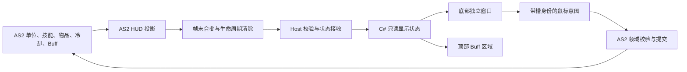

# 玩家信息界面完整迁移：复工调研与施工路线

**文档角色**：2026-09-12 的代码盘点与施工交接，回答完整迁移的剩余工作、复用范围、风险和下一步；不是已实现协议或验收报告。业务边界仍以[玩家信息 HUD 架构设计](玩家信息界面-NativeHud迁移-架构设计-2026-06-21.md)为准，HP/MP 的历史视觉证据仍归 [B0 专项 ADR](玩家信息界面-NativeHud-SVG真源与程序化动效-B0-ADR与分片施工计划-2026-07-28.md)。

**最后核对代码基线**：`cde09af93526dbe894aac90709d51ef978ac4c05`。调研时工作区另有 NPC 菜单、原生注释与鼠标兼容施工，涉及共享 Host、主 XFL、测试和文档；本文明确区分已提交代码与该工作区增量。PlayerInfo C# 目录、B0 工具和两份既有 PlayerInfo 文档在本次编辑前无未提交改动。

**调研范围**：读取源码、XFL 结构、现存图片与历史证据，更新本文及架构文档；调研阶段未执行游戏、Flash 编译、Launcher 构建或部署，也未重新测量游戏性能或完成人验。后续储备提交仅包含这两份 PlayerInfo 文档。

## 1. 复工结论

**具备继续施工的技术基础，完整迁移仍是难度较高的跨栈专项。** 建议以整套 HUD 完成替换为一个连续目标，内部拆分实现步骤。下一次工作应尽早产出覆盖所有区域、连接真实状态的粗粒度候选，再集中修外观和动效；不再把一块仪表的精修作为整项工作的交付终点。

现在用一至两小时做调研和交接是合适的：共享入口正在施工，此时再开实现线容易制造合并和验收冲突。额度重置只改变可用资源，不会自动解除共享文件冲突；重置后按 §9 刷新基线即可接续，不需要重做一次 B0 选型。

对工作量的判断：

- 用户认为血蓝区域远不足整屏的 20%，这个观察不能被“已有很多代码”推翻。B0 的产品覆盖仍很窄，完整业务迁移的大部分工作尚未完成。
- B0 除了画血槽，还完成了蓝条、SVG 真源、字体路径、缓存、透明窗口、性能诊断与真实画面校准。这些基础工作可以保留；不能把它的耗时按剩余面积直接线性放大。
- 剩余成本主要来自状态与旧元件解耦、完整动态画面、鼠标写操作、生命周期及真机回归。模型的视觉判断能力有助于校准，但没有本项目数据支持固定加速倍数或一次短会话完工的承诺。
- 先用首个完整候选测出接数、整体布局、鼠标兼容和每帧成本，再估算后续精修工期。不能用 B0 的小面积性能数字推算整屏收益。

## 2. 已有施工能保留什么

| 部分 | 当前证据 | 可复用范围与限制 |
|---|---|---|
| HP/MP 静态资产 | 8 个 canonical SVG，合计 99,576 字节；当前文件与 manifest 摘要相符 | 保留矢量和 provenance；其余 HUD 资产尚未纳入该资源集 |
| 渲染依赖 | 工程已引用 `Svg.Skia 5.1.1`、`SkiaSharp 3.119.4` | 原有受控 SVG 与原生依赖链可沿用，无须重新引入一套渲染器 |
| 数值绘制与缓动 | HP 128 格、MP 100 格；路径字形与固定虚拟步缓动 | 仅有 HP/MP 模型；生产接数前需要修正 §4.1 的数值边界 |
| 烘焙与缓存 | 按物理尺寸烘焙、PArgb、整批缓存、异步结果归属及释放 | 保留生命周期和所有权规则；缓存键、批大小与 widget 构成需扩展 |
| 独立透明窗口 | `PlayerInfoSplitSurface` 已接暂停、恢复、显隐及 shutdown | 专门避免扩大现有 NativeHud 的合成区域；当前只支持 fixture 和鼠标透传 |
| 视觉资料 | 11 个 HP/MP case、C#/Web/Flash 对比器、路径字体生成结果 | 可定位既有误差；不是完整 HUD 的状态库 |
| 人工接受 | exact `p50` 候选在实际游戏合成画面中接受，B0 为 `b0_accepted` | 保留该历史结论；没有真实玩家数据、完整交互或 PlayerInfo 专项正式入口验证 |

`891d9b08…` 到本轮基线的 `launcher/src/Guardian/Hud/PlayerInfo` 无代码差异。该目录中的 `PlayerInfoWidget` 明确不实现 `IUiDataConsumer` 或 `INativeHudWidget`，`TryHitTest()` 恒为 false。`Program` 仍由 `CF7_PLAYER_INFO_FIXTURE_CASE` 白名单调用 `CreateFixture`；生产树没有 `PlayerInfoState → pi_* → C#` 业务接线。

历史 B0-05 为 32/32，B0-06 为 48/48。B0-06 的 3,000 个活动步中，surface p95 为 **3.3339 ms**，commit p95 为 **0.3028 ms**；3,000 个稳定后空闲 tick 没有重绘。这是旧树上实际 HWND/ULW 的离屏 fixture 测量：content 为 1920×1080，物理缩放 1.875，tight surface 为 528×150，实际系统/窗口 DPI 为 96；报告的设计用例名含 `dpi150`，不等于执行了物理 150% DPI 切换。真实 `p50` 人验的 144 DPI 又是另一条证据。三者不得混为完整游戏性能结论。

追溯入口：[工具 README](../tools/player-info-hud/README.md)、[性能原始报告](../tools/player-info-hud/evidence/b0-06/runtime-qualification.json)、[人工接受记录](../tools/player-info-hud/evidence/b0-06/human-acceptance-main-space-v2.json)。本机 `tmp/` 的对照图片仍可辅助观看，但不是新任务必须依赖的唯一资料，也不应整批提交。

## 3. “完整迁移”的完成标准

迁移对象是游戏中常驻玩家 HUD，包括主舞台上的 Buff 栏。它不是 Character Build 的个人属性详情页；`PlayerInfoProvider` / `PlayerInfoSnapshotBuilder` 属于后者，不能因名字相近直接把完整构筑快照当作每帧 HUD 数据。

| 区域 | 必须交付的显示与行为 | 主要剩余难点 |
|---|---|---|
| HP / MP | 实际值、上限、百分比、缓动、原有装饰及溢出显示 | B0 到生产输入；数值合法范围；遗漏动效 |
| 韧性 | 非线性比例、百分比、破韧各阶段形态与恢复 | 31 帧内的分阶段美术和形变，不能用一条矩形直接宣称等价 |
| 经验 / 等级 / 角色名 / SP | 经验直跳、等级格式、角色名滚动与裁剪、SP 与说明 | 全局数据与单位数据的生命周期不同；字体、遮罩及循环动画 |
| 攻击模式 / 弹药 | 8 个视图，主副手及长枪副武器弹药，战技显示条件 | 各武器领域的实际弹药语义与散布的旧 MC 写点 |
| 12 格快捷技能 | 图标、等级、live 键位、冷却、说明与卸下入口 | 共用组件、槽身份与迟到点击、现役技能服务接线 |
| 战技 | 显隐、当前战技描述、键位、共享冷却、说明 | 普通战技和副武器控制的区别；残存的 UI 优先冷却时长读取 |
| 药剂区 | 切组控件、活动组四格、数量、键位、共享冷却、提示与点击卸下 | 2 组 × 4 列、物理槽与显示列映射、AS2 物品写和保存 |
| 顶部 Buff 栏 | 初始枚举、增删排序、开启动画、计时层、管理器重绑 | 与底部不同的主舞台 placement、计时语义和窗口区域 |

“完成”同时要求：

1. 所有区域消费真实 AS2 权威状态；fixture 可留作诊断，不能成为生产数据来源。
2. 原有键盘行为继续由 AS2 服务裁决，鼠标卸技能/卸药和说明入口有等价路径。
3. 切场景、读档、死亡/重建主角、开关面板、失焦及缩放后，状态、显隐、命中和冷却一致。
4. 底部旧玩家信息实例与顶部旧 Buff 实例不再是显示或输入的必需品；没有依赖隐藏 MovieClip 维持功能。窄普通对象兼容入口可以保留，游戏领域逻辑可以继续在 AS2。
5. 完成绑定候选身份的实际游戏旅程。源码测试、视觉 fixture、供应链 promotion 和正式入口业务复验分别报告。

整体重设计、把战斗权威迁到 C#、重做技能/构筑 Web 面板、为每种 Buff 新设计专属图标，都不属于这次等价迁移的默认目标。

## 4. 本轮核实的关键差异

### 4.1 血蓝样板对真实值的处理需要修正

`PlayerInfoAnimationModel` 内部 gauge 的 `Apply()` 把 current 钳制到 `[0, maximum]`，文本和百分比也来自钳制值。旧 AS2 刷新函数却显示原始数值的向下取整及原比例；`HealApplier` 的生命溢出上限为基础最大 HP 的 1.5 倍，另有 `applyMpOverflow` 超充 API。

例如合法 `HP=1400 / max=1000`，生产显示应保留 `1400` 和 `140`，填充几何可以停在满格；不能显示成 `1000 / 1000`。低于零的有限 current 也不能未经领域判定就与无效输入混为一类。无效上限、非有限数值、无主角等情况需要独立的可用性处理，不由 HUD 回写修复游戏值。

保留 B0 原 case 的历史输出，新生产输入增加溢出、负值、上限突变、缺字段与新角色换入反例。MP 超充 API 的存在已核实，但本轮没有观察具体装备的真实超充旅程；不要据此宣称该旅程通过。

### 4.2 当前是 18 路冷却与双药剂组

`ManualCooldownService` 当前消费集合为 `weapon:shared`、`quick:1..12`、`drug:0..3`、`drug:switch`，共 18 路。`getSnapshot()` 已提供 `ready / totalSteps / currentStep / progressPercent / animationFrame`，无需让 C# 从旧进度条读取逻辑状态。

`DrugInputService` 当前为 8 个物理槽、两个组、四条共享 lane；切组默认键为 `6`，其余默认键为 `7/8/9/0`。切组有独立 3 秒冷却，活动组是会话状态；换组不能重置同列药剂冷却。物品身份必须使用物理槽和对应版本，不能把视觉第一列当成第五个药剂槽，也不能保存活动组来改变现有读档契约。

`CooldownWheel` 的独立 enterFrame 驱动使手动冷却保持暂停期间推进及跨场景存活。C# 窗口暂停绘制时，不能顺手暂停这些领域计时；恢复后读取当前权威状态。完整规则引用[双药剂组 ADR](双药剂组-八槽共享冷却-ADR-2026-08-27.md)，不在 HUD 再造一套药剂状态机。

### 4.3 图标可大量复用，键名不能猜

本轮只读比对现役索引与 `launcher/web/icons/manifest.json`：

| 数据 | 结果 | 实现含义 |
|---|---|---|
| `data/skills/skills.xml` | 80 行中 66 个非空技能名，66 个 manifest key 全部存在，首帧文件均存在 | 技能图标无需从零重烘焙；14 个空行不能算缺图 |
| `data/items/list.xml` 的 54 个 items 文件 | 77 个 `use=药剂` 条目，对应 51 个不同 `<icon>`；77 项映射和首帧文件均存在 | 沿用领域给出的 icon 字段；这些药剂条目没有 manifest 动画/序列标记 |

直接拿物品名查图标会把 27 种药剂误报缺图。例如 `加强mp药剂` 的图标键是 `加强MP药剂`，`超级棒棒糖` 使用 `棒棒糖`，九龙药剂复用既有图标。这里核实的是清单和本机文件存在，不是所有图标在新 HUD 尺寸下的视觉验收。

原生 `LootIconCatalog` 已有 WebP/PNG 解码和缓存经验，但当前输出固定为 64px，并由共享缓存管理 Bitmap 生命周期。可以复用资源与解码边界；不能让常驻 HUD 长期持有可能被该缓存淘汰释放的位图，也不能在高 DPI 下放大 64px 缩略图后称为源尺寸烘焙。

### 4.4 不只是比例条：姓名、韧性和字形

从玩家信息根 symbol 沿所有 `DOMSymbolInstance.libraryItemName` 静态去重，共可达 **60 个 symbol（含根）**，7 个非空直接子组件。以下数字表示各子树潜在可达的 authored 结构，子树间有共享，不能相加；不证明每段脚本都在游戏中执行，也不包含动态 attachMovie 和外部 RSL 展开。

| 子组件 | 去重 symbol | DOMShape | script 块 | 代表性复杂度 |
|---|---:|---:|---:|---|
| HP | 10 | 250 | 4 | 大量几何已由 B0 收敛；遮罩、文字光晕及装饰 |
| MP | 5 | 21 | 2 | 形变、两层遮罩、低透明度底字 |
| 韧性 | 1 | 43 | 0 | 31 帧内四个阶段、3 段 shape tween |
| 快捷技能 | 29 | 12 | 46 | 12 槽重复结构，脚本与状态复杂度高于几何 |
| 药剂区 | 19 | 27 | 24 | 五列、换组、图标交互，内含姓名区域 |
| 模式 / 弹药 / 战技 | 13 | 20 | 11 | 模式帧标签、两张 BitmapFill 来源、四路弹药文本 |
| 经验 / 等级 | 3 | 26 | 1 | 遮罩、比例形变、字形和格式 |

`UI重构/姓名动画.xml` 是 300 帧循环：先停留，随后从 `tx=3.7` 滚到 `-130`，再从 `136` 返回 `3.7`，外有遮罩。把它替换成静态姓名会遗漏现役动画。韧性阶段边界还需要看 7/15/23 等关键帧两侧的形态，不能仅比 0%、50%、100%。

姓名、姓名网格和三项 HP 装饰由显示列表预设任务推进；`PerformanceActuator.apply()` 在 tier 0 继续该任务，在 LOW 的 tier 1 暂停它。完整迁移还需投影这个动效策略，不能让原生动画绕过现有降载行为；“数值不变”与“装饰已暂停”不是相同的空闲状态。

B0 字形集只有 `0123456789/%MP-`，不能覆盖姓名、技能文字和所有键名。现有 `native.hud.body` 默认是思源宋体，原姓名是 Microsoft YaHei；直接套用该角色会改变外观。应保留 B0 数字路径，并按原 HUD 的字体角色补充动态文字方案，经现役字体目录管理；不要把任意字符串塞入 SVG `<text>` 或擅自打包新的字体二进制。

### 4.5 Buff 和战技图标的真实资源范围

顶部 Buff 根实例位于主 XFL 的 `(5.6, 8)`，底部玩家信息实例位于 `ty=512`；两者都在主时间轴 frame index 130 起的 gameplay 段，底部独立 UI XFL 的 1024×64 文档尺寸不是其实际裁剪区域。

主库的 `buff详细图标` 是 RSL import，真源在 `flashswf/arts/新版人物文字信息/LIBRARY/素材-buff详细图标/`。`DetailedIconBar` 复制通用原型，按 add/remove 维护顺序，以 primary timer 投影 26 个计时帧，间距 28。当前所读类和原型没有按每种 Buff 名加载专属图标的路径；不要把“完整迁移”擅自扩成一套新的 Buff 图鉴美术。

类似地，现役 `sprite/战技图标.xml` 是固定矢量形状；`战技栏图标刷新()` 更新描述，按名称 attachMovie 的代码块已被注释。不能将注释中的路径当作当前必需的动态图标系统。旧资源仍需在整套 HUD 的真实画面中复核可见效果。

### 4.6 攻击模式与弹药不能由 C# 重新推算

当前 8 个帧标签为：手枪、手枪2、长枪、兵器、手雷、空手、双枪、长枪副武器。`ReloadManager.updateAmmoDisplay()` 对垂直弹种还将剩余弹数乘以 split 系数；`LongGunSubWeaponCore.updateAmmoDisplay()` 的第二列表示副武器已装数量和指定 reserveName 的库存。这不是一条通用的 `capacity - shot` 能覆盖的显示语义。

已核实的生产脚本写点包括 `ReloadEventComponent` 的动态字段索引、`XM214-CageFrame` 的弹数更新，以及多个装备对 `战技栏图标刷新()` 的调用。静态检索同时会命中旧文件、注释和裸别名；旧文档的“约 60/157/161 处”不是当前可执行闭包计数。

推荐先让 AS2 投影收集这些已结算显示值，保留四字段窄兼容面，再逐项替换剩余 MC 能力。未知模式默认保持同一角色的上一有效视图，首次无有效视图用未就绪态；不能将旧实例状态跨角色保留，也不要悄悄把未知模式改成空手。

### 4.7 键盘已服务化，两个鼠标入口仍需要真实改造

- 快捷技能的 `_root.quickSkillUnequip(slot)` 最终调用 `SkillLoadoutService.unequip()`。旧同步入口在执行时读取当前 revision；原生鼠标到 AS2 是异步链，必须校验点击时的 `slot + skillKey + revision + 上下文`，否则迟到点击可能卸下该槽新换入的技能。
- `DrugIcon.Press()` 仍经真实图标实例检查 locked/冷却，寻找背包空位，先标 dirty 再移动物品，并更新 affinity。C# 必须通过窄 AS2 命令保留这条领域写链，完成后由权威状态刷新图标。
- Character Build 已有成熟药剂卸下事务，但入口绑定 `panelInstanceId / sessionGeneration`，且优先合并同名背包堆；旧 HUD 是 `getFirstVacancy()`。不能通过伪造打开构筑面板或删除其 panel gate 来“复用”，也不能在等价迁移中静默改变满包时的行为。应在领域内抽取可共用的事务能力，保留各入口既有语义。
- `WeaponSkillInputService` 的时长读取仍优先看旧战技槽 `.冷却时间`，缺失时才回退单位主动战技。删壳前应统一读取当前领域描述符，并验证既有时长语义；不能只凭“输入已服务化”断言它完全不读旧 HUD。

## 5. 建议实现结构

以下为施工建议，接口名称和 wire 均尚未实现。保留现有领域权威，新增一个专门的 HUD 投影及 Host 接收器。

### 5.1 AS2 投影与数据采集

一次 HUD 发布应来自同一上下文的自洽状态。建议按以下组维护脏标记：

| 组 | 应携带的语义 | 刷新来源 |
|---|---|---|
| 上下文 | 协议版本、HUD epoch、sequence、可见/可用性、当前主体身份 | 启动、读档、主角/世界重建、重连 |
| 生命与进度 | HP/MP 原值与上限、韧性、经验阈值、等级、角色名、SP | 单位数值变化、升级、读档；小标量可在帧末采样 |
| 战斗视图 | 当前有效模式、四路弹药显示值、战技描述和显隐 | 换装、切模式、射击/换弹、副武器状态变化 |
| 技能 | 12 槽描述符、icon key、等级、可用性、live 键位及版本 | 技能服务变更、改键、读档 |
| 药剂 | 活动组、四个可见槽对应的物理槽、物品身份/数量/图标、版本 | 库存变更、切组、自动回槽、读档 |
| 手动冷却 | 18 路权威 ready/进度；组切换与同列冷却分开 | `ManualCooldownService` |
| Buff | 管理器身份、稳定条目 ID、顺序、是否有计时、total/remaining | 初始化枚举、add/remove、计时推进、管理器替换 |
| 显示策略 | 现有性能策略下装饰是否继续推进 | `PerformanceActuator` 的档位变化；不由 C# 再设一套 FPS 阈值 |

`SkillLoadoutService.getSlotDescriptor()` 每次都会 synchronize 扫描技能状态，已有 `projectQuickSlotRenderer()` 演示了一次扫描投影 12 槽的方式。新增批量描述符读取应沿用该机制；不要再为 HUD 每帧调用 12 次 getter，也不要每帧构建完整管理页 snapshot。

`PlayerInfoProvider`/Character Build 的全量属性分析、装备重建、背包候选和 BuffManager 重置都不应成为 HUD 刷新副作用。描述符按领域变化刷新，小规模动态数值按实际需要采集。Buff 显示订阅者随 manager 替换退订和重绑，不能为了重新显示而 destroy 或重建玩家 Buff。

旧刷新函数可以先变为“更新投影/标脏 + 可选旧 renderer”。`HealApplier.requestHeroHpDisplayRefresh` 当前设置的 `_pendingHpDisplayRefresh` 也必须移交新投影，不能在删壳时一并丢掉。

投影与窄兼容入口的安装必须脱离旧 HUD 的 frame0，进入现有 asLoader/玩家初始化链并满足主体初始化顺序。当前 `UI系统.iconBar` 在 Buff MC 初始化时创建，主角初始化与每帧更新直接调用它；需要把订阅/采集所有者移出 MC，再验证“先有状态后有窗口”和“先有窗口后有状态”两种启动顺序。不能靠保留旧 placement 让新接数偶然工作。

### 5.2 传输、上下文失效与恢复

当前真实路径是 `FrameBroadcaster.send → XmlSocketServer` 提取 `\x03 uiState → Program` 的 UiData 分发。UI 数据并非经 `FrameTask.HandleRaw` 再解析成 PlayerInfo；后者主要处理相机、伤害数字、FPS 与输入。

首个接数切片需要一次性落实以下边界：

1. **同包采用**：成对数值及相互关联的 mode/ammo、bank/slots 在同一个完整更新内采用。支持整组替换和显式清空，不能让旧字典中的缺字段被误认作本轮最新值。
2. **主体代际**：不能只用 `玩家0`、路径字符串或可重指向的 MovieClip 引用识别角色。上下文变化即更新 epoch、清旧状态；同 epoch 的 sequence 处理重复和迟到数据，新 epoch 先取得全量状态再接受增量。
3. **断线有界**：当前 `FrameBroadcaster` 在断线或无 gameworld 时只清 hn，UI 拼接槽并不会同时清空。HUD 发布器不能在断线期间无限向该槽追加；恢复时应发一次当前全量，不回放旧角色的历史更新。
4. **无世界时也能清除**：没有 gameworld 就没有正常 F 帧。切出游戏必须在 teardown 前发送清除，或使用现有 U 快车道/生命周期消息发送清除；不能等待一个不会到来的下一帧。Host 断线也立即取消交互并失效旧显示。
5. **编码有定义**：UiData 按 `|` 和第一个 `:` 拆分，外层另用控制字符分段。姓名和其他自由文本不能直接拼进去。可以用现有 `LiteJSON + Base64` 试作一个有界原子 HUD payload，再测 AS2 编码成本；这是候选方案，尚未冻结为生产 wire。测试应覆盖中文、分隔符、换行、代理对和畸形输入。
6. **按消费者分发**：当前 Program 将 UiData 同时传给 Web 和 NativeHud；Web 即使 idle 也存快照，面板打开后会 ExecScript。新增高频 PlayerInfo 数据应定向交给自己的接收器，避免无消费者的 Web 缓存/回放与现有 NativeHud 的全字典复制成为额外成本。

先保留一条通道和一个状态采用点，按更新组发增量、在 epoch/重连时发全量。不要为每个仪表建立独立请求/应答循环，也不要为读数引入持久 receipt。首版量化 payload 大小、序列化次数和 AS2 时间后再决定紧凑编码程度。

### 5.3 绘制、动效和窗口

- 继续以 **1024×576 Flash 逻辑画布**为坐标源；底部根 `ty=512`，沿真实实例 matrix 合成。使用 content rectangle 的实际物理映射，不能再叠一次 DPI 或套独立 child 的 `ty=3` wrapper。
- 静态几何使用 canonical SVG，比例裁剪、变换、文字和循环效果由程序实现。复用已经完成的 B0 管线；按缺少的语义组件补资产，不再建立通用 XFL 解释器或给每一帧导出一张图片。
- 将数值原值、目标虚拟帧、当前显示帧与装饰播放相位分开。HP/MP/韧性保留既定缓动式，经验直跳；暂停、卡顿和恢复时是否补显示步必须通过同一目标事件序列核对，不能把 B0 的墙钟测试自动视为真实 Flash 帧时序等价。
- 复用同一套槽位框、冷却遮罩、数量/等级、键位和 hover 组件绘制 12 个技能及四个可见药剂槽；模式布局用数据表描述，领域规则不放入 painter。
- 保留底部独立 surface。顶部 Buff 与底部相隔约 500 个逻辑像素，不能放进同一个 bounds union，否则重新得到近全屏 ULW。先评估现有上方区域是否适合容纳 Buff，否则给 Buff 一个有界独立区域；不要求每个槽一个 HWND。
- static raster 和动态图层分开。姓名循环、HP 装饰、Buff 开场等效果一旦恢复，稳定数值下也可能持续重绘。性能标准应区分“完全无动画空闲”与“保留装饰的待机”，不能以删动画换取 B0 的零重绘数字。
- 部署资源的身份与关闭时的 Bitmap/GDI/HWND 归属沿用现有规则；扩大 asset set 后重新测预算，不能假设 16 MiB 或原来的固定批结构自动适合全 HUD。

### 5.4 命中、提示与领域操作

当前 split surface 完全透传鼠标。完整实现需要选择性命中、`MA_NOACTIVATE`、按下/抬起属于同一目标、失焦/面板切换/捕获丢失后取消手势。图形透明区仍应透传；扩大底部区域不能阻断场景拾取、射击或现役 Flash 窗口操作。

点击时携带显示快照的主体和槽身份，AS2 重验当前领域状态后执行窄命令；C# 不直接改物品、技能、冷却或保存。药剂写保持集合首写前标 dirty、移动后更新 affinity 的领域顺序，并用保存后重启读回来验证迁移结果。

当前工作区的 NPC/原生 tooltip 施工正覆盖说明文档聚合、C# 绘制与鼠标兼容，是潜在复用点。当时未提交的 `docs/NPC菜单与原生注释迁移-ADR-2026-09-12.md` 记录首轮注释人验未通过、继续修正；不能将本机出现了类型/测试文件等同于已稳定接口或已发布能力。复工时先确认该专项的最终代码和文档，再复用 TooltipComposer/内容文档与 Host 路由，避免给技能、药剂再做两套提示业务计算。

## 6. 施工顺序与具体首步

以下是同一个完整迁移目标内部的步骤，不要求每一步另起用户任务、另做人类审批或正式发布。

| 步骤 | 做到什么 | 该步解决的不确定性 |
|---|---|---|
| A：刷新基线与整屏参考 | 重读共享入口最终状态；保留当前 Flash HUD 的完整布局、模式、动效参考；扩充测试状态清单 | 防止拿 7 月 HP/MP oracle 当成 9 月整屏基线 |
| B：完整状态与粗粒度候选 | 一个 AS2 HUD 投影、原子接收和上下文失效；全部区域上屏；已有 HP/MP 和技能/药剂图标直接复用，其余可先用明确的临时绘制 | 证明整套接数、数据范围、窗口布局和基础命中可以共同工作 |
| C：交互与视觉收束 | 尽早打通卸技能/卸药/提示；随后成组完成韧性、模式、文字、姓名与其余装饰，校准整屏效果 | 尽早暴露真实鼠标和领域写问题，避免画完以后才发现不能操作 |
| D：旧元件退役 | 散布调用改为领域/投影接口，普通对象兼容只保留必需方法；停止实例化底部及 Buff 旧显示，移除旧绑定 | 证明游戏不再依赖隐藏 MC，防止“看似迁完、旧壳常驻” |
| E：完整旅程与发布收尾 | 按 §7 做候选 E2E、范围内修复及正式发布流程，记录专项正式入口复验范围 | 证明新实现可用于真实游戏，而不仅是截图或编译结果 |

**下一次可直接领取的施工内容**：从 B 开始前完成 A 的短核对，建立覆盖 §3 全区域的 AS2 投影结构和只读 C# 状态，再把已有 B0 surface 从 fixture-only 扩展为可选择真实状态的候选入口。首个可见里程碑必须同时显示 HP/MP、韧性、经验姓名、模式弹药、12 技能、活动药剂组和 Buff；样式尚未完成的区域明确记作临时，不算等价验收。

首个候选必须实际观察一次“进入游戏 → 真实数值变化 → 切模式/切药剂组 → 离开场景或重建主体 → 旧数据清除/新数据全量采用”，并试一次底部命中与场景鼠标共存。它的价值是验证整条施工路径；之后继续完成 C–E，不因又画好了一个血槽而结束整项工作。

采用有限、定向的源码测试和隔离候选迭代；不要把每块仪表都做成独立依赖准入或单独 promotion 列车。修改 shared Host 入口时必须基于届时的合并状态，不套用本文基线的整文件替换。

## 7. 验证矩阵

| 层级 | 必须覆盖的反例或旅程 | 可复用入口与证据边界 |
|---|---|---|
| AS2 状态/领域 | 无旧 placement 仍安装投影；先状态/先窗口两种顺序；无 renderer 仍可释放；18 路冷却；双组映射；一次扫描投影；无主角/manager 替换；快照不重建装备/Buff | `scripts/run-player-manual-input-tests.ps1`、`scripts/run-skill-migration-tests.ps1`；按实际变更补定向测试，不用存在的文件代替执行 |
| 物品写 | 锁定/冷却拒绝、满背包、迟到槽身份、切组竞态、affinity、dirty 与失败后恢复 | 药剂命令的定向反例；必要时复用 `scripts/run-character-build-tests.ps1`、`scripts/run-player-asset-transaction-tests.ps1` 的相关覆盖 |
| Host 状态采用 | 同包成对字段、缺字段与显式空、重复/乱序、epoch 切换、重连全量、无 world 清除、编码边界 | 新接收器定向测试；`UiDataPacketParserTests` 只覆盖原解析器，不证明新契约 |
| 绘制 | HP 溢出/负值/突变、MP 字段锚点、韧性阶段边界、经验直跳、空/满技能槽、8 模式、两药剂组、无/有计时 Buff | `launcher/tests/Guardian/Hud/PlayerInfo/`、B0 对照工具；新 case 应覆盖新行为，旧 case 保留回归价值 |
| 动效与字体 | HP 128 格完整缓动序列；姓名 300 帧的停留/出入遮罩；现役性能降档暂停与恢复；冷却就绪帧；Buff 开场；中文、长名、极大数字、改键 | 关键状态图 + 过渡联系表/短录制；不能只验静态 p50 |
| 原生窗口 | 缩放、窗口/全屏、遮挡、selective hit-test、失焦/捕获丢失、隐藏恢复、关闭无残留 | 实际候选窗口和游戏输入；离屏位图不能代替 |
| 性能 | AS2 采集与序列化时间、每帧包数/字节、排队与采用延迟、各 surface 实际面积、paint/commit、无动画空闲和装饰待机、GDI/内存趋势 | 扩展现有 B0 qualification；同时测完整游戏，不在当前重型施工期间制造新的性能结论 |
| 旧壳移除 | 不实例化玩家信息/Buff 后输入、弹药写、升级、药剂、提示仍正常；没有每帧 undefined/死引用 | 静态调用分类 + fresh Flash 输出 + 无旧 MC 的实际旅程；全库 grep 计数不是退出判据 |
| 真实保存 | 快捷技能变更、卸药、用药耗尽/回槽后正常保存并重启读回 | 绑定候选进程和真实测试槽；fixture、Host 单测不能代签 |

关键实机组合采用代表场景覆盖：普通单枪、双枪、长枪副武器、特殊弹数显示；技能与药剂同时冷却、切组、满包拒绝；HP 上限变化和溢出；Buff 增删；开关 Web 面板；死亡/重进场景；保存重启。无需把所有模式×所有数值×所有 DPI 做成笛卡尔积，但每条独立业务分支都要有证据。

Flash 目标按实际改动选择：业务 `.as` 优先 asLoader/TestLoader；独立玩家信息 XFL 直接发布对应 UI SWF；停止主舞台 placement 才涉及 main；Buff 真源若改动，则处理 `新版人物文字信息` 自己的 XFL。不得手改 SWF，marker 单独出现也不是编译通过。入口和术语均引用[测试指南](../agentsDoc/testing-guide.md)与[运行时构建流程](runtime-build-reproducibility.md)，不复制易过期的发布命令。

## 8. 源码接续索引

| 定位 | 路径 / 搜索锚 |
|---|---|
| 现有原生实现 | [PlayerInfoAnimationModel](../launcher/src/Guardian/Hud/PlayerInfo/PlayerInfoAnimationModel.cs)、[VisualState](../launcher/src/Guardian/Hud/PlayerInfo/PlayerInfoVisualState.cs)、[SplitSurface](../launcher/src/Guardian/Hud/PlayerInfo/PlayerInfoSplitSurface.cs)、[FrameCompositor](../launcher/src/Guardian/Hud/PlayerInfo/PlayerInfoFrameCompositor.cs) |
| 现役资产与尺寸映射 | [manifest](../launcher/src/Guardian/Hud/PlayerInfo/Assets/player-info.manifest.json)、[RasterPlan](../launcher/src/Guardian/Hud/PlayerInfo/PlayerInfoRasterPlan.cs)、[图标目录](../launcher/web/icons/manifest.json)、[字体目录](../fonts/fonts.xml) |
| 原始 HUD 布局 | [根 symbol](../flashswf/UI/玩家信息界面/LIBRARY/玩家信息界面.xml)、[模式/弹药](../flashswf/UI/玩家信息界面/LIBRARY/sprite/玩家必要信息界面.xml)、[姓名动画](../flashswf/UI/玩家信息界面/LIBRARY/UI重构/姓名动画.xml)、[韧性](../flashswf/UI/玩家信息界面/LIBRARY/UI重构/主角韧性UI.xml) |
| AS2 数值入口 | [UI交互_fs_玩家信息界面](../scripts/展现/UI交互/UI交互_fs_玩家信息界面.as)、[HealApplier](../scripts/类定义/org/flashNight/arki/unit/Action/Regeneration/HealApplier.as) |
| 帧与 Host 路由 | [FrameBroadcaster](../scripts/类定义/org/flashNight/arki/render/FrameBroadcaster.as)、[帧计时器](../scripts/通信/通信_fs_帧计时器.as)、[XmlSocketServer](../launcher/src/Bus/XmlSocketServer.cs)、[UiDataPacketParser](../launcher/src/Guardian/Hud/UiDataPacketParser.cs)、[Program](../launcher/src/Program.cs) 的 `uiDataTee` |
| 技能与冷却 | [SkillLoadoutService](../scripts/类定义/org/flashNight/arki/skill/SkillLoadoutService.as) 的 `projectQuickSlotRenderer`、[SkillPanelService](../scripts/类定义/org/flashNight/arki/skill/SkillPanelService.as) 的 `quickHudUnequip`、[ManualCooldownService](../scripts/类定义/org/flashNight/arki/unit/Action/Skill/ManualCooldownService.as)、[WeaponSkillInputService](../scripts/类定义/org/flashNight/arki/unit/Action/Skill/WeaponSkillInputService.as) |
| 药剂与领域写 | [DrugInputService](../scripts/类定义/org/flashNight/arki/unit/Action/Skill/DrugInputService.as)、[DrugIcon](../scripts/类定义/org/flashNight/arki/item/itemIcon/DrugIcon.as)、[CharacterBuildService](../scripts/类定义/org/flashNight/arki/item/CharacterBuildService.as) 的 `executeMutationCore / mutateUnequipDrug` |
| 弹药 | [ReloadManager](../scripts/类定义/org/flashNight/arki/unit/Action/Shoot/ReloadManager.as)、[LongGunSubWeaponCore](../scripts/类定义/org/flashNight/arki/unit/Action/Shoot/LongGunSubWeaponCore.as) 的 `updateAmmoDisplay`；`ReloadEventComponent`、`XM214-CageFrame` 的旧字段写 |
| Buff | [DetailedIconBar](../scripts/类定义/org/flashNight/arki/component/Buff/IconBar/DetailedIconBar.as)、[BuffManagerInitializer](../scripts/类定义/org/flashNight/arki/unit/UnitComponent/Initializer/BuffManagerInitializer.as)、[RSL 原型](../flashswf/arts/新版人物文字信息/LIBRARY/素材-buff详细图标/buff详细图标.xml) |
| 装饰动效开关 | [显示列表引擎](../scripts/展现/视觉系统/视觉系统_fs_显示列表引擎.as) 的 `预设列表初始化`、[PerformanceActuator](../scripts/类定义/org/flashNight/neur/PerformanceOptimizer/PerformanceActuator.as) 的 `apply` |
| 原生图标与交互参照 | [LootIconCatalog](../launcher/src/Guardian/Hud/Loot/LootIconCatalog.cs)、[NativeHudOverlay](../launcher/src/Guardian/NativeHudOverlay.cs)、[OverlayBase](../launcher/src/Guardian/OverlayBase.cs)；NPC/注释的工作区文件名与使用边界见 §5.4 |

## 9. 重置后的恢复步骤与未决项

1. 读取本文 §1、§3、§5–7；需要追证据时再按 §8 打开源码。B0 的一千余行历史 ADR 按问题查阅，不要求每次全量重读。
2. 检查当前 HEAD/工作区，再比较本基线到当前的 PlayerInfo、帧广播、输入服务、药剂和 Host 入口变化。NPC/tooltip 未提交文件不得当作已合并依赖；若仍在改相同 Host/主 XFL，继续做可隔离的 PlayerInfo 内部工作，入口接线串行收口。
3. 用 `launcher/resolve-dotnet.ps1` 找项目 SDK。本轮只读确认项目解析器能找到 10.0.300；系统默认 dotnet host 不带 SDK，不能据此判定环境不可用。已运行的 Flash/TestLoader 进程不等于无人占用或可直接发布。
4. 继续 A/B 的实现工作；不要重新申请 SVG 选型、重做 66 个技能图标，或将旧 fixture 接口简单改名后声称接通真实玩家状态。

还需在实施中解决、且本轮没有伪装成已验证的事项：

- 全 HUD 的当前真实画面与各动效相位：本轮看过既有 HP/MP 图片并读取了其余资源结构，没有启动游戏采集 9 月完整参考。
- 具体 wire 编码、长度上限、主体 epoch 的实际生命周期挂点，以及卡顿时的显示时钟策略：首个接数切片以定向测试和候选观察落实。
- 裸 `_root.玩家必要信息界面` 等剩余引用的实际可达性：退役前按“当前生产调用 / 库中未放置 / 注释或旧文件”分类；不能仅凭搜索命中数量决定重编多少素材库。
- 顶部 Buff 最终窗口归属、完整 HUD 的性能预算、动态文字的最终字体/字距，以及 NPC/tooltip 合并后的接口：依据新候选与最终共享实现验证。
- 对真实按键、鼠标、遮挡和外观的接受：集中展示可玩候选后验证；不能在本轮文档调研中提前给出通过结论。

**调研结束后的交付状态**：复工范围、主要复用点、已核实差异和接续顺序已形成文档；完整迁移尚未开始。文档治理检查、本地链接存在检查和本轮文档的 diff 空白检查通过；这不构成源码测试、候选执行或游戏验收。
