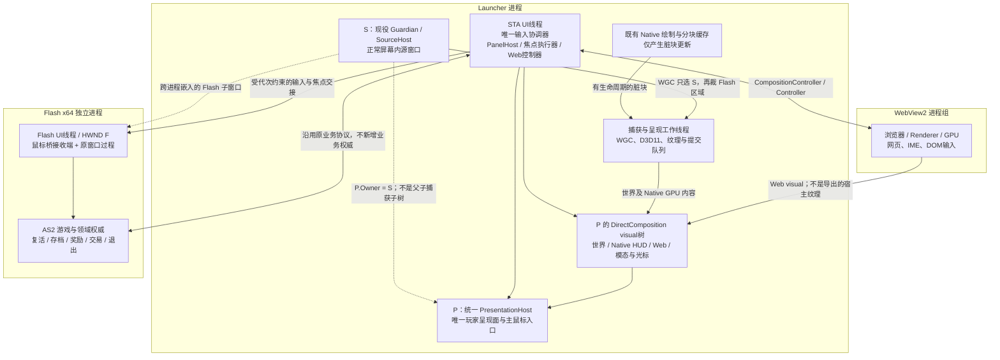
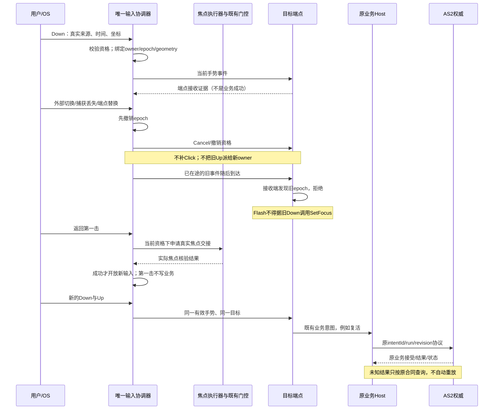

# 统一合成与输入归属：GPT-6 Pro 原始裁决归档

**文档角色**：用户返回的外部裁决原文；其中建议不自动成为施工授权或实测事实。
**来源**：[ChatGPT 分享会话](https://chatgpt.com/s/t_6ab1e07af8c88191abcbaf5673d4be82)；用户于 2026-09-22 同时提供本地 `gpt6pro.txt`。
**取证方式**：分享页抓取未取得正文，采用用户提供的 UTF-8 文本，不声称独立验证服务端模型或全部附件读取过程。
**原文件**：58334 字节；SHA-256 `028DC9A41B6C98623D12299F3352A36ACA90F820522046584E9706DD2F06EBF7`。
**受审基线**：`73c258af5d8df139cad3be3fed8d426eeae6de0b`，附部署提交 `0a65b1162ee0a2f239a6afc82d6bceada8a1f179` 状态变化。
**本地采纳**：以[分阶段施工与接班计划](../统一合成与输入归属-分阶段施工计划-2026-09-22.md)为准；第一击语义和源拓扑仍有待定/实验边界。尚未运行本裁决建议的施工测试。

下方分隔线后为原文，仅按仓库规范将 CRLF 归一为 LF，未重写文字；归一正文 UTF-8 SHA-256 为 `f25fd53dfd1a0b416eda0fecd08b4c398ed430b14eb05628e3c0c483305b3816`。原文自述的附件核对与模型身份归原作者陈述。

---

# CF7 统一合成与输入归属路线裁决

**明确推荐：选择“有限 A0 防护与证据补齐 → C0 捕获源隔离验证 → C1 真实 Flash＋一个 WebView2 功能面板纵切 → B 批量收拢 Native HUD”。**

这不是“先把输入系统全部重写完，再开始合成”，也不是直接批准长期文档中的 C。**我支持 C 优先验证最大未知，但增加两道前置约束：先证明捕获源与输出可以可靠分离，再证明真正的 OS 焦点、中文输入和手势取消能够往返。** 首个纵切还必须带入一个既有 Native 交互部件和一块既有分块绘制资产，否则它没有覆盖你最关心的 HUD 故障面。

**不推荐 D 一次替换全部呈现与输入；不把 E 替换 Flash 宿主作为默认前置。** 天气光照、动态分辨率和当前鼠标桥的独立发布保持独立，本裁决不要求撤回、重做或合并那条发布列车。

---

## 一、审阅依据与结论边界

已通读 `01-上传给Pro-完整审阅材料.md` 全文，并按需展开 `02-源码备查.zip` 中的完整函数；85 份白名单文件的哈希均与材料清单匹配。受审源码提交为：

`73c258af5d8df139cad3be3fed8d426eeae6de0b`

备查 ZIP **不是完整仓库**。原始现场录屏、完整日志和聊天截图没有随包提供，因此下面对现场的判断依赖包内摘要与摘录，不能冒充重新检查过原始媒体。本轮没有运行包内源码、Windows 候选或游戏，也没有修改项目。

封包追加材料记录部署提交已前进到 `0a65b1162ee0a2f239a6afc82d6bceada8a1f179`，并记录窄范围正式入口复验。这取代旧摘录中的“未部署”措辞，**但不是统一输入验收，更不是历史焦点故障关闭证明**。依据：`01-上传给Pro-完整审阅材料.md` §2、末尾“封包时更新”。

为避免反复写长路径，下文源码引用统一相对：

```text
02-源码备查.zip/source/

G/    = launcher/src/Guardian/
WC/   = launcher/src/Guardian/WorldCompositor/
HUD/  = launcher/src/Guardian/Hud/
T/    = launcher/src/Tasks/
Diag/ = launcher/src/Diagnostic/
N/    = launcher/native/world-compositor/
AS/   = scripts/类定义/org/flashNight/arki/
```

冒号后的数字均为**原文件行号**，不是汇编大 Markdown 的行号。

---

## 二、事实纠错：F1–F8，以及材料没有突出列出的两项缺口

### 2.1 F1–F8 逐项裁决

| 项目                                       | 独立裁决                                          | 源码证据与不能越过的边界                                                                                                                                                                                                                                                      |
| ---------------------------------------- | --------------------------------------------- | ----------------------------------------------------------------------------------------------------------------------------------------------------------------------------------------------------------------------------------------------------------------- |
| **F1：全局 HUD 诊断槽被覆盖**                     | **成立，但限定为诊断归属缺陷。** 不能推导实际 HUD 的业务 owner 被覆盖。  | `G/NativeHudOverlay.cs:99–107` 在启用诊断时写入全局 HUD 引用；`HUD/PlayerInfo/PlayerHudRuntime.cs:24–25` 又构造 bottom、buff 实例。`G/NativeHudOverlay.FocusDiagnostics.cs:23–33` 的解除注册也不是“恢复前一个有效 HUD”的注册栈。应改成按 HWND／实例身份查询的注册表，而不是继续维护“唯一 HUD”。这会降低部分全局快照的可信度，但不使实际接收窗口记录全部失效。      |
| **F2：未订阅主 HUD 的 PresentationChanged**    | **收窄为层序维护覆盖线索；尚不足以认定可达业务缺陷。** 我不接受“缺订阅＝截图根因”。 | `HUD/PlayerInfo/PlayerHudRuntime.cs:38–44` 确实只订阅三个 companion；但 `:56–86` 已有整栈恢复与 Resume 后修复。`G/OverlayBase.cs:332–344` 的 ShowBelow 会发事件，`G/NativeHudOverlay.cs:388–433` 也不是每次重绘都任意重排。必须构造**由现役正常入口触发、且后续没有既有修复覆盖**的重排序列。外部强制 SetWindowPos 可以测试防御，却不能证明生产调用链存在同样缺陷。 |
| **F3：世界鼠标包缺时间／手势／代次边界**                  | **成立为协议缺口；可以构造反例，尚不是旧现场根因。**                  | `WC/WorldCompositionSurface.cs:19` 的包没有这些身份；`:64–106` 排队后再映射、发送；`:115–116` 清宿主队列不能撤销已经 Post 的消息。`N/InputBridge.cpp:116–162` 接收旧 Down 后仍可在 `:145–146` 调用 SetFocus；KillFocus 清状态不等于撤销旧消息的执行资格。需在**接收端**拒绝旧代次，而不只是发送端清队列。                                            |
| **F4：忽略 PostMessage 结果却更新 delivered 状态** | **成立。既有命名与日志证明强度过高。**                         | `WC/NativePointerBridge.cs:44–49` 忽略返回值；`WC/WorldCompositionSurface.cs:101–106` 更新 `_deliveredButtons` 并记录世界鼠标事件。必须区分“路由决定、投递尝试、入队成功、接收端见到、原窗口过程返回、业务接受”。不能把这些压成一个 delivered。                                                                                     |
| **F5：ready 不证明持续活性**                     | **成立，但不能用固定帧龄直接判死或杀进程。**                      | `WC/WorldCompositorController.cs:161–175` 的判定能证明收到过满足尺寸与时间门槛的帧，却不能单独证明此后一直出新帧。静态画面和确认暂停可以合法没有新内容。`:166–167` 自己也正确说明时间戳不是像素语义身份。应拆分“首帧准入、几何匹配、设备健康、是否预期内容推进、活性是否可确认”。                                                                                              |
| **F6：UI 阻塞与低级鼠标钩子失效风险**                  | **阻塞路径成立，钩子超时属于条件性风险；没有现场移除证明。**              | `G/WebOverlayForm.cs:3555–3565` 的鼠标钩子安装在 UI 路径；`WC/WorldCompositorController.cs:138–146` 同步 HoldViewport、调整源窗口；`N/Compositor.cpp:93–104,268–395` 的互斥区覆盖呈现工作。UI 消息泵被阻塞会影响钩子调度，但不能仅凭这些行号断言本次现场钩子已被系统移除。                                                             |
| **F7：200ms 去抖与立即压隐／取消不一致**               | **状态口径不同成立；“应删除立即取消”不成立。**                    | `G/AppActivationState.cs:22–84` 是去抖状态；`G/OverlayBase.cs:247–267`、`G/NativeHudOverlay.cs:902–919` 是立即失活处理。正确修补是把**输入即时资格**与**呈现防闪烁状态**分开，并统一由一个协调入口解释，而不是允许旧手势继续活过失焦边界。                                                                                            |
| **F8：消费分支绕过 HookChainResult**            | **成立为观测覆盖缺口。**                                | `G/WebOverlayForm.cs:3635–3648` 的 Native 滚轮／世界消费分支提前返回。需要在返回前记录“本地消费、拒绝、透传”。后续没有 HookChainResult，不代表某个下游组件吞掉输入；而有该记录，也不等于目标窗口收到了事件。                                                                                                                               |

F4 的外部语义没有争议：`PostMessage` 成功只表示消息被放入目标线程的队列，调用不会等待目标处理；失败需要检查返回值和错误信息，UIPI、队列限制等都可能造成失败。([Microsoft Learn][1])

F6 同样有明确平台依据：低级鼠标钩子在安装线程上下文中回调；超时可能导致钩子被静默移除。微软建议相关线程保持短小、及时返回。这证明风险机制存在，**不证明 CF7 的那次事故已经触发该机制**。([Microsoft Learn][2])

### 2.2 另有两项应纳入路线前置，不能只处理 F1–F8

#### 补充发现一：NULL 前台看门狗仍是一个独立的夺焦决策者

`G/GuardianForm.cs:684–752` 的逻辑是：连续观察到 NULL 前台后，调用：

```text
RestoreFlashInputFocus("fg_watchdog:vacuum")
```

虽然已经排除部分锁屏、最小化和面板状态，**“连续两次 NULL”仍然不能证明用户允许游戏重新取得前台**。代码注释中的“真空绝不会是用户主动选择”“因此可判定后台程序抢焦未归还”，超过了代码和 OS 观测能证明的范围。

`GetForegroundWindow()==NULL` 本来就可能发生在激活交接期间；延长观察并不会把这个事实升级成用户意图证明。([Microsoft Learn][3])

**裁决：保留这条观测，退休它自主恢复焦点的权限。** 恢复只能来自当前仍有效的会话内交接或用户返回动作，不由计时器自行创造恢复资格。这也与附件焦点文档的 external／NULL fail-closed 方向一致。

#### 补充发现二：普通 FocusRestore 的成功谓词没有要求内部键盘焦点正确

`G/WindowManager.cs:893–914` 中，普通调用传入 `false`，严格 HWND 绑定重载传入 `true`。随后：

* `:958–962` 把这个布尔值用于最终校验；
* `:1078–1099` 在不要求内部焦点时，只检查前台是否为 Flash 或其根窗口；
* 只有 `:1101–1108` 才核查实际 focused HWND 是否为 Flash 或其子窗口。

因此：

> **普通路径的 `FocusRestore ... pass1=ok`，不能单独证明键盘焦点已经落到 Flash。**

这不是说整个 WindowManager 没有严格验证；严格重载和部分关闭交接路径已经更强。修补应当统一成功谓词，**而不是再叠加一层“恢复成功”包装器**。

### 2.3 应保留、不能误判为缺失的现役防御

当前 Native HUD 已有迟到事件拒绝、捕获丢失取消、Down/Up 同目标约束和 Suspend 边界；`RightContextWidget` 还保存并比对动作、run、revision 等身份。依据：

* `G/NativeHudOverlay.cs:800–868,878–919,947–1058`
* `HUD/RightContextWidget.cs:1857–1935`

这些值得复用。新协调器应引用它们已有的业务身份，不能再造一套“更上层的复活有效性状态”。

### 2.4 现场因果裁决

**现有证据支持“部分输入故障发生在已经看似持有前台／焦点的情况下”，不支持“统一合成必然解决全部故障”。**

2026 年 9 月 7 日那条较强证据，是物理 Down/Up 已被低级钩子观察、同坐标没有 HUD 接收记录，而稍后同坐标成功。它把**那一次**缺口约束在钩子之后、HUD 接收观察点之前。依据：`docs/焦点管理-诊断与卡顿排查-2026-05-24.md:695–698`。

相较之下，9 月 21 日视频中的鼠标位置、HUD 短暂消失、重新激活后约一秒成功，都是有价值的复现线索，但不能补成未记录的物理按下或接收回执。复活后很快再次死亡也应另计。**尤其不能用当前世界鼠标桥的 F3–F6/F8 倒推没有该运行身份的旧现场。** 依据：主材料 §2、§4。

---

## 三、候选路线比较：为什么选带门槛的 C，而不是直接选 B

| 路线                        | 能先解决／验证什么                            | 主要代价与盲区                                                        | 裁决                                 |
| ------------------------- | ------------------------------------ | -------------------------------------------------------------- | ---------------------------------- |
| **A：先统一输入，保留所有窗口**        | 统一恢复资格、诊断身份、迟到边沿与手势归属；较少触动绘制资产       | 仍保留 layered 命中、跨 HWND 层序、多个呈现生命周期；容易把过渡协调器做成永久框架               | **只取有限 A0**，不要求先完成一场全局输入重写         |
| **B：先收拢 Native HUD**      | 最直接覆盖对白遮挡、Native 复活按钮接收路径及多表面层序      | 无法提前证明 CompositionController、真实键盘／IME 往返和捕获源隔离；粗暴合并可能扩大 CPU 位图 | **是有独立价值的第二阶段，也是 C 失败后的主要收缩路线**    |
| **C：Flash＋一个真实 Web 面板纵切** | 最早检验跨进程焦点、Web 合成输入、源／输出隔离这些后续难以绕开的约束 | 初样跨越边界较多；成功不等于 Native 历史故障修复                                   | **推荐，但先 C0，再 C1，并附带小规模 Native 证明** |
| **D：全部一次替换**              | 一步接近理想图谱                             | 多个故障变量一起改变，回退与归因困难，容易触碰发布和持久业务边界                               | **否决为下一阶段**                        |
| **E：替换 Flash 宿主**         | 可能改变源纹理、透明度和输入能力边界                   | AS2 行为、时序、分发、存档路径和兼容性成本无法由本包估定                                 | **仅在明确能力阻塞后独立研究**                  |

### B 的合理性不能被低估

若任务是“尽快缩小当前 Native 复活按钮不响应的窗口故障面”，B 比 C 更直接。当前复活路径并不经过世界鼠标桥，而是：

```text
Native HUD → RightContextWidget → StageOutcomeTask → AS2 StageRunSession
```

依据：`launcher/src/Program.cs:1761–1778`、`T/StageOutcomeTask.cs:128–180`。

**但本次目标是决定统一合成与输入归属的长期路线。** 在批量迁移 Native 之前，应该先知道最大的两个约束能否成立：Flash 的源与输出能否分离而仍正常运行；WebView2 改成组合托管后能否保持真实输入能力。否则 B 做完之后，可能才发现必须重新安排窗口根、坐标和焦点归属。

因此，我选择的顺序是：

> **先用很薄的 C 证明最终承载方式，再把 B 做成批量适配；不把 B 当成 C 的廉价替代，也不把 C 当成 Native 修复的替代证据。**

会推翻这个顺序的主要证据是：在当前可追溯版本上稳定复现了 Native HWND 层序／命中断点，而一个保留分块资产的 B 小样已经消除该断点；同时 C 的 Web 能力验证出现实质阻塞。此时应先交付 A0＋B，而不是等待 C 的所有兼容问题解决。

---

## 四、目标拓扑：一个玩家呈现窗口，不冒充整个系统只有一个 HWND

### 4.1 我推荐验证的具体拓扑

**游戏运行态的第一目标是“一个玩家呈现根 P”，不是“消灭 Flash 的真实窗口”。**

推荐先保留现役捕获思路，把两个角色明确分开：

| 对象                     | 推荐身份与职责                                                                                      |
| ---------------------- | -------------------------------------------------------------------------------------------- |
| **S：SourceHost**       | 保留现役 Guardian 的 Flash 宿主与 WGC 源角色。是实际存在的顶层源窗口；世界需要输出时保持正常、屏幕内、未最小化，不以隐藏或屏幕外作为运行前提            |
| **F：Flash HWND**       | 仍是独立 Flash x64 进程、自己的 UI 线程，嵌在 S 中；仍取得必要的真实键盘焦点并运行 AS2                                       |
| **P：PresentationHost** | Launcher 进程内新的统一玩家呈现窗口；不是 S 的 `WS_CHILD`。推荐作为 S 的 owned 顶层窗口，`P.Owner=S`；显示合成世界、HUD、Web 与光标层 |
| **WebView2**           | CompositionController 的宿主属于 P；控制器在 Launcher 的 STA UI 线程，浏览器／渲染器／GPU 进程仍由 WebView2 管理         |
| **Native HUD**         | 迁移后不再各自拥有呈现与命中 HWND；保留业务控制器、绘制器和缓存，接入 P 的 visual／GPU 内容与统一命中树                                |
| **输入协调器**              | 在 Launcher UI 线程串行决定归属；识别 S、P、F 及已登记的合法子树，不把“同 PID”直接等同于可恢复目标                                |

这个安排保留两个 OS 顶层根，却可以把游戏内容收拢为一个玩家可见呈现面。**它不等于物理单根输入系统：Flash 与 Web 之间仍有必要的 OS 焦点交接。** 我不建议为了追求“HWND 数字等于一”，先去替换 Flash 宿主。

Owned 窗口在层序上位于 owner 之上，owner 最小化会影响 owned 窗口；这可以作为组织关系，但不是一套自动正确的游戏会话恢复协议。任务栏、Alt-Tab、最小化和恢复仍必须纳入 C0 的验收。([Microsoft Learn][4])

具体产品约束应是：**只向玩家暴露 P 的正常操作入口，不出现第二个源窗口入口、裸源闪现或两个互相争抢的任务栏对象。** S 不额外暴露入口，不等于把 S 隐藏或停止绘制。默认 WinForms Owner 行为是否足够，要实测，不能凭名称认定。

### 4.2 图一：窗口、进程、线程与 GPU 拓扑



**线程与 GPU 约束：**

* WebView2 的创建、控制器调用与回调留在有消息泵的 STA UI 线程，不能为了“统一渲染线程”把 Web COM 对象搬到捕获线程。微软明确要求如此。([Microsoft Learn][5])
* WGC、世界调色、Native GPU 更新由受控工作线程承担；UI 不等待覆盖 Present 的长期互斥区。
* 宿主自己的捕获、世界纹理和 HUD 资源优先共用兼容设备／适配器。**不能由此宣称 WebView2 GPU 进程也使用同一个 D3D11 device，或不会跨适配器传输。**
* DirectComposition 根树的变更必须有统一提交归属；不让各窗口独立建立 competing targets。

### 4.3 如何排除自捕获反馈

当前代码明确以 Guardian 为 WGC 源，以独立 Surface 为输出：`WC/WorldCompositorController.cs:111–115`。**如果把输出 visual 直接放回同一个被捕获的 Guardian 根，再裁同一个 Flash 矩形，裁剪不能保证排除输出。**

我的裁决是：

**第一版不这样做。保留 S 为捕获根，将输出放到不同顶层根 P。**

C0 必须同时提交三项证据：

1. **对象边界证据**：实际 capture HWND、P、F、PID/TID、父子关系和 owner 关系均记录；禁止误把 P 或包含 P 输出的捕获子树交给 WGC。
2. **像素负控证据**：只在 P 输出端加入不断变化的标记，检查原始 WGC 源帧中是否出现；再用一个故意错误的捕获配置证明检测能发现反馈。检查源帧可以使用受控诊断读回，不能变成正式每帧 CPU 读回。
3. **持续出帧证据**：真实 Flash 在“应当推进画面”的场景下，被 P 覆盖仍持续产生有效源画面；移动、跨屏、DPI、最小化恢复后仍能重新获得符合新几何的帧。确认暂停与静态内容另行分类。

**源“保持 WS_VISIBLE”本身也不是持续出帧证明。被覆盖是否可靠，仍是 C0 的硬门槛。**

不接受以下替代证明：

* “隐藏后没有立刻崩溃”；
* “移出屏幕后最后一帧还能显示”；
* “最小化时还能重复 Present”；
* “SetWindowDisplayAffinity 可以排除同窗内自己的某个 visual”。

`WDA_EXCLUDEFROMCAPTURE` 是顶层窗口级能力，不是对同一窗口内任意 visual 的选择性排除；它也会影响正常录屏，因此不应成为本路线默认的自捕获补丁。([Microsoft Learn][6])

另外，长期文档若以 WGC 大类的 Windows 10 1803 支持来描述现役 HWND 捕获最低要求，需要收窄：本路线使用的 `IGraphicsCaptureItemInterop::CreateForWindow` 官方最低客户端要求是 **Windows 10 1903**。([Microsoft Learn][7])

**单根窗口优化可以后置**：只有在真实 Flash 子窗口的独立捕获／表面能力已被验证后，再研究将源与输出放在同一宿主内的不同子树。不能把它预先画成已成立架构；`N/InputBroker.cpp:9–15` 的源根 HWND 校验也必须随之重新审查。

---

## 五、统一的是输入决策，不是取消 OS 焦点

### 5.1 必须分开的三种归属

**逻辑键盘归属**回答“当前按键应该服务世界、某个 Web 面板还是模态层”。

**指针手势归属**回答“这次 Down 开始的操作由谁持有，后续 Move／Up／Cancel 应交给谁”。

**OS 焦点归属**回答“哪个真实 HWND／控件正在接收键盘和 IME”。

这三者有关联，但不能压成一个 `isFocused`。Native HUD 的按钮通常不需要夺取独立键盘焦点；Flash 和 Web 文本输入却需要真实 OS 焦点。仅 Post 键码成功，不能证明 `Key.isDown`、长按释放、组合键或中文候选窗正常。

### 5.2 唯一协调器的权限应很窄

新增一个**输入／呈现会话协调器**，只拥有：

* 当前输入资格及其代次；
* 当前键盘目标；
* 尚未终结的指针手势；
* 端点生命周期与几何快照；
* 恢复过程是否可以重新接受新输入。

它**不拥有**面板开关业务状态、复活可用性、扣币结果、存档结果、奖励领取状态或交易幂等表。

`PanelHostController` 继续决定面板生命周期；AS2 继续决定领域结果。协调器读取这些已有身份与状态投影，不再维护另一份业务真相。尤其 exact panel replacement 不一定改变现有 focus generation，因此不能只拿一个 focus generation 代替完整实例身份。依据：`G/PanelHostController.cs:2518–2695,2733–2834`。

### 5.3 手势协议

建议采用以下规则：

**Down 只选一次 owner。** 命中时绑定目标实例、输入代次、几何版本以及目标已有的动作身份。随后 Move／Up 交给同一目标，不因当前位置出现另一个窗口而改派。

**以下边界撤销旧手势：** 会话失去输入资格、目标销毁或替换、模态归属改变、几何无法继续对应、鼠标捕获丢失、接收端重建、桥状态失去确认。

**Cancel 不是 Click，也不是对旧按钮补一个 Up。** 取消后释放捕获和暂态状态；迟到的 Up 不能在新 owner 上结算。

**接收端必须检查代次。** 世界桥最关键的修补是：撤销资格不能只是排在旧 Down 后面的一条普通取消消息。Flash 接收端应能读取已撤销的当前输入代次，并在调用原窗口过程、更不能在 SetFocus 之前拒绝旧包。队列溢出也应撤销会话输入资格，不能随意丢弃一个 Down 或 Up 后继续运行。

现役 `PointerInputBoundary` 的环绕时间比较、Native HUD 的取消流程以及 `RightContextWidget` 的动作身份约束应保留。依据：`G/PointerInputBoundary.cs:1–12`、前述 Native HUD 和 RightContext 行号。

### 5.4 恢复与第一击语义

我建议下一阶段明确采用：

> **从外部应用返回时，第一击只激活会话，不执行复活、交易、领取、退出等业务动作。取得新的有效输入资格后，后续新手势才进入业务路径。**

会话内部已经有效的正常 HUD 点击不额外增加一次确认。面板正常关闭后，也不是要求每个按钮都多点一次。

恢复顺序是：

```text
撤销旧输入资格
→ 取消旧手势／暂态按键记账
→ 确认端点、面板实例和几何仍有效
→ 在仍具恢复资格时执行真实 OS 焦点交接
→ 核查实际焦点
→ 开放新输入
```

外部程序、NULL 前台、锁屏和失效实例都不能触发自主夺焦。`SetForegroundWindow` 本身也有 OS 限制，即使满足列举条件仍可能被拒绝，因此“调用了恢复 API”不能作为成功条件。([Microsoft Learn][8])

`AttachThreadInput` 只保留为受限、严格配对的执行手段，不作为常驻联结各线程的架构基础；其调用还会影响键状态，必须纳入回归。([Microsoft Learn][9])

恢复不注入旧 KeyDown、不重放旧点击，也不重发业务写。宿主消费过的快捷键要保持 Down/Up 成对记账；**清掉宿主的按键集合不等于 Flash 自己的 `Key.isDown` 或技能输入锁已清除**，后者必须用真实 Flash 验证。

### 5.5 WebView2 不止一个 SendMouseInput

CompositionController 提供鼠标／指针输入与 visual 接入，但控制器焦点、父窗口位置、捕获、光标和页面生命周期仍需要宿主承接。官方鼠标合同还明确涉及拖出范围后的捕获处理。([Microsoft Learn][10])

本路线至少需要接续：

* `MoveFocus`、GotFocus／LostFocus、Tab／Shift+Tab；
* Web Bounds、DPI、缩放和父窗口位置变化；
* 鼠标全部现役支持的按钮、滚轮、拖出窗口后的释放、光标；
* 中文组合输入、候选窗与插入点位置；
* 现役页面需要的拖放、模态 Esc、DevTools 和故障恢复；
* 可访问性提供者，而不是只保留视觉效果。

`MoveFocus`、父窗口位置通知和 AutomationProvider 都有对应官方接口，但**接口存在不等于 CF7 的完整交互已验收**。([Microsoft Learn][11])

特别需要防止一个实现陷阱：**不要假造一个所有端点都“必然支持”的通用 Cancel。** Native widget 可以明确收到取消；Flash 桥可以清暂态并撤销代次；Web 的捕获／拖放／页面事件取消必须通过真实页面验证。对旧页面随意补一个 MouseUp，可能反而触发页面动作。不能证明安全取消时，该端点不得通过 C1。

### 5.6 图二：失焦、旧事件拒绝与新业务手势



---

## 六、最小状态与接口边界

### 6.1 最小状态

| 状态                      | 来源／拥有者                                                     | 禁止混淆                     |
| ----------------------- | ---------------------------------------------------------- | ------------------------ |
| `InputEpoch`、是否已开放新输入   | 新协调器                                                       | 不代表业务 revision           |
| `KeyboardTarget`        | 从 PanelHost、模态与世界交互状态导出                                    | 不代表 OS 焦点已经切换成功          |
| `GestureLease`          | 协调器：目标身份、按钮集合、序号、开始时几何                                     | 不独立判断复活／奖励是否合法           |
| `EndpointIdentity`      | 引用现有 HWND 生命周期、Flash 实例、panel instance、document generation | 不能只用 HWND 数值或 PID        |
| `GeometrySnapshot`      | 复用现有坐标映射，增加版本化快照                                           | 不能把旧坐标在出队时用新几何解释         |
| `PresentationReadiness` | 捕获／呈现适配器提供分项证据                                             | 不等于 AS2 场景业务完成，不等于已扫描到屏幕 |
| `RecoveryState`         | 输入与呈现恢复过程                                                  | 不得解除业务未知写锁               |

时间戳保留原始时钟域；排序主要依靠序号与代次，不能混用不同时间单位，也不以固定秒数吞掉所有“看起来太旧”的输入。

### 6.2 接口控制在三个端点、一套焦点执行、一套呈现更新

以下是合同形状，不是要求提前建设通用引擎：

```text
InputEndpoint
  Dispatch(envelope) -> Rejected | Enqueued
  Revoke(epoch, reason)
  ObserveReceipt()    -> 端点接收层证据

FocusExecutor
  Request(targetIdentity, epoch, eligibilityProof)
  VerifyActualFocus(targetIdentity, epoch)

PresentationAdapter
  PublishWorldFrame(frameLease)
  PublishHudTile(tileUpdate)
  ApplyGeometry(geometrySnapshot)
  ObserveReadiness()
```

`Enqueued` 不能改名为 `BusinessAccepted`。Native 桥调用原窗口过程返回，也不能改名为 AS2 已接受动作。

对 Native 复活等路径，可以在 Host 诊断中关联“手势→已有 intentId”，再沿现役业务协议观察；**不必为追踪方便修改 AS2 的封闭业务消息字段**。世界按键的 AS2 采样若没有逐事件身份，就保留为补充观察，不能强行补成一一对应回执。依据：`T/StageOutcomeTask.cs:107–151`、`AS/scene/StageRunSession.as:1363–1415,1539–1556`。

### 6.3 复用与退休

| 类／体系                                        | 保留部分                             | 逐阶段退休或改造部分                         |
| ------------------------------------------- | -------------------------------- | ---------------------------------- |
| `PanelHostController`                       | exact instance、暂停／恢复协调、关闭与未知结果合同 | 不另建平行面板状态机                         |
| `PanelFocusRestoreGate`                     | 代次、迟到回调和执行时复核                    | 焦点申请统一入口；结合现有 document／instance 身份 |
| `WindowManager`                             | Flash 生命周期、嵌入、尺寸与受限焦点执行          | 普通恢复成功谓词收紧；不再允许多方自主申请恢复            |
| `AppActivationState`                        | 呈现／性能去抖                          | 不再作为即时输入资格的唯一来源                    |
| `NativeHudOverlay`                          | widget 命中、取消规则、绘制合同可拆出复用         | 迁移成功后退休对应 Form、layered 提交和自主显隐     |
| `PlayerHudRuntime`／`PlayerInfoSplitSurface` | controller、动画、资源与分块缓存            | 最终退休 HWND 栈恢复与窗口提交外壳               |
| `WebOverlayForm`                            | 浏览器策略、消息与故障恢复逻辑                  | Composition 后端替换窗口外壳；不能复制一份业务消息处理器 |
| `InputShieldForm`                           | 未迁移路径的临时兼容                       | 对通过验收的端点逐个退休 CDP／透明窗口路由            |
| `WorldCompositionSurface`                   | 可复用映射与部分队列逻辑                     | 独立呈现 Form 和未版本化输入协议被新承载替换          |
| `NativePointerBridge`／原生接收桥                 | 跨进程 Flash 输入控制点                  | 增加结果、身份和接收端撤销，不因“单呈现窗”直接删除         |
| `KeyboardHook`／`HotkeyGuard`                | 必要快捷键保护、成对记账                     | 不再各自决定面板关闭或焦点恢复                    |
| `HitNumberOverlay`／`DesktopCursorOverlay`   | 数据、动画与视觉资产                       | 迁移为合成层后退休其 HWND，不退休功能              |

---

## 七、Native 资产与分块缓存：合并窗口不能退回整屏 CPU 位图

### 7.1 当前缓存值得保留

`PlayerInfoSplitSurface` 已按紧致物理边界申请光栅计划，并使用 CurrentHit／CacheHit；绘制还核对 batch identity 和当前边界。`PlayerInfoFrameCompositor` 持有字形、蒙版、调色等缓存，并要求目标是紧致 `Format32bppPArgb`。

依据：

* `HUD/PlayerInfo/PlayerInfoSplitSurface.cs:474–513,646–720`
* `HUD/PlayerInfo/PlayerInfoFrameCompositor.cs:244–274,302–350`

反过来，`NativeHudOverlay` 当前会清空整张 composed bitmap，再画可见 widgets，最后提交该表面。依据：`G/NativeHudOverlay.cs:475–545`。

因此，**把所有远隔 widget 加进一个 NativeHudOverlay，可能只是把多个小窗口变成一张大而稀疏的 CPU 画布。这个实现方向应明确禁止。**

### 7.2 推荐的迁移单位是 tile，不是全屏位图

保留既有 widget／分块绘制器，让它们输出带身份的局部更新：

```text
tileId
contentGeneration
geometryGeneration
localBounds / clip
pixelFormat / premultiplied-alpha
dirtyRegion
bufferLease
```

CPU 只重画受影响的局部表面；GPU 资源长期保留，只上传脏块。位置变化优先更新变换，不重新光栅化。旧绘制代码先保持原线程约束，不因要“异步化”就同时读写同一个 Bitmap。

作为成本约束，可按下式审计上传量：

```text
局部更新像素字节量 ≈ 4 × Σ脏区面积
```

还需计入 stride、对齐和实际提交粒度，但不能无理由退化为每次 `4 × 全窗口面积`。静态、无失效的 HUD 不应因为世界持续 Present 而重复 CPU 重画、上传。

Native tile 可以在 GPU 上按 quad 合成到 HUD 层内容，或接入合适的 composition surface；不要把任意 `ID3D11Texture2D` 当成 `IDCompositionVisual.SetContent` 可直接接收的对象。官方支持的内容类型包括 composition surface、相应 swap chain 和表面包装对象。([Microsoft Learn][12])

### 7.3 单 HWND 多 visual，与真正单一预合成输出

| 方案                      | 可以解决什么                                        | 不能据此声称什么                                           |
| ----------------------- | --------------------------------------------- | -------------------------------------------------- |
| **P 内多 visual**         | 统一承载、显式层序、减少自有覆盖窗口；配合统一命中树消除迁移范围内的跨 HWND 命中竞争 | 不代表所有内容已成为一张宿主纹理；不保证只有一次 GPU 合成                    |
| **世界＋Native 在 GPU 预合成** | 减少这些可控内容之间的独立提交，保留局部 CPU 更新                   | 仍不能把 WebView2 visual 当成已取得的可采样纹理                   |
| **包括 Web 的真正单一最终纹理**    | 能提供明确的最终像素产物，供后处理／导出使用                        | 需要独立证明 Web 内容获取、同步、格式与生命周期，不能由 RootVisualTarget 推导 |

**本轮接受第一种，允许局部采用第二种，不把第三种设为过关条件。**

DirectComposition 的 `topmost=true` 只规定 visual 相对于该 HWND 子窗口的显示关系，不会替你定义 CF7 的语义命中 owner。([Microsoft Learn][13])

此外，单个不透明呈现窗口也不保证进入 Independent Flip 或特定 MPO 路径；这些仍依赖窗口、缓冲区、桌面内容和硬件条件。当前材料没有足够原始 GPU／呈现证据，把历史 MPO 诊断直接继承为本轮瓶颈结论。([Microsoft Learn][14])

---

## 八、分期任务：供采纳后的工单边界，不是当前施工授权

### 8.1 源码归属与阶段出口

| 阶段                 | 主要源码归属                                                                                                                      | 最小交付与验收                                                    | 失败后的收缩                          |
| ------------------ | --------------------------------------------------------------------------------------------------------------------------- | ---------------------------------------------------------- | ------------------------------- |
| **A0-证据与焦点资格**     | `Diag/FocusTrace.cs`、`FocusWindowSnapshot.cs`；`G/NativeHudOverlay.FocusDiagnostics.cs`、`GuardianForm.cs`、`WindowManager.cs` | 多 HUD 注册与实例查询；消费／拒绝可观察；普通恢复核查实际焦点；NULL 看门狗只观察、不自行夺焦        | 保留现役窗口；先形成可验证的输入资格合同            |
| **A0-桥边界**         | `WC/WorldCompositionSurface.cs`、`NativePointerBridge.cs`；`N/InputBridge.h/.cpp`、`InputBroker.cpp`                           | 配对版本、结果分级、有限队列、接收端 epoch 撤销；旧 Down 在失焦后不得 SetFocus 或调用业务入口 | 候选桥不启用；不替换正在收口的正式桥，不单边升级 DLL    |
| **C0-源／输出隔离**      | `G/GuardianForm.cs`、`WindowManager.cs`；`WC/WorldCompositorController.cs`、`NativeCompositorSession.cs`；`N/Compositor.cpp`    | 实际 S/P/F 拓扑；输出标记不进入源帧；覆盖、跨屏、最小化恢复、真实 Flash 焦点；单一玩家入口       | 不继续批量迁移；保留现役捕获拓扑，转 A0＋B 或再裁定源方案 |
| **C1-真实 Web 纵切**   | `G/WebOverlayForm.cs`、`PanelHostController.cs`、`PanelFocusRestoreGate.cs`、坐标映射；一个 Composition 适配层                           | 现役 opener 打开一个真实功能面板，中文输入、滚轮／拖动、关闭、回到世界；业务处理器只有一份          | 只保留已验证的输入基础；Web 继续现役窗口后端        |
| **C1-Native 代表样本** | `HUD/RightContextWidget.cs`、`INativeHudWidget.cs`、`HUD/PlayerInfo/PlayerInfoSplitSurface.cs`；`T/StageOutcomeTask.cs` 不改业务合同 | 一个既有交互目标＋一块真实资源缓存进入 P；旧、新端点不能同时接收同一操作                      | B 的适配方式重选，不扩大成全屏 CPU 位图         |
| **B1-批量 HUD 迁移**   | `NativeHudOverlay`、`PlayerHudRuntime`、对白、资源、bottom／buff；随后伤害数字与光标                                                           | 逐层消除对应 HWND，保留缓存、取消、模态和业务身份；绘制与命中使用同版几何                    | 按端点回到旧后端；不能双路同时生效               |
| **B2-旧路径退休**       | `OverlayBase` 使用点、`InputShieldForm`、旧 Web／HUD 窗口路由、`Program.cs` 装配                                                          | 运行时窗口清单符合设计；旧回调、定时器、hook 路由不再偷偷恢复目标；关闭与重建无资源累积             | 延后退休，而不是删掉尚未替代的兼容能力             |

### 8.2 首个真实功能面板建议

**建议使用现役 `surgery` 的姓名输入，限定为打开、编辑草稿、中文输入和取消，不执行付费应用。**

理由不是“它最简单”，而是它确实同时具有真实 opener、共享输入控件、预览与严格付费边界，能测试合成托管下的真实文本输入，同时避免首轮把业务写纳入试验。依据：`agentsDoc/as2-web-panel-migration.md:44–48`。

其对应 Web 实现不在本次白名单中，不能声称已经审查 DOM、拖放或所有监听器。施工者应定位并复用现役文件，**不是另造一个看起来相似的演示页**。

纵切应当是：

```text
真实世界运行
→ 从原入口打开面板
→ 中文姓名草稿与预览
→ 正常取消
→ 返回世界，验证真实键盘／鼠标
→ 再测试一个既有 Native 交互目标
```

还须处理一个现役装配差异：`Program.cs:1901–1913` 给世界合成器的呈现条件包含面板状态。C 需要调整的是**呈现承载规则**，不是顺带修改 AS2 面板暂停权威。`Mode=Panel` 与“AS2 已暂停”也不能合成一个推定事实。

### 8.3 复杂度预算

不提供无测量依据的工时或帧率承诺。可约束的是增量结构：

**一套协调状态，三个输入端点适配，一套呈现根；沿用现有 PanelHost、业务任务和绘制缓存。**

跨进程桥两端必须配套；Web 后端不得复制业务消息权威；Native 迁移不得要求资产全部重写。若第一阶段开始建设任意 provider 注册、通用场景图、第二套面板状态机或新的存档事务框架，视为超出范围。

---

## 九、测试矩阵：先在受控实验中证伪，不把工作转嫁给玩家

以下均是建议执行的测试，**不是本轮已运行结果**。

| 层级／测试                 | 刺激与对照                                             | 必须观察的结果                                         |
| --------------------- | ------------------------------------------------- | ----------------------------------------------- |
| **纯逻辑：手势状态机**         | Down 后切 owner、改变几何、替换实例、重复 Up、队列溢出                | 每个手势只有一个终态；Cancel 不产生 Click；旧事件不投给新目标           |
| **纯逻辑：时间边界**          | 同毫秒事件、TickCount 环绕、出队延迟                           | 复用并验证既有边界规则；不能靠固定秒数掩盖排序问题                       |
| **纯逻辑：焦点资格**          | NULL 连续出现、同 PID 非目标窗口、外部前台、恢复回调迟到                 | 无恢复授权则零夺焦；普通 Restore 在“根正确、内部 focus 错误”时必须失败    |
| **Win32：多 HUD 诊断／层序** | 构造多个 HUD、销毁最后实例、正常布局变更；另做强制重排负控                   | 每个快照对应真实 HWND；正常序列与故障注入明确区分；F2 能否构造生产可达链单独记录    |
| **桥接：旧包与失败**          | Post 失败；Down 排队后 KillFocus；端点销毁重建；取消排在旧包之后        | 接收端拒绝旧代次；旧 Down 不 SetFocus；“未入队／已入队／已接收”不混写     |
| **线程：延迟与活性**          | 人为阻塞呈现线程、延迟源窗口处理、制造 UI 长任务                        | 钩子入口不等待绘制；队列有界；能区别输入迟到、线程无响应与设备故障               |
| **C0：捕获反馈**           | 输出专有动画标记；正确分源与故意错误同源对照                            | 源帧中没有输出标记；检测器能识别错误配置，而非永远报告成功                   |
| **C0：源状态矩阵**          | 正常、完全被 P 覆盖、部分遮挡、跨屏、DPI、负坐标、最小化／恢复                | 应推进时确有新源内容；暂停另计；恢复后新几何准入；无裸源闪现                  |
| **C1：真实 Flash 键盘**    | 长按移动／动作、面板往返、外部释放后返回、Ctrl 配对、裸 Alt／菜单态            | Flash 实际状态不残留；宿主日志成功不能代签；不自动注入旧动作               |
| **C1：Web 输入与 IME**    | 中文组合、候选选择、Tab／Shift+Tab、滚轮、拖出后释放、捕获丢失、快速开关        | 光标、命中、候选窗与文本状态正确；取消不导致页面提交；旧页面回调不影响新实例          |
| **恢复：端点故障**           | Web renderer／browser 故障分别注入；GPU device loss；源句柄失效 | 重建范围明确；旧输入失效；不能自动重发付费／存档／领取；未知状态锁保留             |
| **Native 业务纵切**       | 在另行授权样本上，复活／返回真实物理点击与失败前后对照                       | 物理边沿→HUD→已有 intentId→AS2→结果；每一段有自己的证据，不用观察补收据   |
| **性能对照**              | 同场景、同源尺寸、同输出尺寸、同画质／softU；先固定档位，再测换档               | AS2 推进、UI 阻塞、输入各段延迟、捕获／Present、CPU／GPU、上传字节分别统计 |
| **人类体验**              | 返回第一击、长按释放、中文输入、跨屏、正常战斗                           | 只验机器无法代签的真实手感与视觉；不重复要求玩家转录机器已有事实                |

现有测试可直接扩展，而不是另起平行测试体系：`NativeHudInputRoutingTests`、`PanelFocusRestoreGateTests`、`WindowManagerFocusRestoreTests`、`KeyboardHookStateTests`、`WorldCompositorTests`、`PanelHostExactReplaceTests`、`StageOutcomeTaskTests` 等。

但测试等级必须明确：**SendMessage 测试窗口分支，不证明物理路由；注入输入也应标明 injected；开发候选运行不等于发布；发布不等于正式业务验收。** 附件测试指南及焦点文档已经有这个方向，不应降级。

性能报告尤其不能再用“重复显示旧纹理的 compositor FPS”替代游戏 FPS，也不能把源尺寸交接时间解释为输入到扫描输出的端到端延迟。依据：`WC/WorldCompositorController.cs:146–167`、`launcher/perf/flash-compositor/README.md:125,139–144`。

---

## 十、哪些故障能结构性消除，哪些不能

| 故障类别                              | 本路线能给出的结论                                               |
| --------------------------------- | ------------------------------------------------------- |
| **已迁移 HUD 之间的跨 HWND 层序、透明窗口命中竞争** | 对真正退休了对应窗口的范围，可以结构性消除这类窗口间竞争；仍可能存在错误的 visual 层序、布局或命中代码 |
| **多个宿主组件自主恢复前台／焦点**               | 把权限收敛到单入口后，可以消除这些组件之间的竞争；Flash、Web 和 OS 自发行为仍需观测与验证     |
| **旧输入穿越端点、几何和恢复边界**               | 在发送端与接收端都实行代次撤销的路径上可以消除；只清宿主队列不能算完成                     |
| **世界鼠标依赖低级钩子才能找到目标**              | P 正常接收 Win32 输入后可以退休这条依赖；不能因此宣称全部快捷键 hook 或所有 UI 阻塞都消失  |
| **Flash 真实按键状态、IME、菜单模态**         | 需要真实 Flash 专项验证；统一像素不能证明它们正确                            |
| **Web 捕获／拖放、IME、renderer 故障**     | 需要真实 Composition 后端和真实页面验证；官方接口存在不代替验收                  |
| **WGC 停帧、裁剪错误、DPI 交接、设备丢失**       | 能建立更明确的身份与恢复门槛，不能仅凭架构图宣布根治                              |
| **复活扣币、保存未知、奖励／交易结果不明**           | 不在本路线迁移范围。视觉或焦点恢复不能改变原结果，也不能自动补发命令                      |
| **9 月 21 日所有历史故障**                | 不能整体认领。只能逐个用相同身份、触发和观测链证明改善范围                           |

AS2 的复活路径本身已处理复活资格、扣币及异常边界，业务意图也有 schema、run、revision 与去重约束。该权威留在原处。依据：`AS/scene/StageRunSession.as:431–495,1296–1335`。

**合成器不应知道“还有多少复活币”；输入协调器不应知道“这次保存能否重试”。** 这两条边界比减少几个 HWND 更重要。

---

## 十一、后置粒子、天空／地图拆分，只保留四类必要接口

| 必要接口             | 本轮保留内容                                         | 不提前实现                   |
| ---------------- | ---------------------------------------------- | ----------------------- |
| **图层位置与命中属性**    | 世界前／后、HUD、模态、光标等有限现役层位；装饰层默认不命中                | 任意插件式场景图、无限 provider 框架 |
| **坐标与裁剪**        | 世界／相机、视口、屏幕坐标域，几何版本和裁剪矩形                       | 未经验证的深度、三维遮挡推定          |
| **颜色与 alpha 能力** | opaque／premultiplied alpha、像素格式、世界调色或 UI 不调色标记 | 透明 Flash、深度纹理、所有渲染器替换   |
| **生命周期与时钟**      | 场景代次、暂停、转场、源是否可用；使用既有游戏时间投影                    | 用宿主墙钟另建天气或游戏状态权威        |

目前 Flash 仍可按不透明世界层处理。放在它“后面”的天空或粒子，若被不透明内容完整覆盖，就不应承诺可见；能力应明确标为不支持，而不是填一个假深度或默认透明。

保留这些接点足够让后续特效有位置可接，不足以提前授权天空拆分工程。

---

## 十二、停止与回退判据

### 硬停止条件

以下任一项出现，都不能把纵切标为通过：

* 只有隐藏、移出屏幕或最小化源才让拓扑“看起来成立”，且持续输出未经验证。
* 输出专有标记进入源帧，或测试不能区分正确分源与错误同源。
* 旧 Down／Up 能跨输入代次产生焦点动作、Click 或业务意图。
* 恢复代码自动重发复活、交易、领取、存档或退出业务写。
* Web 的拖动取消、中文输入或真实焦点往返不能成立。
* Native 合并以每帧整屏 CPU 重画／上传为默认实现，且没有必要性证据。
* 为接入合成器复制 PanelHost、业务有效性或未知结果状态机。
* 实际运行仍有旧窗口／旧 hook 分支悄悄恢复目标，却被报告成“统一输入完成”。

### 收缩路线

**C0 失败：** 不批量迁移 HUD，不立刻启动 E。先保留现役捕获与输入发布成果，采用 A0 或 A0＋B；源拓扑问题单列裁决。

**C1 的 Web 能力失败：** 允许 B 先把 Native 收拢，Web 保持现役后端。协调器的端点接口保留，但不能宣称 Web 已统一。

**B 的性能不合格：** 保留 CPU 绘制资产与分块缓存，调整 GPU 承载方式；不是回头把所有资产重写成另一种渲染器。

**候选运行失败：** 回到完整、配套、可追溯的既有运行版本；不要在活跃会话中单独替换桥 DLL、AS2 或合成器。现役光照路径已经包含 AS2 侧中性化约定，不能简单“关掉合成器，露出原 Flash”作为当然正确的视觉回退。依据：`AS/weather/WorldLightingBridge.as:1–77`、`WC/WorldCompositorController.cs:183–190`。

回退也不得绕过原退出与未知结果合同。无法确认业务结果时保留该不确定性，不能为了恢复画面强制制造一个“成功退出／保存”。

---

## 十三、真正可能改变路线的四个未决问题

1. **推荐的 S/P/F 拓扑，能否在真实 Flash 上同时满足无反馈、覆盖状态出帧、单一玩家入口和正确的键盘／IME？**
   这是 C0 的决定性问题；不是“WGC 能创建成功”即可回答。

2. **现役功能面板在实际支持的 WebView2 Runtime 上，是否能完整承接 Composition 输入、取消、IME 与生命周期？**
   SDK 版本不能替代 Runtime 能力验证，Runtime 版本号也不能单独证明某接口必然不可用。真实 Web 源文件不在本白名单中，需由本地审阅补齐。

3. **当前可追溯版本上的 Native 故障，是否能稳定定位到跨 HWND 命中／层序，并由一个小型 B 候选消除？**
   若能，这会提高 B 先行的价值；旧视频的鼠标位置或普通 FocusRestore 成功日志不够。

4. **匹配负载下的瓶颈主要在哪里：UI 阻塞、Native 上传、源捕获、GPU 合成，还是跨适配器呈现？**
   这决定 B 的承载方式，以及是否值得继续追求更深的预合成；不能沿用“必然是 CPU 调度而非吞吐”的笼统结论。

---

## 最终裁定

**下一步优先证明一个“小而真实”的统一承载，而不是先搬完所有 HUD，也不是先重写全部输入。**

其不可省略的内容是：**S/P 捕获隔离、一个真实 Web 面板、真实 OS 焦点与 IME、接收端旧事件拒绝，再加一个 Native 交互和一块现役缓存资产。** 这些通过以后，B 才成为有明确目标接口的批量迁移；任一关键能力失败，都有保留现役成果的收缩路线。

**本路线能减少一组可识别的窗口与输入竞争机制，但不能代签现场根因，更不能代签业务成功。** 维护者采纳后，应先冻结阶段合同和失败判据，再决定授权哪一阶段施工。

*本文使用了你指定的标题；我无法直接修改会话列表中的实际名称。*

[1]: https://learn.microsoft.com/en-us/windows/win32/api/winuser/nf-winuser-postmessagew "PostMessageW function (winuser.h) - Win32 apps | Microsoft Learn"
[2]: https://learn.microsoft.com/en-us/windows/win32/winmsg/lowlevelmouseproc "LowLevelMouseProc callback function - Win32 apps | Microsoft Learn"
[3]: https://learn.microsoft.com/en-us/windows/win32/api/winuser/nf-winuser-getforegroundwindow "GetForegroundWindow function (winuser.h) - Win32 apps | Microsoft Learn"
[4]: https://learn.microsoft.com/en-us/windows/win32/winmsg/window-features "Window Features - Win32 apps | Microsoft Learn"
[5]: https://learn.microsoft.com/en-us/microsoft-edge/webview2/concepts/threading-model "Threading model for WebView2 apps - Microsoft Edge Developer documentation | Microsoft Learn"
[6]: https://learn.microsoft.com/en-us/windows/win32/api/winuser/nf-winuser-setwindowdisplayaffinity "SetWindowDisplayAffinity function (winuser.h) - Win32 apps | Microsoft Learn"
[7]: https://learn.microsoft.com/en-us/windows/win32/api/windows.graphics.capture.interop/nf-windows-graphics-capture-interop-igraphicscaptureiteminterop-createforwindow "IGraphicsCaptureItemInterop::CreateForWindow - Win32 apps | Microsoft Learn"
[8]: https://learn.microsoft.com/en-us/windows/win32/api/winuser/nf-winuser-setforegroundwindow "SetForegroundWindow function (winuser.h) - Win32 apps | Microsoft Learn"
[9]: https://learn.microsoft.com/en-us/windows/win32/api/winuser/nf-winuser-attachthreadinput "AttachThreadInput function (winuser.h) - Win32 apps | Microsoft Learn"
[10]: https://learn.microsoft.com/en-us/microsoft-edge/webview2/reference/win32/icorewebview2compositioncontroller?view=webview2-1.0.3856.49 "WebView2 Win32 C++ ICoreWebView2CompositionController | Microsoft Learn"
[11]: https://learn.microsoft.com/en-us/microsoft-edge/webview2/reference/win32/icorewebview2controller?view=webview2-1.0.3856.49 "WebView2 Win32 C++ ICoreWebView2Controller | Microsoft Learn"
[12]: https://learn.microsoft.com/en-us/windows/win32/api/dcomp/nf-dcomp-idcompositionvisual-setcontent "IDCompositionVisual::SetContent (dcomp.h) - Win32 apps | Microsoft Learn"
[13]: https://learn.microsoft.com/en-us/windows/win32/api/dcomp/nf-dcomp-idcompositiondevice-createtargetforhwnd "IDCompositionDevice::CreateTargetForHwnd (dcomp.h) - Win32 apps | Microsoft Learn"
[14]: https://learn.microsoft.com/en-us/windows/win32/direct3ddxgi/for-best-performance--use-dxgi-flip-model "For best performance, use DXGI flip model - Win32 apps | Microsoft Learn"
