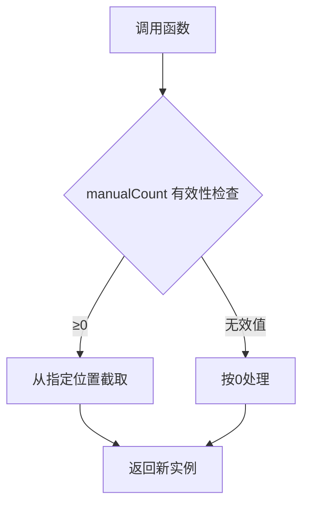

# `args` 类文档

## 目录
- [快速开始](#快速开始)
- [核心功能](#核心功能)
- [参数处理机制](#参数处理机制)
- [常见场景](#常见场景)
- [性能优化](#性能优化)
- [注意事项](#注意事项)
- [最佳实践](#最佳实践)

---

## 快速开始

### 1. 创建 `args` 实例

`args` 类继承自 `Array`，可以直接用于创建具备参数处理能力的数组实例。

```actionscript
// 创建一个包含多个元素的 args 实例
var simpleArgs = new org.flashNight.gesh.arguments.args(1, "text", true);

// 从已有数组创建 args 实例
var fromArray = new org.flashNight.gesh.arguments.args([new Date(), null]);
```

### 2. 参数处理：`fromArguments` 方法

`fromArguments` 方法允许你在函数中指定一个基础参数数量，并自动截取剩余参数。

```actionscript
function processData(name:String, options:args) {
    var EXPECTED_PARAMS = 1; // 期望参数数量
    options = args.fromArguments(EXPECTED_PARAMS, arguments);
    
    trace("核心参数:", name);
    trace("附加选项:", options);
}

// 调用示例
processData("数据报表", "导出PDF", "包含图表", 2023);
```

---

## 核心功能

### 1. 参数截取机制：`fromArguments`

`fromArguments` 方法用于从 `arguments` 对象中提取参数。你可以指定从哪个位置开始截取额外的参数。

```actionscript
public static function fromArguments(manualCount:Number, funcArgs:Arguments):args
```

#### 参数说明：
- `manualCount`：指定函数声明中基础参数的个数。
- `funcArgs`：传入的 `arguments` 对象。

#### 截取逻辑：
- 从 `manualCount` 指定的位置开始截取参数，构造一个新的 `args` 实例。

### 2. 兼容性操作：`valueOf` 和 `toArray`

- `valueOf`：将 `args` 实例转换为普通数组。
- `toArray`：返回当前 `args` 实例的副本。

```actionscript
var customArgs = new args("A", "B");
var nativeArray:Array = customArgs.valueOf(); // 转换为普通数组
```

### 3. 自定义 `splice` 方法

`args` 类重载了 `splice` 方法，可以更灵活地进行数组的截取和删除操作。

```actionscript
public function splice(start:Number, deleteCount:Number):Array {
    return super.splice(start, deleteCount);
}
```

---

## 参数处理机制

### 参数截取公式

`args` 类通过 `fromArguments` 方法进行参数截取，逻辑如下：



### 典型场景

| 手动计数 | 实际参数                | 截取结果        |
| -------- | ----------------------- | --------------- |
| 2        | ["a",1,true,{}]          | [true, {}]      |
| 0        | [100, "text"]            | [100, "text"]   |
| 3        | [1,2]                    | []              |

---

## 常见场景

### 1. 配置项处理

处理动态传入的配置项，使用 `args` 处理额外的选项。

```actionscript
function initApp(config:args) {
    var BASE_PARAMS = 0; // 无基础参数
    config = args.fromArguments(BASE_PARAMS, arguments);
    
    trace("启用特性:", config[0] || "默认设置");
    trace("调试模式:", config[1] === true);
}

// 调用示例
initApp("快速启动", true, {resolution: 1080});
```

### 2. 动态表单提交

将提交的表单字段作为 `args` 进行处理，自动识别并处理动态字段。

```actionscript
function submitForm(formId:String, fields:args) {
    var FIXED_PARAMS = 1; // formId 为固定参数
    fields = args.fromArguments(FIXED_PARAMS, arguments);
    
    var formData = {};
    for (var i:Number = 0; i < fields.length; i++) {
        formData["field_" + i] = fields[i];
    }
    trace("提交数据:", formData);
}

// 调用示例
submitForm("user_profile", "张三", 25, "北京");
```

---

## 性能优化

### 1. 创建性能测试

```actionscript
private static function testCreationPerformance():Void {
    var start:Number = getTimer();
    
    for (var i:Number=0; i<TEST_ITERATIONS; i++) {
        var a = new args(1,2,3,4,5);
    }
    
    var elapsed:Number = getTimer() - start;
    trace(TEST_ITERATIONS + "次实例创建耗时: " + elapsed + "ms");
}
```

### 2. 数组操作性能优化

优化 `push` 和 `pop` 操作，避免频繁的内存分配。

```actionscript
private static function testMethodPerformance():Void {
    var a = new args();
    
    // Push性能
    var startPush:Number = getTimer();
    for (var i:Number=0; i<TEST_ITERATIONS; i++) {
        a.push(i);
    }
    var pushTime:Number = getTimer() - startPush;
    
    // Pop性能
    var startPop:Number = getTimer();
    for (i=0; i<TEST_ITERATIONS; i++) {
        a.pop();
    }
    var popTime:Number = getTimer() - startPop;
    
    trace("Push操作: " + pushTime + "ms");
    trace("Pop操作: " + popTime + "ms");
}
```

---

## 注意事项

### 1. 参数位置约束

`args` 必须作为函数的最后一个参数。如果放置在中间或前面，会导致解析错误。

```actionscript
// ✅ 正确：可变参数必须最后
function valid(a, b, rest:args) {}

// ❌ 错误：可变参数不能前置
function invalid(rest:args, a) {}
```

### 2. 手动计数原则

在使用 `fromArguments` 方法时，必须显式声明基础参数的数量。

```actionscript
function example(a, b, c, rest:args) {
    var MANUAL_COUNT = 3; // 基础参数a,b,c
    rest = args.fromArguments(MANUAL_COUNT, arguments);
}
```

### 3. 类型转换注意事项

`args` 实例虽然继承自 `Array`，但它依然保持了自定义类型。要注意与原生 `Array` 的区别。

```actionscript
var a = new args(1,2);
trace(a is Array); // true
trace(a instanceof args); // true
```

---

## 最佳实践

### 1. 参数校验模板

确保函数中的参数类型和数量符合预期，避免出错。

```actionscript
function safeOperation(baseParam, options:args) {
    var EXPECTED = 1; // 显式声明期望参数数
    options = args.fromArguments(EXPECTED, arguments);
    
    // 空值检查
    if (options.length === 0) {
        throw new Error("至少需要提供1个选项");
    }
    
    // 类型校验
    if (typeof options[0] !== "number") {
        throw new Error("首个选项必须为数字");
    }
}
```

### 2. 数据转换技巧

- 与原生数组互操作：`valueOf` 转换为数组。
- 将 `args` 数据生成 XML 格式。

```actionscript
// 与原生数组互操作
var customArgs = new args("A", "B");
var nativeArray:Array = customArgs.valueOf();

// XML数据生成
function buildXML(data:args):XML {
    var xml = new XML("<items></items>");
    var items = data.valueOf();
    for (var i=0; i<items.length; i++) {
        xml.appendChild(<item>{items[i]}</item>);
    }
    return xml;
}
```

---

## 结论

`args` 类为 ActionScript 2 提供了更强大的参数处理能力，使函数可以灵活处理可变参数数组、类型转换和性能优化。通过合理使用此类，你可以简化代码、提高可维护性，并优化性能。

