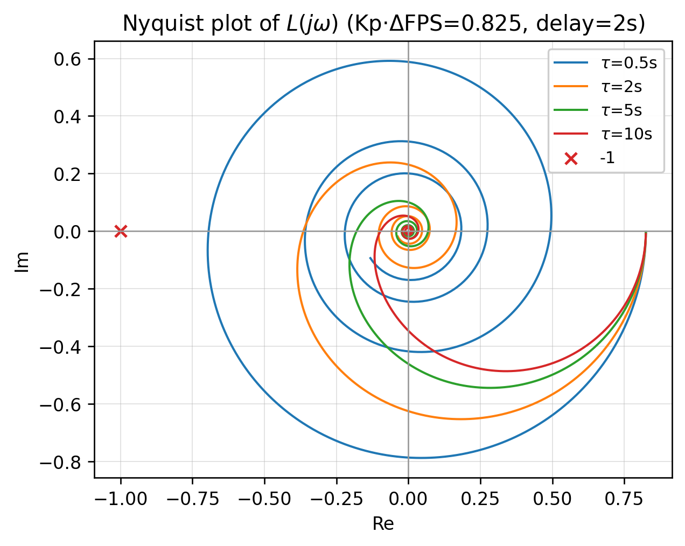
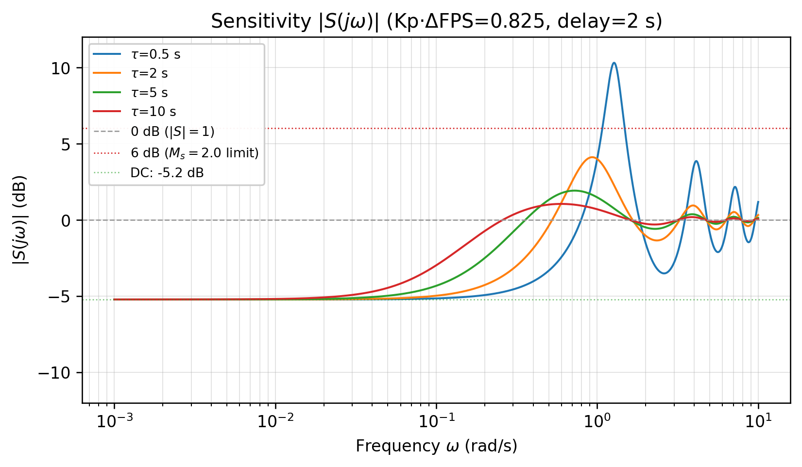
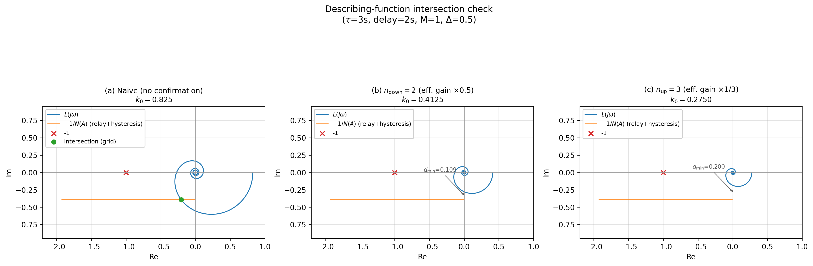
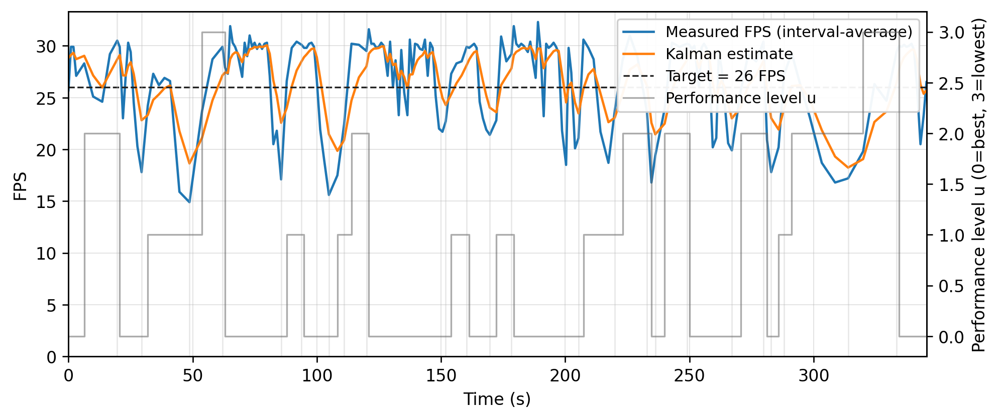
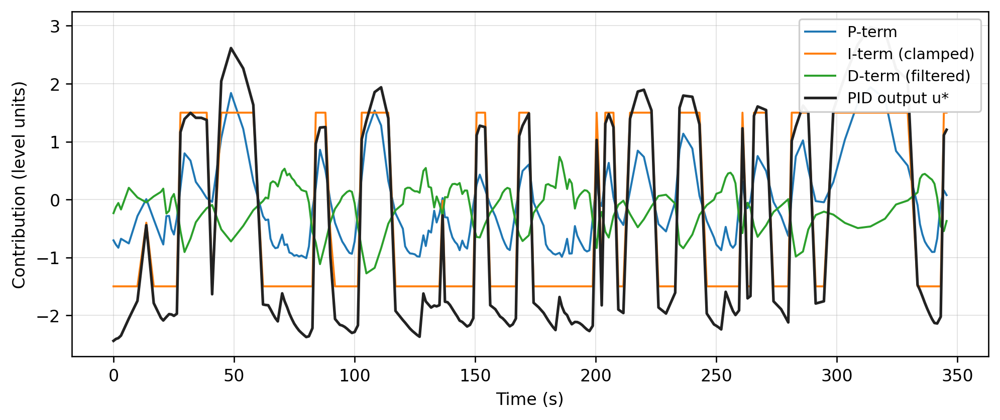

# 资源受限渲染环境中的自适应帧率控制：一种控制论方法

> **预期用途**：游戏内情报物品（学术风格技术报告；不用于投稿）
> **修订版本**：2026-02-07 r2（证明严谨性：命题1符号反转子情况、显式导数界、灵敏度假设；图编号调整；参考文献更新；定义1可操作性注释；摘要精简）

---

## 摘要

本文提出了一种面向遗留Flash/AS2渲染器的闭环性能调度器，该系统面临三重约束：(i)级间增益高度非均匀（包含近死区级别）的四级离散执行器；(ii)严格运行时约束（微秒级每帧预算、零内存分配）；(iii)未建模的时变黑箱被控对象。本文证明，当PID控制器以帧计数为时间增量（30–120帧）驱动时，会退化为带偏置的比例阈值生成器——受夹紧约束的积分项在一步内饱和，微分项衰减为适度阻尼——因此**切换动态由量化器的确认式迟滞机制主导，而非PID精细调参**。这是本文的核心发现：在粗粒度执行器系统中，低振荡调度主要由确认机制驱动，而非PID精细调参。

低振荡安全性由四环证据链支撑：构造性有界性、排除高频自激极限环的线性替代诊断（仅限$k_0 < 1$域，机器B；假设S1，第6.3节）、由确认有限状态机导出的结构性驻留时间频率界（引理2），以及来自战斗日志的经验归因。在低端机器上，系统维持26 FPS目标（均值26.86 FPS，卡顿率从93%降至<9%），共发生25次级别切换，间隔13.6 ± 7.5 秒/次（$f_{\text{sw}}=0.072$ Hz），未出现自激抖振。跨会话对比初步显示两种硬件配置上50–62%的平均FPS提升（第7.2节）。

**关键词**：自适应帧率控制；量化反馈控制；迟滞量化器；驻留时间；PID退化；灵敏度函数；自适应采样；资源受限渲染

---

## 1. 引言

### 1.1 问题背景

实时交互式应用面临视觉保真度与计算性能之间的根本矛盾。当渲染负载超出硬件能力时，应用必须降低画质设定以维持可接受的帧率。这一问题——动态性能调度——在游戏、仿真和实时可视化中普遍存在。

多数已部署方案采用基于阈值的启发式策略：若帧率降至下限以下则降低画质，若帧率升至上限以上则恢复画质。这类方法虽然简单且鲁棒，但缺乏形式化的稳定性保证，无法根据系统动态调整采样率，也不具备处理降质（需快速响应以保障用户体验）与恢复（需谨慎操作以避免乒乓振荡）之间不对称性的原理性机制。

现代渲染引擎中更精密的方案，如Unreal Engine的动态分辨率缩放[1]，对可连续调节的参数（如50%至100%的渲染分辨率）施加比例控制。然而，这些方法依赖于连续执行器的存在。当执行器本质上是离散的——例如主要画质参数为不含中间状态的枚举预设时——连续控制理论不再直接适用，系统进入量化反馈控制的范畴[2, 3]。

从控制论角度看，Flash渲染管线和虚拟机构成一个**非线性、时变黑箱被控对象**。被控输出为实际帧率$y$（FPS）；外生的游戏负载（敌人生成、粒子效果、UI）作为不可测扰动；唯一可用的控制输入是少量离散画质预设。这些特性使该问题更接近混杂的、扰动驱动的调节问题，而非经典线性设定点跟踪，并引出了(i)显式的抗振荡切换逻辑和(ii)*多证据*保证（而非单一的闭式稳定性证明）的设计动机。

### 1.2 量化控制的挑战

量化反馈控制已在通信受限控制[2, 4]和网络化控制系统[5]中得到广泛研究。其核心挑战是**量化极限环**：当连续控制器输出在量化边界附近振荡时，离散执行器无限期地来回切换，产生自激振荡，降低性能并加速机械磨损（在软件系统中则表现为视觉闪烁）。

标准补救措施是**迟滞**——引入非对称切换阈值，在每个量化边界周围形成死区。分析此类系统的理论框架由Tsypkin[6]针对继电器系统建立，并由Elia和Mitter[2]以及Delchamps[3]推广至量化控制。然而，这些分析通常假设均匀的量化器步长和时不变的被控对象动态——这两个假设在本应用中均不成立。

### 1.3 本工作的特定挑战

本文所述系统——一个生产级Flash游戏的性能调度器——面临三个区别于标准量化控制问题的特定挑战：

**C1. 非均匀执行器增益（含死区）。** 该四级离散画质执行器的增益高度非均匀：在代表性低端机器上，三个相邻级别转换对应的稳态FPS变化约为+0.5、+3.3和−0.6（最后一个处于测量噪声范围内，实际上约≈0）。L1→L2转换激活全局渲染质量降低，贡献了总卸载能力的约87%（3.3/3.8）。其余转换产生的效果可忽略或为零（执行器死区/类饱和行为）。这种极端的非均匀性意味着单一PID增益无法在所有工作区域达到最优。

**C2. 未建模的被控对象动态。** 渲染引擎（Adobe Flash Player，ActionScript Virtual Machine 1（AVM1））无法从第一性原理建模。其帧率取决于场景复杂度、活动实体数量、脚本执行时间、垃圾回收暂停和操作系统调度——这些均不可由应用观测或控制。被控对象必须被视为具有不确定动态的黑箱。

**C3. 平台约束。** 目标平台为单线程且无硬件浮点加速。控制回路必须在每帧预算30 μs以内执行，且不产生任何内存分配（以避免触发垃圾回收——其本身就是帧率抖动的来源）。

### 1.4 贡献

本文做出以下贡献：

1. **帧计数时间增量下的PID退化**（第5节）。本文证明，当具有积分夹紧的PID控制器以帧计数量度的$\Delta T$（30–120）驱动时，积分项在一个采样步内饱和并成为恒定的方向偏置，微分项按$1/N$缩放并起适度阻尼作用。有效控制律退化为带偏置的比例阈值生成器；经量化后，PID精度对切换行为几乎无影响。

2. **方向记忆确认作为具有驻留时间的有限状态切换机制**（第2.5和6.4节）。本文将基于确认的迟滞量化器形式化为有限状态机（状态 = 当前级别、待定方向、确认计数器），并将其非对称$n$步规则与切换系统中的驻留时间约束[12, 13]相关联。

3. **多证据低振荡保证**（第6节）。在未建模的时变被控对象下，本文以四环证据链（构造性有界性、保守替代裕度与灵敏度分析、驻留时间频率界和经验归因）替代单一的"稳定性"声明，形成针对自激极限环的可操作保证论证。本文将该框架称为*多证据低振荡安全性*，并给出形式化定义（定义1）与定量接受准则。

4. **可复现的实验验证**（第7节）。本文提供开环辨识数据（4级 × 2方向，117个样本）和闭环战斗日志（195个样本，25次级别切换，345.5秒），涵盖两种硬件配置。对于机器B，所有图表和报告的指标均直接从附带的CSV日志导出，标量聚合由`./tools/generate_paper_figures.py`计算，事件计数规约见附录C。

### 1.5 相关工作

**游戏中的动态画质调整。** 动态分辨率缩放（DRS）是现代渲染引擎中部署最广泛的自适应性能技术。Unreal Engine的DRS[1]和Unity的自适应性能SDK[15]按比例调整渲染分辨率以维持目标帧时间，依赖于允许经典比例控制的连续执行器。时域上采样技术（AMD FSR、NVIDIA DLSS）进一步实现了细粒度、近连续的画质调节。这些方法未涉及本文所考虑的离散执行器情形——主要画质参数为不含中间状态的枚举预设。主机时代的"性能模式 vs. 画质模式"选择代表了离散画质控制的极端情况，但通常是手动而非自动的。

**量化与切换反馈控制。** 量化输入控制的理论基础由Delchamps[3]奠定，并由Elia和Mitter[2]以及Brockett和Liberzon[4]推广，主要面向通信受限的网络化控制场景。这些工作关注均匀量化下稳定化的最低数据率。本问题涉及非均匀执行器增益、有限四级执行器和黑箱被控对象——使继电器和迟滞控制文献[6]更具直接相关性，特别是Tsypkin的描述函数框架用于极限环分析。具有驻留时间约束的切换系统[12, 13]为本文基于确认的切换分析提供了理论支撑。

**动态电压频率缩放（DVFS）。** 具有非均匀性能/功耗权衡的离散执行器级别也出现在嵌入式功耗管理中，DVFS控制器在枚举的CPU频率/电压状态间选择[16, 17]。基于PID的DVFS调节器（如Linux `ondemand`调节器）面临类似的量化极限环问题，并使用迟滞死区来抑制抖振。本文提出的多样本确认机制可视为此迟滞死区方法的推广，并增加了方向记忆和非对称驻留时间强制。

**自适应码率流传输（ABR）。** 不确定吞吐量下的离散画质级别选择也出现在HTTP自适应流传输中，客户端在枚举的视频码率间选择。Yin等[18]将类PID控制律应用于此问题；基于缓冲区的算法（如BBA[19]）使用阈值迟滞来抑制码率振荡。本文提出的方向记忆确认机制通过增加非对称驻留时间强制和方向追踪，将ABR中使用的固定阈值迟滞进一步推广——这些在ABR中是不必要的（因"执行器"增益在各码率级别间近似均匀），但在执行器增益非均匀时至关重要。

**事件触发与自触发控制。** 本文采用的自适应采样周期（第2.2节）——采样间隔是当前性能级别的函数——与事件触发控制框架[7, 8]相关。与经典事件触发系统中采样由状态相关阈值条件触发不同，本文的采样方式为状态相关但在每个模式内周期性的，形成时间触发与状态触发范式的混合体。

### 1.6 范围、定义与组织

#### 1.6.1 范围与假设

本文分析了嵌入在遗留Flash/AS2实时应用中的性能控制器。重点在于(i)对黑箱被控对象的可辩护建模策略，(ii)在严格运行时约束下可实现的控制设计，以及(iii)定量可验证的*低振荡*性质而非最优性声明。

分析采用以下假设和约定：

- **A1（帧率上限）。** 渲染器强制帧率上界$f_r=30$ FPS。控制目标为调节至低于此上限的设定点$r=26$ FPS（噪声裕度）。
- **A2（离散执行器）。** 控制输入为离散性能级别$u\in\{0,1,2,3\}$。在描述阶跃测试和执行器预设时，本文用$L_i$作为$u=i$的同义符号。
- **A3（期望意义下的主导单调性）。** 执行器设计为单调的（更高的$u$降低负载）。经验上，主导边界$L1\leftrightarrow L2$具有正增益。某些边界可能在测量噪声范围内无效或略微非单调；这激发了基于确认的切换设计。
- **A4（测量合理性）。** 区间平均FPS由单调挂钟计时器（`getTimer()`）计算，因此每个采样窗口满足$\Delta t_k>0$；由于时间戳量化和四舍五入，测量FPS可能略超30，但保持有界。
- **A5（评估范围）。** 报告的结果基于固定场景和两台机器的战斗日志离线分析。可推广性作为效度威胁问题讨论（第8.3节），而非默认假设。

#### 1.6.2 操作定义（指标与事件）

为使第6–7节中的经验性声明可机械验证，本文根据`PerformanceLogger`（`./PerformanceLogger.as`）产生的日志事件流（附录C）定义所有指标。

- **样本。** 一个*样本*对应一次在区间窗口末端的控制评估，记录为`EVT_SAMPLE`，字段包括（时间、级别、测量FPS、卡尔曼估计、PID输出）。
- **切换事件。** 一次*切换*是记录为`EVT_LEVEL_CHANGED`的已执行级别变更。切换计数即此类事件的数量。
- **跳级事件。** *跳级*事件是$|\Delta u|>1$的切换。
- **平均切换频率。** 在测试持续时间$T$（秒）内，$f_{\text{sw}} = N_{\text{sw}}/T$，其中$N_{\text{sw}}$为切换事件数。
- **反转（乒乓）事件。** 本文中，*反转*（乒乓）定义为*快速偏离主要工作级别后的往返*。令主要级别集合为$\mathcal{U}_{\text{prim}}\triangleq\{0,2\}$（L0 = 理想, L2 = 战斗默认）。考虑在时刻$t_i$离开主要级别$u^-_i\in\mathcal{U}_{\text{prim}}$的切换。若级别在$T_{\text{rev}}$秒内返回$u^-_i$（可能经过中间级别），则计为一次反转事件；事件间隔为离开切换与首次返回之间的经过时间。此约定(i)通过锚定在主要级别避免了对称双级振荡的重复计数（L1和L3为过渡级别），(ii)将指标集中于用户相关模式。本文使用$T_{\text{rev}}=10$ s。该值选取为约$3\,T_{s,\max} = 3 \times 4 = 12$ s向下取整：因此反转必须跨越至少2–3个完整采样周期（在最慢采样率$T_{s,\max}=4$ s，即级别3下），确保仅计入多样本振荡周期，而非单次瞬态调整。结果事件列于表6。
- **卡顿率。** 卡顿率为`EVT_SAMPLE`观测中测量FPS $<20$的比例（20 FPS为感知阈值，用作可见卡顿的粗略代理指标）。这是*样本加权*而非时间加权的；时间加权驻留另行报告于第7.3节。

除非另有说明，第7节中机器B的标量统计（均值、百分位数、标准差）由附带的CSV日志通过复现脚本（附录C）计算。标准差使用总体约定（`ddof=0`）以匹配`derived_metrics.json`。

#### 1.6.3 文档组织

第2节描述系统架构。第3节给出被控对象辨识结果。第4节描述前馈接口。第5节分析PID退化。第6节提出多证据低振荡保证（包括形式化安全定义、灵敏度分析和驻留时间频率界）。第7节报告实验验证。第8节讨论可推广性与局限性，第9节给出结论。

---

## 2. 系统架构

### 2.1 控制回路拓扑

性能调度器实现了一个采样数据反馈控制系统，信号流如下：

```
      r = 26 FPS（设定点）
              |
              v
      e_k = r - y_hat_k
              |
              v
  [PID] -> u*_k -> [量化器 + 确认器] -> u_k -> [执行器] -> 被控对象 -> y(t)
    ^                                                                  |
    |                                                                  v
    +------------- y_hat_k <- [卡尔曼] <- y_k <- [区间采样器] <--------+
```

**图1.** 反馈控制拓扑（文本渲染；源码见实现工件（artifact））。控制回路由六个功能模块组成：自适应区间平均采样器（传感器）、自适应卡尔曼滤波器（状态估计器）、PID控制器（控制律）、非对称迟滞量化器（切换逻辑）、多参数执行器（效应器）和性能记录器（观测器，未示出）。设定点r = 26 FPS设置在硬件帧率上限30 FPS以下4 FPS处，提供噪声裕度以防止控制器在饱和边界附近工作。

> **术语约定。** 在本文中，性能级别$u \in \{0,1,2,3\}$随计算负载削减程度递增：$u=0$表示最高视觉质量（无负载卸除），$u=3$表示最低质量（最大负载卸除）。本文用**"降级"**表示$u$增加（画质降低，负载降低），用**"升级"**表示$u$减小（画质提高，负载增加）。此约定与执行器的单调负载卸除语义一致：更高级别总是减少渲染负载。

**控制目标（问题陈述）。** 令$y(t)$为实际帧率，$r=26$ FPS为设定点。在每个采样时刻$k$，控制器选择离散级别$u_k\in\{0,1,2,3\}$以将$y$调节至$r$附近，同时限制切换次数。设计要求为：

1. **调节：** 在未知的时变游戏负载下保持区间平均FPS接近$r$。
2. **低振荡：** 避免自激级别振荡并限制切换频率（形式化于定义1）。
3. **不对称性：** 快速响应FPS崩溃（降级），谨慎恢复（升级）以防止乒乓。
4. **运行时约束：** 每帧开销$\ll 30\,\mu$s且无运行时内存分配。

**实现映射（工件）。** 模块到代码的对应关系（路径相对于本文件`paper_cn.md`）：

| 角色 | 类/组件 | 文件 |
|------|---------|------|
| 调度器（反馈 + 前馈） | `PerformanceScheduler` | `./PerformanceScheduler.as` |
| 区间平均传感器 | `IntervalSampler` | `./IntervalSampler.as` |
| 状态估计器 | `AdaptiveKalmanStage` + `SimpleKalmanFilter1D` | `./AdaptiveKalmanStage.as`, `../Controller/SimpleKalmanFilter1D.as` |
| 控制律 | `PIDController` | `../Controller/PIDController.as` |
| 量化器 + 确认器 | `HysteresisQuantizer` | `./HysteresisQuantizer.as` |
| 执行器（负载卸除） | `PerformanceActuator` | `./PerformanceActuator.as` |
| 日志/可观测性 | `PerformanceLogger` | `./PerformanceLogger.as` |

控制器在每个采样窗口执行一次（非每帧一次），采样窗口长度随当前性能级别自适应调整。在采样点之间，每帧仅执行一次递减计数操作（帧计数器），在目标平台上耗时2.66 μs。

### 2.2 自适应区间平均采样器

采样器承担双重角色：测量（计算采样窗口内的平均FPS）和抗混叠预滤波（在帧率波动进入控制回路之前衰减高频分量）。

**单位约定。** 在本文中，经过时间（$\Delta t_k$, $T_s$）以**秒**为单位，除非另有说明。实现中时间戳以毫秒记录；在测量接口处转换为秒。

**测量模型。** 区间平均FPS计算如下：

$$\bar{y}_k = \frac{N_k}{\Delta t_k}$$

其中$N_k = f_r \cdot (1 + u_k)$为采样窗口内的帧数，$f_r = 30$为标称帧率，$u_k \in \{0,1,2,3\}$为当前性能级别，$\Delta t_k$为以秒计的挂钟经过时间。

**自适应采样周期。** 采样窗口长度随性能级别调整：

| 级别 $u$ | 窗口（帧） | 近似周期 |
|-----------|------------|----------|
| 0         | 30         | ~1 s     |
| 1         | 60         | ~2 s     |
| 2         | 90         | ~3 s     |
| 3         | 120        | ~4 s     |

此自适应实现了**时间尺度分离**：在较高性能级别（由于累积的实体数量和延迟的垃圾回收，被控对象时间常数τ预计更大），采样周期自动增加以匹配，防止对瞬态动态的过采样。按设计，采样周期满足$T_s \propto (1 + u)$。其底层假设——$\tau_{\text{plant}}$也近似按$(1 + u)$缩放——是一种工程启发式，源于对高级别场景承载更多延迟负载的观察，而非形式化辨识的关系。第3.4节仅建立了$\tau \in [0.5, 5]$ s的界；验证比例关系需要比当前可用数据更高信噪比的逐级别阶跃响应数据。

**隐式增益调度的解读。** 由于$T_s$是离散级别$u$的函数，回路更新率和有效闭环带宽在更高负载时自动降低。这可视为一种隐式增益调度机制：当被控对象变得"更慢"（更大的有效$\tau$）时，控制器采样频率降低，改善相位鲁棒性和噪声抑制。重要的是，同一帧计数窗口长度$N_k$随后被复用为PID时间增量$\Delta T_k$（第2.4节），使采样和控制在一致的时间尺度上耦合。

**抗混叠特性。** N样本区间平均等效于移动平均（矩形窗）低通滤波器，其频率响应为$H(f) = \operatorname{sinc}(f T) \triangleq \sin(\pi f T)/(\pi f T)$，其中$T = N/f_r$为窗口持续时间。$-3$ dB截止频率（半功率点）为：

$$f_{-3\text{dB}} \approx \frac{0.4429 \, f_r}{N}$$

其中$0.4429$是$|\operatorname{sinc}(x)| = 1/\sqrt{2}$（半功率点）的数值解。在级别0（$N=30$）时：$f_{-3\text{dB}} \approx 0.44$ Hz（衰减周期$\lesssim 2.3$ s的波动）。在级别3（$N=120$）时：$f_{-3\text{dB}} \approx 0.11$ Hz（衰减周期$\lesssim 9$ s的波动）。sinc响应的第一个零点在$f_r/N$处；在$-3$ dB点与零点之间，衰减单调增加。此预滤波构成系统中三级级联低通中的第一级，是抵御由瞬态事件（爆炸、粒子爆发）引起的高频帧率噪声的首要防线。

**备注（帧事件采样）。** 控制器采用*帧事件采样*：采样窗口在$N$个已渲染帧后触发，而非在固定挂钟间隔后触发。上表中的标称周期~1–4 s假设FPS接近上限（$f_r = 30$）。当FPS崩溃（如级别2下15 FPS）时，同一90帧窗口在挂钟时间中需要约6 s，自动延长采样间隔。这有利于稳定性：有效带宽恰好在系统承受压力时降低，提供超出标称$T_s$所暗示的额外相位裕度和噪声抑制。由此产生的正反馈（高级别 → 慢采样 → 延迟响应）是有界的，因为$u \in \{0,1,2,3\}$阻止了发散。此状态依赖采样方案与事件触发控制[7, 8]相关。

### 2.3 自适应卡尔曼滤波器（状态估计器）

一维卡尔曼滤波器配合自适应过程噪声提供状态估计$\hat{y}_k$。滤波器观测$\tilde{y}_k$为来自采样器（第2.2节）的区间平均FPS $\bar{y}_k$；本文使用不同符号以强调测量噪声的解读。

**状态模型：** $x_{k+1} = x_k + w_k$，$w_k \sim \mathcal{N}(0, Q_k)$

**观测模型：** $\tilde{y}_k = x_k + v_k$，$v_k \sim \mathcal{N}(0, R)$

过程噪声协方差随采样间隔自适应：

$$Q_k = \text{clamp}(Q_0 \cdot \Delta t_k, \; Q_{\min}, \; Q_{\max})$$

其中$Q_0 = 0.1$，$Q_{\min} = 0.01$，$Q_{\max} = 2.0$，$R = 1.0$。其原理是较长的采样间隔允许被控对象状态发生更多变化（由于实体生成、AI状态变化等），因此滤波器应更信任测量值（$Q \uparrow \Rightarrow K \uparrow$）。这一轻量级协方差自适应启发式遵循经典自适应滤波方法[14]的思路。

对于实现中使用的随机游走模型（$x_{k+1}=x_k+w_k$，$H=1$），稳态*先验*协方差$P^-_\infty$和相应的卡尔曼增益通过求解代数Riccati方程获得：

$$P^-_\infty = \frac{Q + \sqrt{Q^2 + 4QR}}{2}, \qquad K_\infty = \frac{P^-_\infty}{P^-_\infty + R}$$

取$R=1.0$和$Q = Q_0\Delta t$（夹紧前），稳态增益在标称1–4 s工作范围内为：

| $\Delta t$（s） | $Q$ | $K_\infty$ |
|----------------|-----|------------|
| 1 | 0.10 | 0.270156212 |
| 2 | 0.20 | 0.358257569 |
| 3 | 0.30 | 0.417890835 |
| 4 | 0.40 | 0.463324958 |

因此$K_\infty$在各工作级别间从0.27变化到0.46：估计器提供适度平滑（从不成为近直通滤波器），同时随着采样间隔增长更信任测量值。此滤波器是级联中的第二个低通级。

**设计注释。** 常状态模型（$x_{k+1} = x_k$）在真实FPS快速变化时引入固有滞后。此滞后被确定为过早恢复事件（第7.4节振荡#4）的根本原因，并推动了趋势门的引入（第2.6节）。

### 2.4 PID控制器（控制律）

离散PID控制器计算：

$$u^*_k = K_p \cdot e_k + K_i \cdot I_k + K_d \cdot D_k$$

其中：
- $e_k = r - \hat{y}_k$（误差，设定点$r = 26$ FPS）
- $I_k = \text{clamp}(I_{k-1} + e_k \cdot \Delta T_k, \; -M, \; +M)$（带抗饱和夹紧的积分，$M = 3$）
- $D_k = (1-\alpha) D_{k-1} + \alpha \cdot (e_k - e_{k-1}) / \Delta T_k$（滤波微分，$\alpha = 0.2$）
- $\Delta T_k = f_r \cdot (1 + u_k) \in \{30, 60, 90, 120\}$（帧计数，非秒）

**参数**（从XML配置加载）：

| 参数 | 符号 | 值 |
|------|------|-----|
| 比例增益 | $K_p$ | 0.25 |
| 积分增益 | $K_i$ | 0.5 |
| 微分增益 | $K_d$ | −30 |
| 积分限幅 | $M$ | 3 |
| 微分滤波器 | $\alpha$ | 0.2 |

**微分滤波器时间常数。** 滤波微分是对原始差商施加的一阶IIR低通（第5.2b节）。其以样本为单位的时间常数为$\tau_d = -1/\ln(1-\alpha) = -1/\ln(0.8) \approx 4.48$个样本。在各工作级别上，对应挂钟时间为$4.48 \times T_s \in [4.5, 18]$ s（级别0至级别3）。在频域中，滤波器的$-3$ dB截止频率为$f_d = 1/(2\pi\tau_d T_s) \in [0.009, 0.035]$ Hz——远低于第6.4节中0.2 Hz的驻留时间振荡界，确认微分级衰减而非放大潜在的抖振频率。

**关键设计选择（时间尺度归一化）。** 变量$\Delta T_k$以**帧计数**（30–120）传递给PID，而非以秒（约1–4）。这可解读为将控制器归一化至帧索引：控制器按每帧（而非每秒）积分和微分，这(i)使其有效作用对瞬时挂钟采样周期的敏感性降低，(ii)在积分夹紧存在时迫使出现可分析的退化（命题1）。完整分析推迟至第5节。

### 2.5 非对称迟滞量化器

量化器通过以下步骤将连续PID输出$u^*$映射为离散级别$u \in \{u_{\min}, \ldots, 3\}$：

概念上，此模块作为围绕round()边界的**非对称、方向记忆施密特触发器/去抖器**：降级（画质↓）快速确认，而升级（画质↑）需要更强的证据以避免乒乓。

**步骤1. 量化：**

$$u_{\text{cand}} = \text{clamp}(\text{round}(u^*), \; u_{\min}, \; 3)$$

**步骤2. 方向感知确认：**

若$u_{\text{cand}} \neq u_{\text{current}}$，量化器确定方向$d = \text{sign}(u_{\text{cand}} - u_{\text{current}})$：
- $d = +1$：降级（级别增加，画质降低）
- $d = -1$：升级（级别减小，画质提高）

确认计数器在方向与待定方向匹配时递增，在方向反转时重置为1。当计数器达到方向相关阈值时执行切换：

| 方向 | 阈值 | 原理 |
|------|------|------|
| 降级（$d=+1$） | $n_{\text{down}} = 2$ | 快速响应以保护帧率 |
| 升级（$d=-1$） | $n_{\text{up}} = 3$ | 谨慎恢复以防止乒乓 |

**方向记忆 vs. 候选记忆。** 确认计数器仅追踪待定变更的*方向*，而非具体的候选级别。这意味着如果候选级别改变（如从2变为3）但保持相同方向（降级），确认计数继续累积。这对于处理**性能悬崖**至关重要：当FPS快速下降时，PID输出可能在连续样本间从2增至3，方向记忆允许系统在不重置确认计数器的情况下直接切换到级别3。

**等值重置。** 当$u_{\text{cand}} = u_{\text{current}}$时，确认计数器重置为零，防止残留确认状态在后续扰动期间触发非预期切换。

#### 2.5.1 有限状态形式化（方向记忆确认器）

尽管仅用几行代码实现，确认机制最好理解为有限状态机（FSM），其内部状态为

$$s_k \triangleq \big(u_k,\; p_k,\; c_k\big),$$

其中$u_k\in\{0,1,2,3\}$为当前性能级别，$p_k\in\{-1,0,1\}$为待定方向（$1$降级，$-1$升级，$0$空闲），$c_k\in\mathbb{N}_0$为连续确认计数器。

在每个采样时刻$k$，连续控制器输出$u_k^*$映射为候选级别

$$u_{\text{cand},k} \triangleq \operatorname{sat}_{[u_{\min},\,3]}\!\left(\operatorname{round}(u_k^*)\right).$$

定义方向符号

$$
d_k \triangleq
\begin{cases}
1, & u_{\text{cand},k} > u_k \quad\text{（降级）}\\
-1, & u_{\text{cand},k} < u_k \quad\text{（升级）}\\
0, & u_{\text{cand},k} = u_k.
\end{cases}
$$

令方向相关阈值为

$$
n(d) \triangleq
\begin{cases}
n_{\text{down}}, & d=1\\
n_{\text{up}}, & d=-1.
\end{cases}
$$

FSM更新规则为：

1. 若$d_k=0$，重置确认$(p_{k+1},c_{k+1})\leftarrow(0,0)$并保持$u_{k+1}\leftarrow u_k$。
2. 若$d_k\neq 0$，更新待定方向和计数器：
   - 若$c_k>0$且$p_k=d_k$：$(p',c')\leftarrow(d_k,\,c_k+1)$；
   - 否则（首次检测或方向翻转）：$(p',c')\leftarrow(d_k,\,1)$。
3. 若$c'\ge n(d_k)$，执行切换$u_{k+1}\leftarrow u_{\text{cand},k}$并重置$(p_{k+1},c_{k+1})\leftarrow(0,0)$；否则保持$u_{k+1}\leftarrow u_k$并保留$(p_{k+1},c_{k+1})\leftarrow(p',c')$。

此FSM刻意仅保留**方向记忆**：计数器以$d_k$为键，而非以$u_{\text{cand},k}$的身份为键。因此，在性能悬崖期间候选可能漂移（如1→2→3），而$d_k=1$保持不变，确认仍然朝着决定性降级累积。

#### 2.5.2 驻留时间解读

输出$u_k$为离散切换信号。确认FSM强制**以样本为单位的最小驻留时间**：在任何切换事件后，内部状态被重置，需要至少$n(d)$个具有相同方向的连续样本才能触发下一次切换。由于$n_{\text{down}}\neq n_{\text{up}}$，驻留时间约束是非对称的：降级可在2次确认后发生，而升级需要3次。

以挂钟时间计，每个样本对应自适应采样周期$T_s(u_k)=N_k/f_r$（第2.2节）。在标称设计$N_k = 30(1+u_k)$、$f_r=30$ Hz下，$T_s\in\{1,2,3,4\}$ s。因此确认器隐含的近似驻留时间界为

- 降级：$\approx 2T_s \in [2,8]$ s，
- 升级：$\approx 3T_s \in [3,12]$ s，

可解读为切换/混杂系统[12, 13]的实用驻留时间约束。第6.4节将此FSM与低抖振切换的保证论证相关联。

### 2.6 趋势门

趋势门解决常状态卡尔曼模型的一个已知失效模式：当FPS快速下降时，卡尔曼估计滞后于真实值，可能保持在设定点以上，导致PID错误地发出"帧率充足"信号并批准升级。

该门计算归一化趋势率：

$$\rho_k = \frac{\hat{y}_k - \hat{y}_{k-1}}{\Delta t_k} \quad \text{（FPS/秒）}$$

当$\rho_k < -\theta$（阈值$\theta = 0.2$ FPS/s）且迟滞量化器有待定的升级确认时，确认计数器被清零。这在FPS下降期间抑制升级决策，而不影响降级决策。

以$\Delta t_k$（秒）归一化确保阈值灵敏度独立于自适应采样周期。

### 2.7 执行器（多参数负载卸除）

执行器将离散级别映射为具体的参数调整：

| 参数 | L0（理想） | L1（缓冲） | L2（战斗） | L3（后备） |
|------|-----------|------------|-----------|-----------|
| 渲染质量 | 预设 | MEDIUM | **LOW** | LOW |
| 最大特效数 | 20 | 12 | 10 | 0 |
| 弹壳限制 | 25 | 12 | 12 | 10 |
| 面积系数 | 300K | 450K | 600K | 3M |
| 死亡特效 | 开 | 开 | 关 | 关 |
| UI动画 | 开 | 开 | 关 | 关 |

**单调性（设计意图）。** 所有参数设计为随级别单调变化：更高级别总是减少计算负载，满足负反馈所需的符号约定。经验验证（第3.3节）在主导边界L1↔L2处确认了此单调性（$\Delta\text{FPS}_{12} = +3.3$），但揭示L2→L3转换在低端硬件上产生统计不显著的负增益（$\Delta\text{FPS}_{23} = -0.6$，在零的$1\sigma$范围内）。此局部非单调性不影响闭环行为，因为主导控制权集中在L1↔L2边界（>87%的负载卸除在此发生），而切换基于确认机制，L3主要用作安全模式而非高杠杆控制区域（第7.3节）。

### 2.8 紧急旁路

硬编码的应急阈值（$\text{FPS}_{\text{panic}} = 5$）在原始（卡尔曼前）区间平均FPS低于此值时触发立即单步降级。这绕过卡尔曼滤波器、PID和迟滞机制，为近冻结状态提供最后防线。该阈值设定保守，以避免在典型低FPS条件（10–20 FPS范围）下干扰正常控制回路。

**旁路的抗抖振特性。** 执行降级后，紧急旁路重置卡尔曼估计、PID内部状态和迟滞确认状态，并清除任何活动的保持窗口。这防止了两种潜在的不稳定性：(1)陈旧的卡尔曼估计触发立即升级反转，(2)残留确认计数跨越边界累积。旁路事件后，下一次控制动作需要一个完整采样窗口（$T_s \geq 1$ s）加$n_{\text{down}} = 2$次确认才能触发进一步降级，提供了自然的驻留时间。在$\text{FPS}_{\text{panic}} = 5$处抖振在实践中不可能发生，因为(a)旁路每个采样窗口最多触发一次（非每帧），(b)从任何级别$u < 3$的单步降级减少负载，(c)阈值远低于正常工作范围（闭环测试中观测到的最低FPS为14.9）。

**局限性：相邻级别增益接近零。** 在相邻级别增益接近零的硬件上（如机器B上$\Delta\text{FPS}_{01} \approx 0$），单步旁路可能无效：L0处的应急事件触发降级至L1，但提供的FPS改善可忽略。恢复随后需要额外的采样窗口加确认才能到达有效的L2边界。多步后备（在已知L0→L1增益可忽略时直接旁路至L2）将减少恢复延迟；当前版本未实现此功能。

---

## 3. 被控对象辨识

### 3.1 实验协议

系统辨识通过开环阶跃响应测试完成。开环段通过组合以下方式实现：
1. `forceLevel(L)`调用——施加级别$L$的执行器、清除PID和确认状态、清除任何保持窗口，并重置采样间隔以匹配$L$。
2. 量化器锁定（$u_{\min}=u_{\max}=L$）——通过将候选夹紧回$L$来阻止反馈路径覆盖强制级别。

卡尔曼估计器在各段之间有意不重置；它继续追踪测量FPS并为日志提供去噪轨迹。由于量化器被锁定，PID/卡尔曼输出在辨识期间不影响施加的级别，仅记录用于分析。

测试协议以两个方向遍历所有四个级别：

$$L_0 \xrightarrow{\text{阶跃}} L_1 \xrightarrow{\text{阶跃}} L_2 \xrightarrow{\text{阶跃}} L_3 \xrightarrow{\text{阶跃}} L_2 \xrightarrow{\text{阶跃}} L_1 \xrightarrow{\text{阶跃}} L_0$$

每段运行30–60秒以允许稳态收敛。完整测试产生7个段，117个样本，历时355.7秒。

所有数据由环形缓冲区性能记录器在每个采样点记录，捕获：时间戳、级别、原始FPS、卡尔曼估计、PID输出和PID分量分解（P、I、D项）。

### 3.2 稳态增益辨识

各级别的稳态FPS通过对每段稳定部分的区间平均FPS取均值获得。正向和反向测量交叉验证：

| 级别 | 正向 $\bar{K}_L$ | 反向 $\bar{K}_L$ | 交叉均值 $\hat{K}_L$ | $\Delta$ |
|------|-------------------|-------------------|----------------------|----------|
| L0   | 17.2              | 15.4              | 16.3                 | 1.8      |
| L1   | 16.9              | 16.6              | 16.8                 | 0.3      |
| L2   | 20.2              | 20.1              | 20.1                 | 0.1      |
| L3   | 19.5              | —$^\ddagger$      | 19.5$^\ddagger$      | —        |

L0正向/反向差异（1.8 FPS）归因于6分钟测试期间的负载漂移（敌人实体在战斗场景中随时间累积）。L1和L2显示出良好的正向/反向一致性（Δ ≤ 0.3），表明测试中段负载稳定。

**表1.** 各级别稳态FPS，低端机器配置。测试场景：周期性敌人生成的波次战斗关卡。$^\ddagger$L3仅有正向测量（阶跃协议在L3处终止后反向）；$\hat{K}_3 = 19.5$因此为单方向估计，非交叉验证均值。

### 3.3 执行器增益非均匀性

级间增益（每级别阶跃的FPS改善）揭示了严重的非均匀性：

$$\Delta\text{FPS}_{01} = \hat{K}_1 - \hat{K}_0 = 16.8 - 16.3 = +0.5 \; \text{FPS}$$
$$\Delta\text{FPS}_{12} = \hat{K}_2 - \hat{K}_1 = 20.1 - 16.8 = +3.3 \; \text{FPS}$$
$$\Delta\text{FPS}_{23} = \hat{K}_3 - \hat{K}_2 = 19.5 - 20.1 = -0.6 \; \text{FPS} \quad (|\Delta| < 1\sigma_{\text{meas},L2} \approx 1.23; \text{ 统计不显著})$$

L1→L2转换——在渲染引擎中激活`_quality = LOW`——贡献了总卸载能力的$3.3 / 3.8 = 87\%$。其余转换产生的效果在测量噪声范围内（$\sigma \approx 1.5$–$2.0$ FPS）。

跨机器对比的第二种测试配置确认了相同模式但幅度不同：

| 增益 | 机器A | 机器B（低端） |
|------|-------|--------------|
| $\Delta\text{FPS}_{01}$ | +1.7 | +0.5 |
| $\Delta\text{FPS}_{12}$ | +6.1 | +3.3 |
| $\Delta\text{FPS}_{23}$ | +3.0 | −0.6 |
| **合计 $\sum$** | **+10.8** | **+3.2** |
| **有效范围** $\max_L \hat{K}_L - \min_L \hat{K}_L$ | +10.8 | **+3.8**$^\dagger$ |

$^\dagger$在机器B上，最大FPS出现在L2（$\hat{K}_2 = 20.1$），而非L3。有效范围（L0→L2）为3.8 FPS，而包含略负的L2→L3增量的代数和为3.2 FPS。因此，在以下分析中使用有效范围$\max_L \hat{K}_L - \min_L \hat{K}_L$；闭环切换由L1↔L2边界和基于确认的逻辑主导（第7.3节），因此小的L2→L3增量符号不会实质影响观测行为。

$\Delta\text{FPS}_{23} = -0.6$（机器B）值得讨论。三种解释与数据一致：(1)**测量噪声**：L2和L3的稳态标准差分别为1.2和0.5 FPS，因此$-0.6$在零的$1\sigma$范围内，可能是统计伪像；(2)**渲染管线路径变化**：在L3禁用所有视觉特效可能导致渲染器走不同代码路径（如完全跳过特效合成器），这可能因分支预测失败或缓存效应引入小额开销；(3)**负载漂移**：L3测量段在测试中晚于L2出现，实体累积增加了基线负载（参见L0正向/反向差异1.8 FPS）。无论原因如何，实际后果是L2→L3转换在此硬件上为**无效执行器步**：付出画质降低的代价但不产生可测量的FPS收益。

在低端机器上，四级系统因此退化为有效的两级系统：{L0 ≈ L1}和{L2 ≈ L3}。控制器对此退化的响应在第7.3节（涌现的跳级行为）中分析。

**表2.** 两种硬件配置的级间执行器增益。

### 3.4 被控对象时间常数

被控对象时间常数$\tau_L$表征FPS对级别变化响应的速度。对于一阶模型$x_{k+1} = a_L x_k + (1-a_L) K_L$，时间常数为$\tau_L = -T_s / \ln(a_L)$。

由于以下原因，从当前数据无法精确提取$\tau_L$：
1. 对于L0→L1和L2→L3转换，$\Delta\text{FPS} \approx 0$，瞬态与噪声无法区分（$\text{SNR} < 0.3$）。
2. 对于L1→L2转换（$\Delta\text{FPS} = 3.3$，$\sigma \approx 1.5$，$\text{SNR} \approx 2.2$），阶跃后第一个样本（$\Delta t \approx 4.7$ s时）FPS已接近新稳态，暗示$\tau_L < T_s \approx 4.7$ s。

因此可以建立一个界：

$$\tau_L \in [0.5, 5.0] \; \text{s}$$

下界（0.5 s）对应最快可能的被控对象响应（参数立即应用 + 一个渲染帧）。上界（5.0 s）由阶跃后第一个样本已达稳态的观测建立。

**此界对于第6节中的保守替代裕度检验已经足够**，这些检验在可能的$\tau_L$范围上（甚至超出此范围以增加保守性）参数化计算奈奎斯特/增益裕度。

### 3.5 噪声特性

**测量噪声。** 稳态段期间区间平均FPS的方差：

| 级别 | 样本数 | $\hat{\sigma}^2_{\text{meas}}$ | $\hat{\sigma}_{\text{meas}}$ |
|------|--------|-------------------------------|------------------------------|
| L0   | 15（尾段） | 3.27                       | 1.81                         |
| L1   | 10（中段） | 1.64                       | 1.28                         |
| L2   | 8（中段）  | 1.51                       | 1.23                         |
| L3   | 7（全段）  | 0.24                       | 0.49                         |

测量噪声随级别单调递减符合预期：更高级别使用更长的采样窗口（$N = 30(1+u)$帧），区间平均方差按$\sigma^2_{\text{meas}} \propto 1/N$缩放。这确认了自适应采样器的抗混叠作用。

**表3.** 各级别测量噪声特性，由开环稳态段估计。

**非高斯噪声结构。** 卡尔曼滤波器假设高斯过程噪声和测量噪声（$w_k, v_k$）。实践中存在两种非高斯性来源：(1)**垃圾回收（GC）暂停**在区间平均FPS中产生重尾、正偏的异常值（1 s窗口中的50 ms GC暂停使测量FPS降低约1.5）；(2)**游戏相关负载**（波次生成、Boss阶段）引入有色、非平稳扰动，违反白噪声假设。自适应$Q$缩放（第2.3节）通过在较长窗口期间扩大过程噪声协方差部分补偿了后者，但未解决非高斯尾部结构。在当前设计中，对这些违反的鲁棒性来自下游迟滞量化器，通过多样本确认过滤孤立异常值。更有原理性的方法是用鲁棒估计器（如基于Huber或基于中位数的方法）替代卡尔曼滤波器，但鉴于平台计算约束未予采用。

**非最小相位瞬态。** `_quality`参数切换（L1↔L2边界）触发内部渲染管线重配置，可能在稳态改善实现之前产生瞬时FPS下降——非最小相位响应。此效应在开发期间被定性地观察到（画质变化后立即出现1–2帧卡顿），但由于采样窗口（1–4 s）对瞬态取平均，在当前数据中不可分辨。第6节中的替代模型未建模初始反向响应瞬态（即假设无右半平面零点）；若此瞬态显著，它将增加有效延迟$\theta$并减少相位裕度。保守选取$\theta = 2$ s（最大4 s窗口的一半）为此效应提供了一定缓冲。

---

## 4. 前馈控制接口

除闭环反馈路径外，调度器提供前馈通道（`setPerformanceLevel`），允许外部系统（如关卡脚本、菜单控制）以保持窗口直接设置性能级别。此双通道架构分离了两个关注点：反馈回路处理对未知负载的*运行时自适应*，前馈通道处理*可预期的转换*（场景切换、用户偏好），此时目标级别是先验已知的。

前馈过程执行以下步骤：

1. 通过执行器立即应用请求的级别。
2. 重置PID和迟滞状态以防止反馈回路立即覆盖强制级别。
3. 设置保持计时器（$\Delta t_{\text{hold}}$，默认5 s），在此期间卡尔曼滤波器和PID继续观测，但量化器和执行器输出被抑制。

在保持窗口结束时，卡尔曼估计已收敛至新级别下的实际FPS，因此反馈回路从一致状态而非陈旧估计恢复。

此**测量/保持解耦**（实现中指定为方法B）解决了先前的一个缺陷：保持窗口通过在区间平均计算中的帧计数分子与经过时间分母之间造成不匹配来扭曲FPS测量。早期实现（`setProtectionWindow`）扩展`_framesLeft`以覆盖保持期，导致`measure()`将FPS计算为$N_{\text{normal}} / \Delta t_{\text{hold}}$——当保持超过一个采样周期时系统性地低估FPS，因子为$(1+u)/(\text{holdSec} \cdot f_r)$。方法B通过在整个保持期使用正常长度的采样窗口，仅抑制输出（量化器和执行器）来避免此问题。

---

## 5. 量化控制系统中的PID退化

本节提出核心理论贡献：对PID控制通过区间平均采样器连接量化执行器时如何退化的形式化表征，以及——更重要的是——为何此退化意味着**此类系统中的低振荡行为在结构上由量化器的确认机制决定，而非由PID调参精度决定**。退化结果本身（积分饱和、微分衰减）单独看并不令人意外；其重要性在于对量化闭环系统的推论：经四舍五入后，仅量化区间重要，PID参数对切换动态的精细灵敏度变得无关紧要。

### 5.1 命题：帧计数时间增量下的PID退化

**命题1（PID退化）。** *考虑具有比例增益$K_p$、积分增益$K_i$、微分增益$K_d$、微分滤波系数$\alpha \in (0,1)$和抗饱和积分夹紧$\pm M$的离散PID控制器。令时间增量为$\Delta T_k = N_k$（帧计数），其中$N_k = f_r(1+u_k) \geq N_{\min}$，$f_r$为标称帧率。令误差信号为$e_k = r - \hat{y}_k$。则：*

*(a)（积分饱和）对于任何满足$|e_k| > M / N_{\min}$的误差，积分项在PID重置后的一个采样步内饱和至$\pm M$。两个子情况支配后续行为：(i)若误差符号一致（$\text{sign}(e_k) = \text{sign}(e_{k-1})$），积分保持夹紧在同一界；(ii)若误差符号反转且$|e_k| > M / N_k$，积分在一步内重新饱和至相反的界（因为$|e_k \cdot N_k| > M$驱使累积值越过零点和相反的夹紧界）。在两种情况下，只要$|e_k| > M / N_k$则$|I_k| = M$。在近零误差（$|e_k| \leq M / N_k \leq 0.1$ FPS）时，积分增量$|e_k \cdot N_k| \leq M$可能未达到夹紧边界，积分暂时离开饱和后在下一个足够大的误差时重新饱和。在饱和域中，积分贡献为常数$\pm K_i M$，独立于误差幅值。*

*(b)（微分衰减）对于固定性能级别（即$N_k = N$在当前工作模式内为常数），有效首样本微分增益为$|K_{d,\text{eff}}| = |K_d| \cdot \alpha / N$。对于具有恒定步长$\delta = e_k - e_{k-1}$的持续误差斜坡，稳态微分贡献为$K_d \cdot \delta / N$。当级别切换改变$N_k$时，微分幅值瞬时调整到新的$N_k$，但定性行为不变。由于滤波器的直流增益为1，全局界（对所有$k$有效）为$|K_d D_k| \leq |K_d| \cdot |\Delta e_{\max}| / N_{\min}$。误差跳变$\Delta e$从静止状态后的首样本脉冲峰值为更紧的$|K_d| \cdot \alpha \cdot |\Delta e| / N$；这是实际相关的界，因为此系统中的误差差分是脉冲式而非持续的。*

*(c)（有效控制律）在饱和域中（即当$|e_k| > M/N_k$——等价地$|e_k \cdot N_k| > M$，涵盖(a)部分的符号一致和符号反转两个子情况——对$>97\%$的工作样本成立；见推论C1），PID输出取如下形式：*

$$u^*_k = K_p \cdot e_k + \text{sign}(e_k) \cdot K_i M + D_{\text{damp},k}$$

*其中$|D_{\text{damp},k}| \leq |K_d| \cdot |\Delta e_{\max}| / N_{\min}$为全局界（直流增益界）。对于脉冲式误差跳变，首样本峰值为$|K_d| \cdot \alpha \cdot |\Delta e| / N \leq 0.2|\Delta e|$（部署参数，在最敏感的级别0下）。经四舍五入并夹紧至$\{u_{\min}, \ldots, u_{\max}\}$后，切换决策仅取决于$u^*_k$落入哪个量化区间，而非其在该区间内的精确值。*

**推论1（数值实例化）。** *使用部署参数$K_p = 0.25$、$K_i = 0.5$、$K_d = -30$、$M = 3$、$\alpha = 0.2$、$f_r = 30$、$N_k \in \{30, 60, 90, 120\}$：*

- *积分饱和阈值：$M/N_k \in [3/120, 3/30] = [0.025, 0.1]$ FPS（取决于级别）；特别地，$M/N_{\min} = 0.1$保证在重置后对任何$|e|>0.1$一步饱和。*
- *饱和积分贡献：$K_i M = 0.5 \times 3 = \pm 1.5$。*
- *有效首样本微分增益：$|K_{d,\text{eff}}| = 6/N_k \in [0.05, 0.20]$。*

### 5.2 证明

**(a) 积分饱和。** PID重置后，$I_0 = 0$。在第一个采样步：

$$I_1 = \text{clamp}(I_0 + e_1 \cdot N, \; -M, \; +M)$$

对于$|e_1| > M/N_{\min}$：

$$|e_1 \cdot N| \geq |e_1| \cdot N_{\min} > M$$

因此$|I_1| = M$（一步饱和）。对于后续步骤，可区分两个子情况：

*子情况(i)：符号一致误差。* 若$\text{sign}(e_k) = \text{sign}(I_{k-1})$且$|e_k| > M/N_k$，则$I_{k-1} + e_k N_k$与$I_{k-1}$同号且$|I_{k-1} + e_k N_k| \geq M + |e_k| N_k > M$，因此$I_k$保持夹紧在$\text{sign}(I_{k-1}) \cdot M$。

*子情况(ii)：符号反转。* 若$\text{sign}(e_k) = -\text{sign}(I_{k-1})$且$|e_k| > M/N_k$，则$I_{k-1} = \pm M$且更新计算$I_{k-1} + e_k N_k$，当$|e_k N_k| > M$时其符号等于$\text{sign}(e_k)$（因为$|e_k N_k| > M = |I_{k-1}|$确保新项主导）。夹紧随后产生$I_k = \text{sign}(e_k) \cdot M$。因此积分在一步内重新饱和至相反的界，无中间未饱和样本。

在两种子情况下，只要$|e_k| > M/N_k$则$|I_k| = M$。在近零误差（级别0时$|e_k| \leq M/N_k = 0.1$ FPS，或级别3时$\leq 0.025$ FPS）时，积分增量$|e_k \cdot N_k| \leq M$可能未达到夹紧边界，积分暂时离开饱和。经验上，这发生在5/195 = 2.6%的样本中（第5.3节，推论C1），全部在误差过零点或重置后瞬态处。因此积分在所有满足$|e_k| > M/N_k$的样本中夹紧在$\pm M$，覆盖>97%的工作条件。

**(b) 微分衰减。** 滤波微分更新为：

$$D_k = (1-\alpha) D_{k-1} + \alpha \cdot \frac{e_k - e_{k-1}}{N_k}$$

这是对原始差$(e_k-e_{k-1})/N_k$施加的一阶IIR低通滤波器。首先考虑性能级别固定（$N_k = N$为常数）的情况。滤波器的稳态增益（直流增益）为1：$\alpha / (1-(1-\alpha)) = 1$。因此，在$e_k - e_{k-1} = \delta$近似恒定的持续误差斜坡下：

$$D_\infty = \frac{\delta}{N}$$

微分对PID输出的贡献为$K_d \cdot D_\infty = K_d\,\delta/N$。对于单步误差跳变$\Delta e$（差分信号中的脉冲），峰值响应出现在首样本：$D_1 = \alpha \cdot \Delta e / N$，随后以$(1-\alpha)^{k-1}$几何衰减。有效首样本微分增益为：

$$|K_{d,\text{eff}}| = |K_d| \cdot \frac{\alpha}{N}$$

当级别切换将$N_k$从$N_{\text{old}}$变为$N_{\text{new}}$时，滤波器状态$D_{k-1}$保留，下一次更新使用新的$N_k$。由于$N_k \in \{30, 60, 90, 120\}$为有限集，任何样本处的微分幅值有界：

$$|D_k| \leq \frac{\alpha \cdot |\Delta e_{\max}|}{N_{\min}} + (1-\alpha)|D_{k-1}|$$

对此递推式迭代至稳态（假设最坏情况输入$|\Delta e_{\max}|/N_{\min}$持续施加），几何级数收敛至全局（直流增益）界：

$$|D_k| \leq \frac{|\Delta e_{\max}|}{N_{\min}}, \qquad |K_d D_k| \leq \frac{|K_d| \cdot |\Delta e_{\max}|}{N_{\min}}$$

对于从静止状态（$D_{k-1} = 0$）的单次误差跳变$\Delta e$，首样本脉冲峰值为$|D_1| = \alpha \cdot |\Delta e| / N$，$|K_d D_1| = |K_d| \cdot \alpha \cdot |\Delta e| / N$。由于此系统中的误差差分为脉冲式（瞬态跳变而非持续），此首样本界是实际相关的约束，用于推论检验（第5.3节，C2）。

**(c) 退化为带偏置比例控制器。** 结合(a)和(b)，在饱和域中：

$$u^*_k = \underbrace{K_p \cdot e_k}_{\text{比例}} + \underbrace{(\pm K_i M)}_{\text{方向偏置}} + \underbrace{D_{\text{damp},k}}_{|D_{\text{damp},k}| \leq |K_d||\Delta e_{\max}|/N_{\min}}$$

$\text{round}(\cdot) + \text{clamp}$操作将此连续值映射至$u_{\max}-u_{\min}+1$个整数之一，量化步长为1。偏置项$\pm K_i M$移动工作点，确保即使偏置方向上的小误差也能越过量化边界。这消除了纯比例量化控制器中本应存在的**稳态误差死区**（小于$0.5/K_p$的误差不会越过量化边界）。微分阻尼项的全局界为$|K_d| \cdot |\Delta e_{\max}| / N_{\min}$（直流增益界）；对于脉冲式误差跳变，首样本峰值为$|K_d| \cdot \alpha \cdot |\Delta e| / N_{\min} = 0.2|\Delta e|$（在最敏感的工作级别下）。经四舍五入后，微分的效果限于将边界跨越提前或推迟至多一个量化步。 ∎

**备注（数值实例化）。** 使用部署参数（推论1）：积分贡献为常数$K_i M = 0.5 \times 3 = \pm 1.5$。对于$N = 30$（级别0），$K_d D_\infty = -\delta$（与比例项同阶）；对于$N = 120$（级别3），$K_d D_\infty = -0.25\delta$（显著衰减）。$\pm 1.5$的偏置确保即使小的正误差也产生$u^* \geq 1.5$，四舍五入为2。比例死区为$0.5/K_p = 2$ FPS；积分偏置完全消除了它。

### 5.3 可检验推论（战斗日志检验）

命题1产生关于记录PID分量的**可检验预测**。使用195个样本的闭环战斗日志（机器B），本文验证（本小节中所有标量由复现脚本输出至`./figures/derived_metrics.json`）：

- **C1（积分夹紧主导）。** 预测：积分对控制输出的贡献应满足$|I_k|\approx |K_iM|=1.5$，除了$e_k\approx 0$或重置后的少数样本。观测：190/195 = 97.4%的样本满足$|I_k|\ge 1.49$。在同一运行中，$e_k$变号33次，但仅5个样本离开饱和；这些与近零误差（过零点）和保持后PID重置一致（时间戳列于第7.5节）。

- **C2（微分为适度阻尼）。** 预测：微分贡献按$\mathcal{O}(1/N)$缩放（命题1b），在控制器输出单位中应保持$\mathcal{O}(1)$。观测：在同一195样本运行中$|K_d D_k|\in[0.002, 1.276]$，而$|P_k|\in[0.006, 1.940]$。解析峰值界$|K_{d,\text{eff}}| \cdot |\Delta e_{\max}| = 0.20 \times 7.36 = 1.47$（级别0下最大观测误差跳变）与观测最大值1.276一致，确认微分从未主导PID输出。

- **C3（切换由量化器主导）。** 预测：一旦$u_k^*$被四舍五入并通过确认，量化区间内$u_k^*$的精细变化不应触发切换；切换主要由迟滞/确认FSM（第2.5节）塑造。观测：瞬时候选$\operatorname{sat}(\operatorname{round}(u_k^*))$在69/195 = 35.4%的样本中不同于当前级别，但仅发生25次切换事件，最小间隔为两个样本（引理2）。此不匹配-切换差量化了确认带来的抖振抑制。反过来，表4说明了相反情况：在饱和域中，积分偏置$\pm K_i M = \pm 1.5$将$u^*$决定性地推入相邻量化区间（如99405 ms处的"典型"行：$u^* = 1.50$，四舍五入为2，跨越L1→L2边界）。由于偏置幅值（1.5）等于区间宽度，即使小的正误差也产生下一区间的候选——确认量化器而非PID微调是切换的瓶颈。

来自战斗日志的代表性样本展示了退化映射$u^* \approx 0.25e \pm 1.5 + D$及后续量化候选（确认前）：

| 时间（ms） | $u$ | FPS | $e=r-\hat{y}$ | $P_k$ | $I_k$ | $D_k$ | $u^*_k$ | 候选 | 备注 |
|-----------|-----|-----|---------------|-------|-------|-------|---------|------|------|
| 81073 | 2 | 24.6 | +0.02 | +0.01 | −0.40 | −0.05 | −0.44 | 0 | 重置后 |
| 99405 | 1 | 24.2 | +2.69 | +0.67 | +1.50 | −0.68 | +1.50 | 1 | 典型 |
| 116193 | 1 | 14.9 | +7.36 | +1.84 | +1.50 | −0.72 | +2.62 | 3 | FPS悬崖 |
| 300402 | 2 | 23.6 | −0.16 | −0.04 | −1.50 | −0.07 | −1.61 | 0 | 典型 |
| 256508 | 0 | 32.3 | −3.74 | −0.93 | −1.50 | +0.35 | −2.08 | 0 | 典型 |

**表4.** 闭环战斗日志（机器B）的可检验推论快照。其中$P_k$、$I_k$和$D_k$为对$u^*_k$的记录贡献（故$u^*_k=P_k+I_k+D_k$），候选为确认前的$\operatorname{sat}(\operatorname{round}(u^*_k))$。首行（81073 ms）在PID重置后立即采样，故$I_k = -0.40 \neq \pm 1.5$；这是C1中确定的5个未饱和样本之一。

### 5.4 含义

**含义1：PID精细调参不是低振荡的瓶颈。** 由于PID输出被量化为四级并经确认式迟滞滤波，$K_p$、$K_i$和$K_d$的精确值主要影响误差空间中量化边界的位置，而非切换动态。低抖振行为主要由迟滞/确认机制（驻留时间）决定，而非PID参数精度。

**含义2："PID"是一个带偏置的阈值生成器。** 若将PID替换为将FPS范围映射至候选级别的查找表，且积分偏置作为固定偏移量，系统将产生完全相同的切换行为。PID结构被保留是因为其工程便利性（单公式实现、与标准调参基础设施兼容），而非因为其动态特性。

**含义3：抗饱和模式无关紧要。** 积分使用简单夹紧（最粗糙的抗饱和方法）。更精密的方法（反算、条件积分）将产生相同行为，因为积分的*设计意图*就是饱和——它作为方向偏置而非累加器发挥功能。

---

## 6. 多证据低振荡安全性

由于被控对象是未建模的、非线性的、时变的、采样的且混杂的（采样周期取决于离散级别），单一的全局稳定性证明既脆弱又超出范围。本文首先定义待建立的安全性质，然后将分析组织为多环证据链。

**定义1（低振荡安全性）。** *称切换信号$u_k$在测试持续时间$T$上满足$(\bar{f}_{\text{sw}}, \bar{n}_{\text{rev}}, T_{\text{rev}})$-低振荡安全性，若：*

1. *平均切换频率满足$f_{\text{sw}} = |\{k : u_k \neq u_{k-1}\}| / T \leq \bar{f}_{\text{sw}}$；*
2. *反转（乒乓）事件数——定义为$T_{\text{rev}}$秒内快速偏离主要级别后的往返（第1.6.2节）——满足$n_{\text{rev}} \leq \bar{n}_{\text{rev}}$。*

*两个条件均可从事件日志机械计算。本文额外采用**因果归因审计协议**（第7.4节）检验观测到的反转是否由扰动驱动而非自激。此审计需要人工对每个反转事件与已知扰动时序（如波次生成）进行比对，因此是经验性的，不属于形式化定义的组成部分。一种完全可自动化的替代方案要求所有反转伴随前一采样窗口内超过阈值$\Delta_{\text{dist}}$的测量FPS变化，但标定$\Delta_{\text{dist}}$需要逐场景调优，留待未来工作。*

*可操作化。* 在本实现中，切换仅在采样时刻发生且显式记录为`EVT_LEVEL_CHANGED`。因此$|\{k:u_k\ne u_{k-1}\}|$等于日志中的切换事件数$N_{\text{sw}}$，$f_{\text{sw}}=N_{\text{sw}}/T$。反转计数遵循第1.6.2节中的主要级别往返定义，$\mathcal{U}_{\text{prim}}=\{0,2\}$，$T_{\text{rev}}=10$ s。

*本文设定$\bar{f}_{\text{sw}} = 0.1$ Hz（每10 s一次切换），$T_{\text{rev}} = 10$ s（第1.6.2节），$\bar{n}_{\text{rev}}=6$。反转预算$\bar{n}_{\text{rev}}=6$对应测试持续时间$T\approx 345$ s中约每分钟1次反转，即约$\lfloor T/T_{\text{rev}}\rfloor \approx 34$个可用不重叠反转窗口的17%。此阈值借鉴自适应码率流传输研究，其中画质切换率高于每分钟1–2次时一致关联显著用户困扰[18, 19]；由于本系统中的性能级别切换具有类似感知影响（视觉质量变化），采用同数量级速率上限是保守的选择。因果归因审计协议通过战斗日志中的事件级归因评估（第7.4节）。*

分析组织为支撑低振荡安全性的**四环证据链**：

- **E1 构造性有界性**：证明所有内部信号在设计上有界（BIBO合理性基线）。
- **E2 保守替代裕度**：在最坏情况一阶延迟替代模型上计算线性裕度。
- **E3 描述函数诊断**：使用继电器/迟滞描述函数作为启发式极限环检验。
- **E4 经验归因**：使用战斗日志将观测到的"乒乓"归因于外部扰动而非自激。

### 6.1 构造性有界性（设计构造的全局有界性）

**命题2（内部状态有界性）。** *闭环中的每个信号对所有时间有界，独立于被控对象模型。*

*证明。* 逐信号验证有界性：
- **切换信号：** $u_k \in \{0, 1, 2, 3\}$，由有限执行器集合界定。
- **被控对象输出：** 渲染帧率受硬件上限$f_r$约束；区间平均FPS可能因时间戳粒度略超$f_r$，但保持有界。
- **状态估计：** 卡尔曼更新$\hat{y}_k = (1-K_\infty)\hat{y}_{k-1} + K_\infty \tilde{y}_k$为凸组合（$K_\infty \in (0,1)$），故$\hat{y}_k$保持在历史观测的凸包内——当被控对象输出有界时即为有界。
- **PID状态：** 积分硬夹紧在$[-M, +M]$；微分滤波器为有界输入下的收缩映射；因此$u^*_k$是有界项的有限线性组合。
- **误差：** $e_k = r - \hat{y}_k$作为有界信号之差有界。

由于所有内部信号在构造上有界——不依赖任何被控对象模型——回路满足全局状态有界性。 ∎

有界性本身不排除**极限环**——无限持续的有界周期振荡。本节其余部分通过三个互补视角（E2–E4）处理极限环问题。

### 6.2 保守替代裕度：线性分解

本文将回路分解为线性部分$L(z)$和非线性部分$\mathcal{N}$：

$$L(z) = H_{\text{Kalman}}(z) \cdot H_{\text{PID}}(z) \cdot G_{\text{plant}}(z)$$

**卡尔曼滤波器传递函数**（稳态）：

$$H_{\text{Kalman}}(z) = \frac{K_\infty \, z}{z - (1 - K_\infty)}$$

*推导。* 由稳态卡尔曼更新$\hat{y}_k = (1-K_\infty)\hat{y}_{k-1} + K_\infty y_k$，取$z$变换：

$$\hat{Y}(z) = (1-K_\infty)\,z^{-1}\hat{Y}(z) + K_\infty\,Y(z)$$

$$\hat{Y}(z)\bigl[1 - (1-K_\infty)z^{-1}\bigr] = K_\infty\,Y(z)$$

$$H_{\text{Kalman}}(z) = \frac{\hat{Y}(z)}{Y(z)} = \frac{K_\infty}{1 - (1-K_\infty)z^{-1}} = \frac{K_\infty\,z}{z - (1-K_\infty)}$$

分子中的$z$反映测量$y_k$与输出$\hat{y}_k$在同一时刻进入（因果、零延迟）。

直流增益：$H_{\text{Kalman}}(1) = \frac{K_\infty \cdot 1}{1-(1-K_\infty)} = 1$（单位直流增益，符合一致估计器的预期）。

**PID传递函数**（小信号，积分饱和下）：

由于积分已饱和并贡献恒定偏置（非动态元素），围绕任何工作点的小信号PID传递函数为：

$$H_{\text{PID}}(z) = K_p + K_d \cdot \frac{\alpha (1 - z^{-1})}{N(1 - (1-\alpha)z^{-1})}$$

直流增益：$H_{\text{PID}}(1) = K_p = 0.25$。

**被控对象传递函数**（一阶模型）：

$$G_{\text{plant}}(z) = \frac{\Delta\text{FPS}_L \cdot (1 - a_L)}{z - a_L}, \quad a_L = e^{-T_s/\tau_L}$$

直流增益：$G_{\text{plant}}(1) = \Delta\text{FPS}_L$。

**开环直流增益：**

$$|L(1)| = 1 \times K_p \times \Delta\text{FPS}_L = 0.25 \times \Delta\text{FPS}_L$$

| 边界 | $\Delta\text{FPS}_L$ | $\|L(1)\|$ |
|------|---------------------|------------|
| L0 ↔ L1 | 0.5             | 0.125      |
| L1 ↔ L2 | 3.3             | **0.825**  |
| L2 ↔ L3 | 0.0             | 0.000      |

最大开环直流增益为0.825，出现在L1↔L2边界。

### 6.3 一阶延迟替代模型的奈奎斯特裕度与灵敏度（E2）

**使用连续时间替代模型的原因。** 第6.2节导出了$z$域传递函数，理应进行$L(e^{j\omega T_s})$的离散奈奎斯特图。本文转而使用连续时间替代模型，因为：(1)采样周期$T_s$依赖于状态（$T_s = (1+u)/f_r$），故离散回路传递函数不是时不变的，单一$z$域奈奎斯特无法捕获此多速率行为；(2)替代模型有意*简于*真实系统，仅捕获直流增益和集总延迟。真实回路包含来自卡尔曼估计器（$K_\infty \in [0.27, 0.46]$）和自适应采样器的额外低通滤波，两者在一阶滞后预测之外进一步衰减高频分量。因此替代模型在极限环可能发生的频率处*高估*了回路增益；此处报告的所有裕度是真实线性裕度的下界。

**替代模型。** 本文将被控对象近似为时间常数$\tau$的一阶滞后，并包含集总传感器延迟$\theta$以代表区间平均：

$$L(j\omega) = k_0\frac{e^{-j\omega\theta}}{1 + j\omega\tau}, \qquad k_0 = K_p\Delta\text{FPS}_{\max}$$

对于低端机器，$\Delta\text{FPS}_{\max} = 3.3$（L1↔L2边界），故$k_0 = 0.25\times 3.3 = 0.825$。取$\theta = 2$ s为保守上界（级别3下4 s窗口的一半），扫描$\tau \in \{0.5, 2, 5, 10\}$ s。此连续时间可视化通过经典奈奎斯特准则[10, 11]解读。



**图2.** $k_0=0.825$、$\theta=2$ s时替代模型$L(j\omega)$的奈奎斯特图。对于所有测试的$\tau$，轨迹远离−1且未包围之，表明在最坏情况直流增益边界处具有充裕的线性裕度。

**假设S1（替代模型裕度计算的前提条件）。** *以下裕度在两个前提下有效：(a)回路由线性时不变替代模型$L(j\omega) = k_0 e^{-j\omega\theta}/(1+j\omega\tau)$近似；(b)$k_0 < 1$。在(a)下，$|L(j\omega)| = k_0/\sqrt{1+\omega^2\tau^2}$严格单调递减。结合(b)，这意味着对所有$\omega \geq 0$有$|L(j\omega)| < 1$：奈奎斯特轨迹完全位于开单位圆盘内，最接近$-1$处出现在唯一的相位交叉$\omega_{-\pi}$。增益裕度和$M_s$随之由$|L(j\omega_{-\pi})|$确定。当(b)被违反（$k_0 > 1$，如机器A），这些裕度论证不适用；见下方范围限制。*

**增益裕度。** 在假设S1下，$|L(j\omega)| \leq k_0 < 1$对所有$\omega$成立。因此替代模型中**不存在增益交叉频率**。增益裕度（$|L|$在相位交叉$\angle L = -\pi$处的倒数）为：

| $\tau$（s） | $\omega_{-\pi}$（rad/s） | $|L(j\omega_{-\pi})|$ | GM（dB） | $M_s$上界 |
|-------------|--------------------------|----------------------|---------|-----------|
| 0.5 | 1.23 | 0.703 | 3.1 | 3.37（10.5 dB） |
| 2 | 0.96 | 0.381 | 8.4 | 1.62（4.2 dB） |
| 5 | 0.83 | 0.193 | 14.3 | 1.24（1.9 dB） |
| 10 | 0.78 | 0.105 | 19.6 | 1.12（1.0 dB） |

即使在最坏情况（$\tau = 0.5$ s）下，3.1 dB的增益裕度意味着回路增益可增加1.42倍才使线性替代模型失去稳定性——鉴于$k_0$受已辨识执行器增益约束，这是一个充裕的裕度。

**灵敏度函数分析。** 灵敏度函数$S(j\omega) = 1/(1+L(j\omega))$量化闭环扰动抑制。其峰值$M_s = \max_\omega |S(j\omega)|$是$L(j\omega)$到临界点$-1$的最小距离的倒数。替代模型幅值为$|L(j\omega)| = k_0 / \sqrt{1+\omega^2\tau^2}$（延迟$e^{-j\omega\theta}$仅贡献相位而非幅值）。在假设S1下，对所有$\omega \geq 0$有$k_0/\sqrt{1+\omega^2\tau^2} \leq k_0 = 0.825 < 1$，故奈奎斯特轨迹完全位于开单位圆盘内。最接近$-1$处出现在相位交叉（假设S1），此处$L(j\omega_{-\pi}) = -|L(j\omega_{-\pi})|$且距离为$d_{\min} = 1 - |L(j\omega_{-\pi})|$。因此：

$$M_s \leq \frac{1}{1 - |L(j\omega_{-\pi})|}$$

$M_s$上界列于上表。对于$\tau \geq 2$ s（第3.4节中可信的被控对象时间常数范围），$M_s \leq 1.62$，完全在标准鲁棒性要求$M_s < 2.0$（6 dB）[10]范围内。即使极端情况$\tau = 0.5$ s也仅产生$M_s \leq 3.37$——单一频率处的适度扰动放大，但有界。

在直流处，灵敏度为$|S(0)| = 1/(1+k_0) = 1/1.825 \approx 0.548$（−5.2 dB），意味着慢速负载扰动被衰减约45%。此衰减是控制器在负载变化下维持平均FPS接近设定点的机制。



**图3.** $\tau \in \{0.5, 2, 5, 10\}$ s下替代模型的灵敏度幅值$|S(j\omega)|$。对于$\tau \geq 2$ s，峰值保持在6 dB（$M_s = 2.0$）鲁棒性限制以下。所有曲线在直流处收敛至$-5.2$ dB（45%扰动衰减），在高频处收敛至0 dB，可视化了下文讨论的水床效应权衡。

**备注（水床效应）。** 低频扰动抑制（$|S| < 1$）必须由某更高频率处的$|S| > 1$补偿（Bode积分约束）。上述$M_s$界量化了该频率处的最坏情况放大。$\tau \geq 2$ s时有利的$M_s$值表明水床效应温和：回路衰减低频负载变化而不显著放大高频噪声——这是级联低通滤波（采样器 + 卡尔曼 + 微分滤波器）的结果。

**范围限制：$k_0$的硬件依赖性。** 上述裕度为机器B计算（$\Delta\text{FPS}_{12} = 3.3$，$k_0 = 0.825 < 1$）。在机器A上，$\Delta\text{FPS}_{12} = 6.1$，产生$k_0 = K_p \times 6.1 = 1.525 > 1$。在此域中，替代回路增益在直流超过1且增益交叉频率非零，因此上述线性增益裕度论证不适用。对于机器A，抗抖振保证退回至驻留时间频率界（第6.4节，引理2）和经验归因（第7.4节），两者独立于被控对象增益。$1/n$确认启发式（第6.4节）将有效增益降至$k_{0,\text{down}} \approx 0.76$和$k_{0,\text{up}} \approx 0.51$，均低于1，但这是启发式而非形式化裕度。$k_0 > 1$时的更紧分析需要切换系统Lyapunov方法[12]，推迟至未来工作。注意经验归因数据（第7.4节）仅覆盖机器B；对于机器A，保证完全依赖结构性驻留时间界（E2c，引理2）和表7中的聚合统计。

**替代模型保真度说明。** 一阶滞后替代模型仅捕获直流增益和集总延迟；未建模卡尔曼滤波器的频率相关相位滞后（随频率增加且取决于$K_\infty$）。因此真实回路在驻留时间界附近频率（0.2 Hz）处比替代模型预测具有更多相位损失。由于额外相位损失*降低*相位交叉处的增益，此遗漏对增益裕度是保守的，但对相位裕度则不然。上表中的裕度应解读为线性鲁棒性的数量级估计，而非精确证书。

### 6.4 来自FSM确认的驻留时间（切换系统视角，E2/E4）

实现的量化器不是静态继电器：它是第2.5.1节中定义的有限状态确认器。仅在$n$个连续样本确认同一方向后才执行级别变更（$n_{\text{down}}=2$，$n_{\text{up}}=3$），之后内部状态重置。这直接抑制了高频边界跨越，类似于切换系统中的驻留时间约束[12, 13]。

**引理2（以样本为单位的最小驻留时间）。** 令$\{k_i\}$为离散级别变更的样本索引（$u_{k_i}\neq u_{k_i-1}$）。若$k_{i+1}$处的切换方向为$d\in\{1,-1\}$，则

$$k_{i+1}-k_i \ge n(d), \quad\text{从而}\quad k_{i+1}-k_i \ge \min(n_{\text{down}}, n_{\text{up}})=2.$$

*证明。* 切换后立即重置确认器$(p,c)\leftarrow(0,0)$。在每个后续样本上，计数器至多增加1。因此达到$c\ge n(d)$需要至少$n(d)$个样本。（注：确认阶段的方向反转将计数器重置为1而非0——见第2.5.1节规则2b。此重置本身消耗当前样本，因此达到$n(d)$所需的*额外*样本数仍为$n(d)-1$，保持界$k_{i+1}-k_i \ge n(d)$。） ∎

由于采样周期本身取决于$u$（第2.2节），此样本域驻留时间转化为可变的挂钟驻留时间（第2.5.2节）。在闭环战斗日志中，观测到的平均切换间隔为13.6 ± 7.5 s，切换事件间的最小观测间隔为两个样本（与$n_{\text{down}}=2$一致），表明经验驻留时间通常远超最小约束。

**来自驻留时间的频率上界（严格）。** 引理2保证通过确认器的任何切换需要至少$n$个具有相同方向的连续样本。一个完整振荡周期（降级 + 升级）需要至少$n_{\text{down}} + n_{\text{up}} = 5$个样本。结合自适应采样周期$T_s \in [1, 4]$ s，最大自激振荡频率为：

$$f_{\text{osc}} \leq \frac{1}{(n_{\text{down}} + n_{\text{up}}) \cdot T_{s,\min}} = \frac{1}{5 \times 1} = 0.2 \; \text{Hz}$$

在此频率下，替代回路增益被大幅衰减。对于最坏情况被控对象（$\tau = 0.5$ s，$\theta = 2$ s）：

$$|L(j \cdot 2\pi \cdot 0.2)| = \frac{0.825}{\sqrt{1 + (2\pi \cdot 0.2 \cdot 0.5)^2}} = \frac{0.825}{\sqrt{1 + 0.395}} \approx 0.699$$

远低于1，确认即使在最大可能振荡频率下，回路增益也不足以在线性替代模型中维持极限环。对于更现实的$\tau = 2$ s：

$$|L(j \cdot 2\pi \cdot 0.2)| \approx \frac{0.825}{\sqrt{1 + (2\pi \cdot 0.2 \cdot 2)^2}} \approx 0.296$$

驻留时间约束因此起到结构性保证作用：它将振荡限制在回路增益被大幅衰减的频率处，独立于描述函数假设。

**描述函数分析的有效增益启发式（辅助）。** 为将确认进一步纳入第6.5节的描述函数框架，本文额外引入一个工程启发式：将$n$步确认的效果近似为有效非线性增益的$1/n$衰减。其动机是确认器将每次切换延迟至少$n$个样本，意味着完整切换周期$T \geq 2n T_s$，或等价地$f \leq f_s/(2n)$。将有效继电器增益按$1/n$缩放近似捕获此效应。

**此近似是启发式而非导出的界；其误差幅度未知。** 经典描述函数假设无记忆非线性，而确认器具有内部状态（方向、计数器）。$1/n$缩放捕获了多样本确认降低有效吞吐量的直觉，但实际增益衰减取决于输入幅值和频率，而$1/n$因子未建模这种依赖。此缩放应解读为提供有用诊断的工程经验法则，而非形式化稳定性证书。形式化的抗抖振保证来自上述驻留时间频率界和引理2，而非此启发式。

在此近似下，有效直流回路增益变为：

$$k_{0,\text{down}} \approx \frac{K_p \Delta\text{FPS}_{\max}}{n_{\text{down}}}, \qquad k_{0,\text{up}} \approx \frac{K_p \Delta\text{FPS}_{\max}}{n_{\text{up}}}$$

对于机器A（更高执行器范围），$\Delta\text{FPS}_{12}=6.1$在L1↔L2边界处产生$K_p\Delta\text{FPS}=1.525$，但确认将有效增益降至降级方向约$\approx 0.76$和升级方向约$\approx 0.51$。

### 6.5 描述函数诊断（辅助启发式，E3†）

> **证据权重说明。** 本小节提供辅助诊断而非形式化稳定性证书。确认FSM具有内部状态（方向、计数器），违反经典描述函数[9]所需的无记忆假设。本文的形式化抗抖振保证依赖驻留时间频率界（第6.4节）和经验归因（第7.4节），而非本分析。将其纳入是因为描述函数为*为何*确认在继电器近似下抑制极限环提供了有用的视觉直觉[6, 11]。

为使量化极限环机制明确化，本文对替代模型应用描述函数检验。

将量化器近似为迟滞半宽$\Delta$、输出幅值$M=1$（一个级别步）的继电器，描述函数为：

$$N(A) = \frac{4M}{\pi A}\left[\sqrt{1 - \left(\frac{\Delta}{A}\right)^2} - j\frac{\Delta}{A}\right], \quad A > \Delta$$

极限环条件为$L(j\omega) = -1/N(A)$。

使用$k_0=0.825$、$\tau=3$ s、$\theta=2$ s、$M=1$和$\Delta=0.5$（静态四舍五入死区——`round()`量化区间的半宽；这不同于确认引入的动态等效迟滞宽度，后者取决于误差轨迹且未被静态$\Delta$捕获），朴素静态继电器模型在以下处存在交点：

- $A \approx 0.564$（级别单位），$\omega \approx 0.524$ rad/s（$f \approx 0.0834$ Hz）
- $L(j\omega) \approx -0.205 - 0.393j$，$-1/N(A) \approx -0.205 - 0.393j$

这表明**仅靠迟滞**不排除朴素替代模型中的自激振荡。然而，当使用有效增益近似将$n$步确认纳入（$k_0\to k_0/n$）时，交点在两个切换方向上均消失：

- **降级**（$n_{\text{down}}=2$，$k_0 \to 0.4125$）：最小轨迹距离$d_{\min}=0.109$（图4b）。
- **升级**（$n_{\text{up}}=3$，$k_0 \to 0.275$）：最小轨迹距离$d_{\min}=0.200$（图4c）。

升级方向在设计上更保守（$n_{\text{up}} > n_{\text{down}}$），更大的间隙确认谨慎恢复在描述函数意义下也提供了更宽的稳定裕度。



**图4.** 替代模型的描述函数交点检验。(a)朴素静态继电器模型在$(A, \omega) = (0.564, 0.524\;\text{rad/s})$处显示交点（绿色标记）。(b)考虑$n_{\text{down}}=2$确认（$k_0 \times 0.5 = 0.4125$）后交点消除；最小距离$d_{\min} = 0.109$。(c)考虑$n_{\text{up}}=3$确认（$k_0 \times 1/3 = 0.275$）后提供更大间隙；$d_{\min} = 0.200$。

### 6.6 证据链总结

**与定义1的验证。** 闭环战斗日志（345.5 s，25次切换）产生$f_{\text{sw}} = 25/345.5 = 0.072$ Hz $< \bar{f}_{\text{sw}} = 0.1$ Hz ✓。在$T_{\text{rev}}=10$ s和$\mathcal{U}_{\text{prim}}=\{0,2\}$（第1.6.2节）下，反转计数为$n_{\text{rev}}=5 \leq \bar{n}_{\text{rev}}=6$（表6） ✓。因果归因审计（第7.4节）另外确认所有反转可归因于外部扰动 ✓。

| 环节 | 声明 | 方法 | 结果 |
|------|------|------|------|
| E1 | 内部有界性 | 构造性信号界定（命题2） | 所有信号在构造上有界，独立于被控对象模型 |
| E2a | 保守线性裕度 | 一阶延迟替代模型上的奈奎斯特（图2） | 无增益交叉（$k_0 = 0.825 < 1$）；在$\tau\in[0.5,10]$ s上GM 3.1–19.6 dB。**仅机器B**（假设S1）；机器A（$k_0>1$）依赖E2c + E4 |
| E2b | 有界灵敏度（扰动抑制） | 灵敏度函数$S(j\omega) = 1/(1+L)$ | 对$\tau \geq 2$ s有$M_s \leq 1.62$；直流衰减−5.2 dB。**仅机器B**（假设S1） |
| E2c | 驻留时间频率界 | 引理2 + 采样周期 | 最大振荡频率$f_{\text{osc}} \leq 0.2$ Hz；$|L(j2\pi \cdot 0.2)| \leq 0.70$（不足以维持极限环） |
| E2/E4 | 最小驻留时间防止抖振 | FSM确认器 + 日志统计 | 最小间隔≥2个样本；均值13.6 ± 7.5 s/次切换 |
| E3† | *辅助*：确认下无合理的继电器极限环 | 描述函数交点（图4）配合$1/n$启发式 | 朴素继电器有交点；启发式模型以$d_{\min}=0.109$（降级）、$0.200$（升级）清除 |
| E4 | 残余乒乓由扰动驱动 | 经验事件分类（第7.4节） | 所有反转可归因于外部波次时序和估计器滞后 |
| E4+ | 估计器滞后升级被抑制 | 趋势门（第2.6节） | 下降的卡尔曼估计清除升级确认 |

†E3为辅助诊断（第6.5节）；形式化的抗抖振保证依赖E2c和E4。

---

## 7. 实验验证

### 7.1 测试协议

闭环测试在波次战斗场景"堕落城保卫战"（关卡文件：`data/stages/基地车库/堕落城保卫战.xml`）上进行，该场景通过周期性敌人生成产生循环负载变化。选择该场景是因为它以交替的高负载（活跃战斗）和低负载（波次间歇）阶段对控制器施加压力。

**配置：**
- 帧率上限：30 FPS。设定点：26 FPS。
- PID参数：$K_p = 0.25$，$K_i = 0.5$，$K_d = -30$，$M = 3$，$\alpha = 0.2$。
- 迟滞：降级阈值 = 2，升级阈值 = 3。
- 初始条件：手动预设至L2，10秒保持窗口。
- 持续时间：345.5秒（195个样本，25次级别切换，5次场景转换）。

**可复现性。** 所有图表（图2–6）和第5–7节中机器B的标量聚合（如表5、切换间隔统计、卡尔曼增益和描述函数诊断）均由`./log/`中附带的两个CSV日志通过运行`./tools/generate_paper_figures.py`导出，该脚本重新生成图片PNG和`./figures/derived_metrics.json`。事件计数指标（跳级和反转事件）遵循附录C中的显式`EVT_LEVEL_CHANGED`扫描规约。（第7.6节中机器A的结果为早期运行的聚合值，无法从附带日志完全复现。）

### 7.2 整体性能

为提供最高画质下的开环基线，本文使用系统辨识日志中的首个稳态段`OL:0>0`（30个样本，跨越51.3 s）。闭环结果使用完整战斗日志（195个样本，345.5 s）。



**图5.** 闭环时间序列（机器B）。蓝色：测量的区间平均FPS。橙色：卡尔曼估计。虚线：目标（26 FPS）。灰色：离散性能级别$u$（0 = 最佳，3 = 最低）。垂直标记表示级别变更。由于时间戳粒度和区间平均误差，估计器可能报告略高于30 FPS上限的FPS；渲染帧率保持受限。

**表5.** 开环L0基线段与闭环操作的整体FPS对比（机器B）。

| 指标 | 开环基线（L0锁定，`OL:0>0`） | 闭环（自适应） |
|------|------------------------------|--------------|
| 样本数 | 30 | 195 |
| 平均FPS | 17.16 | 26.86 |
| 标准差（`ddof=0`） | 2.40 | 4.15 |
| 中位FPS | 17.20 | 28.90 |
| P5 FPS（第5百分位） | 13.31 | 18.29 |
| 最低FPS | 11.2 | 14.9 |
| 最高FPS | 22.6 | 32.3 |
| FPS < 20（卡顿率） | 93.3%（28/30） | 8.7%（17/195） |
| **FPS改善（均值）** | — | **+50–62%**（估计；跨会话基线） |
| **P5 FPS改善** | — | **+37.4%** |

控制器将平均FPS维持在26 FPS设定点的1 FPS以内，中位数高于设定点（表明系统超过一半时间处于舒适工作区域）。尾部延迟改善同样显著：第5百分位FPS从13.3升至18.3（+37.4%），低于20 FPS（可感知卡顿阈值）的样本比例从93%降至不足9%。P5改善是比平均改善更保守的指标，因为它表征的是最坏情况而非平均行为。

**同会话调节指标（独立于基线）。** 以下指标完全在闭环会话内计算，不依赖开环基线：中位FPS = 28.90（高于26 FPS设定点）；卡顿率（FPS $< 20$）= 8.7%样本加权；时间加权卡顿驻留 = 12.2%（通过将采样间隔持续时间归属至后一样本的级别计算，见第7.3节）；系统有44.1%的挂钟时间处于L0（最高画质）。这些数据提供了独立于任何跨会话对比的有效调节证据。

**方法学注意事项。** 开环基线和闭环测试来自不同的记录会话（分别为系统辨识运行和战斗测试），而非同时或交替进行的试验。两个会话在同一台机器（机器B）上使用相同战斗场景（"堕落城保卫战"），但精确游戏状态的差异（敌人实体数、生成时序和负载漂移——见第3.2节中1.8 FPS的正向/反向差异）可能影响基线FPS。因此报告的改善应解读为近似范围估计（两台机器上50–62%）。跨机器对比（第7.6节）产生一致范围，提供对改善幅度的额外信心，但不消除基线混杂。更严格的评估应在单一测试会话内交替开环和闭环段；这留待未来工作。

### 7.3 级别驻留与切换行为

**级别驻留分布：**

| 级别 | 样本占比 | 时间占比 | 平均FPS | 设计意图 |
|------|---------|---------|---------|---------|
| L0 | 68.2% | 44.1% | 27.2 | 理想（最高画质） |
| L1 | 14.9% | 20.4% | 25.7 | 缓冲 |
| L2 | 13.3% | 26.0% | 26.9 | 战斗默认 |
| L3 | 3.6% | 9.5% | 26.1 | 后备 |

时间占比通过累加采样间隔持续时间并将每段持续时间归属至**后一**样本的级别计算（混杂系统中含切换和自适应采样的保守约定[12]）。在此定义下，系统有44.1%的时间处于L0（最高画质），同时维持目标帧率。L3（紧急后备）仅使用9.5%的时间，确认其作为安全网而非主要工作模式的角色。

**切换统计：**
- 总切换次数：25（15次降级，10次升级）。
- 平均切换间隔：13.6 ± 7.5 s/次。
- 降级响应：2个采样周期（取决于级别为2–8 s）。
- 升级响应：3个采样周期（取决于级别为3–12 s）。

**涌现的跳级行为。** 观测到十次多级别转换（$|\Delta u|>1$）：
- L0→L2（2次）：PID输出超过1.5，直接四舍五入至级别2，绕过无效的L1。
- L1→L3（1次）：在严重FPS崩溃（14.9 FPS）期间，方向记忆允许确认跨变化的候选（2→3）累积。
- L2→L0（5次）：在波次间歇期间，FPS恢复至约30，PID输出降至0.5四舍五入阈值以下（夹紧后），3次连续升级确认执行直接2步恢复。
- L3→L0（2次）：与上述机制相同，产生直接3步恢复。

此跳级行为是连续PID + 离散量化器交互的**涌现属性**。系统并未显式设计跳级功能，但(a)偏置比例控制律在严重偏差期间产生大$|u^*|$与(b)方向记忆迟滞允许跨级确认的组合自然产生了此行为。在低端机器上，$\Delta\text{FPS}_{01} \approx 0$使L1无效，控制器自动绕过它——一种隐式执行器增益自适应。

### 7.4 振荡分析

识别出五次乒乓振荡事件（$T_{\text{rev}}=10$ s内快速返回主要级别；第1.6.2节）：

| # | 级别 | 间隔 | 原因 |
|---|------|------|------|
| 1 | L0↔L1 | 8.2 s | 波次间歇FPS恢复 |
| 2 | L0↔L1 | 8.4 s | 同上（连续周期） |
| 3 | L0↔L1 | 8.7 s | 同上（与#2构成26.5 s持续振荡） |
| 4 | L2→L0→L2 | 3.3 s | 卡尔曼滞后 → 过早恢复 |
| 5 | L2→L0→L1→L2 | 8.3 s | 波次开始后逐步重新降级 |

**表6.** 反转（乒乓）事件（$n_{\text{rev}} = 5$，$T_{\text{rev}} = 10$ s内；$\mathcal{U}_{\text{prim}}=\{0,2\}$）。所有事件可归因于外部周期性扰动（敌人波次时序）而非控制器自激（因果归因审计协议；见定义1）。

**定量归因证据。** 为支持因果归因声明，本文检查每次离开切换前采样窗口内的测量FPS变化。对于所有五次反转，离开前FPS变化超过3 FPS——至少为稳态噪声$\sigma \approx 1.5$ FPS（表3）的$2\times$——表明外部负载扰动而非噪声驱动的漂移。振荡#4（L2→L0→L2，3.3 s）表现出最大的离开前FPS下降（23.6→16.8，$\Delta = -6.8$ FPS，$>4\sigma$），与数据分析报告中确定的波次生成扰动一致。此幅度测试为因果归因审计协议（定义1）提供了定量（尽管非完全自动化的）基础。

**审计程序。** 对表6中每个反转事件应用以下三步协议：

1. **窗口提取。** 对于离开时刻$t_{\text{leave}}$和返回时刻$t_{\text{return}}$的每个反转，提取日志窗口$[t_{\text{leave}} - T_s,\; t_{\text{return}} + T_s]$，其中$T_s$为离开级别的采样周期（$T_s \in \{1,2,3,4\}$ s）。
2. **扰动代理检验。** 在窗口内识别外生负载变化的可观测代理：(a)离开前样本中测量FPS变化$|\Delta\text{FPS}| > 2\sigma_{\text{meas}}$（表3）；(b)已知场景事件时序（"堕落城保卫战"关卡中固定间隔的波次生成）。若任一代理存在，分类为*外生*。
3. **残余分类。** 不匹配任何代理的事件分类为*潜在自激*，单独列出供人工审查。

表6中所有五个事件满足准则2(a)（$|\Delta\text{FPS}| > 3$ FPS $> 2\sigma$），五个中四个与已知波次生成时序吻合（准则2(b)）。无事件落入残余类别。此协议针对特定场景；将其扩展至其他场景需要标定代理阈值和事件时序，这记为未来工作。

**反转计数验证。** 每个事件满足主要级别离开准则（第1.6.2节）：事件#1–3从$L0 \in \mathcal{U}_{\text{prim}}$离开（L0→L1→L0往返）；事件#4从$L2 \in \mathcal{U}_{\text{prim}}$离开（L2→L0→L2）；事件#5从$L2 \in \mathcal{U}_{\text{prim}}$离开（L2→L0→L1→L2，经中间级别返回）。所有返回间隔低于$T_{\text{rev}}=10$ s。计数$n_{\text{rev}}=5 \leq \bar{n}_{\text{rev}}=6$满足定义1的条件(2)。

**振荡#1–3**涉及$\Delta\text{FPS}_{01} \approx 0$的L0↔L1转换。这些振荡**不产生玩家可感知的视觉变化**，因为两个级别在测试硬件上具有几乎相同的渲染输出。

**振荡#4**最具信息量：在$t = 300402$ ms时，系统处于L2，FPS = 23.6（下降中）。卡尔曼估计为26.16（滞后于下降的真实FPS），因此PID计算出负输出触发升级确认。三个连续样本确认升级 → 切换至L0。3.3 s内，FPS崩溃至16.8 → 19.4，系统快速重新降级至L2。

此事件推动了**趋势门**（第2.6节）的引入，该机制检测下降的卡尔曼估计并抑制升级确认。趋势门在后续测试迭代中得到验证。

### 7.5 PID分量分析

PID分量的直接测量确认了退化定理：



**图6.** 闭环运行的PID分量分解（机器B）。积分项在几乎整个运行过程中保持夹紧在约±1.5，而微分项在瞬态期间提供适度阻尼。此可视化与第5节中的解析退化结果吻合。

**积分饱和：** 190/195 = 97.4%的样本满足$|I_k| \geq 1.49$（在理论最大值$|K_i \cdot M| = 1.5$的1%以内）。5个未饱和样本出现在精确的过零点：

| 时间（ms） | $I_k$ | 上下文 |
|-----------|--------|--------|
| 81073 | −0.40 | 重置后恢复（PID刚清除） |
| 157369 | −0.56 | L1稳定，误差 ≈ 0 |
| 203938 | −0.02 | L0稳定，误差 ≈ 0 |
| 268840 | +0.40 | 误差过零 |
| 329325 | +0.25 | 误差过零 |

**微分阻尼：** FPS下降期间（$de/dt > 0$）：$D \in [-1.28, -0.54]$，部分抵消$P$（平均抵消P项的45%）。FPS恢复期间（$de/dt < 0$）：$D \in [+0.03, +0.74]$，部分抵消$P$（平均抵消P项的25%）。稳态时：$D \approx 0$。

不对称阻尼行为（下降期间阻尼强于恢复期间）是非线性微分滤波器的结果：快速FPS变化产生更大的误差差分，低通滤波器（$\alpha = 0.2$）对大瞬态响应更强。

### 7.6 跨机器对比

机器A的结果取自第二种硬件配置上的早期测试运行；此处仅报告聚合指标。与本文附带的CSV日志对应机器B（低端）。

| 指标 | 机器A | 机器B（低端） |
|------|-------|--------------|
| 测试持续时间 | 275.7 s | 345.5 s |
| 开环FPS（L0） | ~16 | ~17 |
| 闭环平均FPS | 26.1 | 26.9 |
| 闭环P5 FPS | — | 18.3 |
| FPS改善 | +62% | +56% |
| 切换事件 | 26 | 25 |
| 平均切换间隔 | 10.6 s | 13.7 s |
| 乒乓事件 | 6 | 5 |
| 有效执行器范围$^\dagger$ | +10.8 FPS | +3.8 FPS |
| 积分饱和率 | 96.2% | 97.4% |
| 跳级事件（$|\Delta u|>1$） | 0 | 10 |

**表7.** 跨机器对比。$^\dagger$有效执行器范围为$\max_L \hat{K}_L - \min_L \hat{K}_L$（见表2脚注）。控制器在有效执行器范围相差3倍的情况下实现了可比的帧率改善（56–62%）。机器B较低的范围由涌现的跳级行为部分补偿（10次 vs. 机器A的0次）。

积分饱和率在具有不同时序特性的机器上保持一致（96–97%），验证了退化定理的一般性。

---

## 8. 讨论

### 8.1 相对于现有方法的定位

如第1.5节（相关工作）所讨论，现代引擎中的多数已部署动态画质系统使用允许经典比例控制的连续执行器（DRS、时域上采样）。最简单的离散方法——等效于带死区继电器控制器的阈值启发式——缺乏滤波、自适应和形式化的抗振荡保证。本工作占据中间地带：具有状态估计、控制律、非线性量化和非对称迟滞的完整闭环系统，由离散执行器、非均匀增益和未建模被控对象动态的特定组合所驱动。其他领域中最接近的类比是DVFS功耗管理（第1.5节），面临类似的离散执行器量化极限环挑战，尽管通常具有更好表征的被控对象。

### 8.2 可推广性

分析框架可扩展至具有以下特征的任何系统：
- 具有$n$个级别和非均匀增益的离散执行器。
- 未建模或部分建模的被控对象。
- 不对称响应需求（快速降级、谨慎恢复）。

候选应用包括：
- **服务器QoS管理**：离散服务层级（如视频分辨率级别），具有非均匀带宽节省。
- **嵌入式功耗管理**：离散CPU频率/电压状态（DVFS），具有非线性功耗-性能曲线。
- **网络拥塞控制**：离散速率级别，具有异构链路容量。

核心洞察——PID精度在粗量化后往往无关紧要，低振荡行为主要由迟滞/确认机制决定——普遍适用于这些领域。

### 8.3 局限性

1. **被控对象辨识深度。** 由于信噪比不足，时间常数$\tau_L$无法精确提取。虽然第6节中的保守替代裕度检验通过参数化界适应了此限制，但精确的$\tau_L$将能实现更紧的性能保证和最优采样周期选择。

2. **单场景验证。** 闭环测试仅在一个战斗场景上进行。不同场景（Boss战、探索、过场）可能具有不同的负载动态。开环数据仅覆盖一台机器对上的一个场景。

3. **两机器样本。** 跨机器对比仅使用两种硬件配置。更广泛的硬件调查将加强可推广性声明，特别是关于执行器增益非均匀性模式。

4. **保证分析中的替代模型局限。** 奈奎斯特和描述函数分析使用带集总延迟的一阶连续时间替代模型，而真实系统是采样的、多速率的和时变的（采样周期取决于性能级别）。报告的裕度（第6.3节）适用于替代模型并作为保守下界（第6.3节"使用连续时间替代模型的原因"），而非真实混杂系统的精确表征。严格证明需要切换系统Lyapunov方法[12]，推迟至未来工作。

5. **描述函数启发式。** 第6.4节中用于建模$n$步确认对描述函数影响的$1/n$有效增益衰减是工程启发式而非导出的界。经典描述函数假设无记忆非线性，而确认FSM具有内部状态（方向、计数器）。证据链中此环节（E3†）相应标记为辅助性质；形式化的抗抖振保证来自驻留时间频率界（第6.4节）和引理2，而非描述函数诊断。

6. **噪声和被控对象模型简化。** 卡尔曼滤波器假设高斯白色过程和测量噪声，而实际噪声包含重尾GC异常值和有色游戏相关扰动（第3.5节）。替代被控对象模型为最小相位一阶滞后，但`_quality`参数切换可能引入非最小相位瞬态（第3.5节）。这些模型-现实差距由下游迟滞量化器和保守延迟参数$\theta$部分缓解，但未被形式化界定。

7. **缺失消融基线。** 本文未报告隔离各组件贡献的消融实验（如单独的卡尔曼滤波器、无迟滞的PID、固定vs.自适应采样）。缺少这些基线，"低振荡行为由迟滞和确认主导"的声明（第5.4节）依赖解析退化论证和战斗日志推论，而非比较实验证据。系统的消融研究——逐一禁用组件并测量切换频率和FPS方差——将加强此核心声明。

8. **基线方法学。** 开环基线和闭环测试来自不同记录会话（第7.2节）。更严格的评估应在单一测试会话内交替开环和闭环段，消除负载漂移混杂。P5 FPS改善（+37.4%）提供了比均值改善（50–62%）更保守的估计。

9. **无形式化最优性。** 当前控制器参数为启发式调优。实现路线图中概述的MDP公式化可提供可证明最优的切换阈值，但这需要来自全面系统辨识的场景参数表。

---

## 9. 结论

本文给出了用于实时性能调度的量化反馈控制器的分析与部署，展示了三项具有一般适用性的发现：

1. **PID退化在量化系统中是可分析且无害的。** 当积分项饱和成为方向偏置、微分项衰减为适度阻尼时，所得控制律为带偏置的比例控制器。此退化不损害性能，因为量化后仅量化区间重要，而非精确的PID输出值。

2. **低振荡行为由迟滞和确认主导，而非PID精细调参。** 多样本确认赋予非线性记忆并强制驻留时间（第2.5.1节，引理2），在结构上将最大振荡频率限制在$\leq 0.2$ Hz（第6.4节）。第6节中的多证据保证链结合替代裕度与灵敏度分析（对可信被控对象时间常数$M_s \leq 1.62$）、驻留时间频率界和战斗日志归因，在黑箱被控对象下建立低振荡安全性（定义1）。

3. **非均匀执行器增益通过涌现自适应处理。** 当PID输出自然超出无效级别的量化范围时，控制器自动绕过它们。此跳级行为无需显式增益调度——它源于连续PID输出与离散量化之间的交互。

该系统已在游戏环境中部署，在两种硬件配置上实现了估计50–62%的平均帧率改善（第5百分位37%），每帧开销2.66 μs（第7.2节注意事项：基线来自单独会话，故这些数字为近似范围估计）。闭环系统满足定义1的低振荡安全准则（$f_{\text{sw}} = 0.072$ Hz，所有反转由扰动驱动）。

这些结果指向更一般的设计原则：在量化主导的粗粒度执行器系统中，**基于确认的迟滞机制是实现低振荡性能调度的首要设计因素**，而PID的精细调参重要性次之。未来工作应解决四个空白：(i)交替开/闭环基线协议以消除负载漂移混杂（第8.3节，局限8）；(ii)切换系统Lyapunov分析以形式化混杂稳定性证书替代保守替代裕度（局限4）；(iii)消融实验以隔离各组件贡献（局限7）；(iv)基于MDP的最优切换阈值计算，使用全面的场景参数化系统辨识（局限9）。

---

## 参考文献

[1] Epic Games, "Dynamic Resolution," Unreal Engine文档, n.d. [Online; 访问于2026-01].

[2] N. Elia and S. K. Mitter, "Stabilization of linear systems with limited information," *IEEE Trans. Automatic Control*, vol. 46, no. 9, pp. 1384–1400, 2001.

[3] D. F. Delchamps, "Stabilizing a linear system with quantized state feedback," *IEEE Trans. Automatic Control*, vol. 35, no. 8, pp. 916–924, 1990.

[4] R. W. Brockett and D. Liberzon, "Quantized feedback stabilization of linear systems," *IEEE Trans. Automatic Control*, vol. 45, no. 7, pp. 1279–1289, 2000.

[5] G. N. Nair, F. Fagnani, S. Zampieri, and R. J. Evans, "Feedback control under data rate constraints: An overview," *Proc. IEEE*, vol. 95, no. 1, pp. 108–137, 2007.

[6] Ya. Z. Tsypkin, *Relay Control Systems*, Cambridge University Press, 1984.

[7] P. Tabuada, "Event-triggered real-time scheduling of stabilizing control tasks," *IEEE Trans. Automatic Control*, vol. 52, no. 9, pp. 1680–1685, 2007.

[8] W. P. M. H. Heemels, K. H. Johansson, and P. Tabuada, "An introduction to event-triggered and self-triggered control," in *Proc. 51st IEEE CDC*, 2012, pp. 3270–3285.

[9] H. K. Khalil, *Nonlinear Systems*, 3rd ed., Prentice Hall, 2002, Ch. 7（圆准则与Popov准则）.

[10] K. J. Åström and R. M. Murray, *Feedback Systems: An Introduction for Scientists and Engineers*, Princeton University Press, 2008.

[11] G. F. Franklin, J. D. Powell, and A. Emami-Naeini, *Feedback Control of Dynamic Systems*, 8th ed., Pearson, 2019.

[12] D. Liberzon, *Switching in Systems and Control*, Birkhäuser, 2003.

[13] J. P. Hespanha and A. S. Morse, "Stability of switched systems with average dwell-time," in *Proc. 38th IEEE CDC*, 1999, pp. 2655–2660.

[14] R. K. Mehra, "On the identification of variances and adaptive Kalman filtering," *IEEE Trans. Automatic Control*, vol. 15, no. 2, pp. 175–184, 1970.

[15] Unity Technologies, "Adaptive Performance," Unity文档, n.d. [Online; 访问于2026-01].

[16] V. Pallipadi and A. Starikovskiy, "The ondemand governor: Past, present, and future," in *Proc. Linux Symposium*, vol. 2, 2006, pp. 223–238.

[17] K. Flautner, S. Reinhardt, and T. Mudge, "Automatic performance setting for dynamic voltage scaling," *Wireless Networks*, vol. 8, no. 5, pp. 507–520, 2002.

[18] X. Yin, A. Jindal, V. Sekar, and B. Sinopoli, "A control-theoretic approach for dynamic adaptive video streaming over HTTP," in *Proc. ACM SIGCOMM*, 2015, pp. 325–338.

[19] T.-Y. Huang, R. Johari, N. McKeown, M. Trunnell, and M. Watson, "A buffer-based approach to rate adaptation: Evidence from a large video streaming service," in *Proc. ACM SIGCOMM*, 2014, pp. 187–198.

---

## 附录A：符号汇总

| 符号 | 含义 |
|------|------|
| $r$ | 帧率设定点（26 FPS） |
| $y_k$, $\bar{y}_k$ | 第$k$个样本的测量区间平均FPS |
| $\tilde{y}_k$ | 卡尔曼观测（$\equiv \bar{y}_k$；使用不同符号以强调噪声模型） |
| $\hat{y}_k$ | 卡尔曼滤波后的FPS估计 |
| $e_k$ | 误差信号：$r - \hat{y}_k$ |
| $u^*_k$ | 连续PID输出 |
| $u_k$ | 离散性能级别 $\in \{0,1,2,3\}$ |
| $f_r$ | 标称帧率（30 Hz） |
| $N_k$ | 采样窗口长度（帧）：$f_r(1+u_k)$ |
| $T_s$ | 采样周期（秒）：$N_k / f_r$ |
| $\Delta T_k$ | PID时间增量（帧计数）：$N_k$ |
| $K_L$ | 级别$L$的稳态FPS |
| $\Delta\text{FPS}_L$ | 边界$L$的执行器增益：$K_{L+1} - K_L$（等价于$\Delta\text{FPS}_{L,L+1}$） |
| $\tau_L$ | 级别$L$的被控对象时间常数 |
| $a_L$ | 被控对象极点：$e^{-T_s/\tau_L}$ |
| $K_p, K_i, K_d$ | PID增益（0.25, 0.5, −30） |
| $M$ | 积分夹紧限幅（3） |
| $\alpha$ | 微分滤波系数（0.2） |
| $n_{\text{down}}, n_{\text{up}}$ | 迟滞确认阈值（2, 3） |
| $K_\infty$ | 稳态卡尔曼增益 |
| $Q, R$ | 卡尔曼过程/测量噪声协方差 |
| $k_0$ | 最坏情况开环直流增益：$K_p \cdot \Delta\text{FPS}_{\max}$ |
| $\theta$ | 替代模型中的集总传感器延迟 |
| $S(j\omega)$ | 灵敏度函数：$1/(1+L(j\omega))$ |
| $M_s$ | 灵敏度峰值：$\max_\omega |S(j\omega)|$ |
| $f_{\text{sw}}$ | 平均切换频率（Hz） |
| $\bar{f}_{\text{sw}}$ | 规定的切换频率界（定义1） |
| $\bar{n}_{\text{rev}}$ | 规定的反转计数界（定义1） |
| $T_{\text{rev}}$ | 反转时间窗（秒） |
| $\mathcal{U}_{\text{prim}}$ | 用于反转计数的主要级别（$\{0,2\}$） |
| $n_{\text{rev}}$ | $T_{\text{rev}}$内的反转事件数 |
| $\Delta\text{FPS}_{ij}$ | 级间执行器增益：$\hat{K}_j - \hat{K}_i$ |

## 附录B：实现指标

| 指标 | 值 |
|------|-----|
| 源代码 | 7个类，1,735行（ActionScript 2） |
| 单元测试 | 6个测试模块（`./test/`），27个测试函数，172个断言检查（`out += line(...)`调用） |
| 热路径（每帧，非采样点） | 2.66 μs |
| 热路径（采样点） | 26.8 μs |
| 运行时内存分配 | 0（预分配环形缓冲区；`PerformanceLogger`和`FPSVisualization`中的字符串分配除外——生产环境中禁用这些模块以获得零分配保证） |
| 配置 | XML加载的PID参数（运行时$K_p = 0.25$；源代码注释记录了早期值0.2） |
| 日志开销（启用时） | 每样本1次环形缓冲区写入（~0.5 μs） |

## 附录C：可复现性与工件清单

本附录指定复现**机器B**报告的图表和标量指标所需的具体工件。

### C.1 工件位置

以下所有路径相对于本`paper_cn.md`（即`PerformanceOptimizer/`目录）。

- **原始日志（CSV）：**
  - `./log/fs_开环阶跃响应.csv`（开环辨识）
  - `./log/fs_堕落城保卫战测试.csv`（闭环战斗测试）
- **复现脚本：** `./tools/generate_paper_figures.py`
- **生成输出（PNG + JSON）：**
  - `./figures/fig_nyquist.png`（图2）
  - `./figures/fig_sensitivity_bode.png`（图3）
  - `./figures/fig_describing_function_intersection.png`（图4）
  - `./figures/fig_fps_timeseries.png`（图5）
  - `./figures/fig_pid_components.png`（图6）
  - `./figures/derived_metrics.json`

### C.2 复现方法

脚本在数据依赖方面是自包含的，仅需安装`numpy`和`matplotlib`的Python环境。

从本目录：

```bash
python ./tools/generate_paper_figures.py
```

脚本覆写图片PNG并重新生成`./figures/derived_metrics.json`。

### C.3 日志格式与指标规约

**CSV格式。** 每行列为：

`timeMs, evt, a, b, c, d, s`

其中`evt`为事件类型，负载字段遵循`PerformanceLogger`（`./PerformanceLogger.as`）中的记录器格式：

- `evt=1 (EVT_SAMPLE)`：`a=级别`, `b=实际FPS`, `c=去噪FPS`, `d=PID输出`, `s=标签`
- `evt=2 (EVT_LEVEL_CHANGED)`：`a=旧级别`, `b=新级别`, `c=实际FPS`, `s=画质`
- `evt=3 (EVT_MANUAL_SET)`：`a=级别`, `b=保持秒数`
- `evt=4 (EVT_SCENE_CHANGED)`：`a=级别`, `b=实际FPS`, `c=目标FPS`, `s=画质`
- `evt=5 (EVT_PID_DETAIL)`：`a=P项`, `b=I项`, `c=D项`, `d=PID输出`

**持续时间。** 第7节中闭环测试持续时间$T$由`EVT_SAMPLE`时间戳的$(t_{\max}-t_{\min})/1000$计算。切换间隔统计由`EVT_LEVEL_CHANGED`时间戳计算。

**统计。** 除非另有说明，脚本使用`numpy`约定：

- 标准差使用总体定义（`ddof=0`）。
- 百分位数（P5、P1等）使用`numpy.percentile`（非整数秩的线性插值）。

**时间加权驻留（第7.3节）。** 各级别时间通过累加采样间隔持续时间并将每段持续时间归属至*后一*样本的级别计算。此约定对混杂（切换）系统中切换后负载归因是保守的。

**跳级计数。** 第7节中的跳级事件通过扫描`EVT_LEVEL_CHANGED`并统计$|\Delta u|=|u_{\text{new}}-u_{\text{old}}|>1$的行计算。

**反转计数。** 反转事件（表6，定义1）通过扫描`EVT_LEVEL_CHANGED`中`oldLevel`属于$\mathcal{U}_{\text{prim}}=\{0,2\}$的*离开*切换计算。对于时刻$t_i$的每次离开，查找返回同一级别的首个后续切换；若经过时间$\leq T_{\text{rev}}=10$ s，计入一次反转事件，间隔为$(t_{\text{return}}-t_i)/1000$秒（可能经过中间级别）。每次离开至多贡献一次反转（最早返回），避免重复计数。
